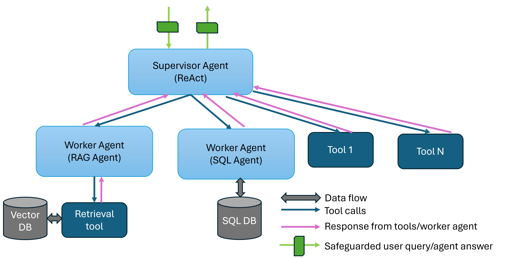

# Agents for Question Answering

## Overview

This example showcases a hierarchical multi-agent system for question-answering applications. The architecture diagram is shown below. The supervisor agent interfaces with the user and dispatch tasks to two worker agents to gather information and come up with answers. The worker RAG agent uses the retrieval tool to retrieve relevant documents from the knowledge base (a vector database). The worker SQL agent retrieve relevant data from the SQL database. Although not included in this example, but other tools such as a web search tool or a knowledge graph query tool can be used by the supervisor agent to gather information from additional sources.


The AgentQnA example is implemented using the component-level microservices defined in [GenAIComps](https://github.com/opea-project/GenAIComps). The flow chart below shows the information flow between different microservices for this example.


### Why Agent for question answering?

1. Improve relevancy of retrieved context.
   RAG agent can rephrase user queries, decompose user queries, and iterate to get the most relevant context for answering user's questions. Compared to conventional RAG, RAG agent can significantly improve the correctness and relevancy of the answer.
2. Expand scope of the agent.
   The supervisor agent can interact with multiple worker agents that specialize in different domains with different skills (e.g., retrieve documents, write SQL queries, etc.), and thus can answer questions in multiple domains.
3. Hierarchical multi-agents can improve performance.
   Expert worker agents, such as RAG agent and SQL agent, can provide high-quality output for different aspects of a complex query, and the supervisor agent can aggregate the information together to provide a comprehensive answer. If we only use one agent and provide all the tools to this single agent, it may get overwhelmed and not able to provide accurate answers.

## Deploy with docker

1. Build agent docker image [Optional]

> [!NOTE]
> the step is optional. The docker images will be automatically pulled when running the docker compose commands. This step is only needed if pulling images failed.

First, clone the opea GenAIComps repo.

```
export WORKDIR=<your-work-directory>
cd $WORKDIR
git clone https://github.com/opea-project/GenAIComps.git
```

Then build the agent docker image. Both the supervisor agent and the worker agent will use the same docker image, but when we launch the two agents we will specify different strategies and register different tools.

```
cd GenAIComps
docker build -t opea/agent:latest --build-arg https_proxy=$https_proxy --build-arg http_proxy=$http_proxy -f comps/agent/src/Dockerfile .
```

2. Set up environment for this example </br>

   First, clone this repo.

   ```
   export WORKDIR=<your-work-directory>
   cd $WORKDIR
   git clone https://github.com/opea-project/GenAIExamples.git
   ```

   Second, set up env vars.

   ```
   # Example: host_ip="192.168.1.1" or export host_ip="External_Public_IP"
   export host_ip=$(hostname -I | awk '{print $1}')
   # if you are in a proxy environment, also set the proxy-related environment variables
   export http_proxy="Your_HTTP_Proxy"
   export https_proxy="Your_HTTPs_Proxy"
   # Example: no_proxy="localhost, 127.0.0.1, 192.168.1.1"
   export no_proxy="Your_No_Proxy"

   export TOOLSET_PATH=$WORKDIR/GenAIExamples/AgentQnA/tools/
   # for using open-source llms
   export HUGGINGFACEHUB_API_TOKEN=<your-HF-token>
   export HF_CACHE_DIR=<directory-where-llms-are-downloaded> #so that no need to redownload every time

   # optional: OPANAI_API_KEY if you want to use OpenAI models
   export OPENAI_API_KEY=<your-openai-key>
   ```

3. Deploy the retrieval tool (i.e., DocIndexRetriever mega-service)

   First, launch the mega-service.

   ```
   cd $WORKDIR/GenAIExamples/AgentQnA/retrieval_tool
   bash launch_retrieval_tool.sh
   ```

   Then, ingest data into the vector database. Here we provide an example. You can ingest your own data.

   ```
   bash run_ingest_data.sh
   ```

4. Prepare SQL database
   In this example, we will use the Chinook SQLite database. Run the commands below.

   ```
   # Download data
   cd $WORKDIR
   git clone https://github.com/lerocha/chinook-database.git
   cp chinook-database/ChinookDatabase/DataSources/Chinook_Sqlite.sqlite $WORKDIR/GenAIExamples/AgentQnA/tests/
   ```

5. Launch other tools. </br>
   In this example, we will use some of the mock APIs provided in the Meta CRAG KDD Challenge to demonstrate the benefits of gaining additional context from mock knowledge graphs.

   ```
   docker run -d -p=8080:8000 docker.io/aicrowd/kdd-cup-24-crag-mock-api:v0
   ```

6. Launch multi-agent system. </br>
   We provide two options for `llm_engine` of the agents: 1. open-source LLMs on Intel Gaudi2, 2. OpenAI models via API calls.

   ::::{tab-set}
   :::{tab-item} Gaudi
   :sync: Gaudi

   On Gaudi2 we will serve `meta-llama/Meta-Llama-3.1-70B-Instruct` using vllm.

   First build vllm-gaudi docker image.

   ```bash
   cd $WORKDIR
   git clone https://github.com/vllm-project/vllm.git
   cd ./vllm
   git checkout v0.6.6
   docker build --no-cache -f Dockerfile.hpu -t opea/vllm-gaudi:latest --shm-size=128g . --build-arg https_proxy=$https_proxy --build-arg http_proxy=$http_proxy
   ```

   Then launch vllm on Gaudi2 with the command below.

   ```bash
   vllm_port=8086
   model="meta-llama/Meta-Llama-3.1-70B-Instruct"
   docker run -d --runtime=habana --rm --name "vllm-gaudi-server" -e HABANA_VISIBLE_DEVICES=0,1,2,3 -p $vllm_port:8000 -v $vllm_volume:/data -e HF_TOKEN=$HF_TOKEN -e HUGGING_FACE_HUB_TOKEN=$HF_TOKEN -e HF_HOME=/data -e OMPI_MCA_btl_vader_single_copy_mechanism=none -e PT_HPU_ENABLE_LAZY_COLLECTIVES=true -e http_proxy=$http_proxy -e https_proxy=$https_proxy -e no_proxy=$no_proxy -e VLLM_SKIP_WARMUP=true --cap-add=sys_nice --ipc=host opea/vllm-gaudi:latest --model ${model} --max-seq-len-to-capture 16384 --tensor-parallel-size 4
   ```

   Then launch Agent microservices.

   ```bash
   cd $WORKDIR/GenAIExamples/AgentQnA/docker_compose/intel/hpu/gaudi/
   bash launch_agent_service_gaudi.sh
   ```

   :::
   :::{tab-item} Xeon
   :sync: Xeon

   To use OpenAI models, run commands below.

   ```
   export OPENAI_API_KEY=<your-openai-key>
   cd $WORKDIR/GenAIExamples/AgentQnA/docker_compose/intel/cpu/xeon
   bash launch_agent_service_openai.sh
   ```

   :::
   ::::

## Deploy AgentQnA UI

The AgentQnA UI can be deployed locally or using Docker.

For detailed instructions on deploying AgentQnA UI, refer to the [AgentQnA UI Guide](./ui/svelte/README.md).

## Deploy using Helm Chart

Refer to the [AgentQnA helm chart](./kubernetes/helm/README.md) for instructions on deploying AgentQnA on Kubernetes.

## Validate services

1. First look at logs of the agent docker containers:

```
# worker RAG agent
docker logs rag-agent-endpoint

# worker SQL agent
docker logs sql-agent-endpoint
```

```
# supervisor agent
docker logs react-agent-endpoint
```

You should see something like "HTTP server setup successful" if the docker containers are started successfully.</p>

2. You can use python to validate the agent system

```bash
# RAG worker agent
python tests/test.py --prompt "Tell me about Michael Jackson song Thriller" --agent_role "worker" --ext_port 9095

# SQL agent
python tests/test.py --prompt "How many employees in company" --agent_role "worker" --ext_port 9096

# supervisor agent: this will test a two-turn conversation
python tests/test.py --agent_role "supervisor" --ext_port 9090
```

## How to register your own tools with agent

You can take a look at the tools yaml and python files in this example. For more details, please refer to the "Provide your own tools" section in the instructions [here](https://github.com/opea-project/GenAIComps/tree/main/comps/agent/src/README.md).
