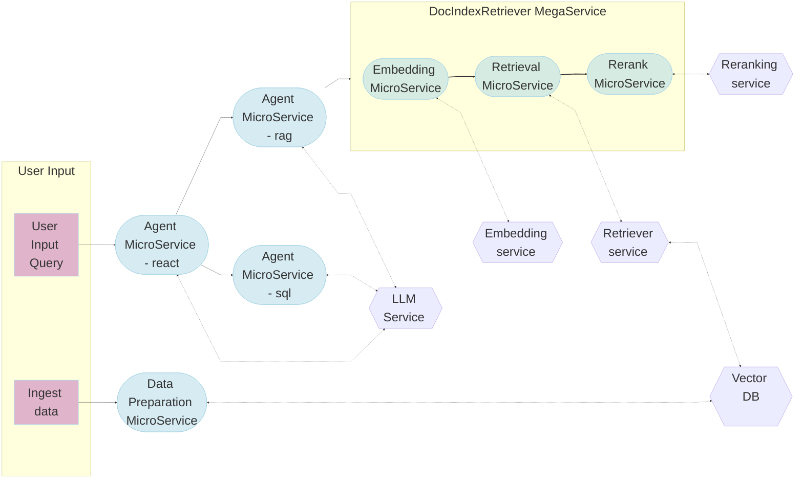
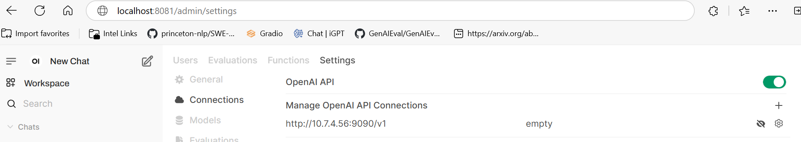
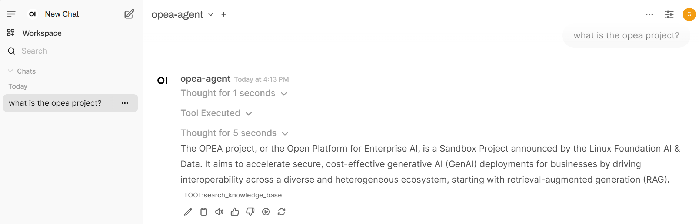

# Agents for Question Answering

## Table of contents

1. [Overview](#overview)
2. [Deploy with Docker](#deploy-with-docker)
3. [How to interact with the agent system with UI](#how-to-interact-with-the-agent-system-with-ui)
4. [Validate Services](#validate-services)
5. [Register Tools](#how-to-register-other-tools-with-the-ai-agent)
6. [Monitoring and Tracing](#monitor-and-tracing)

## Overview

This example showcases a hierarchical multi-agent system for question-answering applications. The architecture diagram below shows a supervisor agent that interfaces with the user and dispatches tasks to two worker agents to gather information and come up with answers. The worker RAG agent uses the retrieval tool to retrieve relevant documents from a knowledge base - a vector database. The worker SQL agent retrieves relevant data from a SQL database. Although not included in this example by default, other tools such as a web search tool or a knowledge graph query tool can be used by the supervisor agent to gather information from additional sources.


The AgentQnA example is implemented using the component-level microservices defined in [GenAIComps](https://github.com/opea-project/GenAIComps). The flow chart below shows the information flow between different microservices for this example.



### Why should AI Agents be used for question-answering?

1. **Improve relevancy of retrieved context.**
   RAG agents can rephrase user queries, decompose user queries, and iterate to get the most relevant context for answering a user's question. Compared to conventional RAG, RAG agents significantly improve the correctness and relevancy of the answer because of the iterations it goes through.
2. **Expand scope of skills.**
   The supervisor agent interacts with multiple worker agents that specialize in different skills (e.g., retrieve documents, write SQL queries, etc.). Thus, it can answer questions with different methods.
3. **Hierarchical multi-agents improve performance.**
   Expert worker agents, such as RAG agents and SQL agents, can provide high-quality output for different aspects of a complex query, and the supervisor agent can aggregate the information to provide a comprehensive answer. If only one agent is used and all tools are provided to this single agent, it can lead to large overhead or not use the best tool to provide accurate answers.

## Deploy with docker

### 1. Set up environment </br>

#### First, clone the `GenAIExamples` repo.

```
export WORKDIR=<your-work-directory>
cd $WORKDIR
git clone https://github.com/opea-project/GenAIExamples.git
```

#### Second, set up environment variables.

##### For proxy environments only

```
export http_proxy="Your_HTTP_Proxy"
export https_proxy="Your_HTTPs_Proxy"
# Example: no_proxy="localhost, 127.0.0.1, 192.168.1.1"
export no_proxy="Your_No_Proxy"
```

##### For using open-source llms

```
export HUGGINGFACEHUB_API_TOKEN=<your-HF-token>
export HF_CACHE_DIR=<directory-where-llms-are-downloaded> #so that no need to redownload every time
```

##### [Optional] OPANAI_API_KEY to use OpenAI models

```
export OPENAI_API_KEY=<your-openai-key>
```

#### Third, set up environment variables for the selected hardware using the corresponding `set_env.sh`

##### Gaudi

```
source $WORKDIR/GenAIExamples/AgentQnA/docker_compose/intel/hpu/gaudi/set_env.sh
```

##### Xeon

```
source $WORKDIR/GenAIExamples/AgentQnA/docker_compose/intel/cpu/xeon/set_env.sh
```

### 2. Launch the multi-agent system. </br>

We make it convenient to launch the whole system with docker compose, which includes microservices for LLM, agents, UI, retrieval tool, vector database, dataprep, and telemetry. There are 3 docker compose files, which make it easy for users to pick and choose. Users can choose a different retrieval tool other than the `DocIndexRetriever` example provided in our GenAIExamples repo. Users can choose not to launch the telemetry containers.

#### Launch on Gaudi

On Gaudi, `meta-llama/Meta-Llama-3.3-70B-Instruct` will be served using vllm. The command below will launch the multi-agent system with the `DocIndexRetriever` as the retrieval tool for the Worker RAG agent.

```bash
cd $WORKDIR/GenAIExamples/AgentQnA/docker_compose/intel/hpu/gaudi/
docker compose -f $WORKDIR/GenAIExamples/DocIndexRetriever/docker_compose/intel/cpu/xeon/compose.yaml -f compose.yaml up -d
```

> **Note**: To enable the web search tool, skip this step and proceed to the "[Optional] Web Search Tool Support" section.

To enable Open Telemetry Tracing, compose.telemetry.yaml file need to be merged along with default compose.yaml file.
Gaudi example with Open Telemetry feature:

```bash
cd $WORKDIR/GenAIExamples/AgentQnA/docker_compose/intel/hpu/gaudi/
docker compose -f $WORKDIR/GenAIExamples/DocIndexRetriever/docker_compose/intel/cpu/xeon/compose.yaml -f compose.yaml -f compose.telemetry.yaml up -d
```

##### [Optional] Web Search Tool Support

<details>
<summary> Instructions </summary>
A web search tool is supported in this example and can be enabled by running docker compose with the `compose.webtool.yaml` file.
The Google Search API is used. Follow the [instructions](https://python.langchain.com/docs/integrations/tools/google_search) to create an API key and enable the Custom Search API on a Google account. The environment variables `GOOGLE_CSE_ID` and `GOOGLE_API_KEY` need to be set.

```bash
cd $WORKDIR/GenAIExamples/AgentQnA/docker_compose/intel/hpu/gaudi/
export GOOGLE_CSE_ID="YOUR_ID"
export GOOGLE_API_KEY="YOUR_API_KEY"
docker compose -f $WORKDIR/GenAIExamples/DocIndexRetriever/docker_compose/intel/cpu/xeon/compose.yaml -f compose.yaml -f compose.webtool.yaml up -d
```

</details>

#### Launch on Xeon

On Xeon, only OpenAI models are supported. The command below will launch the multi-agent system with the `DocIndexRetriever` as the retrieval tool for the Worker RAG agent.

```bash
export OPENAI_API_KEY=<your-openai-key>
cd $WORKDIR/GenAIExamples/AgentQnA/docker_compose/intel/cpu/xeon
docker compose -f $WORKDIR/GenAIExamples/DocIndexRetriever/docker_compose/intel/cpu/xeon/compose.yaml -f compose_openai.yaml up -d
```

### 3. Ingest Data into the vector database

The `run_ingest_data.sh` script will use an example jsonl file to ingest example documents into a vector database. Other ways to ingest data and other types of documents supported can be found in the OPEA dataprep microservice located in the opea-project/GenAIComps repo.

```bash
cd  $WORKDIR/GenAIExamples/AgentQnA/retrieval_tool/
bash run_ingest_data.sh
```

> **Note**: This is a one-time operation.

## How to interact with the agent system with UI

The UI microservice is launched in the previous step with the other microservices.
To see the UI, open a web browser to `http://${ip_address}:5173` to access the UI. Note the `ip_address` here is the host IP of the UI microservice.

1. `create Admin Account` with a random value
2. add opea agent endpoint `http://$ip_address:9090/v1` which is a openai compatible api



3. test opea agent with ui



## [Optional] Deploy using Helm Charts

Refer to the [AgentQnA helm chart](./kubernetes/helm/README.md) for instructions on deploying AgentQnA on Kubernetes.

## Validate Services

1. First look at logs for each of the agent docker containers:

```bash
# worker RAG agent
docker logs rag-agent-endpoint

# worker SQL agent
docker logs sql-agent-endpoint

# supervisor agent
docker logs react-agent-endpoint
```

Look for the message "HTTP server setup successful" to confirm the agent docker container has started successfully.</p>

2. Use python to validate each agent is working properly:

```bash
# RAG worker agent
python $WORKDIR/GenAIExamples/AgentQnA/tests/test.py --prompt "Tell me about Michael Jackson song Thriller" --agent_role "worker" --ext_port 9095

# SQL agent
python $WORKDIR/GenAIExamples/AgentQnA/tests/test.py --prompt "How many employees in company" --agent_role "worker" --ext_port 9096

# supervisor agent: this will test a two-turn conversation
python $WORKDIR/GenAIExamples/AgentQnA/tests/test.py --agent_role "supervisor" --ext_port 9090
```

## How to register other tools with the AI agent

The [tools](./tools) folder contains YAML and Python files for additional tools for the supervisor and worker agents. Refer to the "Provide your own tools" section in the instructions [here](https://github.com/opea-project/GenAIComps/tree/main/comps/agent/src/README.md) to add tools and customize the AI agents.

## Monitor and Tracing

Follow [OpenTelemetry OPEA Guide](https://opea-project.github.io/latest/tutorial/OpenTelemetry/OpenTelemetry_OPEA_Guide.html) to understand how to use OpenTelemetry tracing and metrics in OPEA.  
For AgentQnA specific tracing and metrics monitoring, follow [OpenTelemetry on AgentQnA](https://opea-project.github.io/latest/tutorial/OpenTelemetry/deploy/AgentQnA.html) section.
