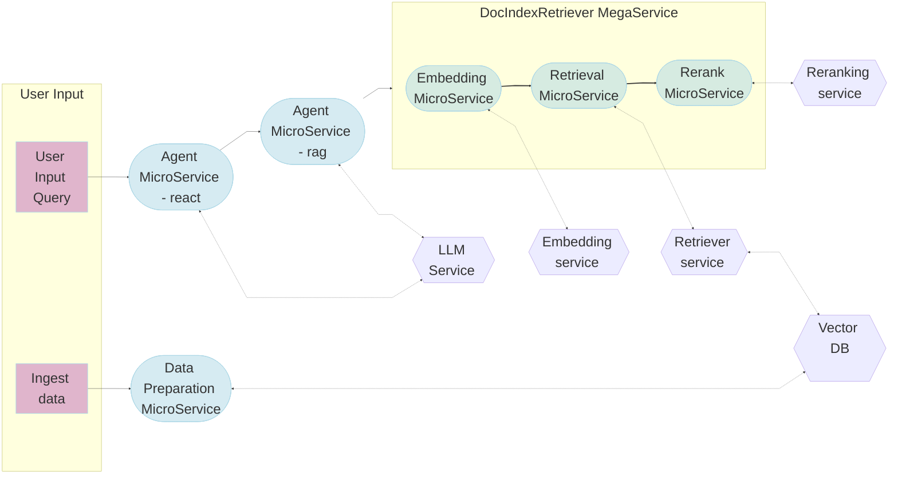

# Agents for Question Answering

## Overview

This example showcases a hierarchical multi-agent system for question-answering applications. The architecture diagram is shown below. The supervisor agent interfaces with the user and dispatch tasks to the worker agent and other tools to gather information and come up with answers. The worker agent uses the retrieval tool to generate answers to the queries posted by the supervisor agent. Other tools used by the supervisor agent may include APIs to interface knowledge graphs, SQL databases, external knowledge bases, etc.


The AgentQnA example is implemented using the component-level microservices defined in [GenAIComps](https://github.com/opea-project/GenAIComps). The flow chart below shows the information flow between different microservices for this example.



### Why Agent for question answering?

1. Improve relevancy of retrieved context.
   Agent can rephrase user queries, decompose user queries, and iterate to get the most relevant context for answering user's questions. Compared to conventional RAG, RAG agent can significantly improve the correctness and relevancy of the answer.
2. Use tools to get additional knowledge.
   For example, knowledge graphs and SQL databases can be exposed as APIs for Agents to gather knowledge that may be missing in the retrieval vector database.
3. Hierarchical agent can further improve performance.
   Expert worker agents, such as retrieval agent, knowledge graph agent, SQL agent, etc., can provide high-quality output for different aspects of a complex query, and the supervisor agent can aggregate the information together to provide a comprehensive answer.

### Roadmap

- v0.9: Worker agent uses open-source websearch tool (duckduckgo), agents use OpenAI GPT-4o-mini as llm backend.
- v1.0: Worker agent uses OPEA retrieval megaservice as tool.
- v1.0 or later: agents use open-source llm backend.
- v1.1 or later: add safeguards

## Getting started

1. Build agent docker image </br>
   First, clone the opea GenAIComps repo

   ```
   export WORKDIR=<your-work-directory>
   cd $WORKDIR
   git clone https://github.com/opea-project/GenAIComps.git
   ```

   Then build the agent docker image. Both the supervisor agent and the worker agent will use the same docker image, but when we launch the two agents we will specify different strategies and register different tools.

   ```
   cd GenAIComps
   docker build -t opea/agent-langchain:latest --build-arg https_proxy=$https_proxy --build-arg http_proxy=$http_proxy -f comps/agent/langchain/Dockerfile .
   ```

2. Launch tool services </br>
   In this example, we will use some of the mock APIs provided in the Meta CRAG KDD Challenge to demonstrate the benefits of gaining additional context from mock knowledge graphs.

   ```
   docker run -d -p=8080:8000 docker.io/aicrowd/kdd-cup-24-crag-mock-api:v0
   ```

3. Set up environment for this example </br>
   First, clone this repo

   ```
   cd $WORKDIR
   git clone https://github.com/opea-project/GenAIExamples.git
   ```

   Second, set up env vars

   ```
   export TOOLSET_PATH=$WORKDIR/GenAIExamples/AgentQnA/tools/
   # optional: OPANAI_API_KEY
   export OPENAI_API_KEY=<your-openai-key>
   ```

4. Launch agent services</br>
   The configurations of the supervisor agent and the worker agent are defined in the docker-compose yaml file. We currently use openAI GPT-4o-mini as LLM, and we plan to add support for llama3.1-70B-instruct (served by TGI-Gaudi) in a subsequent release.
   To use openai llm, run command below.

   ```
   cd docker_compose/intel/cpu/xeon
   bash launch_agent_service_openai.sh
   ```

## Validate services

First look at logs of the agent docker containers:

```
docker logs docgrader-agent-endpoint
```

```
docker logs react-agent-endpoint
```

You should see something like "HTTP server setup successful" if the docker containers are started successfully.</p>

Second, validate worker agent:

```
curl http://${ip_address}:9095/v1/chat/completions -X POST -H "Content-Type: application/json" -d '{
     "query": "Most recent album by Taylor Swift"
    }'
```

Third, validate supervisor agent:

```
curl http://${ip_address}:9090/v1/chat/completions -X POST -H "Content-Type: application/json" -d '{
     "query": "Most recent album by Taylor Swift"
    }'
```

## How to register your own tools with agent

You can take a look at the tools yaml and python files in this example. For more details, please refer to the "Provide your own tools" section in the instructions [here](https://github.com/opea-project/GenAIComps/tree/main/comps/agent/langchain/README.md#5-customize-agent-strategy).
