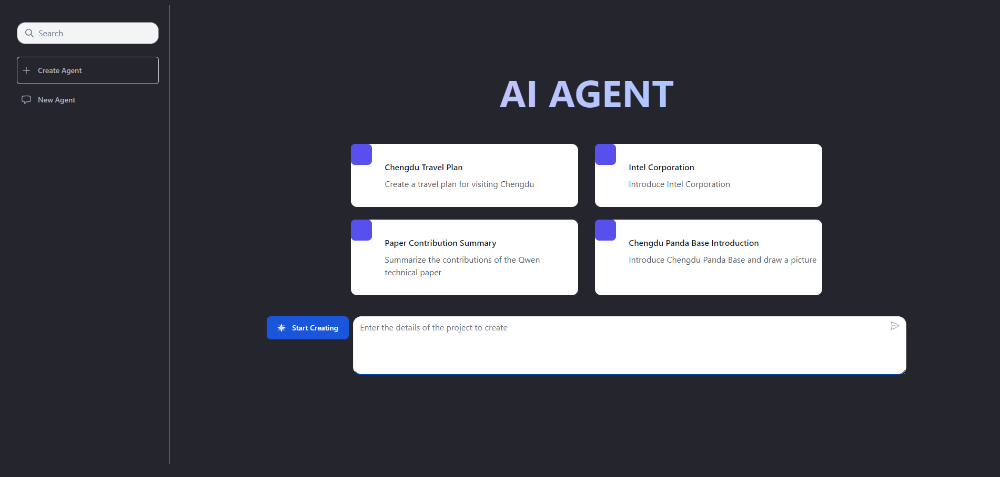
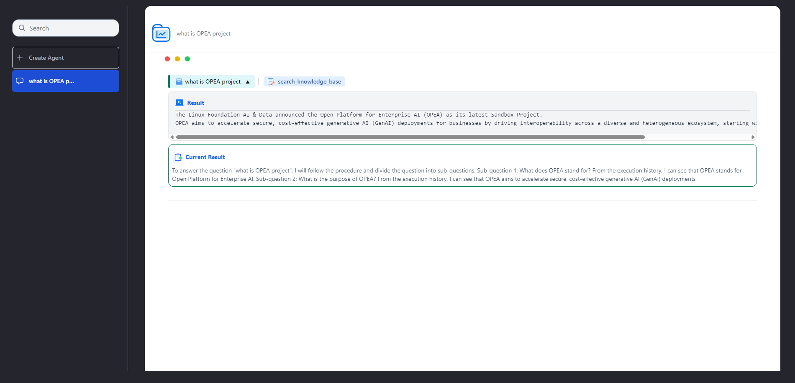

# AgentQnA

## 📸 Project Screenshots




## 🧐 Features

Here're some of the project's features:

- Create Agent：Provide more precise answers based on user queries, showcase the high-quality output process of complex queries across different dimensions, and consolidate information to present comprehensive answers.

## 🛠️ Get it Running

1. Clone the repo.

2. cd command to the current folder.

   ```
   cd AgentQnA/ui/svelte
   ```

3. Modify the required .env variables.

   ```
   AGENT_URL = ''
   ```

4. **For Local Development:**

- Install the dependencies:

  ```
  npm install
  ```

- Start the development server:

  ```
  npm run dev
  ```

- The application will be available at `http://localhost:5173`.

5. **For Docker Setup:**

- Build the Docker image:

  ```
  docker build -t opea:agent-ui .
  ```

- Run the Docker container:

  ```
  docker run -d -p 5173:5173 --name agent-ui opea:agent-ui
  ```

- The application will be available at `http://localhost:5173`.
