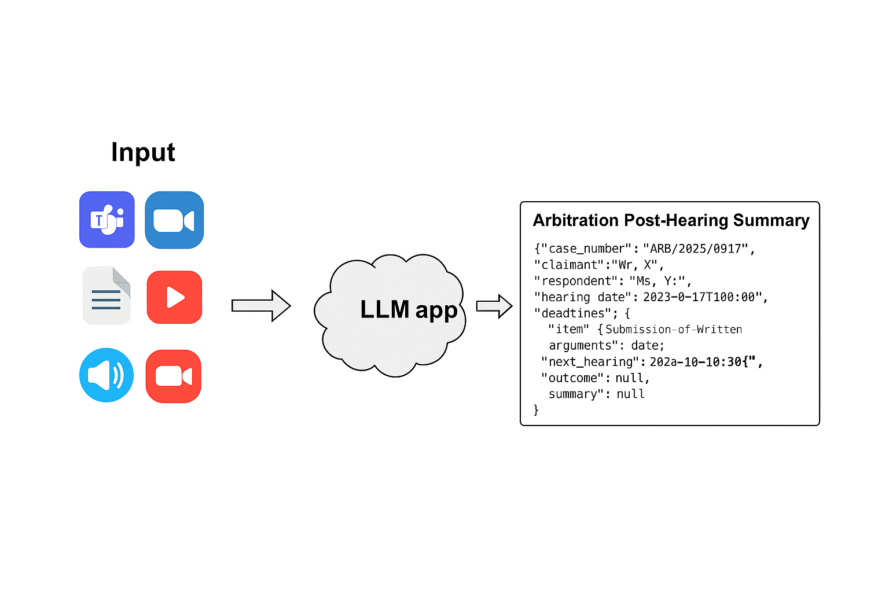

# Arbitration Post-Hearing Assistant

The Arbitration Post-Hearing Assistant is a GenAI-based module designed to process and summarize post-hearing transcripts or arbitration-related documents. It intelligently extracts key entities and insights to assist arbitrators, legal teams, and case managers in managing case follow-ups efficiently.

## Table of contents

1. [Architecture](#architecture)
2. [Deployment Options](#deployment-options)

## Architecture

The architecture of the Document Summarization Application is illustrated below:

The DocSum example is implemented using the component-level microservices defined in [GenAIComps](https://github.com/opea-project/GenAIComps).

## Deployment Options

The table below lists currently available deployment options. They outline in detail the implementation of this example on selected hardware.

| Category               | Deployment Option      | Description                                                    |
| ---------------------- | ---------------------- | -------------------------------------------------------------- |
| On-premise Deployments | Docker Compose (Xeon)  | [DocSum deployment on Xeon](./docker_compose/intel/cpu/xeon)   |
|                        | Docker Compose (Gaudi) | [DocSum deployment on Gaudi](./docker_compose/intel/hpu/gaudi) |

## Validated Configurations

| **Deploy Method** | **LLM Engine** | **LLM Model**                       | **Hardware** |
| ----------------- | -------------- | ----------------------------------- | ------------ |
| Docker Compose    | vLLM, TGI      | mistralai/Mistral-7B-Instruct-v0.2 | Intel Gaudi  |
| Docker Compose    | vLLM, TGI      | mistralai/Mistral-7B-Instruct-v0.2 | Intel Xeon   |
