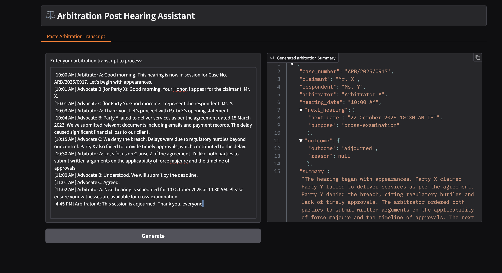

# Example Arbitration Post-Hearing Assistant deployments on Intel® Gaudi® Platform

This document outlines the deployment process for a Arbitration Post-Hearing Assistant application utilizing OPEA components on Intel® Gaudi® AI Accelerators.

This example includes the following sections:

- [Arbitration Post-Hearing Assistant Quick Start Deployment](#arb-post-hearing-assistant-quick-start-deployment): Demonstrates how to quickly deploy a Arbitration Post-Hearing Assistant application/pipeline on Intel® Gaudi® platform.
- [Arbitration Post-Hearing Assistant Docker Compose Files](#arb-post-hearing-assistant-docker-compose-files): Describes some example deployments and their docker compose files.
- [Arbitration Post-Hearing Assistant Detailed Usage](#arb-post-hearing-assistant-detailed-usage): Provide more detailed usage.
- [Launch the UI](#launch-the-ui): Guideline for UI usage

**Note** This example requires access to a properly installed Intel® Gaudi® platform with a functional Docker service configured to use the habanalabs-container-runtime. Please consult the [Intel® Gaudi® software Installation Guide](https://docs.habana.ai/en/v1.20.0/Installation_Guide/Driver_Installation.html) for more information.

## arb-post-hearing-assistant Quick Start Deployment

This section describes how to quickly deploy and test the arb-post-hearing-assistant service manually on an Intel® Gaudi® platform. The basic steps are:

1. [Access the Code](#access-the-code)
2. [Generate a HuggingFace Access Token](#generate-a-huggingface-access-token)
3. [Configure the Deployment Environment](#configure-the-deployment-environment)
4. [Deploy the Services Using Docker Compose](#deploy-the-services-using-docker-compose)
5. [Check the Deployment Status](#check-the-deployment-status)
6. [Test the Pipeline](#test-the-pipeline)
7. [Cleanup the Deployment](#cleanup-the-deployment)

### Access the Code and Set Up Environment

Clone the GenAIExample repository and access the Arbitration Post-Hearing Assistant Intel® Gaudi® platform Docker Compose files and supporting scripts:

```bash
git clone https://github.com/opea-project/GenAIExamples.git
cd GenAIExamples/ArbPostHearingAssistant/docker_compose
source intel/set_env.sh
```

> NOTE: by default vLLM does "warmup" at start, to optimize its performance for the specified model and the underlying platform, which can take long time. For development (and e.g. autoscaling) it can be skipped with `export VLLM_SKIP_WARMUP=true`.

> NOTE: If any port on your local machine is occupied (like `9000/8008/8888`, etc.), modify it in `set_env.sh`, then run `source set_env.sh` again.

### Generate a HuggingFace Access Token

Some HuggingFace resources, such as some models, are only accessible if you have an access token. If you do not already have a HuggingFace access token, you can create one by first creating an account by following the steps provided at [HuggingFace](https://huggingface.co/) and then generating a [user access token](https://huggingface.co/docs/transformers.js/en/guides/private#step-1-generating-a-user-access-token).

### Deploy the Services Using Docker Compose

To deploy the Arbitration Post-Hearing Assistant services, execute the `docker compose up` command with the appropriate arguments. For a default deployment, execute:

```bash
cd intel/hpu/gaudi/
docker compose up -d
```

**Note**: developers should build docker image from source when:

- Developing off the git main branch (as the container's ports in the repo may be different from the published docker image).
- Unable to download the docker image.
- Use a specific version of Docker image.

Please refer to the table below to build different microservices from source:

| Microservice                   | Deployment Guide                                                                                                                                            |
| ------------------------------ | ----------------------------------------------------------------------------------------------------------------------------------------------------------- |
| vLLM                           | [vLLM build guide](https://github.com/opea-project/GenAIComps/tree/main/comps/third_parties/vllm#build-docker)                                              |
| llm-arb-post-hearing-assistant | [LLM-ArbPostHearingAssistant build guide](https://github.com/opea-project/GenAIComps/tree/main/comps/arb_post_hearing_assistant/src/#12-build-docker-image) |
| MegaService                    | [MegaService build guide](../../../../README_miscellaneous.md#build-megaservice-docker-image)                                                               |
| UI                             | [Basic UI build guide](../../../../README_miscellaneous.md#build-ui-docker-image)                                                                           |

### Check the Deployment Status

After running docker compose, check if all the containers launched via docker compose have started:

```bash
docker ps -a
```

For the default deployment, the following 4 containers should be running:

```bash
CONTAINER ID   IMAGE                                                           COMMAND                  CREATED       STATUS                 PORTS                                         NAMES
24bd78300413   opea/arb-post-hearing-assistant-gradio-ui:latest                "python arb_post_hea…"   2 hours ago   Up 2 hours             0.0.0.0:5173->5173/tcp, [::]:5173->5173/tcp   arb-post-hearing-assistant-xeon-ui-server
59e60c954e26   opea/arb-post-hearing-assistant:latest                          "python arb_post_hea…"   2 hours ago   Up 2 hours             0.0.0.0:8888->8888/tcp, [::]:8888->8888/tcp   arb-post-hearing-assistant-xeon-backend-server
32afc12de996   opea/llm-arb-post-hearing-assistant:latest                      "python comps/arb_po…"   2 hours ago   Up 2 hours             0.0.0.0:9000->9000/tcp, [::]:9000->9000/tcp   arb-post-hearing-assistant-xeon-llm-server
c8e539360aff   ghcr.io/huggingface/text-generation-inference:2.4.0-intel-cpu   "text-generation-lau…"   2 hours ago   Up 2 hours (healthy)   0.0.0.0:8008->80/tcp, [::]:8008->80/tcp       arb-post-hearing-assistant-xeon-tgi-server
```

### Test the Pipeline

Once the Arbitration Post-Hearing Assistant services are running, test the pipeline using the following command:

```bash
curl -X POST http://${host_ip}:8888/v1/arb-post-hearing \
        -H "Content-Type: application/json" \
        -d '{"type": "text", [10:00 AM] Arbitrator Hon. Rebecca Lawson: Good morning. This hearing is now in session for Case No. ARB/2025/0917. Lets begin with appearances. [10:01 AM] Attorney Michael Grant for Mr. Jonathan Reed: Good morning Your Honor. I represent the claimant Mr. Jonathan Reed. [10:01 AM] Attorney Lisa Chen for Ms. Rachel Morgan: Good morning. I represent the respondent Ms. Rachel Morgan. [10:03 AM] Arbitrator Hon. Rebecca Lawson: Thank you. Lets proceed with Mr. Reeds opening statement. [10:04 AM] Attorney Michael Grant: Ms. Morgan failed to deliver services as per the agreement dated March 15 2023. We have submitted relevant documentation including email correspondence and payment records. The delay caused substantial financial harm to our client. [10:15 AM] Attorney Lisa Chen: We deny any breach of contract. The delays were due to regulatory issues outside our control. Furthermore Mr. Reed did not provide timely approvals which contributed to the delay. [10:30 AM] Arbitrator Hon. Rebecca Lawson: Lets turn to Clause Z of the agreement. Id like both parties to submit written briefs addressing the applicability of the force majeure clause and the timeline of approvals. [11:00 AM] Attorney Michael Grant: Understood. Well submit by the deadline. [11:01 AM] Attorney Lisa Chen: Agreed. [11:02 AM] Arbitrator Hon. Rebecca Lawson: The next hearing is scheduled for October 22 2025 at 1030 AM Eastern Time. Please ensure your witnesses are available for cross examination. [4:45 PM] Arbitrator Hon. Rebecca Lawson: This session is adjourned. Thank you everyone.","max_tokens":2000,"language":"en"}'
```

**Note** The value of _host_ip_ was set using the _set_env.sh_ script and can be found in the _.env_ file.

### Cleanup the Deployment

To stop the containers associated with the deployment, execute the following command:

```bash
docker compose -f compose.yaml down
```

All the Arbitration Post-Hearing Assistant containers will be stopped and then removed on completion of the "down" command.

## Arbitration Post-Hearing Assistant Docker Compose Files

In the context of deploying a Arbitration Post-Hearing Assistant pipeline on an Intel® Gaudi® platform, the allocation and utilization of Gaudi devices across different services are important considerations for optimizing performance and resource efficiency. Each of the example deployments, defined by the example Docker compose yaml files, demonstrates a unique approach to leveraging Gaudi hardware, reflecting different priorities and operational strategies.

| File                                   | Description                                                                               |
| -------------------------------------- | ----------------------------------------------------------------------------------------- |
| [compose.yaml](./compose.yaml)         | Default compose file using vllm as serving framework                                      |
| [compose_tgi.yaml](./compose_tgi.yaml) | The LLM serving framework is TGI. All other configurations remain the same as the default |

## Arbitration Post-Hearing Assistant Detailed Usage

There are also some customized usage.

### Query with text

```bash
# form input. Use English mode (default).
curl http://${host_ip}:8888/v1/arb-post-hearing \
      -H "Content-Type: application/json" \
      -F "type=text" \
      -F "messages=[10:00 AM] Arbitrator Hon. Rebecca Lawson: Good morning. This hearing is now in session for Case No. ARB/2025/0917. Lets begin with appearances. [10:01 AM] Attorney Michael Grant for Mr. Jonathan Reed: Good morning Your Honor. I represent the claimant Mr. Jonathan Reed. [10:01 AM] Attorney Lisa Chen for Ms. Rachel Morgan: Good morning. I represent the respondent Ms. Rachel Morgan. [10:03 AM] Arbitrator Hon. Rebecca Lawson: Thank you. Lets proceed with Mr. Reeds opening statement. [10:04 AM] Attorney Michael Grant: Ms. Morgan failed to deliver services as per the agreement dated March 15 2023. We have submitted relevant documentation including email correspondence and payment records. The delay caused substantial financial harm to our client. [10:15 AM] Attorney Lisa Chen: We deny any breach of contract. The delays were due to regulatory issues outside our control. Furthermore Mr. Reed did not provide timely approvals which contributed to the delay. [10:30 AM] Arbitrator Hon. Rebecca Lawson: Lets turn to Clause Z of the agreement. Id like both parties to submit written briefs addressing the applicability of the force majeure clause and the timeline of approvals. [11:00 AM] Attorney Michael Grant: Understood. Well submit by the deadline. [11:01 AM] Attorney Lisa Chen: Agreed. [11:02 AM] Arbitrator Hon. Rebecca Lawson: The next hearing is scheduled for October 22 2025 at 1030 AM Eastern Time. Please ensure your witnesses are available for cross examination. [4:45 PM] Arbitrator Hon. Rebecca Lawson: This session is adjourned. Thank you everyone." \
      -F "max_tokens=2000" \
      -F "language=en"

## Launch the UI

### Gradio UI

Open this URL `http://{host_ip}:5173` in your browser to access the Gradio based frontend.


### Profile Microservices

To further analyze MicroService Performance, users could follow the instructions to profile MicroServices.

#### 1. vLLM backend Service

Users could follow previous section to testing vLLM microservice or Arbitration Post-Hearing Assistant MegaService. By default, vLLM profiling is not enabled. Users could start and stop profiling by following commands.

## Conclusion

This guide should enable developer to deploy the default configuration or any of the other compose yaml files for different configurations. It also highlights the configurable parameters that can be set before deployment.
```
