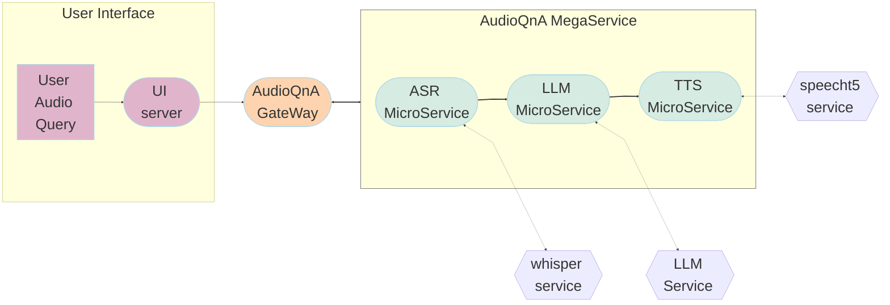

# AudioQnA Application

AudioQnA is an example that demonstrates the integration of Generative AI (GenAI) models for performing question-answering (QnA) on audio files, with the added functionality of Text-to-Speech (TTS) for generating spoken responses. The example showcases how to convert audio input to text using Automatic Speech Recognition (ASR), generate answers to user queries using a language model, and then convert those answers back to speech using Text-to-Speech (TTS).

## Table of Contents

1. [Architecture](#architecture)
2. [Deployment Options](#deployment-options)

## Architecture

The AudioQnA example is implemented using the component-level microservices defined in [GenAIComps](https://github.com/opea-project/GenAIComps). The flow chart below shows the information flow between different microservices for this example.

## Deployment Options

The table below lists currently available deployment options. They outline in detail the implementation of this example on selected hardware.

| Category               | Deployment Option | Description                                                      |
| ---------------------- | ----------------- | ---------------------------------------------------------------- |
| On-premise Deployments | Docker compose    | [AudioQnA deployment on Xeon](./docker_compose/intel/cpu/xeon)   |
|                        |                   | [AudioQnA deployment on Gaudi](./docker_compose/intel/hpu/gaudi) |
|                        |                   | [AudioQnA deployment on AMD ROCm](./docker_compose/amd/gpu/rocm) |
|                        | Kubernetes        | [Helm Charts](./kubernetes/helm)                                 |
