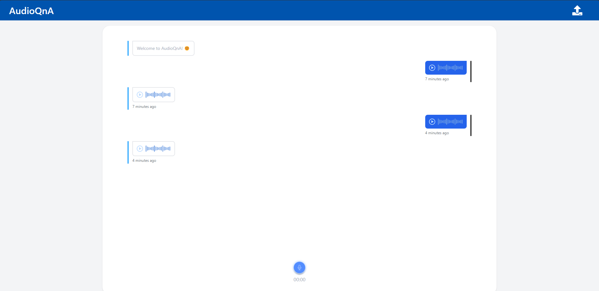
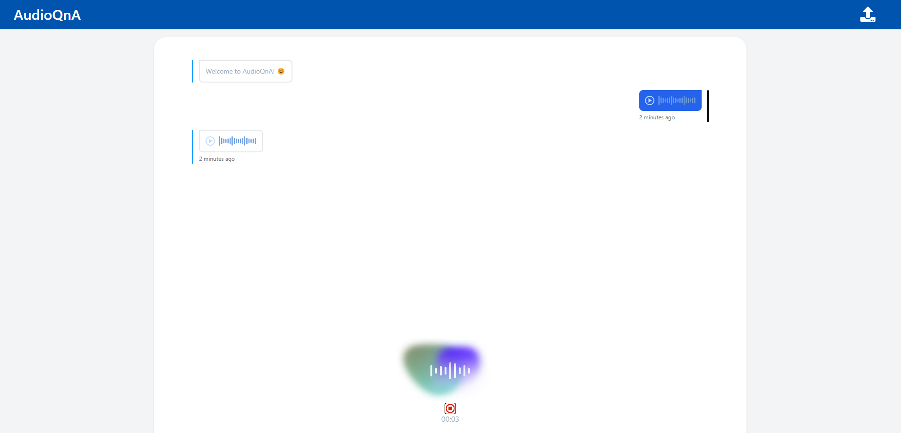

# AudioQnA

## 📸 Project Screenshots




## 🧐 Features

Here're some of the project's features:

- Start a Talking Chat：Initiate voice chat, able to input voice content, and customize the conversation sound based on the uploaded file.
- Scroll to Bottom: The chat automatically slides to the bottom.

## 🛠️ Get it Running

1. Clone the repo.

2. cd command to the current folder.

3. Modify the required .env variables.

   ```
   CHAT_URL = ''
   ```

4. Execute `npm install` to install the corresponding dependencies.

5. Execute `npm run dev` in both environments
