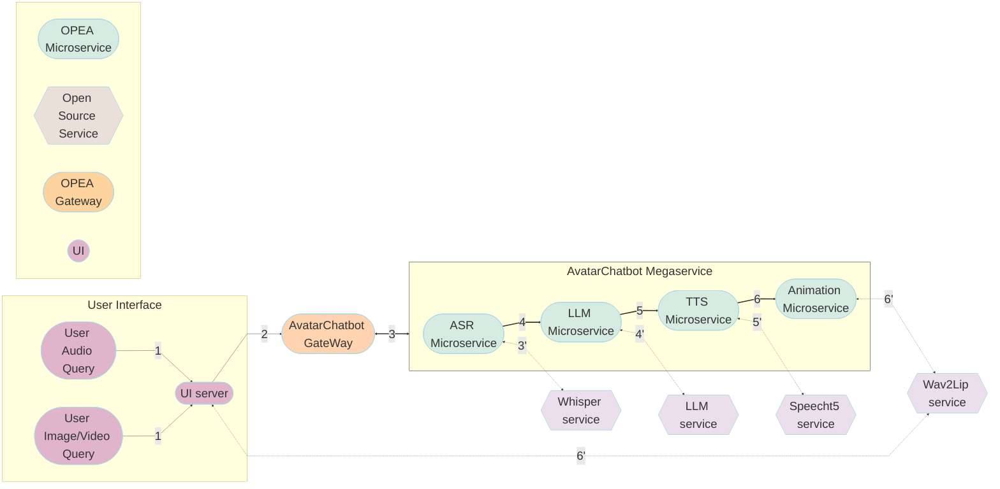

# AvatarChatbot Application

The AvatarChatbot service can be effortlessly deployed on either Intel Gaudi2 or Intel XEON Scalable Processors.

## AI Avatar Workflow

The AI Avatar example is implemented using both megaservices and the component-level microservices defined in [GenAIComps](https://github.com/opea-project/GenAIComps). The flow chart below shows the information flow between different megaservices and microservices for this example.

