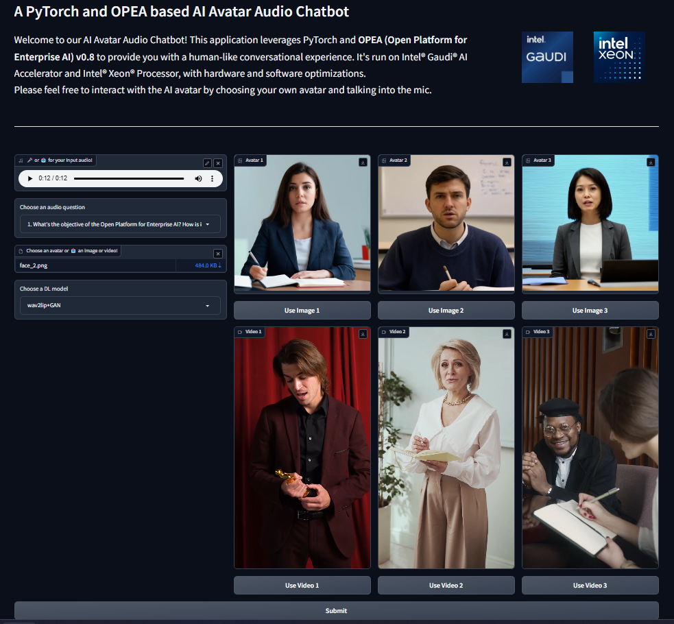

# Build Mega Service of AvatarChatbot on AMD GPU

This document outlines the deployment process for a AvatarChatbot application utilizing the [GenAIComps](https://github.com/opea-project/GenAIComps.git) microservice pipeline on Intel Xeon server.

## 🚀 Build Docker images

### 1. Source Code install GenAIComps

```bash
git clone https://github.com/opea-project/GenAIComps.git
cd GenAIComps
```

### 2. Build ASR Image

```bash
docker build -t opea/whisper:latest --build-arg https_proxy=$https_proxy --build-arg http_proxy=$http_proxy -f comps/asr/src/integrations/dependency/whisper/Dockerfile .


docker build -t opea/asr:latest --build-arg https_proxy=$https_proxy --build-arg http_proxy=$http_proxy -f comps/asr/src/Dockerfile .
```

### 3. Build LLM Image

```bash
docker build --no-cache -t opea/llm-textgen:latest --build-arg https_proxy=$https_proxy --build-arg http_proxy=$http_proxy -f comps/llms/src/text-generation/Dockerfile .
```

### 4. Build TTS Image

```bash
docker build -t opea/speecht5:latest --build-arg https_proxy=$https_proxy --build-arg http_proxy=$http_proxy -f comps/tts/src/integrations/dependency/speecht5/Dockerfile .

docker build -t opea/tts:latest --build-arg https_proxy=$https_proxy --build-arg http_proxy=$http_proxy -f comps/tts/src/Dockerfile .
```

### 5. Build Animation Image

```bash
docker build -t opea/wav2lip:latest --build-arg https_proxy=$https_proxy --build-arg http_proxy=$http_proxy -f comps/third_parties/wav2lip/src/Dockerfile .

docker build -t opea/animation:latest --build-arg https_proxy=$https_proxy --build-arg http_proxy=$http_proxy -f comps/animation/src/Dockerfile .
```

### 6. Build MegaService Docker Image

To construct the Mega Service, we utilize the [GenAIComps](https://github.com/opea-project/GenAIComps.git) microservice pipeline within the `audioqna.py` Python script. Build the MegaService Docker image using the command below:

```bash
git clone https://github.com/opea-project/GenAIExamples.git
cd GenAIExamples/AvatarChatbot/
docker build --no-cache -t opea/avatarchatbot:latest --build-arg https_proxy=$https_proxy --build-arg http_proxy=$http_proxy -f Dockerfile .
```

Then run the command `docker images`, you will have following images ready:

1. `opea/whisper:latest`
2. `opea/asr:latest`
3. `opea/llm-tgi:latest`
4. `opea/speecht5:latest`
5. `opea/tts:latest`
6. `opea/wav2lip:latest`
7. `opea/animation:latest`
8. `opea/avatarchatbot:latest`

## 🚀 Set the environment variables

Before starting the services with `docker compose`, you have to recheck the following environment variables.

```bash
export HUGGINGFACEHUB_API_TOKEN=${HUGGINGFACEHUB_API_TOKEN}
export host_ip=$(hostname -I | awk '{print $1}')

export TGI_SERVICE_PORT=3006
export TGI_LLM_ENDPOINT=http://${host_ip}:${TGI_SERVICE_PORT}
export LLM_MODEL_ID="Intel/neural-chat-7b-v3-3"

export ASR_ENDPOINT=http://${host_ip}:7066
export TTS_ENDPOINT=http://${host_ip}:7055
export WAV2LIP_ENDPOINT=http://${host_ip}:7860

export MEGA_SERVICE_HOST_IP=${host_ip}
export ASR_SERVICE_HOST_IP=${host_ip}
export TTS_SERVICE_HOST_IP=${host_ip}
export LLM_SERVICE_HOST_IP=${host_ip}
export ANIMATION_SERVICE_HOST_IP=${host_ip}

export MEGA_SERVICE_PORT=8888
export ASR_SERVICE_PORT=3001
export TTS_SERVICE_PORT=3002
export LLM_SERVICE_PORT=3007
export ANIMATION_SERVICE_PORT=3008

export DEVICE="cpu"
export WAV2LIP_PORT=7860
export INFERENCE_MODE='wav2lip+gfpgan'
export CHECKPOINT_PATH='/usr/local/lib/python3.11/site-packages/Wav2Lip/checkpoints/wav2lip_gan.pth'
export FACE="assets/img/avatar5.png"
# export AUDIO='assets/audio/eg3_ref.wav' # audio file path is optional, will use base64str in the post request as input if is 'None'
export AUDIO='None'
export FACESIZE=96
export OUTFILE="/outputs/result.mp4"
export GFPGAN_MODEL_VERSION=1.4 # latest version, can roll back to v1.3 if needed
export UPSCALE_FACTOR=1
export FPS=10
```

Warning!!! - The Wav2lip service works in this solution using only the CPU. To use AMD GPUs and achieve operational performance, the Wav2lip image needs to be modified to adapt to AMD hardware and the ROCm framework.

## 🚀 Start the MegaService

```bash
cd GenAIExamples/AvatarChatbot/docker_compose/intel/cpu/xeon/
docker compose -f compose.yaml up -d
```

## 🚀 Test MicroServices

```bash
# whisper service
curl http://${host_ip}:7066/v1/asr \
  -X POST \
  -d '{"audio": "UklGRigAAABXQVZFZm10IBIAAAABAAEARKwAAIhYAQACABAAAABkYXRhAgAAAAEA"}' \
  -H 'Content-Type: application/json'

# asr microservice
curl http://${host_ip}:3001/v1/audio/transcriptions \
  -X POST \
  -d '{"byte_str": "UklGRigAAABXQVZFZm10IBIAAAABAAEARKwAAIhYAQACABAAAABkYXRhAgAAAAEA"}' \
  -H 'Content-Type: application/json'

# tgi service
curl http://${host_ip}:3006/generate \
  -X POST \
  -d '{"inputs":"What is Deep Learning?","parameters":{"max_new_tokens":17, "do_sample": true}}' \
  -H 'Content-Type: application/json'

# llm microservice
curl http://${host_ip}:3007/v1/chat/completions\
  -X POST \
  -d '{"query":"What is Deep Learning?","max_tokens":17,"top_k":10,"top_p":0.95,"typical_p":0.95,"temperature":0.01,"repetition_penalty":1.03,"streaming":false}' \
  -H 'Content-Type: application/json'

# speecht5 service
curl http://${host_ip}:7055/v1/tts \
  -X POST \
  -d '{"text": "Who are you?"}' \
  -H 'Content-Type: application/json'

# tts microservice
curl http://${host_ip}:3002/v1/audio/speech \
  -X POST \
  -d '{"text": "Who are you?"}' \
  -H 'Content-Type: application/json'

# wav2lip service
cd ../../../..
curl http://${host_ip}:7860/v1/wav2lip \
  -X POST \
  -d @assets/audio/sample_minecraft.json \
  -H 'Content-Type: application/json'

# animation microservice
curl http://${host_ip}:3008/v1/animation \
  -X POST \
  -d @assets/audio/sample_question.json \
  -H "Content-Type: application/json"

```

## 🚀 Test MegaService

```bash
curl http://${host_ip}:3009/v1/avatarchatbot \
  -X POST \
  -d @assets/audio/sample_whoareyou.json \
  -H 'Content-Type: application/json'
```

If the megaservice is running properly, you should see the following output:

```bash
"/outputs/result.mp4"
```

The output file will be saved in the current working directory, as `${PWD}` is mapped to `/outputs` inside the wav2lip-service Docker container.

## Gradio UI

```bash
cd $WORKPATH/GenAIExamples/AvatarChatbot
python3 ui/gradio/app_gradio_demo_avatarchatbot.py
```

The UI can be viewed at http://${host_ip}:7861  
  
In the current version v1.0, you need to set the avatar figure image/video and the DL model choice in the environment variables before starting AvatarChatbot backend service and running the UI. Please just customize the audio question in the UI.  
\*\* We will enable change of avatar figure between runs in v2.0

## Troubleshooting

```bash
cd GenAIExamples/AvatarChatbot/tests
export IMAGE_REPO="opea"
export IMAGE_TAG="latest"
export HUGGINGFACEHUB_API_TOKEN=<your_hf_token>

test_avatarchatbot_on_xeon.sh
```
