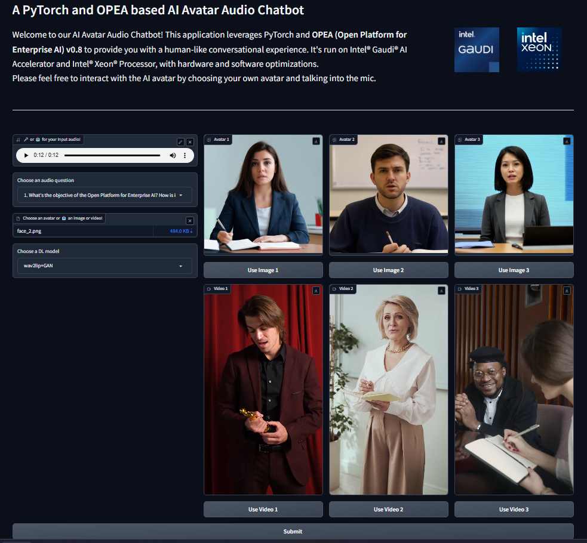

# Build Mega Service of AvatarChatbot on Gaudi

This document outlines the deployment process for a AvatarChatbot application utilizing the [GenAIComps](https://github.com/opea-project/GenAIComps.git) microservice pipeline on Intel Gaudi server.

## 🚀 Build Docker images

### 1. Source Code install GenAIComps

```bash
git clone https://github.com/opea-project/GenAIComps.git
cd GenAIComps
```

### 2. Build ASR Image

```bash
docker build -t opea/whisper-gaudi:latest --build-arg https_proxy=$https_proxy --build-arg http_proxy=$http_proxy -f comps/asr/src/integrations/dependency/whisper/Dockerfile.intel_hpu .
```

### 3. Build LLM Image

Intel Gaudi optimized image hosted in huggingface repo will be used for TGI service: ghcr.io/huggingface/tgi-gaudi:2.0.6 (https://github.com/huggingface/tgi-gaudi)

### 4. Build TTS Image

```bash
docker build -t opea/speecht5-gaudi:latest --build-arg https_proxy=$https_proxy --build-arg http_proxy=$http_proxy -f comps/tts/src/integrations/dependency/speecht5/Dockerfile.intel_hpu .
```

### 5. Build Animation Image

```bash
docker build -t opea/wav2lip-gaudi:latest --build-arg https_proxy=$https_proxy --build-arg http_proxy=$http_proxy -f comps/third_parties/wav2lip/src/Dockerfile.intel_hpu .

docker build -t opea/animation:latest --build-arg https_proxy=$https_proxy --build-arg http_proxy=$http_proxy -f comps/animation/src/Dockerfile .
```

### 6. Build MegaService Docker Image

To construct the Mega Service, we utilize the [GenAIComps](https://github.com/opea-project/GenAIComps.git) microservice pipeline within the `audioqna.py` Python script. Build the MegaService Docker image using the command below:

```bash
git clone https://github.com/opea-project/GenAIExamples.git
cd GenAIExamples/AvatarChatbot/
docker build --no-cache -t opea/avatarchatbot:latest --build-arg https_proxy=$https_proxy --build-arg http_proxy=$http_proxy -f Dockerfile .
```

Then run the command `docker images`, you will have following images ready:

1. `opea/whisper-gaudi:latest`
2. `opea/speecht5-gaudi:latest`
3. `opea/wav2lip-gaudi:latest`
4. `opea/animation:latest`
5. `opea/avatarchatbot:latest`

## 🚀 Set the environment variables

Before starting the services with `docker compose`, you have to recheck the following environment variables.

```bash
export HUGGINGFACEHUB_API_TOKEN=<your_hf_token>
export host_ip=$(hostname -I | awk '{print $1}')

export LLM_MODEL_ID=Intel/neural-chat-7b-v3-3

export WAV2LIP_ENDPOINT=http://$host_ip:7860

export MEGA_SERVICE_HOST_IP=${host_ip}
export WHISPER_SERVER_HOST_IP=${host_ip}
export WHISPER_SERVER_PORT=7066
export SPEECHT5_SERVER_HOST_IP=${host_ip}
export SPEECHT5_SERVER_PORT=7055
export LLM_SERVER_HOST_IP=${host_ip}
export LLM_SERVER_PORT=3006
export ANIMATION_SERVICE_HOST_IP=${host_ip}
export ANIMATION_SERVICE_PORT=3008

export MEGA_SERVICE_PORT=8888
```

- Gaudi2 HPU

```bash
export DEVICE="hpu"
export WAV2LIP_PORT=7860
export INFERENCE_MODE='wav2lip_only'
export CHECKPOINT_PATH='/usr/local/lib/python3.10/dist-packages/Wav2Lip/checkpoints/wav2lip_gan.pth'
export FACE="assets/img/avatar1.jpg"
# export AUDIO='assets/audio/eg3_ref.wav' # audio file path is optional, will use base64str in the post request as input if is 'None'
export AUDIO='None'
export FACESIZE=96
export OUTFILE="/outputs/result.mp4"
export GFPGAN_MODEL_VERSION=1.4 # latest version, can roll back to v1.3 if needed
export UPSCALE_FACTOR=1
export FPS=10
```

## 🚀 Start the MegaService

```bash
cd GenAIExamples/AvatarChatbot/docker_compose/intel/hpu/gaudi/
docker compose -f compose.yaml up -d
```

## 🚀 Test MicroServices

```bash
# whisper service
curl http://${host_ip}:7066/v1/asr \
  -X POST \
  -d '{"audio": "UklGRigAAABXQVZFZm10IBIAAAABAAEARKwAAIhYAQACABAAAABkYXRhAgAAAAEA"}' \
  -H 'Content-Type: application/json'

# tgi service
curl http://${host_ip}:3006/generate \
  -X POST \
  -d '{"inputs":"What is Deep Learning?","parameters":{"max_new_tokens":17, "do_sample": true}}' \
  -H 'Content-Type: application/json'

# speecht5 service
curl http://${host_ip}:7055/v1/tts \
  -X POST \
  -d '{"text": "Who are you?"}' \
  -H 'Content-Type: application/json'

# wav2lip service
cd ../../../..
curl http://${host_ip}:7860/v1/wav2lip \
  -X POST \
  -d @assets/audio/sample_minecraft.json \
  -H 'Content-Type: application/json'

# animation microservice
curl http://${host_ip}:3008/v1/animation \
  -X POST \
  -d @assets/audio/sample_question.json \
  -H "Content-Type: application/json"

```

## 🚀 Test MegaService

```bash
curl http://${host_ip}:3009/v1/avatarchatbot \
  -X POST \
  -d @assets/audio/sample_whoareyou.json \
  -H 'Content-Type: application/json'
```

If the megaservice is running properly, you should see the following output:

```bash
"/outputs/result.mp4"
```

The output file will be saved in the current working directory, as `${PWD}` is mapped to `/outputs` inside the wav2lip-service Docker container.

## Gradio UI

```bash
sudo apt update
sudo apt install -y yasm pkg-config libx264-dev nasm
cd $WORKPATH
git clone https://github.com/FFmpeg/FFmpeg.git
cd FFmpeg
sudo ./configure --enable-gpl --enable-libx264 && sudo make -j$(nproc-1) && sudo make install && hash -r
pip install gradio==4.38.1 soundfile
```

```bash
cd $WORKPATH/GenAIExamples/AvatarChatbot
python3 ui/gradio/app_gradio_demo_avatarchatbot.py
```

The UI can be viewed at http://${host_ip}:7861  
  
In the current version v1.0, you need to set the avatar figure image/video and the DL model choice in the environment variables before starting AvatarChatbot backend service and running the UI. Please just customize the audio question in the UI.  
\*\* We will enable change of avatar figure between runs in v2.0

## Troubleshooting

```bash
cd GenAIExamples/AvatarChatbot/tests
export IMAGE_REPO="opea"
export IMAGE_TAG="latest"
export HUGGINGFACEHUB_API_TOKEN=<your_hf_token>

test_avatarchatbot_on_gaudi.sh
```
