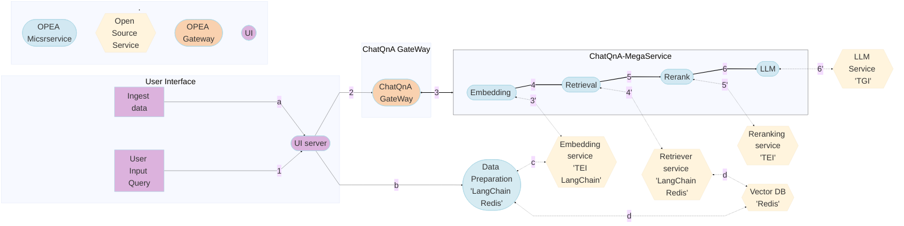

# ChatQnA Application

Chatbots are the most widely adopted use case for leveraging the powerful chat and reasoning capabilities of large language models (LLMs). The retrieval augmented generation (RAG) architecture is quickly becoming the industry standard for chatbots development. It combines the benefits of a knowledge base (via a vector store) and generative models to reduce hallucinations, maintain up-to-date information, and leverage domain-specific knowledge.

RAG bridges the knowledge gap by dynamically fetching relevant information from external sources, ensuring that responses generated remain factual and current. The core of this architecture are vector databases, which are instrumental in enabling efficient and semantic retrieval of information. These databases store data as vectors, allowing RAG to swiftly access the most pertinent documents or data points based on semantic similarity.

ChatQnA architecture shows below:


ChatQnA is implemented on top of [GenAIComps](https://github.com/opea-project/GenAIComps), the ChatQnA Flow Chart shows below:



This ChatQnA use case performs RAG using LangChain, Redis VectorDB and Text Generation Inference on Intel Gaudi2 or Intel XEON Scalable Processors. The Intel Gaudi2 accelerator supports both training and inference for deep learning models in particular for LLMs. Visit [Habana AI products](https://habana.ai/products) for more details.

## Deploy ChatQnA Service

The ChatQnA service can be effortlessly deployed on either Intel Gaudi2 or Intel XEON Scalable Processors.

Currently we support two ways of deploying ChatQnA services with docker compose:

1. Start services using the docker image on `docker hub`:

   ```bash
   docker pull opea/chatqna:latest
   ```

   Two type of UI are supported now, choose one you like and pull the referred docker image.

   If you choose conversational UI, follow the [instruction](https://github.com/opea-project/GenAIExamples/tree/main/ChatQnA/docker/gaudi#-launch-the-conversational-ui-optional) and modify the [compose.yaml](./docker/xeon/compose.yaml).

   ```bash
   docker pull opea/chatqna-ui:latest
   # or
   docker pull opea/chatqna-conversation-ui:latest
   ```

2. Start services using the docker images `built from source`: [Guide](./docker)

### Setup Environment Variable

To set up environment variables for deploying ChatQnA services, follow these steps:

1. Set the required environment variables:

   ```bash
   # Example: host_ip="192.168.1.1"
   export host_ip="External_Public_IP"
   # Example: no_proxy="localhost, 127.0.0.1, 192.168.1.1"
   export no_proxy="Your_No_Proxy"
   export HUGGINGFACEHUB_API_TOKEN="Your_Huggingface_API_Token"
   ```

2. If you are in a proxy environment, also set the proxy-related environment variables:

   ```bash
   export http_proxy="Your_HTTP_Proxy"
   export https_proxy="Your_HTTPs_Proxy"
   ```

3. Set up other environment variables:

   > Notice that you can only choose **one** command below to set up envs according to your hardware. Other that the port numbers may be set incorrectly.

   ```bash
   # on Gaudi
   source ./docker/gaudi/set_env.sh
   # on Xeon
   source ./docker/xeon/set_env.sh
   # on Nvidia GPU
   source ./docker/gpu/set_env.sh
   ```

### Deploy ChatQnA on Gaudi

Find the corresponding [compose.yaml](./docker/gaudi/compose.yaml).

```bash
cd GenAIExamples/ChatQnA/docker/gaudi/
docker compose up -d
```

> Notice: Currently only the **Habana Driver 1.16.x** is supported for Gaudi.

Refer to the [Gaudi Guide](./docker/gaudi/README.md) to build docker images from source.

### Deploy ChatQnA on Xeon

Find the corresponding [compose.yaml](./docker/xeon/compose.yaml).

```bash
cd GenAIExamples/ChatQnA/docker/xeon/
docker compose up -d
```

Refer to the [Xeon Guide](./docker/xeon/README.md) for more instructions on building docker images from source.

### Deploy ChatQnA on NVIDIA GPU

```bash
cd GenAIExamples/ChatQnA/docker/gpu/
docker compose up -d
```

Refer to the [NVIDIA GPU Guide](./docker/gpu/README.md) for more instructions on building docker images from source.

### Deploy ChatQnA into Kubernetes on Xeon & Gaudi with GMC

Refer to the [Kubernetes Guide](./kubernetes/README.md) for instructions on deploying ChatQnA into Kubernetes on Xeon & Gaudi with GMC.

### Deploy ChatQnA into Kubernetes on Xeon & Gaudi without GMC

Refer to the [Kubernetes Guide](./kubernetes/manifests/README.md) for instructions on deploying ChatQnA into Kubernetes on Xeon & Gaudi without GMC.

### Deploy ChatQnA into Kubernetes using Helm Chart

Install Helm (version >= 3.15) first. Refer to the [Helm Installation Guide](https://helm.sh/docs/intro/install/) for more information.

Refer to the [ChatQnA helm chart](https://github.com/opea-project/GenAIInfra/tree/main/helm-charts/chatqna) for instructions on deploying ChatQnA into Kubernetes on Xeon & Gaudi.

### Deploy ChatQnA on AI PC

Refer to the [AI PC Guide](./docker/aipc/README.md) for instructions on deploying ChatQnA on AI PC.

### Deploy ChatQnA on Red Hat OpenShift Container Platform (RHOCP)

Refer to the [Intel Technology enabling for Openshift readme](https://github.com/intel/intel-technology-enabling-for-openshift/blob/main/workloads/opea/chatqna/README.md) for instructions to deploy ChatQnA prototype on RHOCP with [Red Hat OpenShift AI (RHOAI)](https://www.redhat.com/en/technologies/cloud-computing/openshift/openshift-ai).

## Consume ChatQnA Service

Two ways of consuming ChatQnA Service:

1. Use cURL command on terminal

   ```bash
   curl http://${host_ip}:8888/v1/chatqna \
       -H "Content-Type: application/json" \
       -d '{
           "messages": "What is the revenue of Nike in 2023?"
       }'
   ```

2. Access via frontend

   To access the frontend, open the following URL in your browser: `http://{host_ip}:5173`

   By default, the UI runs on port 5173 internally.

   If you choose conversational UI, use this URL: `http://{host_ip}:5174`

## Troubleshooting

1. If you get errors like "Access Denied", [validate micro service](https://github.com/opea-project/GenAIExamples/tree/main/ChatQnA/docker/xeon#validate-microservices) first. A simple example:

   ```bash
   http_proxy="" curl ${host_ip}:6006/embed -X POST  -d '{"inputs":"What is Deep Learning?"}' -H 'Content-Type: application/json'
   ```

2. (Docker only) If all microservices work well, check the port ${host_ip}:8888, the port may be allocated by other users, you can modify the `compose.yaml`.

3. (Docker only) If you get errors like "The container name is in use", change container name in `compose.yaml`.

## Monitoring OPEA Service with Prometheus and Grafana dashboard

OPEA microservice deployment can easily be monitored through Grafana dashboards in conjunction with Prometheus data collection. Follow the [README](https://github.com/opea-project/GenAIEval/blob/main/evals/benchmark/grafana/README.md) to setup Prometheus and Grafana servers and import dashboards to monitor the OPEA service.


