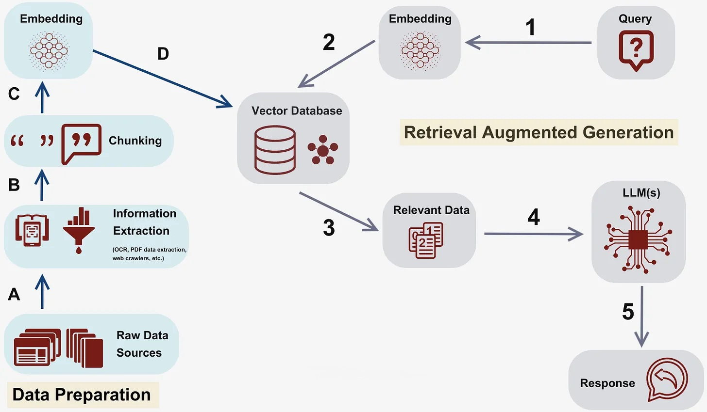
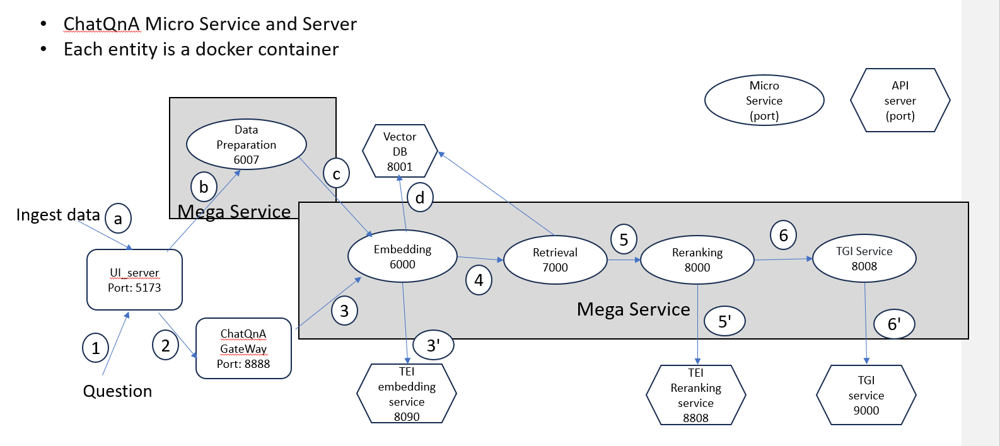

# ChatQnA Application

Chatbots are the most widely adopted use case for leveraging the powerful chat and reasoning capabilities of large language models (LLMs). The retrieval augmented generation (RAG) architecture is quickly becoming the industry standard for chatbots development. It combines the benefits of a knowledge base (via a vector store) and generative models to reduce hallucinations, maintain up-to-date information, and leverage domain-specific knowledge.

RAG bridges the knowledge gap by dynamically fetching relevant information from external sources, ensuring that responses generated remain factual and current. The core of this architecture are vector databases, which are instrumental in enabling efficient and semantic retrieval of information. These databases store data as vectors, allowing RAG to swiftly access the most pertinent documents or data points based on semantic similarity.

ChatQnA architecture shows below:

ChatQnA is implemented on top of [GenAIComps](https://github.com/opea-project/GenAIComps), the ChatQnA Flow Chart shows below:

This ChatQnA use case performs RAG using LangChain, Redis VectorDB and Text Generation Inference on Intel Gaudi2 or Intel XEON Scalable Processors. The Intel Gaudi2 accelerator supports both training and inference for deep learning models in particular for LLMs. Please visit [Habana AI products](https://habana.ai/products) for more details.

# Deploy ChatQnA Service

The ChatQnA service can be effortlessly deployed on either Intel Gaudi2 or Intel XEON Scalable Processors.

## Deploy ChatQnA on Gaudi

Refer to the [Gaudi Guide](./docker/gaudi/README.md) for instructions on deploying ChatQnA on Gaudi.

## Deploy ChatQnA on Xeon

Refer to the [Xeon Guide](./docker/xeon/README.md) for instructions on deploying ChatQnA on Xeon.

## Deploy ChatQnA on NVIDIA GPU

Refer to the [NVIDIA GPU Guide](./docker/gpu/README.md) for instructions on deploying ChatQnA on NVIDIA GPU.

## Deploy ChatQnA into Kubernetes on Xeon & Gaudi

Refer to the [Kubernetes Guide](./kubernetes/manifests/README.md) for instructions on deploying ChatQnA into Kubernetes on Xeon & Gaudi.

## Deploy ChatQnA on AI PC

Refer to the [AI PC Guide](./docker/aipc/README.md) for instructions on deploying ChatQnA on AI PC.
