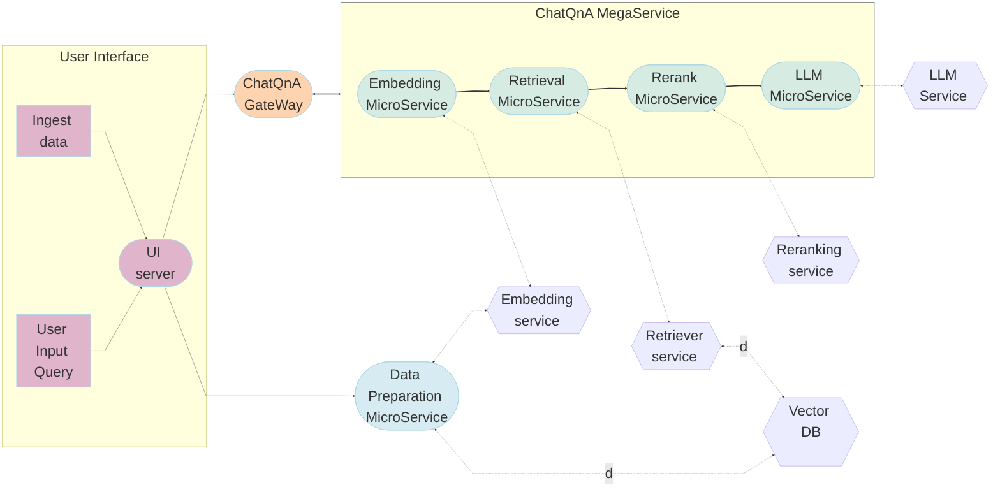

# ChatQnA Application

Chatbots are the most widely adopted use case for leveraging the powerful chat and reasoning capabilities of large language models (LLMs). The retrieval augmented generation (RAG) architecture is quickly becoming the industry standard for chatbot development. It combines the benefits of a knowledge base (via a vector store) and generative models to reduce hallucinations, maintain up-to-date information, and leverage domain-specific knowledge.

RAG bridges the knowledge gap by dynamically fetching relevant information from external sources, ensuring that response generated remain factual and current. The core of this architecture is vector databases, which are instrumental in enabling efficient and semantic retrieval of information. These databases store data as vectors, allowing RAG to swiftly access the most pertinent documents or data points based on semantic similarity.

# Table of contents

1. [Architecture](#architecture-and-deploy-details)
2. [Deployment Options](#deployment-options)
3. [Monitoring and Tracing](#monitoring-opea-service-with-prometheus-and-grafana-dashboard)

## Architecture

The ChatQnA application is a customizable end-to-end workflow that leverages the capabilities of LLM's and RAG efficiently. ChatQnA architecture is shown below:

This application is modular as it leverages each component as a microservice(as defined in [GenAIComps](https://github.com/opea-project/GenAIComps)) that can scale independently. It comprises data preparation, embedding, retrival, reranker(optinal) and LLM microservices. All these microservices are stiched together by the Chatqna megaservice that orchestrates the data through these microservices. The flow chart below shows the information flow between different microservices for this example.

## Deployment Options

The table below shows different deployment options to choose from. They outline in detail the implementation of this example on the selected hardware.

| Category | Deployment Option | Description |
|------------------|------------|------------------------------|
| On-premise Deployments | Docker compose | [ChatQnA deployment on Xeon](./docker_compose/intel/cpu/xeon) |
| | | [ChatQnA deployment on  AI PC](./docker_compose/intel/cpu/aipc) |
| | | [ChatQnA deployment on  Gaudi](./docker_compose/intel/hpu/gaudi) |
| | | [ChatQnA deployment on  Nvidia GPU (Turing, Ampere 80, Ampere 86, Ada Lovelace, H100](./docker_compose/nvidia/gpu) |
| | | [ChatQnA deployment on  AMD Rocm](./docker_compose/amd/gpu/rocm) |
| | Kubernetes | [helm charts](./kubernetes/helm)|
| Cloud Service Providers |AWS | [Terraform deployment on 4th Gen Intel Xeon with Intel AMX using meta-llama/Meta-Llama-3-8B-Instruct ](https://github.com/intel/terraform-intel-aws-vm/tree/main/examples/gen-ai-xeon-opea-chatqna) |
|  | | [Terraform deployment on 4th Gen Intel Xeon with Intel AMX using TII Falcon2-11B](https://github.com/intel/terraform-intel-aws-vm/tree/main/examples/gen-ai-xeon-opea-chatqna-falcon11B) |
| | GCP | [Terraform deployment on 5th Gen Intel Xeon with Intel AMX(support Confidential AI by using Intel® TDX](https://github.com/intel/terraform-intel-gcp-vm/tree/main/examples/gen-ai-xeon-opea-chatqna) |
| | Azure | Work-in-progress  |
| | Intel Tiber AI Cloud | Work-in-progress |
| | Any Xeon based Ubuntu system | [ChatQnA Ansible Module for Ubuntu 20.04](https://github.com/intel/optimized-cloud-recipes/tree/main/recipes/ai-opea-chatqna-xeon) . Use this if you are not using Terraform and have provisioned your system with another tool or manually including bare metal. |
