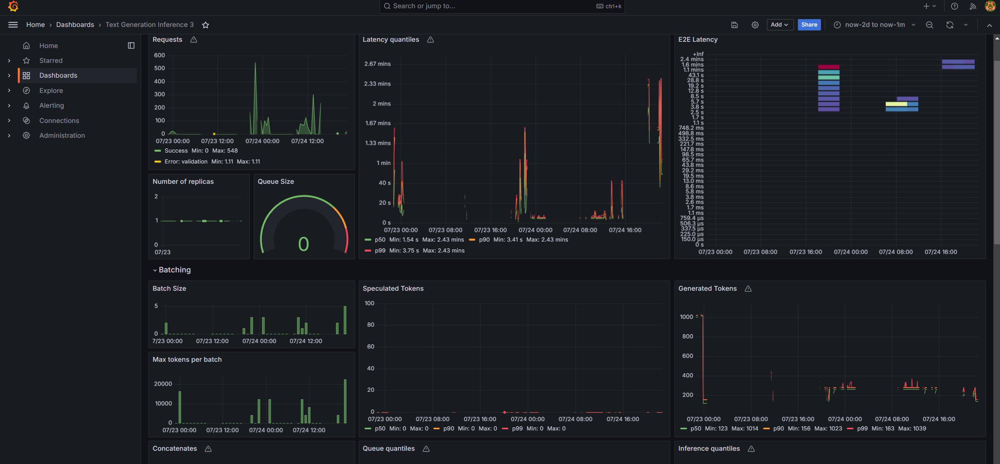

# ChatQnA Application

Chatbots are the most widely adopted use case for leveraging the powerful chat and reasoning capabilities of large language models (LLMs). The retrieval augmented generation (RAG) architecture is quickly becoming the industry standard for chatbots development. It combines the benefits of a knowledge base (via a vector store) and generative models to reduce hallucinations, maintain up-to-date information, and leverage domain-specific knowledge.

RAG bridges the knowledge gap by dynamically fetching relevant information from external sources, ensuring that responses generated remain factual and current. The core of this architecture are vector databases, which are instrumental in enabling efficient and semantic retrieval of information. These databases store data as vectors, allowing RAG to swiftly access the most pertinent documents or data points based on semantic similarity.

## 🤖 Automated Terraform Deployment using Intel® Optimized Cloud Modules for **Terraform**

| Cloud Provider       | Intel Architecture                | Intel Optimized Cloud Module for Terraform                                                                                         | Comments                                                             |
| -------------------- | --------------------------------- | ---------------------------------------------------------------------------------------------------------------------------------- | -------------------------------------------------------------------- |
| AWS                  | 4th Gen Intel Xeon with Intel AMX | [AWS Module](https://github.com/intel/terraform-intel-aws-vm/tree/main/examples/gen-ai-xeon-opea-chatqna)                          | Uses meta-llama/Meta-Llama-3-8B-Instruct by default                  |
| AWS Falcon2-11B      | 4th Gen Intel Xeon with Intel AMX | [AWS Module with Falcon11B](https://github.com/intel/terraform-intel-aws-vm/tree/main/examples/gen-ai-xeon-opea-chatqna-falcon11B) | Uses TII Falcon2-11B LLM Model                                       |
| GCP                  | 5th Gen Intel Xeon with Intel AMX | [GCP Module](https://github.com/intel/terraform-intel-gcp-vm/tree/main/examples/gen-ai-xeon-opea-chatqna)                          | Also supports Confidential AI by using Intel® TDX with 4th Gen Xeon |
| Azure                | 5th Gen Intel Xeon with Intel AMX | Work-in-progress                                                                                                                   | Work-in-progress                                                     |
| Intel Tiber AI Cloud | 5th Gen Intel Xeon with Intel AMX | Work-in-progress                                                                                                                   | Work-in-progress                                                     |

## Automated Deployment to Ubuntu based system(if not using Terraform) using Intel® Optimized Cloud Modules for **Ansible**

To deploy to existing Xeon Ubuntu based system, use our Intel Optimized Cloud Modules for Ansible. This is the same Ansible playbook used by Terraform.
Use this if you are not using Terraform and have provisioned your system with another tool or manually including bare metal.
| Operating System | Intel Optimized Cloud Module for Ansible |
|------------------|------------------------------------------|
| Ubuntu 20.04 | [ChatQnA Ansible Module](https://github.com/intel/optimized-cloud-recipes/tree/main/recipes/ai-opea-chatqna-xeon) |
| Ubuntu 22.04 | Work-in-progress |

## Manually Deploy ChatQnA Service

The ChatQnA service can be effortlessly deployed on Intel Gaudi2, Intel Xeon Scalable Processors，Nvidia GPU and AMD GPU.

Two types of ChatQnA pipeline are supported now: `ChatQnA with/without Rerank`. And the `ChatQnA without Rerank` pipeline (including Embedding, Retrieval, and LLM) is offered for Xeon customers who can not run rerank service on HPU yet require high performance and accuracy.

Quick Start Deployment Steps:

1. Set up the environment variables.
2. Run Docker Compose.
3. Consume the ChatQnA Service.

Note:

1. If you do not have docker installed you can run this script to install docker : `bash docker_compose/install_docker.sh`.

2. The default LLM is `meta-llama/Meta-Llama-3-8B-Instruct`. Before deploying the application, please make sure either you've requested and been granted the access to it on [Huggingface](https://huggingface.co/meta-llama/Meta-Llama-3-8B-Instruct) or you've downloaded the model locally from [ModelScope](https://www.modelscope.cn/models).

### Quick Start: 1.Setup Environment Variable

To set up environment variables for deploying ChatQnA services, follow these steps:

1. Set the required environment variables:

   ```bash
   # Example: host_ip="192.168.1.1"
   export host_ip="External_Public_IP"
   # Example: no_proxy="localhost, 127.0.0.1, 192.168.1.1"
   export no_proxy="Your_No_Proxy"
   export HUGGINGFACEHUB_API_TOKEN="Your_Huggingface_API_Token"
   ```

2. If you are in a proxy environment, also set the proxy-related environment variables:

   ```bash
   export http_proxy="Your_HTTP_Proxy"
   export https_proxy="Your_HTTPs_Proxy"
   ```

3. Set up other environment variables:

   > Notice that you can only choose **one** hardware option below to set up envs according to your hardware. Make sure port numbers are set correctly as well.

   ```bash
   # on Gaudi
   cd GenAIExamples/ChatQnA/docker_compose/intel/hpu/gaudi/
   source ./set_env.sh
   export no_proxy="Your_No_Proxy",chatqna-gaudi-ui-server,chatqna-gaudi-backend-server,dataprep-redis-service,tei-embedding-service,retriever,tei-reranking-service,tgi-service,vllm-service,guardrails
   # on Xeon
   cd GenAIExamples/ChatQnA/docker_compose/intel/cpu/xeon/
   source ./set_env.sh
   export no_proxy="Your_No_Proxy",chatqna-xeon-ui-server,chatqna-xeon-backend-server,dataprep-redis-service,tei-embedding-service,retriever,tei-reranking-service,tgi-service,vllm-service
   # on Nvidia GPU
   cd GenAIExamples/ChatQnA/docker_compose/nvidia/gpu
   source ./set_env.sh
   export no_proxy="Your_No_Proxy",chatqna-ui-server,chatqna-backend-server,dataprep-redis-service,tei-embedding-service,retriever,tei-reranking-service,tgi-service
   ```

### Quick Start: 2.Run Docker Compose

Select the compose.yaml file that matches your hardware.

CPU example:

```bash
cd GenAIExamples/ChatQnA/docker_compose/intel/cpu/xeon/
# cd GenAIExamples/ChatQnA/docker_compose/intel/hpu/gaudi/
# cd GenAIExamples/ChatQnA/docker_compose/nvidia/gpu/
docker compose up -d
```

To enable Open Telemetry Tracing, compose.telemetry.yaml file need to be merged along with default compose.yaml file.  
CPU example with Open Telemetry feature:

```bash
cd GenAIExamples/ChatQnA/docker_compose/intel/cpu/xeon/
docker compose -f compose.yaml -f compose.telemetry.yaml up -d
```

It will automatically download the docker image on `docker hub`:

```bash
docker pull opea/chatqna:latest
docker pull opea/chatqna-ui:latest
```

In following cases, you could build docker image from source by yourself.

- Failed to download the docker image.

- If you want to use a specific version of Docker image.

Please refer to the 'Build Docker Images' in [Guide](docker_compose/intel/cpu/xeon/README.md).

### QuickStart: 3.Consume the ChatQnA Service

```bash
curl http://${host_ip}:8888/v1/chatqna \
    -H "Content-Type: application/json" \
    -d '{
        "messages": "What is the revenue of Nike in 2023?"
    }'
```

## Architecture and Deploy details

ChatQnA architecture shows below:


The ChatQnA example is implemented using the component-level microservices defined in [GenAIComps](https://github.com/opea-project/GenAIComps). The flow chart below shows the information flow between different microservices for this example.


This ChatQnA use case performs RAG using LangChain, Redis VectorDB and Text Generation Inference on [Intel Gaudi2](https://www.intel.com/content/www/us/en/products/details/processors/ai-accelerators/gaudi-overview.html) or [Intel Xeon Scalable Processors](https://www.intel.com/content/www/us/en/products/details/processors/xeon.html).
In the below, we provide a table that describes for each microservice component in the ChatQnA architecture, the default configuration of the open source project, hardware, port, and endpoint.

Gaudi default compose.yaml
| MicroService | Open Source Project | HW | Port | Endpoint |
| ------------ | ------------------- | ----- | ---- | -------------------- |
| Embedding | Langchain | Xeon | 6000 | /v1/embeddings |
| Retriever | Langchain, Redis | Xeon | 7000 | /v1/retrieval |
| Reranking | Langchain, TEI | Gaudi | 8000 | /v1/reranking |
| LLM | Langchain, TGI | Gaudi | 9000 | /v1/chat/completions |
| Dataprep | Redis, Langchain | Xeon | 6007 | /v1/dataprep/ingest |

### Required Models

By default, the embedding, reranking and LLM models are set to a default value as listed below:

| Service   | Model                               |
| --------- | ----------------------------------- |
| Embedding | BAAI/bge-base-en-v1.5               |
| Reranking | BAAI/bge-reranker-base              |
| LLM       | meta-llama/Meta-Llama-3-8B-Instruct |

Change the `xxx_MODEL_ID` in `docker_compose/xxx/set_env.sh` for your needs.

For customers with proxy issues, the models from [ModelScope](https://www.modelscope.cn/models) are also supported in ChatQnA. Refer to [this readme](docker_compose/intel/cpu/xeon/README.md) for details.

### Deploy ChatQnA on Gaudi

Find the corresponding [compose.yaml](./docker_compose/intel/hpu/gaudi/compose.yaml).

```bash
cd GenAIExamples/ChatQnA/docker_compose/intel/hpu/gaudi/
docker compose up -d
```

To enable Open Telemetry Tracing, compose.telemetry.yaml file need to be merged along with default compose.yaml file.

```bash
cd GenAIExamples/ChatQnA/docker_compose/intel/hpu/gaudi/
docker compose -f compose.yaml -f compose.telemetry.yaml up -d
```

Refer to the [Gaudi Guide](./docker_compose/intel/hpu/gaudi/README.md) to build docker images from source.

### Deploy ChatQnA on Xeon

Find the corresponding [compose.yaml](./docker_compose/intel/cpu/xeon/compose.yaml).

```bash
cd GenAIExamples/ChatQnA/docker_compose/intel/cpu/xeon/
docker compose up -d
```

To enable Open Telemetry Tracing, compose.telemetry.yaml file need to be merged along with default compose.yaml file.

```bash
cd GenAIExamples/ChatQnA/docker_compose/intel/cpu/xeon/
docker compose -f compose.yaml -f compose.telemetry.yaml up -d
```

Refer to the [Xeon Guide](./docker_compose/intel/cpu/xeon/README.md) for more instructions on building docker images from source.

### Deploy ChatQnA on NVIDIA GPU

```bash
cd GenAIExamples/ChatQnA/docker_compose/nvidia/gpu/
docker compose up -d
```

Refer to the [NVIDIA GPU Guide](./docker_compose/nvidia/gpu/README.md) for more instructions on building docker images from source.

### Deploy ChatQnA on Kubernetes using Helm Chart

Refer to the [ChatQnA helm chart](./kubernetes/helm/README.md) for instructions on deploying ChatQnA on Kubernetes.

### Deploy ChatQnA on AI PC

Refer to the [AI PC Guide](./docker_compose/intel/cpu/aipc/README.md) for instructions on deploying ChatQnA on AI PC.

### Deploy ChatQnA on Red Hat OpenShift Container Platform (RHOCP)

Refer to the [Intel Technology enabling for Openshift readme](https://github.com/intel/intel-technology-enabling-for-openshift/blob/main/workloads/opea/chatqna/README.md) for instructions to deploy ChatQnA prototype on RHOCP with [Red Hat OpenShift AI (RHOAI)](https://www.redhat.com/en/technologies/cloud-computing/openshift/openshift-ai).

## Consume ChatQnA Service with RAG

### Check Service Status

Before consuming ChatQnA Service, make sure the vLLM/TGI service is ready, which takes some time.

```bash
# vLLM example
docker logs vllm-gaudi-server 2>&1 | grep complete
# TGI example
docker logs tgi-gaudi-server | grep Connected
```

Consume ChatQnA service until you get the response like below.

```log
# vLLM
INFO: Application startup complete.
# TGI
2024-09-03T02:47:53.402023Z  INFO text_generation_router::server: router/src/server.rs:2311: Connected
```

### Upload RAG Files (Optional)

To chat with retrieved information, you need to upload a file using `Dataprep` service.

Here is an example of `Nike 2023` pdf.

```bash
# download pdf file
wget https://raw.githubusercontent.com/opea-project/GenAIComps/v1.1/comps/retrievers/redis/data/nke-10k-2023.pdf
# upload pdf file with dataprep
curl -X POST "http://${host_ip}:6007/v1/dataprep/ingest" \
    -H "Content-Type: multipart/form-data" \
    -F "files=@./nke-10k-2023.pdf"
```

### Consume Chat Service

Two ways of consuming ChatQnA Service:

1. Use cURL command on terminal

   ```bash
   curl http://${host_ip}:8888/v1/chatqna \
       -H "Content-Type: application/json" \
       -d '{
           "messages": "What is the revenue of Nike in 2023?"
       }'
   ```

2. Access via frontend

   To access the frontend, open the following URL in your browser: `http://{host_ip}:5173`

   By default, the UI runs on port 5173 internally.

   If you choose conversational UI, use this URL: `http://{host_ip}:5174`

## Troubleshooting

1. If you get errors like "Access Denied", [validate micro service](https://github.com/opea-project/GenAIExamples/tree/main/ChatQnA/docker_compose/intel/cpu/xeon/README.md#validate-microservices) first. A simple example:

   ```bash
   http_proxy="" curl ${host_ip}:6006/embed -X POST  -d '{"inputs":"What is Deep Learning?"}' -H 'Content-Type: application/json'
   ```

2. (Docker only) If all microservices work well, check the port ${host_ip}:8888, the port may be allocated by other users, you can modify the `compose.yaml`.

3. (Docker only) If you get errors like "The container name is in use", change container name in `compose.yaml`.

## Monitoring OPEA Service with Prometheus and Grafana dashboard

OPEA microservice deployment can easily be monitored through Grafana dashboards in conjunction with Prometheus data collection. Follow the [README](https://github.com/opea-project/GenAIEval/blob/main/evals/benchmark/grafana/README.md) to setup Prometheus and Grafana servers and import dashboards to monitor the OPEA service.




## Tracing Services with OpenTelemetry Tracing and Jaeger

> NOTE: This feature is disabled by default. Please check the Deploy ChatQnA sessions for how to enable this feature with compose.telemetry.yaml file.

OPEA microservice and TGI/TEI serving can easily be traced through Jaeger dashboards in conjunction with OpenTelemetry Tracing feature. Follow the [README](https://github.com/opea-project/GenAIComps/tree/main/comps/cores/telemetry#tracing) to trace additional functions if needed.

Tracing data is exported to http://{EXTERNAL_IP}:4318/v1/traces via Jaeger.
Users could also get the external IP via below command.

```bash
ip route get 8.8.8.8 | grep -oP 'src \K[^ ]+'
```

Access the Jaeger dashboard UI at http://{EXTERNAL_IP}:16686

For TGI serving on Gaudi, users could see different services like opea, TEI and TGI.


Here is a screenshot for one tracing of TGI serving request.


There are also OPEA related tracings. Users could understand the time breakdown of each service request by looking into each opea:schedule operation.


There could be async function such as `llm/MicroService_asyn_generate` and user needs to check the trace of the async function in another operation like
opea:llm_generate_stream.

