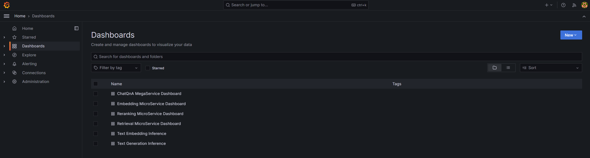

# Table of contents

1. [Build MegaService Docker Image](#Build-MegaService-Docker-Image)
2. [Build UI Docker Image](#Build-UI-Docker-Image)
3. [Build Conversational React UI Docker Image](#Build-Conversational-React-UI-Docker-Imaged)
4. [Troubleshooting](#Troubleshooting)
5. [Monitoring OPEA Service with Prometheus and Grafana dashboard](#Monitoring-OPEA-Service-with-Prometheus-and-Grafana-dashboard)
6. [Tracing Services with OpenTelemetry Tracing and Jaeger](#Tracing-Services-with-OpenTelemetry-Tracing-and-Jaeger)

## Build MegaService Docker Image

To construct the Mega Service with Rerank, we utilize the [GenAIComps](https://github.com/opea-project/GenAIComps.git) microservice pipeline within the `chatqna.py` Python script. Build MegaService Docker image via below command:

```bash
git clone https://github.com/opea-project/GenAIExamples.git
cd GenAIExamples/ChatQnA
docker build --no-cache -t opea/chatqna:latest --build-arg https_proxy=$https_proxy --build-arg http_proxy=$http_proxy -f Dockerfile .
```

## Build UI Docker Image

Build frontend Docker image via below command:

```bash
cd GenAIExamples/ChatQnA/ui
docker build --no-cache -t opea/chatqna-ui:latest --build-arg https_proxy=$https_proxy --build-arg http_proxy=$http_proxy -f ./docker/Dockerfile .
```

## Build Conversational React UI Docker Image (Optional)

Build frontend Docker image that enables Conversational experience with ChatQnA megaservice via below command:

**Export the value of the public IP address of your Xeon server to the `host_ip` environment variable**

```bash
cd GenAIExamples/ChatQnA/ui
docker build --no-cache -t opea/chatqna-conversation-ui:latest --build-arg https_proxy=$https_proxy --build-arg http_proxy=$http_proxy -f ./docker/Dockerfile.react .
```

## Troubleshooting

1. If you get errors like "Access Denied", [validate micro service](https://github.com/opea-project/GenAIExamples/tree/main/ChatQnA/docker_compose/intel/cpu/xeon/README.md#validate-microservices) first. A simple example:

   ```bash
   http_proxy="" curl ${host_ip}:6006/embed -X POST  -d '{"inputs":"What is Deep Learning?"}' -H 'Content-Type: application/json'
   ```

2. (Docker only) If all microservices work well, check the port ${host_ip}:8888, the port may be allocated by other users, you can modify the `compose.yaml`.

3. (Docker only) If you get errors like "The container name is in use", change container name in `compose.yaml`.

## Monitoring OPEA Service with Prometheus and Grafana dashboard

OPEA microservice deployment can easily be monitored through Grafana dashboards in conjunction with Prometheus data collection. Follow the [README](https://github.com/opea-project/GenAIEval/blob/main/evals/benchmark/grafana/README.md) to setup Prometheus and Grafana servers and import dashboards to monitor the OPEA service.




## Tracing Services with OpenTelemetry Tracing and Jaeger

> NOTE: This feature is disabled by default. Please check the Deploy ChatQnA sessions for how to enable this feature with compose.telemetry.yaml file.

OPEA microservice and TGI/TEI serving can easily be traced through Jaeger dashboards in conjunction with OpenTelemetry Tracing feature. Follow the [README](https://github.com/opea-project/GenAIComps/tree/main/comps/cores/telemetry#tracing) to trace additional functions if needed.

Tracing data is exported to http://{EXTERNAL_IP}:4318/v1/traces via Jaeger.
Users could also get the external IP via below command.

```bash
ip route get 8.8.8.8 | grep -oP 'src \K[^ ]+'
```

Access the Jaeger dashboard UI at http://{EXTERNAL_IP}:16686

For TGI serving on Gaudi, users could see different services like opea, TEI and TGI.


Here is a screenshot for one tracing of TGI serving request.


There are also OPEA related tracings. Users could understand the time breakdown of each service request by looking into each opea:schedule operation.


There could be async function such as `llm/MicroService_asyn_generate` and user needs to check the trace of the async function in another operation like
opea:llm_generate_stream.

