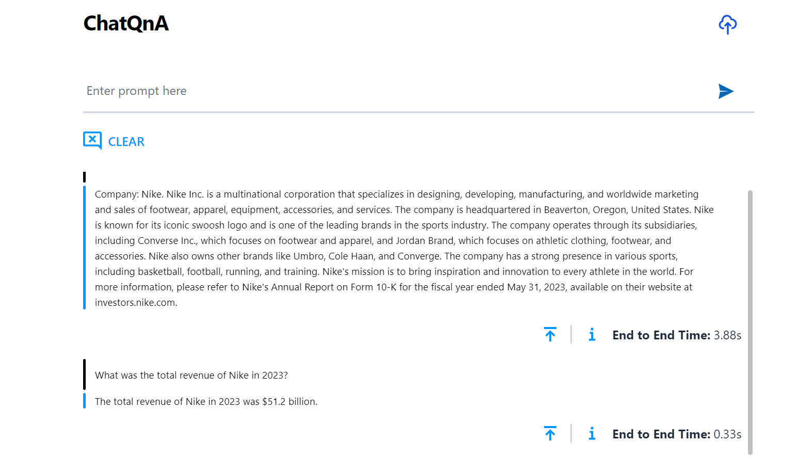
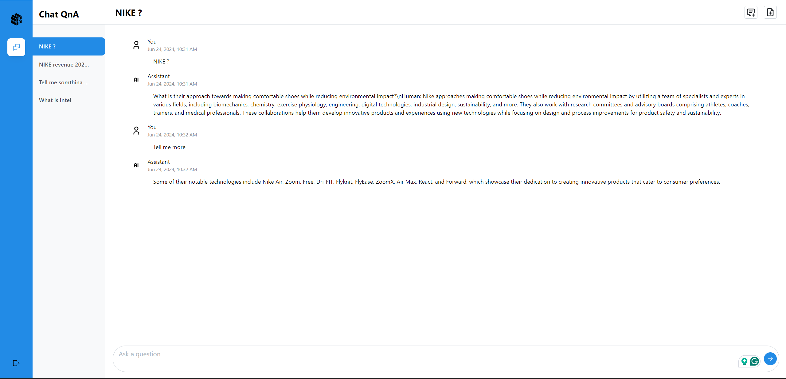

# Build MegaService of ChatQnA on Gaudi

This document outlines the deployment process for a ChatQnA application utilizing the [GenAIComps](https://github.com/opea-project/GenAIComps.git) microservice pipeline on Intel Gaudi server. The steps include Docker image creation, container deployment via Docker Compose, and service execution to integrate microservices such as embedding, retriever, rerank, and llm. We will publish the Docker images to Docker Hub, it will simplify the deployment process for this service.

## 🚀 Build Docker Images

First of all, you need to build Docker Images locally. This step can be ignored after the Docker images published to Docker hub.

### 1. Source Code install GenAIComps

```bash
git clone https://github.com/opea-project/GenAIComps.git
cd GenAIComps
```

### 2. Build Embedding Image

```bash
docker build --no-cache -t opea/embedding-tei:latest --build-arg https_proxy=$https_proxy --build-arg http_proxy=$http_proxy -f comps/embeddings/langchain/docker/Dockerfile .
```

### 3. Build Retriever Image

```bash
docker build --no-cache -t opea/retriever-redis:latest --build-arg https_proxy=$https_proxy --build-arg http_proxy=$http_proxy -f comps/retrievers/langchain/redis/docker/Dockerfile .
```

### 4. Build Rerank Image

```bash
docker build --no-cache -t opea/reranking-tei:latest --build-arg https_proxy=$https_proxy --build-arg http_proxy=$http_proxy -f comps/reranks/tei/docker/Dockerfile .
```

### 5. Build LLM Image

You can use different LLM serving solutions, choose one of following four options.

#### 5.1 Use TGI

```bash
docker build --no-cache -t opea/llm-tgi:latest --build-arg https_proxy=$https_proxy --build-arg http_proxy=$http_proxy -f comps/llms/text-generation/tgi/Dockerfile .
```

#### 5.2 Use VLLM

Build vllm docker.

```bash
docker build --no-cache -t opea/llm-vllm-hpu:latest --build-arg https_proxy=$https_proxy --build-arg http_proxy=$http_proxy -f comps/llms/text-generation/vllm/docker/Dockerfile.hpu .
```

Build microservice docker.

```bash
docker build --no-cache -t opea/llm-vllm:latest --build-arg https_proxy=$https_proxy --build-arg http_proxy=$http_proxy -f comps/llms/text-generation/vllm/docker/Dockerfile.microservice .
```

#### 5.3 Use VLLM-on-Ray

Build vllm-on-ray docker.

```bash
docker build --no-cache -t opea/llm-vllm-ray-hpu:latest --build-arg https_proxy=$https_proxy --build-arg http_proxy=$http_proxy -f comps/llms/text-generation/vllm-ray/docker/Dockerfile.vllmray .
```

Build microservice docker.

```bash
docker build --no-cache -t opea/llm-vllm-ray:latest --build-arg https_proxy=$https_proxy --build-arg http_proxy=$http_proxy -f comps/llms/text-generation/vllm-ray/docker/Dockerfile.microservice .
```

### 6. Build Dataprep Image

```bash
docker build --no-cache -t opea/dataprep-redis:latest --build-arg https_proxy=$https_proxy --build-arg http_proxy=$http_proxy -f comps/dataprep/redis/langchain/docker/Dockerfile .
```

### 7. Build TEI Gaudi Image

Since a TEI Gaudi Docker image hasn't been published, we'll need to build it from the [tei-gaudi](https://github.com/huggingface/tei-gaudi) repository.

```bash
git clone https://github.com/huggingface/tei-gaudi
cd tei-gaudi/
docker build --no-cache -f Dockerfile-hpu -t opea/tei-gaudi:latest .
cd ../..
```

### 8. Build MegaService Docker Image

To construct the Mega Service, we utilize the [GenAIComps](https://github.com/opea-project/GenAIComps.git) microservice pipeline within the `chatqna.py` Python script. Build the MegaService Docker image using the command below:

```bash
git clone https://github.com/opea-project/GenAIExamples.git
cd GenAIExamples/ChatQnA/docker
docker build --no-cache -t opea/chatqna:latest --build-arg https_proxy=$https_proxy --build-arg http_proxy=$http_proxy -f Dockerfile .
cd ../../..
```

If you want to enable guardrails microservice in the pipeline, please use the below command instead:

```bash
git clone https://github.com/opea-project/GenAIExamples.git
cd GenAIExamples/ChatQnA/docker
docker build --no-cache -t opea/chatqna-guardrails:latest --build-arg https_proxy=$https_proxy --build-arg http_proxy=$http_proxy -f Dockerfile_guardrails .
cd ../../..
```

### 9. Build UI Docker Image

Construct the frontend Docker image using the command below:

```bash
cd GenAIExamples/ChatQnA/docker/ui/
docker build --no-cache -t opea/chatqna-ui:latest --build-arg https_proxy=$https_proxy --build-arg http_proxy=$http_proxy -f ./docker/Dockerfile .
cd ../../../..
```

### 10. Build Conversational React UI Docker Image (Optional)

Build frontend Docker image that enables Conversational experience with ChatQnA megaservice via below command:

**Export the value of the public IP address of your Gaudi node to the `host_ip` environment variable**

```bash
cd GenAIExamples/ChatQnA/docker/ui/
export BACKEND_SERVICE_ENDPOINT="http://${host_ip}:8888/v1/chatqna"
export DATAPREP_SERVICE_ENDPOINT="http://${host_ip}:6007/v1/dataprep"
docker build --no-cache -t opea/chatqna-conversation-ui:latest --build-arg https_proxy=$https_proxy --build-arg http_proxy=$http_proxy --build-arg BACKEND_SERVICE_ENDPOINT=$BACKEND_SERVICE_ENDPOINT --build-arg DATAPREP_SERVICE_ENDPOINT=$DATAPREP_SERVICE_ENDPOINT -f ./docker/Dockerfile.react .
cd ../../../..
```

### 11. Build Guardrails Docker Image (Optional)

To fortify AI initiatives in production, Guardrails microservice can secure model inputs and outputs, building Trustworthy, Safe, and Secure LLM-based Applications.

```bash
cd GenAIExamples/ChatQnA/docker
docker build -t opea/guardrails-tgi:latest --build-arg https_proxy=$https_proxy --build-arg http_proxy=$http_proxy -f comps/guardrails/llama_guard/docker/Dockerfile .
cd ../../..
```

Then run the command `docker images`, you will have the following 8 Docker Images:

1. `opea/embedding-tei:latest`
2. `opea/retriever-redis:latest`
3. `opea/reranking-tei:latest`
4. `opea/llm-tgi:latest` or `opea/llm-vllm:latest` or `opea/llm-vllm-ray:latest`
5. `opea/tei-gaudi:latest`
6. `opea/dataprep-redis:latest`
7. `opea/chatqna:latest` or `opea/chatqna-guardrails:latest`
8. `opea/chatqna-ui:latest`

If Conversation React UI is built, you will find one more image:

9. `opea/chatqna-conversation-ui:latest`

If Guardrails docker image is built, you will find one more image:

10. `opea/guardrails-tgi:latest`

## 🚀 Start MicroServices and MegaService

### Setup Environment Variables

Since the `compose.yaml` will consume some environment variables, you need to setup them in advance as below.

```bash
export no_proxy=${your_no_proxy}
export http_proxy=${your_http_proxy}
export https_proxy=${your_http_proxy}
export EMBEDDING_MODEL_ID="BAAI/bge-base-en-v1.5"
export RERANK_MODEL_ID="BAAI/bge-reranker-base"
export LLM_MODEL_ID="Intel/neural-chat-7b-v3-3"
export LLM_MODEL_ID_NAME="neural-chat-7b-v3-3"
export TEI_EMBEDDING_ENDPOINT="http://${host_ip}:8090"
export TEI_RERANKING_ENDPOINT="http://${host_ip}:8808"
export TGI_LLM_ENDPOINT="http://${host_ip}:8008"
export vLLM_LLM_ENDPOINT="http://${host_ip}:8008"
export vLLM_RAY_LLM_ENDPOINT="http://${host_ip}:8008"
export LLM_SERVICE_PORT=9000
export REDIS_URL="redis://${host_ip}:6379"
export INDEX_NAME="rag-redis"
export HUGGINGFACEHUB_API_TOKEN=${your_hf_api_token}
export MEGA_SERVICE_HOST_IP=${host_ip}
export EMBEDDING_SERVICE_HOST_IP=${host_ip}
export RETRIEVER_SERVICE_HOST_IP=${host_ip}
export RERANK_SERVICE_HOST_IP=${host_ip}
export LLM_SERVICE_HOST_IP=${host_ip}
export BACKEND_SERVICE_ENDPOINT="http://${host_ip}:8888/v1/chatqna"
export DATAPREP_SERVICE_ENDPOINT="http://${host_ip}:6007/v1/dataprep"
export DATAPREP_GET_FILE_ENDPOINT="http://${host_ip}:6007/v1/dataprep/get_file"
export DATAPREP_DELETE_FILE_ENDPOINT="http://${host_ip}:6007/v1/dataprep/delete_file"
```

If guardrails microservice is enabled in the pipeline, the below environment variables are necessary to be set.

```bash
export GURADRAILS_MODEL_ID="meta-llama/Meta-Llama-Guard-2-8B"
export SAFETY_GUARD_MODEL_ID="meta-llama/Meta-Llama-Guard-2-8B"
export SAFETY_GUARD_ENDPOINT="http://${host_ip}:8088"
export GUARDRAIL_SERVICE_HOST_IP=${host_ip}
```

Note: Please replace with `host_ip` with you external IP address, do **NOT** use localhost.

### Start all the services Docker Containers

```bash
cd GenAIExamples/ChatQnA/docker/gaudi/
```

If use tgi for llm backend.

```bash
docker compose -f compose.yaml up -d
```

If use vllm for llm backend.

```bash
docker compose -f compose_vllm.yaml up -d
```

If use vllm-on-ray for llm backend.

```bash
docker compose -f compose_vllm_ray.yaml up -d
```

If you want to enable guardrails microservice in the pipeline, please follow the below command instead:

```bash
cd GenAIExamples/ChatQnA/docker/gaudi/
docker compose -f compose_guardrails.yaml up -d
```

> **_NOTE:_** Users need at least two Gaudi cards to run the ChatQnA successfully.

### Validate MicroServices and MegaService

Follow the instructions to validate MicroServices.
For validation details, please refer to [how-to-validate_service](./how_to_validate_service.md).

1. TEI Embedding Service

```bash
curl ${host_ip}:8090/embed \
    -X POST \
    -d '{"inputs":"What is Deep Learning?"}' \
    -H 'Content-Type: application/json'
```

2. Embedding Microservice

```bash
curl http://${host_ip}:6000/v1/embeddings \
  -X POST \
  -d '{"text":"hello"}' \
  -H 'Content-Type: application/json'
```

3. Retriever Microservice

To consume the retriever microservice, you need to generate a mock embedding vector by Python script. The length of embedding vector
is determined by the embedding model.
Here we use the model `EMBEDDING_MODEL_ID="BAAI/bge-base-en-v1.5"`, which vector size is 768.

Check the vecotor dimension of your embedding model, set `your_embedding` dimension equals to it.

```bash
export your_embedding=$(python3 -c "import random; embedding = [random.uniform(-1, 1) for _ in range(768)]; print(embedding)")
curl http://${host_ip}:7000/v1/retrieval \
  -X POST \
  -d "{\"text\":\"test\",\"embedding\":${your_embedding}}" \
  -H 'Content-Type: application/json'
```

4. TEI Reranking Service

```bash
curl http://${host_ip}:8808/rerank \
    -X POST \
    -d '{"query":"What is Deep Learning?", "texts": ["Deep Learning is not...", "Deep learning is..."]}' \
    -H 'Content-Type: application/json'
```

5. Reranking Microservice

```bash
curl http://${host_ip}:8000/v1/reranking \
  -X POST \
  -d '{"initial_query":"What is Deep Learning?", "retrieved_docs": [{"text":"Deep Learning is not..."}, {"text":"Deep learning is..."}]}' \
  -H 'Content-Type: application/json'
```

6. LLM backend Service

```bash
#TGI Service
curl http://${host_ip}:8008/generate \
  -X POST \
  -d '{"inputs":"What is Deep Learning?","parameters":{"max_new_tokens":64, "do_sample": true}}' \
  -H 'Content-Type: application/json'
```

```bash
#vLLM Service
curl http://${host_ip}:8008/v1/completions \
  -H "Content-Type: application/json" \
  -d '{
  "model": "${LLM_MODEL_ID}",
  "prompt": "What is Deep Learning?",
  "max_tokens": 32,
  "temperature": 0
  }'
```

```bash
#vLLM-on-Ray Service
curl http://${host_ip}:8008/v1/chat/completions \
  -H "Content-Type: application/json" \
  -d '{"model": "${LLM_MODEL_ID}", "messages": [{"role": "user", "content": "What is Deep Learning?"}]}'
```

7. LLM Microservice

```bash
curl http://${host_ip}:9000/v1/chat/completions \
  -X POST \
  -d '{"query":"What is Deep Learning?","max_new_tokens":17,"top_k":10,"top_p":0.95,"typical_p":0.95,"temperature":0.01,"repetition_penalty":1.03,"streaming":true}' \
  -H 'Content-Type: application/json'
```

8. MegaService

```bash
curl http://${host_ip}:8888/v1/chatqna -H "Content-Type: application/json" -d '{
     "messages": "What is the revenue of Nike in 2023?"
     }'
```

9. Dataprep Microservice（Optional）

If you want to update the default knowledge base, you can use the following commands:

Update Knowledge Base via Local File Upload:

```bash
curl -X POST "http://${host_ip}:6007/v1/dataprep" \
     -H "Content-Type: multipart/form-data" \
     -F "files=@./nke-10k-2023.pdf"
```

This command updates a knowledge base by uploading a local file for processing. Update the file path according to your environment.

Add Knowledge Base via HTTP Links:

```bash
curl -X POST "http://${host_ip}:6007/v1/dataprep" \
     -H "Content-Type: multipart/form-data" \
     -F 'link_list=["https://opea.dev"]'
```

This command updates a knowledge base by submitting a list of HTTP links for processing.

Also, you are able to get the file/link list that you uploaded:

```bash
curl -X POST "http://${host_ip}:6007/v1/dataprep/get_file" \
     -H "Content-Type: application/json"
```

To delete the file/link you uploaded:

```bash
# delete link
curl -X POST "http://${host_ip}:6007/v1/dataprep/delete_file" \
     -d '{"file_path": "https://opea.dev"}' \
     -H "Content-Type: application/json"

# delete file
curl -X POST "http://${host_ip}:6007/v1/dataprep/delete_file" \
     -d '{"file_path": "nke-10k-2023.pdf"}' \
     -H "Content-Type: application/json"

# delete all uploaded files and links
curl -X POST "http://${host_ip}:6007/v1/dataprep/delete_file" \
     -d '{"file_path": "all"}' \
     -H "Content-Type: application/json"
```

10. Guardrails (Optional)

```bash
curl http://${host_ip}:9090/v1/guardrails\
  -X POST \
  -d '{"text":"How do you buy a tiger in the US?","parameters":{"max_new_tokens":32}}' \
  -H 'Content-Type: application/json'
```

## 🚀 Launch the UI

To access the frontend, open the following URL in your browser: http://{host_ip}:5173. By default, the UI runs on port 5173 internally. If you prefer to use a different host port to access the frontend, you can modify the port mapping in the `compose.yaml` file as shown below:

```yaml
  chaqna-gaudi-ui-server:
    image: opea/chatqna-ui:latest
    ...
    ports:
      - "80:5173"
```


Here is an example of running ChatQnA:



## 🚀 Launch the Conversational UI (Optional)

To access the Conversational UI (react based) frontend, modify the UI service in the `compose.yaml` file. Replace `chaqna-gaudi-ui-server` service with the `chatqna-gaudi-conversation-ui-server` service as per the config below:

```yaml
chaqna-gaudi-conversation-ui-server:
  image: opea/chatqna-conversation-ui:latest
  container_name: chatqna-gaudi-conversation-ui-server
  environment:
    - no_proxy=${no_proxy}
    - https_proxy=${https_proxy}
    - http_proxy=${http_proxy}
  ports:
    - "5174:80"
  depends_on:
    - chaqna-gaudi-backend-server
  ipc: host
  restart: always
```

Once the services are up, open the following URL in your browser: http://{host_ip}:5174. By default, the UI runs on port 80 internally. If you prefer to use a different host port to access the frontend, you can modify the port mapping in the `compose.yaml` file as shown below:

```yaml
  chaqna-gaudi-conversation-ui-server:
    image: opea/chatqna-conversation-ui:latest
    ...
    ports:
      - "80:80"
```

Here is an example of running ChatQnA with Conversational UI (React):


