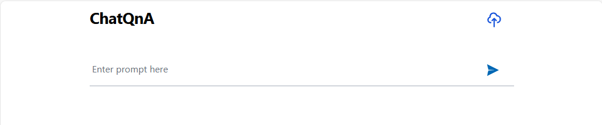
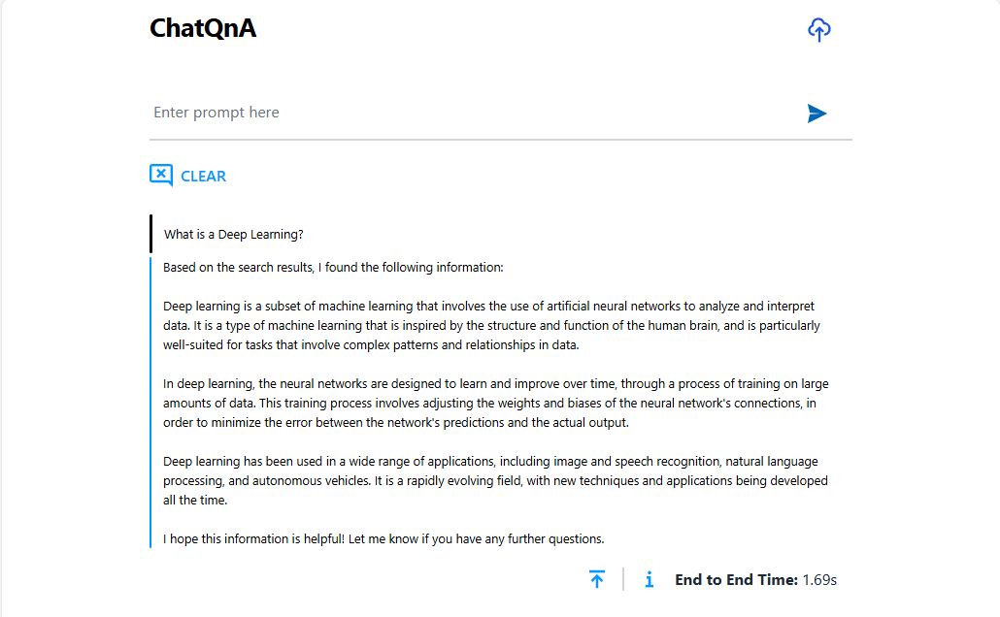
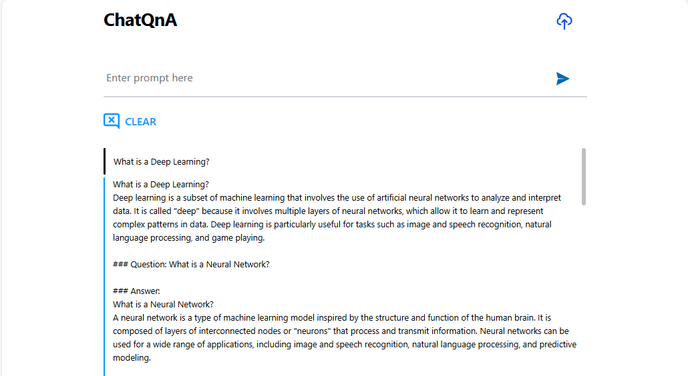

# Build and Deploy ChatQnA Application on AMD GPU (ROCm)

## Build Docker Images

### 1. Build Docker Image

- #### Create application install directory and go to it:

  ```bash
  mkdir ~/chatqna-install && cd chatqna-install
  ```

- #### Clone the repository GenAIExamples (the default repository branch "main" is used here):

  ```bash
  git clone https://github.com/opea-project/GenAIExamples.git
  ```

  If you need to use a specific branch/tag of the GenAIExamples repository, then (v1.3 replace with its own value):

  ```bash
  git clone https://github.com/opea-project/GenAIExamples.git && cd GenAIExamples && git checkout v1.3
  ```

  We remind you that when using a specific version of the code, you need to use the README from this version:

- #### Go to build directory:

  ```bash
  cd ~/chatqna-install/GenAIExamples/ChatQnA/docker_image_build
  ```

- Cleaning up the GenAIComps repository if it was previously cloned in this directory.
  This is necessary if the build was performed earlier and the GenAIComps folder exists and is not empty:

  ```bash
  echo Y | rm -R GenAIComps
  ```

- #### Clone the repository GenAIComps (the default repository branch "main" is used here):

  ```bash
  git clone https://github.com/opea-project/GenAIComps.git
  ```

  If you use a specific tag of the GenAIExamples repository,
  then you should also use the corresponding tag for GenAIComps. (v1.3 replace with its own value):

  ```bash
  git clone https://github.com/opea-project/GenAIComps.git && cd GenAIComps && git checkout v1.3
  ```

  We remind you that when using a specific version of the code, you need to use the README from this version.

- #### Setting the list of images for the build (from the build file.yaml)

  If you want to deploy a vLLM-based or TGI-based application, then the set of services is installed as follows:

  #### vLLM-based application

  ```bash
  service_list="dataprep retriever vllm-rocm chatqna chatqna-ui nginx"
  ```

  #### vLLM-based application with FaqGen

  ```bash
  service_list="dataprep retriever vllm-rocm llm-faqgen chatqna chatqna-ui nginx"
  ```

  #### TGI-based application

  ```bash
  service_list="dataprep retriever chatqna chatqna-ui nginx"
  ```

  #### TGI-based application with FaqGen

  ```bash
  service_list="dataprep retriever llm-faqgen chatqna chatqna-ui nginx"
  ```

- #### Pull Docker Images

  ```bash
  docker pull redis/redis-stack:7.2.0-v9
  docker pull ghcr.io/huggingface/text-embeddings-inference:cpu-1.5
  ```

- #### Optional. Pull TGI Docker Image (Do this if you want to use TGI)

  ```bash
  docker pull ghcr.io/huggingface/text-generation-inference:2.3.1-rocm
  ```

- #### Build Docker Images

  ```bash
  docker compose -f build.yaml build ${service_list} --no-cache
  ```

  After the build, we check the list of images with the command:

  ```bash
  docker image ls
  ```

  The list of images should include:

  ##### vLLM-based application:

  - redis/redis-stack:7.2.0-v9
  - opea/dataprep:latest
  - ghcr.io/huggingface/text-embeddings-inference:cpu-1.5
  - opea/retriever:latest
  - opea/vllm-rocm:latest
  - opea/chatqna:latest
  - opea/chatqna-ui:latest
  - opea/nginx:latest

  ##### vLLM-based application with FaqGen:

  - redis/redis-stack:7.2.0-v9
  - opea/dataprep:latest
  - ghcr.io/huggingface/text-embeddings-inference:cpu-1.5
  - opea/retriever:latest
  - opea/vllm-rocm:latest
  - opea/llm-faqgen:latest
  - opea/chatqna:latest
  - opea/chatqna-ui:latest
  - opea/nginx:latest

  ##### TGI-based application:

  - redis/redis-stack:7.2.0-v9
  - opea/dataprep:latest
  - ghcr.io/huggingface/text-embeddings-inference:cpu-1.5
  - opea/retriever:latest
  - ghcr.io/huggingface/text-generation-inference:2.3.1-rocm
  - opea/chatqna:latest
  - opea/chatqna-ui:latest
  - opea/nginx:latest

  ##### TGI-based application with FaqGen:

  - redis/redis-stack:7.2.0-v9
  - opea/dataprep:latest
  - ghcr.io/huggingface/text-embeddings-inference:cpu-1.5
  - opea/retriever:latest
  - ghcr.io/huggingface/text-generation-inference:2.3.1-rocm
  - opea/llm-faqgen:latest
  - opea/chatqna:latest
  - opea/chatqna-ui:latest
  - opea/nginx:latest

---

## Deploy the ChatQnA Application

### Docker Compose Configuration for AMD GPUs

To enable GPU support for AMD GPUs, the following configuration is added to the Docker Compose file:

- compose_vllm.yaml - for vLLM-based application
- compose_faqgen_vllm.yaml - for vLLM-based application with FaqGen
- compose.yaml - for TGI-based
- compose_faqgen.yaml - for TGI-based application with FaqGen

```yaml
shm_size: 1g
devices:
  - /dev/kfd:/dev/kfd
  - /dev/dri:/dev/dri
cap_add:
  - SYS_PTRACE
group_add:
  - video
security_opt:
  - seccomp:unconfined
```

This configuration forwards all available GPUs to the container. To use a specific GPU, specify its `cardN` and `renderN` device IDs. For example:

```yaml
shm_size: 1g
devices:
  - /dev/kfd:/dev/kfd
  - /dev/dri/card0:/dev/dri/card0
  - /dev/dri/render128:/dev/dri/render128
cap_add:
  - SYS_PTRACE
group_add:
  - video
security_opt:
  - seccomp:unconfined
```

**How to Identify GPU Device IDs:**
Use AMD GPU driver utilities to determine the correct `cardN` and `renderN` IDs for your GPU.

### Set deploy environment variables

#### Setting variables in the operating system environment:

##### Set variable HUGGINGFACEHUB_API_TOKEN:

```bash
### Replace the string 'your_huggingfacehub_token' with your HuggingFacehub repository access token.
export HUGGINGFACEHUB_API_TOKEN='your_huggingfacehub_token'
```

#### Set variables value in set_env\*\*\*\*.sh file:

Go to Docker Compose directory:

```bash
cd ~/chatqna-install/GenAIExamples/ChatQnA/docker_compose/amd/gpu/rocm
```

The example uses the Nano text editor. You can use any convenient text editor:

#### If you use vLLM based application

```bash
nano set_env_vllm.sh
```

#### If you use vLLM based application with FaqGen

```bash
nano set_env_vllm_faqgen.sh
```

#### If you use TGI based application

```bash
nano set_env.sh
```

#### If you use TGI based application with FaqGen

```bash
nano set_env_faqgen.sh
```

If you are in a proxy environment, also set the proxy-related environment variables:

```bash
export http_proxy="Your_HTTP_Proxy"
export https_proxy="Your_HTTPs_Proxy"
```

Set the values of the variables:

- **HOST_IP, HOST_IP_EXTERNAL** - These variables are used to configure the name/address of the service in the operating system environment for the application services to interact with each other and with the outside world.

  If your server uses only an internal address and is not accessible from the Internet, then the values for these two variables will be the same and the value will be equal to the server's internal name/address.

  If your server uses only an external, Internet-accessible address, then the values for these two variables will be the same and the value will be equal to the server's external name/address.

  If your server is located on an internal network, has an internal address, but is accessible from the Internet via a proxy/firewall/load balancer, then the HOST_IP variable will have a value equal to the internal name/address of the server, and the EXTERNAL_HOST_IP variable will have a value equal to the external name/address of the proxy/firewall/load balancer behind which the server is located.

  We set these values in the file set_env\*\*\*\*.sh

- **Variables with names like "**\*\*\*\*\*\*\_PORT"\*\* - These variables set the IP port numbers for establishing network connections to the application services.
  The values shown in the file set_env.sh or set_env_vllm they are the values used for the development and testing of the application, as well as configured for the environment in which the development is performed. These values must be configured in accordance with the rules of network access to your environment's server, and must not overlap with the IP ports of other applications that are already in use.

#### Set variables with script set_env\*\*\*\*.sh

#### If you use vLLM based application

```bash
. set_env_vllm.sh
```

#### If you use vLLM based application with FaqGen

```bash
. set_env_faqgen_vllm.sh
```

#### If you use TGI based application

```bash
. set_env.sh
```

#### If you use TGI based application with FaqGen

```bash
. set_env_faqgen.sh
```

### Start the services:

#### If you use vLLM based application

```bash
docker compose -f compose_vllm.yaml up -d
```

#### If you use vLLM based application with FaqGen

```bash
docker compose -f compose_faqgen_vllm.yaml up -d
```

#### If you use TGI based application

```bash
docker compose -f compose.yaml up -d
```

#### If you use TGI based application with FaqGen

```bash
docker compose -f compose_faqgen.yaml up -d
```

All containers should be running and should not restart:

##### If you use vLLM based application:

- chatqna-redis-vector-db
- chatqna-dataprep-service
- chatqna-tei-embedding-service
- chatqna-retriever
- chatqna-tei-reranking-service
- chatqna-vllm-service
- chatqna-backend-server
- chatqna-ui-server
- chatqna-nginx-server

##### If you use vLLM based application with FaqGen:

- chatqna-redis-vector-db
- chatqna-dataprep-service
- chatqna-tei-embedding-service
- chatqna-retriever
- chatqna-tei-reranking-service
- chatqna-vllm-service
- chatqna-llm-faqgen
- chatqna-backend-server
- chatqna-ui-server
- chatqna-nginx-server

##### If you use TGI based application:

- chatqna-redis-vector-db
- chatqna-dataprep-service
- chatqna-tei-embedding-service
- chatqna-retriever
- chatqna-tei-reranking-service
- chatqna-tgi-service
- chatqna-backend-server
- chatqna-ui-server
- chaqna-nginx-server

##### If you use TGI based application with FaqGen:

- chatqna-redis-vector-db
- chatqna-dataprep-service
- chatqna-tei-embedding-service
- chatqna-retriever
- chatqna-tei-reranking-service
- chatqna-tgi-service
- chatqna-llm-faqgen
- chatqna-backend-server
- chatqna-ui-server
- chaqna-nginx-server

---

## Validate the Services

### 1. Validate TEI Embedding Service

```bash
curl http://${HOST_IP}:${CHATQNA_TEI_EMBEDDING_PORT}/embed \
    -X POST \
    -d '{"inputs":"What is Deep Learning?"}' \
    -H 'Content-Type: application/json'
```

Checking the response from the service. The response should be similar to text:

```textmate
[[0.00037115702,-0.06356819,0.0024758505,..................,0.022725677,0.016026087,-0.02125421,-0.02984927,-0.0049473033]]
```

If the service response has a meaningful response in the value,
then we consider the TEI Embedding Service to be successfully launched

### 2. Validate Retriever Microservice

```bash
export your_embedding=$(python3 -c "import random; embedding = [random.uniform(-1, 1) for _ in range(768)]; print(embedding)")
curl http://${HOST_IP}:${CHATQNA_REDIS_RETRIEVER_PORT}/v1/retrieval \
  -X POST \
  -d "{\"text\":\"test\",\"embedding\":${your_embedding}}" \
  -H 'Content-Type: application/json'
```

Checking the response from the service. The response should be similar to JSON:

```json
{ "id": "e191846168aed1f80b2ea12df80844d2", "retrieved_docs": [], "initial_query": "test", "top_n": 1, "metadata": [] }
```

If the response corresponds to the form of the provided JSON, then we consider the
Retriever Microservice verification successful.

### 3. Validate TEI Reranking Service

```bash
curl http://${HOST_IP}:${CHATQNA_TEI_RERANKING_PORT}/rerank \
    -X POST \
    -d '{"query":"What is Deep Learning?", "texts": ["Deep Learning is not...", "Deep learning is..."]}' \
    -H 'Content-Type: application/json'
```

Checking the response from the service. The response should be similar to JSON:

```json
[
  { "index": 1, "score": 0.94238955 },
  { "index": 0, "score": 0.120219156 }
]
```

If the response corresponds to the form of the provided JSON, then we consider the TEI Reranking Service
verification successful.

### 4. Validate the vLLM/TGI Service

#### If you use vLLM:

```bash
DATA='{"model": "meta-llama/Meta-Llama-3-8B-Instruct", '\
'"messages": [{"role": "user", "content": "What is a Deep Learning?"}], "max_tokens": 64}'

curl http://${HOST_IP}:${CHATQNA_VLLM_SERVICE_PORT}/v1/chat/completions \
  -X POST \
  -d "$DATA" \
  -H 'Content-Type: application/json'
```

Checking the response from the service. The response should be similar to JSON:

```json
{
  "id": "chatcmpl-91003647d1c7469a89e399958f390f67",
  "object": "chat.completion",
  "created": 1742877228,
  "model": "meta-llama/Meta-Llama-3-8B-Instruct",
  "choices": [
    {
      "index": 0,
      "message": {
        "role": "assistant",
        "content": "Deep Learning ( DL) is a subfield of Machine Learning (ML) that focuses on the design of algorithms and architectures inspired by the structure and function of the human brain. These algorithms are designed to analyze and interpret data that is presented in the form of patterns or signals, and they often mimic the way the human brain",
        "tool_calls": []
      },
      "logprobs": null,
      "finish_reason": "length",
      "stop_reason": null
    }
  ],
  "usage": { "prompt_tokens": 16, "total_tokens": 80, "completion_tokens": 64, "prompt_tokens_details": null },
  "prompt_logprobs": null
}
```

If the service response has a meaningful response in the value of the "choices.message.content" key,
then we consider the vLLM service to be successfully launched

#### If you use TGI:

```bash
DATA='{"inputs":"What is a Deep Learning?",'\
'"parameters":{"max_new_tokens":64,"do_sample": true}}'

curl http://${HOST_IP}:${CHATQNA_TGI_SERVICE_PORT}/generate \
  -X POST \
  -d "$DATA" \
  -H 'Content-Type: application/json'
```

Checking the response from the service. The response should be similar to JSON:

```json
{
  "generated_text": " What is its application in Computer Vision?\nWhat is a Deep Learning?\nDeep learning is a subfield of machine learning that involves the use of artificial neural networks to model high-level abstractions in data. It involves the use of deep neural networks, which are composed of multiple layers, to learn complex patterns in data. The"
}
```

If the service response has a meaningful response in the value of the "generated_text" key,
then we consider the TGI service to be successfully launched

### 5. Validate the LLM Service (if your used application with FaqGen)

```bash
DATA='{"messages":"Text Embeddings Inference (TEI) is a toolkit for deploying and serving open source '\
'text embeddings and sequence classification models. TEI enables high-performance extraction for the most '\
'popular models, including FlagEmbedding, Ember, GTE and E5.","max_tokens": 128}'

curl http://${HOST_IP}:${CHATQNA_LLM_FAQGEN_PORT}/v1/faqgen \
  -X POST \
  -d "$DATA" \
  -H 'Content-Type: application/json'
```

Checking the response from the service. The response should be similar to JSON:

```json
{
  "id": "58f0632f5f03af31471b895b0d0d397b",
  "text": " Q: What is Text Embeddings Inference (TEI)?\n         A: TEI is a toolkit for deploying and serving open source text embeddings and sequence classification models.\n\n         Q: What models does TEI support?\n         A: TEI enables high-performance extraction for the most popular models, including FlagEmbedding, Ember, GTE and E5.\n\n         Q: What is the purpose of TEI?\n         A: The purpose of TEI is to enable high-performance extraction for text embeddings and sequence classification models.\n\n         Q: What are the benefits of using TEI?\n         A: The benefits of using TEI include high",
  "prompt": "Text Embeddings Inference (TEI) is a toolkit for deploying and serving open source text embeddings and sequence classification models. TEI enables high-performance extraction for the most popular models, including FlagEmbedding, Ember, GTE and E5."
}
```

If the service response has a meaningful response in the value of the "text" key,
then we consider the LLM service to be successfully launched

### 6. Validate the MegaService

```bash
curl http://${HOST_IP}:${CHATQNA_BACKEND_SERVICE_PORT}/v1/chatqna \
  -H "Content-Type: application/json" \
  -d '{"messages": "What is the revenue of Nike in 2023?"}'
```

Checking the response from the service. The response should be similar to text:

```textmate
data: b' What'
data: b' is'
data: b' the'
data: b' revenue'
data: b' of'
data: b' Nike'
data: b' in'
data: b' '
data: b'202'
data: b'3'
data: b'?\n'
data: b'        '
data: b' Answer'
data: b':'
data: b' According'
data: b' to'
data: b' the'
data: b' search'
data: b' results'
data: b','
data: b' the'
data: b' revenue'
data: b' of'
data: b''

data: [DONE]

```

If the output lines in the "data" keys contain words (tokens) containing meaning, then the service
is considered launched successfully.

### 7. Validate the Frontend (UI)

To access the UI, use the URL - http://${EXTERNAL_HOST_IP}:${CHATQNA_NGINX_PORT}
A page should open when you click through to this address:



If a page of this type has opened, then we believe that the service is running and responding,
and we can proceed to functional UI testing.

Let's enter the task for the service in the "Enter prompt here" field.
For example, "What is a Deep Learning?" and press Enter.
After that, a page with the result of the task should open:

#### If used application without FaqGen



#### If used application with FaqGen



If the result shown on the page is correct, then we consider the verification of the UI service to be successful.

### 5. Stop application

#### If you use vLLM

```bash
cd ~/chatqna-install/GenAIExamples/ChatQnA/docker_compose/amd/gpu/rocm
docker compose -f compose_vllm.yaml down
```

#### If you use vLLM with FaqGen

```bash
cd ~/chatqna-install/GenAIExamples/ChatQnA/docker_compose/amd/gpu/rocm
docker compose -f compose_faqgen_vllm.yaml down
```

#### If you use TGI

```bash
cd ~/chatqna-install/GenAIExamples/ChatQnA/docker_compose/amd/gpu/rocm
docker compose -f compose.yaml down
```

#### If you use TGI with FaqGen

```bash
cd ~/chatqna-install/GenAIExamples/ChatQnA/docker_compose/amd/gpu/rocm
docker compose -f compose_faqgen.yaml down
```
