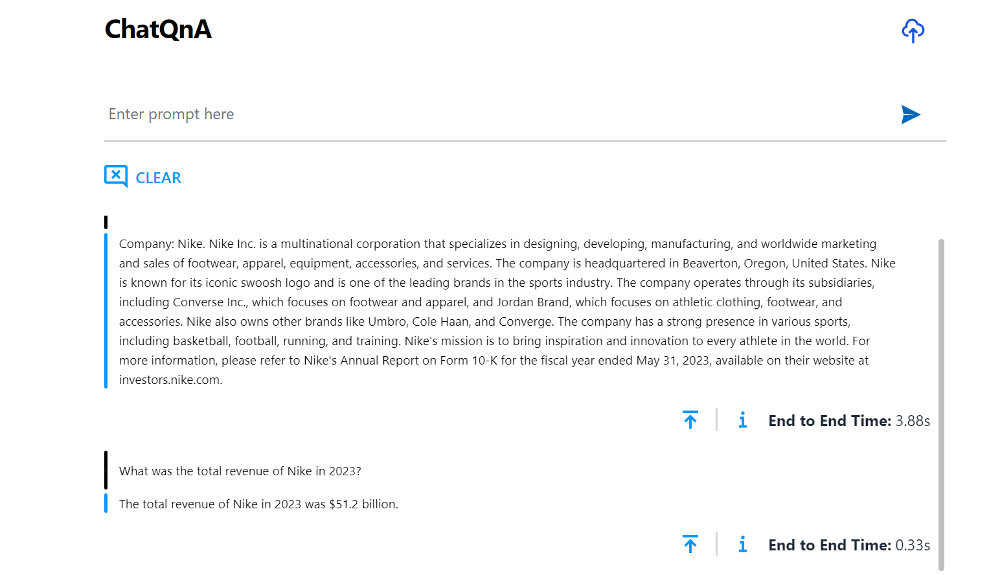

# Build and deploy ChatQnA Application on AMD GPU (ROCm)

## Build MegaService of ChatQnA on AMD ROCm GPU

This document outlines the deployment process for a ChatQnA application utilizing the [GenAIComps](https://github.com/opea-project/GenAIComps.git) microservice pipeline on AMD ROCm GPU platform. The steps include Docker image creation, container deployment via Docker Compose, and service execution to integrate microservices such as embedding, retriever, rerank, and llm. We will publish the Docker images to Docker Hub, it will simplify the deployment process for this service.

Quick Start Deployment Steps:

1. Set up the environment variables.
2. Run Docker Compose.
3. Consume the ChatQnA Service.

Note: The default LLM is `meta-llama/Meta-Llama-3-8B-Instruct`. Before deploying the application, please make sure either you've requested and been granted the access to it on [Huggingface](https://huggingface.co/meta-llama/Meta-Llama-3-8B-Instruct) or you've downloaded the model locally from [ModelScope](https://www.modelscope.cn/models).

## Quick Start: 1.Setup Environment Variable

To set up environment variables for deploying ChatQnA services, follow these steps:

1. Set the required environment variables:

   ```bash
   # Example: host_ip="192.168.1.1"
   export HOST_IP=${host_ip}
   # Example: no_proxy="localhost, 127.0.0.1, 192.168.1.1"
   export CHATQNA_HUGGINGFACEHUB_API_TOKEN=${your_hf_api_token}
   ```

2. If you are in a proxy environment, also set the proxy-related environment variables:

   ```bash
   export http_proxy="Your_HTTP_Proxy"
   export https_proxy="Your_HTTPs_Proxy"
   ```

3. Set up other environment variables:

   ```bash
   source ./set_env.sh
   ```

## Quick Start: 2.Run Docker Compose

```bash
docker compose up -d
```

It will automatically download the docker image on `docker hub`:

```bash
docker pull opea/chatqna:latest
docker pull opea/chatqna-ui:latest
```

In following cases, you could build docker image from source by yourself.

- Failed to download the docker image.

- If you want to use a specific version of Docker image.

Please refer to 'Build Docker Images' in below.

## QuickStart: 3.Consume the ChatQnA Service

Prepare and upload test document

```
# download pdf file
wget https://raw.githubusercontent.com/opea-project/GenAIComps/v1.1/comps/retrievers/redis/data/nke-10k-2023.pdf
# upload pdf file with dataprep
curl -X POST "http://${host_ip}:6007/v1/dataprep/ingest" \
    -H "Content-Type: multipart/form-data" \
    -F "files=@./nke-10k-2023.pdf"
```

Get MegaSerice(backend) response:

```bash
curl http://${host_ip}:8888/v1/chatqna \
    -H "Content-Type: application/json" \
    -d '{
        "messages": "What is the revenue of Nike in 2023?"
    }'
```

## 🚀 Build Docker Images

First of all, you need to build Docker Images locally. This step can be ignored after the Docker images published to Docker hub.

### 1. Source Code install GenAIComps

```bash
git clone https://github.com/opea-project/GenAIComps.git
cd GenAIComps
```

### 2. Build Retriever Image

```bash
docker build --no-cache -t opea/retriever:latest --build-arg https_proxy=$https_proxy --build-arg http_proxy=$http_proxy -f comps/retrievers/src/Dockerfile .
```

### 3. Build Dataprep Image

```bash
docker build --no-cache -t opea/dataprep:latest --build-arg https_proxy=$https_proxy --build-arg http_proxy=$http_proxy -f comps/dataprep/src/Dockerfile .
```

### 4. Build MegaService Docker Image

To construct the Mega Service, we utilize the [GenAIComps](https://github.com/opea-project/GenAIComps.git) microservice pipeline within the `chatqna.py` Python script. Build the MegaService Docker image using the command below:

```bash
git clone https://github.com/opea-project/GenAIExamples.git
cd GenAIExamples/ChatQnA/docker
docker build --no-cache -t opea/chatqna:latest --build-arg https_proxy=$https_proxy --build-arg http_proxy=$http_proxy -f Dockerfile .
cd ../../..
```

### 5. Build UI Docker Image

Construct the frontend Docker image using the command below:

```bash
cd GenAIExamples/ChatQnA/ui
docker build --no-cache -t opea/chatqna-ui:latest --build-arg https_proxy=$https_proxy --build-arg http_proxy=$http_proxy -f ./docker/Dockerfile .
cd ../../../..
```

### 6. Build React UI Docker Image (Optional)

Construct the frontend Docker image using the command below:

```bash
cd GenAIExamples/ChatQnA/ui
docker build --no-cache -t opea/chatqna-react-ui:latest --build-arg https_proxy=$https_proxy --build-arg http_proxy=$http_proxy -f ./docker/Dockerfile.react .
cd ../../../..
```

### 7. Build Nginx Docker Image

```bash
cd GenAIComps
docker build -t opea/nginx:latest --build-arg https_proxy=$https_proxy --build-arg http_proxy=$http_proxy -f comps/third_parties/nginx/src/Dockerfile .
```

Then run the command `docker images`, you will have the following 5 Docker Images:

1. `opea/retriever:latest`
2. `opea/dataprep:latest`
3. `opea/chatqna:latest`
4. `opea/chatqna-ui:latest` or `opea/chatqna-react-ui:latest`
5. `opea/nginx:latest`

## 🚀 Start MicroServices and MegaService

### Required Models

By default, the embedding, reranking and LLM models are set to a default value as listed below:

| Service   | Model                               |
| --------- | ----------------------------------- |
| Embedding | BAAI/bge-base-en-v1.5               |
| Reranking | BAAI/bge-reranker-base              |
| LLM       | meta-llama/Meta-Llama-3-8B-Instruct |

Change the `xxx_MODEL_ID` below for your needs.

### Setup Environment Variables

1. Set the required environment variables:

   ```bash
   # Example: host_ip="192.168.1.1"
   export host_ip="External_Public_IP"
   # Example: no_proxy="localhost, 127.0.0.1, 192.168.1.1"
   export no_proxy="Your_No_Proxy"
   export CHATQNA_HUGGINGFACEHUB_API_TOKEN="Your_Huggingface_API_Token"
   # Example: NGINX_PORT=80
   export HOST_IP=${host_ip}
   export NGINX_PORT=${your_nginx_port}
   export CHATQNA_TGI_SERVICE_IMAGE="ghcr.io/huggingface/text-generation-inference:2.3.1-rocm"
   export CHATQNA_EMBEDDING_MODEL_ID="BAAI/bge-base-en-v1.5"
   export CHATQNA_RERANK_MODEL_ID="BAAI/bge-reranker-base"
   export CHATQNA_LLM_MODEL_ID="meta-llama/Meta-Llama-3-8B-Instruct"
   export CHATQNA_TGI_SERVICE_PORT=8008
   export CHATQNA_TEI_EMBEDDING_PORT=8090
   export CHATQNA_TEI_EMBEDDING_ENDPOINT="http://${HOST_IP}:${CHATQNA_TEI_EMBEDDING_PORT}"
   export CHATQNA_TEI_RERANKING_PORT=8808
   export CHATQNA_REDIS_VECTOR_PORT=16379
   export CHATQNA_REDIS_VECTOR_INSIGHT_PORT=8001
   export CHATQNA_REDIS_DATAPREP_PORT=6007
   export CHATQNA_REDIS_RETRIEVER_PORT=7000
   export CHATQNA_INDEX_NAME="rag-redis"
   export CHATQNA_MEGA_SERVICE_HOST_IP=${HOST_IP}
   export CHATQNA_RETRIEVER_SERVICE_HOST_IP=${HOST_IP}
   export CHATQNA_BACKEND_SERVICE_ENDPOINT="http://127.0.0.1:${CHATQNA_BACKEND_SERVICE_PORT}/v1/chatqna"
   export CHATQNA_DATAPREP_SERVICE_ENDPOINT="http://127.0.0.1:${CHATQNA_REDIS_DATAPREP_PORT}/v1/dataprep/ingest"
   export CHATQNA_DATAPREP_GET_FILE_ENDPOINT="http://127.0.0.1:${CHATQNA_REDIS_DATAPREP_PORT}/v1/dataprep/get"
   export CHATQNA_DATAPREP_DELETE_FILE_ENDPOINT="http://127.0.0.1:${CHATQNA_REDIS_DATAPREP_PORT}/v1/dataprep/delete"
   export CHATQNA_FRONTEND_SERVICE_IP=${HOST_IP}
   export CHATQNA_FRONTEND_SERVICE_PORT=5173
   export CHATQNA_BACKEND_SERVICE_NAME=chatqna
   export CHATQNA_BACKEND_SERVICE_IP=${HOST_IP}
   export CHATQNA_BACKEND_SERVICE_PORT=8888
   export CHATQNA_REDIS_URL="redis://${HOST_IP}:${CHATQNA_REDIS_VECTOR_PORT}"
   export CHATQNA_EMBEDDING_SERVICE_HOST_IP=${HOST_IP}
   export CHATQNA_RERANK_SERVICE_HOST_IP=${HOST_IP}
   export CHATQNA_LLM_SERVICE_HOST_IP=${HOST_IP}
   export CHATQNA_NGINX_PORT=5176
   ```

2. If you are in a proxy environment, also set the proxy-related environment variables:

   ```bash
   export http_proxy="Your_HTTP_Proxy"
   export https_proxy="Your_HTTPs_Proxy"
   ```

3. Note: In order to limit access to a subset of GPUs, please pass each device individually using one or more -device /dev/dri/rendered<node>, where <node> is the card index, starting from 128. (https://rocm.docs.amd.com/projects/install-on-linux/en/latest/how-to/docker.html#docker-restrict-gpus) into tgi-service in compose.yaml file

Example for set isolation for 1 GPU

```
      - /dev/dri/card0:/dev/dri/card0
      - /dev/dri/renderD128:/dev/dri/renderD128
```

Example for set isolation for 2 GPUs

```
      - /dev/dri/card0:/dev/dri/card0
      - /dev/dri/renderD128:/dev/dri/renderD128
      - /dev/dri/card1:/dev/dri/card1
      - /dev/dri/renderD129:/dev/dri/renderD129
```

Please find more information about accessing and restricting AMD GPUs in the link (https://rocm.docs.amd.com/projects/install-on-linux/en/latest/how-to/docker.html#docker-restrict-gpus)

4. Set up other environment variables:

   ```bash
   source ./set_env.sh
   ```

### Start all the services Docker Containers

```bash
cd GenAIExamples/ChatQnA/docker_compose/amd/gpu/rocm
docker compose up -d
```

### Validate MicroServices and MegaService

1. TEI Embedding Service

   ```bash
   curl ${host_ip}:8090/embed \
       -X POST \
       -d '{"inputs":"What is Deep Learning?"}' \
       -H 'Content-Type: application/json'
   ```

2. Retriever Microservice

   To consume the retriever microservice, you need to generate a mock embedding vector by Python script. The length of embedding vector
   is determined by the embedding model.
   Here we use the model `EMBEDDING_MODEL_ID="BAAI/bge-base-en-v1.5"`, which vector size is 768.

   Check the vecotor dimension of your embedding model, set `your_embedding` dimension equals to it.

   ```bash
   export your_embedding=$(python3 -c "import random; embedding = [random.uniform(-1, 1) for _ in range(768)]; print(embedding)")
   curl http://${host_ip}:7000/v1/retrieval \
     -X POST \
     -d "{\"text\":\"test\",\"embedding\":${your_embedding}}" \
     -H 'Content-Type: application/json'
   ```

3. TEI Reranking Service

   ```bash
   curl http://${host_ip}:8808/rerank \
       -X POST \
       -d '{"query":"What is Deep Learning?", "texts": ["Deep Learning is not...", "Deep learning is..."]}' \
       -H 'Content-Type: application/json'
   ```

4. TGI Service

   In first startup, this service will take more time to download the model files. After it's finished, the service will be ready.

   Try the command below to check whether the TGI service is ready.

   ```bash
   docker logs chatqna-tgi-server | grep Connected
   ```

   If the service is ready, you will get the response like below.

   ```
   2024-09-03T02:47:53.402023Z  INFO text_generation_router::server: router/src/server.rs:2311: Connected
   ```

   Then try the `cURL` command below to validate TGI.

   ```bash
   curl http://${host_ip}:8008/generate \
     -X POST \
     -d '{"inputs":"What is Deep Learning?","parameters":{"max_new_tokens":64, "do_sample": true}}' \
     -H 'Content-Type: application/json'
   ```

5. MegaService

   ```bash
   curl http://${host_ip}:8888/v1/chatqna -H "Content-Type: application/json" -d '{
        "messages": "What is the revenue of Nike in 2023?"
        }'
   ```

6. Nginx Service

   ```bash
   curl http://${host_ip}:${NGINX_PORT}/v1/chatqna \
       -H "Content-Type: application/json" \
       -d '{"messages": "What is the revenue of Nike in 2023?"}'
   ```

7. Dataprep Microservice（Optional）

If you want to update the default knowledge base, you can use the following commands:

Update Knowledge Base via Local File Upload:

```bash
curl -X POST "http://${host_ip}:6007/v1/dataprep/ingest" \
     -H "Content-Type: multipart/form-data" \
     -F "files=@./nke-10k-2023.pdf"
```

This command updates a knowledge base by uploading a local file for processing. Update the file path according to your environment.

Add Knowledge Base via HTTP Links:

```bash
curl -X POST "http://${host_ip}:6007/v1/dataprep/ingest" \
     -H "Content-Type: multipart/form-data" \
     -F 'link_list=["https://opea.dev"]'
```

This command updates a knowledge base by submitting a list of HTTP links for processing.

Also, you are able to get the file list that you uploaded:

```bash
curl -X POST "http://${host_ip}:6007/v1/dataprep/get" \
     -H "Content-Type: application/json"
```

To delete the file/link you uploaded:

```bash
# delete link
curl -X POST "http://${host_ip}:6007/v1/dataprep/delete" \
     -d '{"file_path": "https://opea.dev"}' \
     -H "Content-Type: application/json"

# delete file
curl -X POST "http://${host_ip}:6007/v1/dataprep/delete" \
     -d '{"file_path": "nke-10k-2023.pdf"}' \
     -H "Content-Type: application/json"

# delete all uploaded files and links
curl -X POST "http://${host_ip}:6007/v1/dataprep/delete" \
     -d '{"file_path": "all"}' \
     -H "Content-Type: application/json"
```

## 🚀 Launch the UI

### Launch with origin port

To access the frontend, open the following URL in your browser: http://{host_ip}:5173. By default, the UI runs on port 5173 internally. If you prefer to use a different host port to access the frontend, you can modify the port mapping in the `compose.yaml` file as shown below:

```yaml
  chaqna-ui-server:
    image: opea/chatqna-ui:latest
    ...
    ports:
      - "80:5173"
```

### Launch with Nginx

If you want to launch the UI using Nginx, open this URL: `http://${host_ip}:${NGINX_PORT}` in your browser to access the frontend.

## 🚀 Launch the Conversational UI (Optional)

To access the Conversational UI (react based) frontend, modify the UI service in the `compose.yaml` file. Replace `chaqna-ui-server` service with the `chatqna-react-ui-server` service as per the config below:

```yaml
chatqna-react-ui-server:
  image: opea/chatqna-react-ui:latest
  container_name: chatqna-react-ui-server
  environment:
    - APP_BACKEND_SERVICE_ENDPOINT=${BACKEND_SERVICE_ENDPOINT}
    - APP_DATA_PREP_SERVICE_URL=${DATAPREP_SERVICE_ENDPOINT}
  ports:
    - "5174:80"
  depends_on:
    - chaqna-backend-server
  ipc: host
  restart: always
```

Once the services are up, open the following URL in your browser: http://{host_ip}:5174. By default, the UI runs on port 80 internally. If you prefer to use a different host port to access the frontend, you can modify the port mapping in the `compose.yaml` file as shown below:

```yaml
  chaqna-react-ui-server:
    image: opea/chatqna-react-ui:latest
    ...
    ports:
      - "80:80"
```


Here is an example of running ChatQnA:



Here is an example of running ChatQnA with Conversational UI (React):


