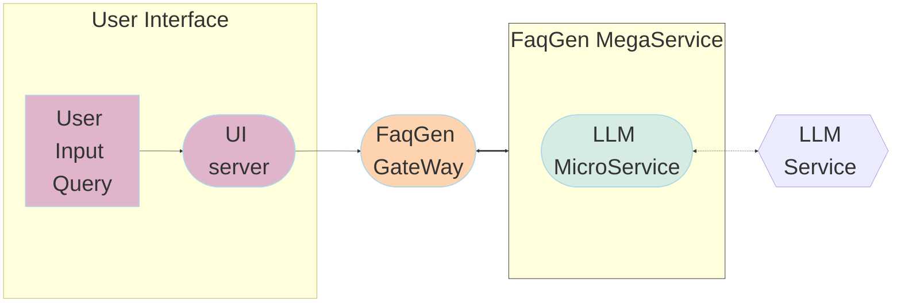

# Deploying FAQ Generation on Intel® Xeon® Processors

In today's data-driven world, organizations across various industries face the challenge of managing and understanding vast amounts of information. Legal documents, contracts, regulations, and customer inquiries often contain critical insights buried within dense text. Extracting and presenting these insights in a concise and accessible format is crucial for decision-making, compliance, and customer satisfaction.

Our FAQ Generation Application leverages the power of large language models (LLMs) to revolutionize the way you interact with and comprehend complex textual data. By harnessing cutting-edge natural language processing techniques, our application can automatically generate comprehensive and natural-sounding frequently asked questions (FAQs) from your documents, legal texts, customer queries, and other sources. In this example use case, we utilize LangChain to implement FAQ Generation and facilitate LLM inference using Text Generation Inference on Intel Xeon and Gaudi2 processors.

The FaqGen example is implemented using the component-level microservices defined in [GenAIComps](https://github.com/opea-project/GenAIComps). The flow chart below shows the information flow between different microservices for this example.



---

## Table of Contents

1. [Build Docker Images](#build-docker-images)
2. [Validate Microservices](#validate-microservices)
3. [Launch the UI](#launch-the-ui)
4. [Launch the Conversational UI (Optional)](#launch-the-conversational-ui-optional)

---

## Build Docker Images

First of all, you need to build Docker Images locally. This step can be ignored once the Docker images are published to Docker hub.

### 1. Build vLLM Image

```bash
git clone https://github.com/vllm-project/vllm.git
cd ./vllm/
VLLM_VER="$(git describe --tags "$(git rev-list --tags --max-count=1)" )"
git checkout ${VLLM_VER}
docker build --no-cache --build-arg https_proxy=$https_proxy --build-arg http_proxy=$http_proxy -f Dockerfile.cpu -t opea/vllm:latest --shm-size=128g .
```

### 2. Build LLM Image

```bash
git clone https://github.com/opea-project/GenAIComps.git
cd GenAIComps
docker build -t opea/llm-faqgen:latest --build-arg https_proxy=$https_proxy --build-arg http_proxy=$http_proxy -f comps/llms/src/faq-generation/Dockerfile .
```

### 3. Build MegaService Docker Image

To construct the Mega Service, we utilize the [GenAIComps](https://github.com/opea-project/GenAIComps.git) microservice pipeline within the `faqgen.py` Python script. Build the MegaService Docker image via below command:

```bash
git clone https://github.com/opea-project/GenAIExamples
cd GenAIExamples/ChatQnA
docker build --no-cache -t opea/chatqna:latest --build-arg https_proxy=$https_proxy --build-arg http_proxy=$http_proxy -f Dockerfile .
```

### 4. Build UI Docker Image

Build frontend Docker image via below command:

```bash
cd GenAIExamples/ChatQnA/ui
docker build --no-cache -t opea/chatqna-ui:latest --build-arg https_proxy=$https_proxy --build-arg http_proxy=$http_proxy -f ./docker/Dockerfile .
```

### 5. Build Conversational React UI Docker Image (Optional)

Build frontend Docker image that enables Conversational experience with ChatQnA megaservice via below command:

**Export the value of the public IP address of your Xeon server to the `host_ip` environment variable**

```bash
cd GenAIExamples/ChatQnA/ui
docker build --no-cache -t opea/chatqna-conversation-ui:latest --build-arg https_proxy=$https_proxy --build-arg http_proxy=$http_proxy -f ./docker/Dockerfile.react .
```

### 6. Build Nginx Docker Image

```bash
cd GenAIComps
docker build -t opea/nginx:latest --build-arg https_proxy=$https_proxy --build-arg http_proxy=$http_proxy -f comps/third_parties/nginx/src/Dockerfile .
```

Then run the command `docker images`, you will have the following Docker Images:

1. `opea/vllm:latest`
2. `opea/llm-faqgen:latest`
3. `opea/chatqna:latest`
4. `opea/chatqna-ui:latest`
5. `opea/nginx:latest`

## Start Microservices and MegaService

### Required Models

We set default model as "meta-llama/Meta-Llama-3-8B-Instruct", change "LLM_MODEL_ID" in following Environment Variables setting if you want to use other models.

If use gated models, you also need to provide [huggingface token](https://huggingface.co/docs/hub/security-tokens) to "HUGGINGFACEHUB_API_TOKEN" environment variable.

### Setup Environment Variables

Since the `compose.yaml` will consume some environment variables, you need to setup them in advance as below.

```bash
export no_proxy=${your_no_proxy}
export http_proxy=${your_http_proxy}
export https_proxy=${your_http_proxy}
export host_ip=${your_host_ip}
export LLM_ENDPOINT_PORT=8008
export LLM_SERVICE_PORT=9000
export FAQGEN_BACKEND_PORT=8888
export FAQGen_COMPONENT_NAME="OpeaFaqGenvLLM"
export LLM_MODEL_ID="meta-llama/Meta-Llama-3-8B-Instruct"
export HUGGINGFACEHUB_API_TOKEN=${your_hf_api_token}
export MEGA_SERVICE_HOST_IP=${host_ip}
export LLM_SERVICE_HOST_IP=${host_ip}
export LLM_ENDPOINT="http://${host_ip}:${LLM_ENDPOINT_PORT}"
export BACKEND_SERVICE_ENDPOINT="http://${host_ip}:8888/v1/faqgen"
```

Note: Please replace with `your_host_ip` with your external IP address, do not use localhost.

### Start Microservice Docker Containers

```bash
cd GenAIExamples/FaqGen/docker_compose/intel/cpu/xeon
docker compose up -d
```

### Validate Microservices

1. vLLM Service

```bash
curl http://${host_ip}:${LLM_ENDPOINT_PORT}/v1/chat/completions \
  -X POST \
  -H "Content-Type: application/json" \
  -d '{"model": "meta-llama/Meta-Llama-3-8B-Instruct", "messages": [{"role": "user", "content": "What is Deep Learning?"}]}'
```

2. LLM Microservice

```bash
curl http://${host_ip}:${LLM_SERVICE_PORT}/v1/faqgen \
  -X POST \
  -d '{"query":"Text Embeddings Inference (TEI) is a toolkit for deploying and serving open source text embeddings and sequence classification models. TEI enables high-performance extraction for the most popular models, including FlagEmbedding, Ember, GTE and E5."}' \
  -H 'Content-Type: application/json'
```

3. MegaService

```bash
curl http://${host_ip}:${FAQGEN_BACKEND_PORT}/v1/faqgen \
  -H "Content-Type: multipart/form-data" \
  -F "messages=Text Embeddings Inference (TEI) is a toolkit for deploying and serving open source text embeddings and sequence classification models. TEI enables high-performance extraction for the most popular models, including FlagEmbedding, Ember, GTE and E5." \
  -F "max_tokens=32" \
  -F "stream=False"
```

```bash
## enable stream
curl http://${host_ip}:${FAQGEN_BACKEND_PORT}/v1/faqgen \
  -H "Content-Type: multipart/form-data" \
  -F "messages=Text Embeddings Inference (TEI) is a toolkit for deploying and serving open source text embeddings and sequence classification models. TEI enables high-performance extraction for the most popular models, including FlagEmbedding, Ember, GTE and E5." \
  -F "max_tokens=32" \
  -F "stream=True"
```

Following the validation of all aforementioned microservices, we are now prepared to construct a mega-service.

## Launch the UI

To access the frontend, open the following URL in your browser: http://{host_ip}:5173. By default, the UI runs on port 5173 internally. If you prefer to use a different host port to access the frontend, you can modify the port mapping in the `compose.yaml` file as shown below:

```yaml
  chaqna-gaudi-ui-server:
    image: opea/chatqna-ui:latest
    ...
    ports:
      - "80:5173"
```

## Launch the Conversational UI (Optional)

To access the Conversational UI frontend, open the following URL in your browser: http://{host_ip}:5174. By default, the UI runs on port 80 internally. If you prefer to use a different host port to access the frontend, you can modify the port mapping in the `compose.yaml` file as shown below:

```yaml
  chaqna-xeon-conversation-ui-server:
    image: opea/chatqna-conversation-ui:latest
    ...
    ports:
      - "80:80"
```
