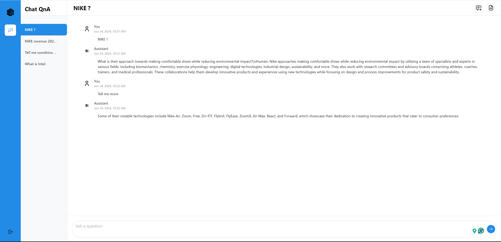

# Build MegaService of ChatQnA on Gaudi

This document outlines the deployment process for a ChatQnA application utilizing the [GenAIComps](https://github.com/opea-project/GenAIComps.git) microservice pipeline on Intel Gaudi server. The steps include Docker image creation, container deployment via Docker Compose, and service execution to integrate microservices such as `embedding`, `retriever`, `rerank`, and `llm`.

The default pipeline deploys with vLLM as the LLM serving component and leverages rerank component. It also provides options of not using rerank in the pipeline, leveraging guardrails, or using TGI backend for LLM microservice, please refer to [start-all-the-services-docker-containers](#start-all-the-services-docker-containers) section in this page.

Quick Start:

1. Set up the environment variables.
2. Run Docker Compose.
3. Consume the ChatQnA Service.

Note: The default LLM is `meta-llama/Meta-Llama-3-8B-Instruct`. Before deploying the application, please make sure either you've requested and been granted the access to it on [Huggingface](https://huggingface.co/meta-llama/Meta-Llama-3-8B-Instruct) or you've downloaded the model locally from [ModelScope](https://www.modelscope.cn/models). We now support running the latest DeepSeek models, including [deepseek-ai/DeepSeek-R1-Distill-Llama-70B](https://huggingface.co/deepseek-ai/DeepSeek-R1-Distill-Llama-70B) and [deepseek-ai/DeepSeek-R1-Distill-Qwen-32B](https://huggingface.co/deepseek-ai/DeepSeek-R1-Distill-Qwen-32B) on Gaudi accelerators. To run `deepseek-ai/DeepSeek-R1-Distill-Llama-70B`, update the `LLM_MODEL_ID` and configure `NUM_CARDS` to 8 in the [set_env.sh](./set_env.sh) script. To run `deepseek-ai/DeepSeek-R1-Distill-Qwen-32B`, update the `LLM_MODEL_ID` and configure `NUM_CARDS` to 4 in the [set_env.sh](./set_env.sh) script.

## Quick Start: 1.Setup Environment Variable

To set up environment variables for deploying ChatQnA services, follow these steps:

1. Set the required environment variables:

   ```bash
   # Example: host_ip="192.168.1.1"
   export host_ip="External_Public_IP"
   export HUGGINGFACEHUB_API_TOKEN="Your_Huggingface_API_Token"
   ```

2. If you are in a proxy environment, also set the proxy-related environment variables:

   ```bash
   export http_proxy="Your_HTTP_Proxy"
   export https_proxy="Your_HTTPs_Proxy"
   # Example: no_proxy="localhost, 127.0.0.1, 192.168.1.1"
   export no_proxy="Your_No_Proxy",chatqna-gaudi-ui-server,chatqna-gaudi-backend-server,dataprep-redis-service,tei-embedding-service,retriever,tei-reranking-service,tgi-service,vllm-service,guardrails
   ```

3. Set up other environment variables:

   ```bash
   source ./set_env.sh
   ```

4. Change Model for LLM serving

   By default, Meta-Llama-3-8B-Instruct is used for LLM serving, the default model can be changed to other validated LLM models.  
   Please pick a [validated llm models](https://github.com/opea-project/GenAIComps/tree/main/comps/llms/src/text-generation#validated-llm-models) from the table.  
   To change the default model defined in set_env.sh, overwrite it by exporting LLM_MODEL_ID to the new model or by modifying set_env.sh, and then repeat step 3.  
   For example, change to DeepSeek-R1-Distill-Qwen-32B using the following command.

   ```bash
   export LLM_MODEL_ID="deepseek-ai/DeepSeek-R1-Distill-Qwen-32B"
   ```

   Please also check [required gaudi cards for different models](https://github.com/opea-project/GenAIComps/tree/main/comps/llms/src/text-generation#system-requirements-for-llm-models) for new models.  
   It might be necessary to increase the number of Gaudi cards for the model by exporting NUM_CARDS to the new model or by modifying set_env.sh, and then repeating step 3. For example, increase the number of Gaudi cards for DeepSeek-R1-
   Distill-Qwen-32B using the following command:

   ```bash
   export NUM_CARDS=4
   ```

## Quick Start: 2.Run Docker Compose

```bash
docker compose up -d
```

To enable Open Telemetry Tracing, compose.telemetry.yaml file need to be merged along with default compose.yaml file.

```bash
docker compose -f compose.yaml -f compose.telemetry.yaml up -d
```

It will automatically download the docker image on `docker hub`:

```bash
docker pull opea/chatqna:latest
docker pull opea/chatqna-ui:latest
```

In following cases, you could build docker image from source by yourself.

- Failed to download the docker image.

- If you want to use a specific version of Docker image.

Please refer to 'Build Docker Images' in below.

## QuickStart: 3.Consume the ChatQnA Service

```bash
curl http://${host_ip}:8888/v1/chatqna \
    -H "Content-Type: application/json" \
    -d '{
        "messages": "What is the revenue of Nike in 2023?"
    }'
```

## 🚀 Build Docker Images

First of all, you need to build Docker Images locally. This step can be ignored after the Docker images published to Docker hub.

```bash
git clone https://github.com/opea-project/GenAIComps.git
cd GenAIComps
```

### 1. Build Retriever Image

```bash
docker build --no-cache -t opea/retriever:latest --build-arg https_proxy=$https_proxy --build-arg http_proxy=$http_proxy -f comps/retrievers/src/Dockerfile .
```

### 2. Build Dataprep Image

```bash
docker build --no-cache -t opea/dataprep:latest --build-arg https_proxy=$https_proxy --build-arg http_proxy=$http_proxy -f comps/dataprep/src/Dockerfile .
```

### 3. Build Guardrails Docker Image (Optional)

To fortify AI initiatives in production, Guardrails microservice can secure model inputs and outputs, building Trustworthy, Safe, and Secure LLM-based Applications.

```bash
docker build -t opea/guardrails:latest --build-arg https_proxy=$https_proxy --build-arg http_proxy=$http_proxy -f comps/guardrails/src/guardrails/Dockerfile .
```

### 4. Build MegaService Docker Image

1. MegaService with Rerank

   To construct the Mega Service with Rerank, we utilize the [GenAIComps](https://github.com/opea-project/GenAIComps.git) microservice pipeline within the `chatqna.py` Python script. Build the MegaService Docker image using the command below:

   ```bash
   git clone https://github.com/opea-project/GenAIExamples.git
   cd GenAIExamples/ChatQnA
   docker build --no-cache -t opea/chatqna:latest --build-arg https_proxy=$https_proxy --build-arg http_proxy=$http_proxy -f Dockerfile .
   ```

2. MegaService with Guardrails

   If you want to enable guardrails microservice in the pipeline, please use the below command instead:

   ```bash
   git clone https://github.com/opea-project/GenAIExamples.git
   cd GenAIExamples/ChatQnA/
   docker build --no-cache -t opea/chatqna-guardrails:latest --build-arg https_proxy=$https_proxy --build-arg http_proxy=$http_proxy -f Dockerfile.guardrails .
   ```

3. MegaService without Rerank

   To construct the Mega Service without Rerank, we utilize the [GenAIComps](https://github.com/opea-project/GenAIComps.git) microservice pipeline within the `chatqna_without_rerank.py` Python script. Build MegaService Docker image via below command:

   ```bash
   git clone https://github.com/opea-project/GenAIExamples.git
   cd GenAIExamples/ChatQnA
   docker build --no-cache -t opea/chatqna-without-rerank:latest --build-arg https_proxy=$https_proxy --build-arg http_proxy=$http_proxy -f Dockerfile.without_rerank .
   ```

### 5. Build UI Docker Image

Construct the frontend Docker image using the command below:

```bash
cd GenAIExamples/ChatQnA/ui
docker build --no-cache -t opea/chatqna-ui:latest --build-arg https_proxy=$https_proxy --build-arg http_proxy=$http_proxy -f ./docker/Dockerfile .
```

### 6. Build Conversational React UI Docker Image (Optional)

Build frontend Docker image that enables Conversational experience with ChatQnA megaservice via below command:

**Export the value of the public IP address of your Gaudi node to the `host_ip` environment variable**

```bash
cd GenAIExamples/ChatQnA/ui
docker build --no-cache -t opea/chatqna-conversation-ui:latest --build-arg https_proxy=$https_proxy --build-arg http_proxy=$http_proxy -f ./docker/Dockerfile.react .
```

### 7. Build Nginx Docker Image

```bash
cd GenAIComps
docker build -t opea/nginx:latest --build-arg https_proxy=$https_proxy --build-arg http_proxy=$http_proxy -f comps/third_parties/nginx/src/Dockerfile .
```

Then run the command `docker images`, you will have the following 5 Docker Images:

- `opea/retriever:latest`
- `opea/dataprep:latest`
- `opea/chatqna:latest`
- `opea/chatqna-ui:latest`
- `opea/nginx:latest`

If Conversation React UI is built, you will find one more image:

- `opea/chatqna-conversation-ui:latest`

If Guardrails docker image is built, you will find one more image:

- `opea/guardrails:latest`

## 🚀 Start MicroServices and MegaService

### Required Models

By default, the embedding, reranking and LLM models are set to a default value as listed below:

| Service   | Model                               |
| --------- | ----------------------------------- |
| Embedding | BAAI/bge-base-en-v1.5               |
| Reranking | BAAI/bge-reranker-base              |
| LLM       | meta-llama/Meta-Llama-3-8B-Instruct |

Change the `xxx_MODEL_ID` below for your needs.

For users in China who are unable to download models directly from Huggingface, you can use [ModelScope](https://www.modelscope.cn/models) or a Huggingface mirror to download models. The vLLM/TGI can load the models either online or offline as described below:

1. Online

   ```bash
   export HF_TOKEN=${your_hf_token}
   export HF_ENDPOINT="https://hf-mirror.com"
   model_name="meta-llama/Meta-Llama-3-8B-Instruct"
   # Start vLLM LLM Service
   docker run -p 8007:80 -v ./data:/data --name vllm-gaudi-server -e HF_ENDPOINT=$HF_ENDPOINT -e http_proxy=$http_proxy -e https_proxy=$https_proxy --runtime=habana -e HABANA_VISIBLE_DEVICES=all -e OMPI_MCA_btl_vader_single_copy_mechanism=none -e HUGGING_FACE_HUB_TOKEN=$HF_TOKEN -e VLLM_TORCH_PROFILER_DIR="/mnt" --cap-add=sys_nice --ipc=host opea/vllm-gaudi:latest --model $model_name --tensor-parallel-size 1 --host 0.0.0.0 --port 80 --block-size 128 --max-num-seqs 256 --max-seq_len-to-capture 2048
   # Start TGI LLM Service
   docker run -p 8005:80 -v ./data:/data --name tgi-gaudi-server -e HF_ENDPOINT=$HF_ENDPOINT -e http_proxy=$http_proxy -e https_proxy=$https_proxy --runtime=habana -e HABANA_VISIBLE_DEVICES=all -e OMPI_MCA_btl_vader_single_copy_mechanism=none -e HUGGING_FACE_HUB_TOKEN=$HF_TOKEN -e ENABLE_HPU_GRAPH=true -e LIMIT_HPU_GRAPH=true -e USE_FLASH_ATTENTION=true -e FLASH_ATTENTION_RECOMPUTE=true --cap-add=sys_nice --ipc=host ghcr.io/huggingface/tgi-gaudi:2.0.6 --model-id $model_name --max-input-tokens 1024 --max-total-tokens 2048
   ```

2. Offline

   - Search your model name in ModelScope. For example, check [this page](https://modelscope.cn/models/LLM-Research/Meta-Llama-3-8B-Instruct/files) for model `Meta-Llama-3-8B-Instruct`.

   - Click on `Download this model` button, and choose one way to download the model to your local path `/path/to/model`.

   - Run the following command to start the LLM service.

     ```bash
     export HF_TOKEN=${your_hf_token}
     export model_path="/path/to/model"
     # Start vLLM LLM Service
     docker run -p 8007:80 -v $model_path:/data --name vllm-gaudi-server --runtime=habana -e HABANA_VISIBLE_DEVICES=all -e OMPI_MCA_btl_vader_single_copy_mechanism=none -e HUGGING_FACE_HUB_TOKEN=$HF_TOKEN -e VLLM_TORCH_PROFILER_DIR="/mnt" --cap-add=sys_nice --ipc=host opea/vllm-gaudi:latest --model /data --tensor-parallel-size 1 --host 0.0.0.0 --port 80 --block-size 128 --max-num-seqs 256 --max-seq_len-to-capture 2048
     # Start TGI LLM Service
     docker run -p 8005:80 -v $model_path:/data --name tgi-gaudi-server --runtime=habana -e HABANA_VISIBLE_DEVICES=all -e OMPI_MCA_btl_vader_single_copy_mechanism=none -e HUGGING_FACE_HUB_TOKEN=$HF_TOKEN -e ENABLE_HPU_GRAPH=true -e LIMIT_HPU_GRAPH=true -e USE_FLASH_ATTENTION=true -e FLASH_ATTENTION_RECOMPUTE=true --cap-add=sys_nice --ipc=host ghcr.io/huggingface/tgi-gaudi:2.0.6 --model-id /data --max-input-tokens 1024 --max-total-tokens 2048
     ```

### Setup Environment Variables

1. Set the required environment variables:

   ```bash
   # Example: host_ip="192.168.1.1"
   export host_ip="External_Public_IP"
   export HUGGINGFACEHUB_API_TOKEN="Your_Huggingface_API_Token"
   # Example: NGINX_PORT=80
   export NGINX_PORT=${your_nginx_port}
   ```

2. If you are in a proxy environment, also set the proxy-related environment variables:

   ```bash
   export http_proxy="Your_HTTP_Proxy"
   export https_proxy="Your_HTTPs_Proxy"
   # Example: no_proxy="localhost, 127.0.0.1, 192.168.1.1"
   export no_proxy="Your_No_Proxy",chatqna-gaudi-ui-server,chatqna-gaudi-backend-server,dataprep-redis-service,tei-embedding-service,retriever,tei-reranking-service,tgi-service,vllm-service,guardrails
   ```

3. Set up other environment variables:

   ```bash
   source ./set_env.sh
   ```

### Start all the services Docker Containers

```bash
cd GenAIExamples/ChatQnA/docker_compose/intel/hpu/gaudi/
```

If use vLLM as the LLM serving backend.

```bash
# Start ChatQnA with Rerank Pipeline
docker compose -f compose.yaml up -d
# Start ChatQnA without Rerank Pipeline
docker compose -f compose_without_rerank.yaml up -d
# Start ChatQnA with Rerank Pipeline and Open Telemetry Tracing
docker compose -f compose.yaml -f compose.telemetry.yaml up -d
```

If use TGI as the LLM serving backend.

```bash
docker compose -f compose_tgi.yaml up -d
# Start ChatQnA with Open Telemetry Tracing
docker compose -f compose_tgi.yaml -f compose_tgi.telemetry.yaml up -d
```

If you want to enable guardrails microservice in the pipeline, please follow the below command instead:

```bash
cd GenAIExamples/ChatQnA/docker_compose/intel/hpu/gaudi/
docker compose -f compose_guardrails.yaml up -d
```

> **_NOTE:_** Users need at least two Gaudi cards to run the ChatQnA successfully.

### Validate MicroServices and MegaService

Follow the instructions to validate MicroServices.
For validation details, please refer to [how-to-validate_service](./how_to_validate_service.md).

1. TEI Embedding Service

   ```bash
   curl ${host_ip}:8090/embed \
       -X POST \
       -d '{"inputs":"What is Deep Learning?"}' \
       -H 'Content-Type: application/json'
   ```

2. Retriever Microservice

   To consume the retriever microservice, you need to generate a mock embedding vector by Python script. The length of embedding vector
   is determined by the embedding model.
   Here we use the model `EMBEDDING_MODEL_ID="BAAI/bge-base-en-v1.5"`, which vector size is 768.

   Check the vecotor dimension of your embedding model, set `your_embedding` dimension equals to it.

   ```bash
   export your_embedding=$(python3 -c "import random; embedding = [random.uniform(-1, 1) for _ in range(768)]; print(embedding)")
   curl http://${host_ip}:7000/v1/retrieval \
     -X POST \
     -d "{\"text\":\"test\",\"embedding\":${your_embedding}}" \
     -H 'Content-Type: application/json'
   ```

3. TEI Reranking Service

   > Skip for ChatQnA without Rerank pipeline

   ```bash
   curl http://${host_ip}:8808/rerank \
       -X POST \
       -d '{"query":"What is Deep Learning?", "texts": ["Deep Learning is not...", "Deep learning is..."]}' \
       -H 'Content-Type: application/json'
   ```

4. LLM backend Service

   In the first startup, this service will take more time to download, load and warm up the model. After it's finished, the service will be ready.

   Try the command below to check whether the LLM serving is ready.

   ```bash
   # vLLM service
   docker logs vllm-gaudi-server 2>&1 | grep complete
   # If the service is ready, you will get the response like below.
   INFO:     Application startup complete.
   ```

   ```bash
   # TGI service
   docker logs tgi-gaudi-server | grep Connected
   If the service is ready, you will get the response like below.
   2024-09-03T02:47:53.402023Z  INFO text_generation_router::server: router/src/server.rs:2311: Connected
   ```

   Then try the `cURL` command below to validate services.

   ```bash
   # vLLM Service
   curl http://${host_ip}:8007/v1/chat/completions \
     -X POST \
     -d '{"model": ${LLM_MODEL_ID}, "messages": [{"role": "user", "content": "What is Deep Learning?"}], "max_tokens":17}' \
     -H 'Content-Type: application/json'
   ```

   ```bash
   # TGI service
   curl http://${host_ip}:8005/v1/chat/completions \
     -X POST \
     -d '{"model": ${LLM_MODEL_ID}, "messages": [{"role": "user", "content": "What is Deep Learning?"}], "max_tokens":17}' \
     -H 'Content-Type: application/json'
   ```

5. MegaService

   ```bash
   curl http://${host_ip}:8888/v1/chatqna -H "Content-Type: application/json" -d '{
         "messages": "What is the revenue of Nike in 2023?"
         }'
   ```

6. Nginx Service

   ```bash
   curl http://${host_ip}:${NGINX_PORT}/v1/chatqna \
       -H "Content-Type: application/json" \
       -d '{"messages": "What is the revenue of Nike in 2023?"}'
   ```

7. Dataprep Microservice（Optional）

If you want to update the default knowledge base, you can use the following commands:

Update Knowledge Base via Local File Upload:

```bash
curl -X POST "http://${host_ip}:6007/v1/dataprep/ingest" \
     -H "Content-Type: multipart/form-data" \
     -F "files=@./nke-10k-2023.pdf"
```

This command updates a knowledge base by uploading a local file for processing. Update the file path according to your environment.

Add Knowledge Base via HTTP Links:

```bash
curl -X POST "http://${host_ip}:6007/v1/dataprep/ingest" \
     -H "Content-Type: multipart/form-data" \
     -F 'link_list=["https://opea.dev"]'
```

This command updates a knowledge base by submitting a list of HTTP links for processing.

Also, you are able to get the file/link list that you uploaded:

```bash
curl -X POST "http://${host_ip}:6007/v1/dataprep/get" \
     -H "Content-Type: application/json"
```

Then you will get the response JSON like this. Notice that the returned `name`/`id` of the uploaded link is `https://xxx.txt`.

```json
[
  {
    "name": "nke-10k-2023.pdf",
    "id": "nke-10k-2023.pdf",
    "type": "File",
    "parent": ""
  },
  {
    "name": "https://opea.dev.txt",
    "id": "https://opea.dev.txt",
    "type": "File",
    "parent": ""
  }
]
```

To delete the file/link you uploaded:

```bash
# delete link
curl -X POST "http://${host_ip}:6007/v1/dataprep/delete" \
     -d '{"file_path": "https://opea.dev.txt"}' \
     -H "Content-Type: application/json"

# delete file
curl -X POST "http://${host_ip}:6007/v1/dataprep/delete" \
     -d '{"file_path": "nke-10k-2023.pdf"}' \
     -H "Content-Type: application/json"

# delete all uploaded files and links
curl -X POST "http://${host_ip}:6007/v1/dataprep/delete" \
     -d '{"file_path": "all"}' \
     -H "Content-Type: application/json"
```

8. Guardrails (Optional)

```bash
curl http://${host_ip}:9090/v1/guardrails\
  -X POST \
  -d '{"text":"How do you buy a tiger in the US?","parameters":{"max_new_tokens":32}}' \
  -H 'Content-Type: application/json'
```

### Profile Microservices

To further analyze MicroService Performance, users could follow the instructions to profile MicroServices.

#### 1. vLLM backend Service

Users could follow previous section to testing vLLM microservice or ChatQnA MegaService.  
 By default, vLLM profiling is not enabled. Users could start and stop profiling by following commands.

##### Start vLLM profiling

```bash
curl http://${host_ip}:9009/start_profile \
  -H "Content-Type: application/json" \
  -d '{"model": ${LLM_MODEL_ID}}'
```

Users would see below docker logs from vllm-service if profiling is started correctly.

```bash
INFO api_server.py:361] Starting profiler...
INFO api_server.py:363] Profiler started.
INFO:     x.x.x.x:35940 - "POST /start_profile HTTP/1.1" 200 OK
```

After vLLM profiling is started, users could start asking questions and get responses from vLLM MicroService  
 or ChatQnA MicroService.

##### Stop vLLM profiling

By following command, users could stop vLLM profliing and generate a \*.pt.trace.json.gz file as profiling result  
 under /mnt folder in vllm-service docker instance.

```bash
# vLLM Service
curl http://${host_ip}:9009/stop_profile \
  -H "Content-Type: application/json" \
  -d '{"model": ${LLM_MODEL_ID}}'
```

Users would see below docker logs from vllm-service if profiling is stopped correctly.

```bash
INFO api_server.py:368] Stopping profiler...
INFO api_server.py:370] Profiler stopped.
INFO:     x.x.x.x:41614 - "POST /stop_profile HTTP/1.1" 200 OK
```

After vllm profiling is stopped, users could use below command to get the \*.pt.trace.json.gz file under /mnt folder.

```bash
docker cp  vllm-service:/mnt/ .
```

##### Check profiling result

Open a web browser and type "chrome://tracing" or "ui.perfetto.dev", and then load the json.gz file, you should be able  
 to see the vLLM profiling result as below diagram.


## 🚀 Launch the UI

### Launch with origin port

To access the frontend, open the following URL in your browser: http://{host_ip}:5173. By default, the UI runs on port 5173 internally. If you prefer to use a different host port to access the frontend, you can modify the port mapping in the `compose.yaml` file as shown below:

```yaml
  chatqna-gaudi-ui-server:
    image: opea/chatqna-ui:latest
    ...
    ports:
      - "80:5173"
```

### Launch with Nginx

If you want to launch the UI using Nginx, open this URL: `http://${host_ip}:${NGINX_PORT}` in your browser to access the frontend.

## 🚀 Launch the Conversational UI (Optional)

To access the Conversational UI (react based) frontend, modify the UI service in the `compose.yaml` file. Replace `chatqna-gaudi-ui-server` service with the `chatqna-gaudi-conversation-ui-server` service as per the config below:

```yaml
chatqna-gaudi-conversation-ui-server:
  image: opea/chatqna-conversation-ui:latest
  container_name: chatqna-gaudi-conversation-ui-server
  environment:
    - APP_BACKEND_SERVICE_ENDPOINT=${BACKEND_SERVICE_ENDPOINT}
    - APP_DATA_PREP_SERVICE_URL=${DATAPREP_SERVICE_ENDPOINT}
  ports:
    - "5174:80"
  depends_on:
    - chatqna-gaudi-backend-server
  ipc: host
  restart: always
```

Once the services are up, open the following URL in your browser: http://{host_ip}:5174. By default, the UI runs on port 80 internally. If you prefer to use a different host port to access the frontend, you can modify the port mapping in the `compose.yaml` file as shown below:

```yaml
  chatqna-gaudi-conversation-ui-server:
    image: opea/chatqna-conversation-ui:latest
    ...
    ports:
      - "80:80"
```


Here is an example of running ChatQnA:


Here is an example of running ChatQnA with Conversational UI (React):


