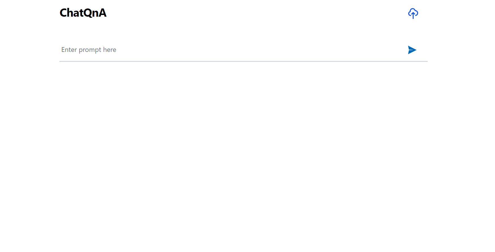

# Enable ChatQnA on Intel iGPU/dGPU

This document outlines the deployment process for a ChatQnA application utilizing the [GenAIComps](https://github.com/opea-project/GenAIComps.git) microservice pipeline on Intel iGPU and dGPU. The steps include model downloading, container deployment via Docker Compose, and service execution to integrate microservices such as `embedding`, `retriever`, `rerank`, and `llm`.

The default pipeline deploys with vLLM(provided by ipex-llm) as the LLM serving component and leverages rerank component.

Quick Start:

1. Prerequisites
2. Set up the environment variables.
3. Run Docker Compose.
4. Consume the ChatQnA Service.

Note: The default LLM is `deepseek-ai/DeepSeek-R1-Distill-Qwen-32B`. Before deploying the application, please make sure either you're able to download the model from [Huggingface](https://huggingface.co/deepseek-ai/DeepSeek-R1-Distill-Qwen-32B) or you may download the model from [ModelScope](https://modelscope.cn/models/deepseek-ai/DeepSeek-R1-Distill-Qwen-32B/summary). The quick start section will leverage Modelscope for model downloading and steps for Huggingface are listed in the `Start MicroServices and MegaService` section.

## Quick Start: 1.Prerequisites

Several prerequisites are required when starting up the ChatQnA use case. Please refer to the following links for prerequisite installation.

```
Docker installation: https://docs.docker.com/engine/install/ubuntu/
Pip installation: https://pip.pypa.io/en/stable/installation/
Modelscope CLI installation:
  pip install modelscope
```

ChatQnA use case involves several models that will be used in `llm`, `embedding` and `reranking` services. To prevent delays or download issues, follow these steps to pre-download the models locally.

```
# create data/ directory to save models
mkdir data
cd data
# download model used in LLM serving
mkdir DeepSeek-R1-Distill-Qwen-32B
modelscope download --model deepseek-ai/DeepSeek-R1-Distill-Qwen-32B --local_dir ./data/DeepSeek-R1-Distill-Qwen-32B
# download model used in embedding service
mkdir BAAI-bge-base-en-v1.5
modelscope download --model BAAI/bge-base-en-v1.5 --local_dir ./data/BAAI-bge-base-en-v1.5
# download model used in reranking service
mkdir BAAI--bge-reranker-base
modelscope download --model BAAI/bge-reranker-base --local_dir ./data/BAAI-bge-reranker-base
```

## Quick Start: 2.Setup Environment Variable

To set up environment variables for deploying ChatQnA services, follow these steps:

1. Edit the required environment variables if required:

   ```bash
   # Example: host_ip="192.168.1.1"
   export host_ip="External_Public_IP"
   export TENSOR_PARALLEL_SIZE=4
   export QUANTIZATION="fp8"
   ```

2. If you are in a proxy environment, also set the proxy-related environment variables:

   ```bash
   export http_proxy="Your_HTTP_Proxy"
   export https_proxy="Your_HTTPs_Proxy"
   # Example: no_proxy="localhost, 127.0.0.1, 192.168.1.1"
   export no_proxy="Your_No_Proxy",chatqna-xeon-ui-server,chatqna-xeon-backend-server,dataprep-redis-service,tei-embedding-service,retriever,tei-reranking-service,vllm-service
   ```

3. Set up other environment variables:

   ```bash
   source ./set_env.sh
   ```

## Quick Start: 3.Run Docker Compose

```bash
docker compose up -d
```

It will automatically download the docker image on `docker hub`:

```bash
docker pull opea/chatqna:1.2
docker pull opea/chatqna-ui:1.2
```

## QuickStart: 3.Consume the ChatQnA Service

```bash
curl http://${host_ip}:8888/v1/chatqna \
    -H "Content-Type: application/json" \
    -d '{
        "model":"deepseek-ai/DeepSeek-R1-Distill-Qwen-32B",
        "messages":[
            {
                "role":"user",
                "content":"你是谁"
            }
        ],
        "max_tokens":256,
        "temperature":0,
        "stream":true
    }'
```

## 🚀 Start MicroServices and MegaService

### Required Models

By default, the embedding, reranking and LLM models are set to a default value as listed below:

| Service   | Model                                    |
| --------- | ---------------------------------------- |
| Embedding | BAAI/bge-base-en-v1.5                    |
| Reranking | BAAI/bge-reranker-base                   |
| LLM       | deepseek-ai/DeepSeek-R1-Distill-Qwen-32B |

Change the `xxx_MODEL_ID` below for your needs.

For users in China who are unable to download models directly from Huggingface, you can use [ModelScope](https://www.modelscope.cn/models) or a Huggingface mirror to download models. The vLLM can load the models either online or offline as described below:

1. Online

   ```bash
   export HF_TOKEN=${your_hf_token}
   export HF_ENDPOINT="https://hf-mirror.com"
   model_name="deepseek-ai/DeepSeek-R1-Distill-Qwen-32B"
   # Start vLLM LLM Service
   docker run -p 8008:80 -v ./data:/llm/models --name vllm-service --device=/dev/dri:/dev/dri -e HF_ENDPOINT=$HF_ENDPOINT -e HF_TOKEN=$HF_TOKEN -e http_proxy=$http_proxy -e https_proxy=$https_proxy -e no_proxy=$no_proxy --shm-size 128g intelanalytics/ipex-llm-serving-xpu:2.2.0-b14

   ```

2. Offline

   - Search your model name in ModelScope. For example, check [this page](https://modelscope.cn/models/deepseek-ai/DeepSeek-R1-Distill-Qwen-32B/files) for model `deepseek-ai/DeepSeek-R1-Distill-Qwen-32B`.

   - Click on `Download this model` button, and choose one way to download the model to your local path `/path/to/model`.

   - Run the following command to start the LLM service.

     ```bash
     export HF_TOKEN=${your_hf_token}
     export model_path="/path/to/model"
     # Start vLLM LLM Service
     docker run -p 8008:80 -v $model_path:/llm/models --name vllm-service -e HF_TOKEN=$HF_TOKEN -e http_proxy=$http_proxy -e https_proxy=$https_proxy -e no_proxy=$no_proxy --shm-size 128g intelanalytics/ipex-llm-serving-xpu:2.2.0-b14
     ```

### Validate MicroServices and MegaService

Follow the instructions to validate MicroServices.
For validation details, please refer to [how-to-validate_service](./how_to_validate_service.md).

1. TEI Embedding Service

   ```bash
   curl ${host_ip}:8090/embed \
       -X POST \
       -d '{"inputs":"What is Deep Learning?"}' \
       -H 'Content-Type: application/json'
   ```

2. Retriever Microservice

   To consume the retriever microservice, you need to generate a mock embedding vector by Python script. The length of embedding vector
   is determined by the embedding model.
   Here we use the model `EMBEDDING_MODEL_ID="BAAI/bge-base-en-v1.5"`, which vector size is 768.

   Check the vecotor dimension of your embedding model, set `your_embedding` dimension equals to it.

   ```bash
   export your_embedding=$(python3 -c "import random; embedding = [random.uniform(-1, 1) for _ in range(768)]; print(embedding)")
   curl http://${host_ip}:7000/v1/retrieval \
     -X POST \
     -d "{\"text\":\"test\",\"embedding\":${your_embedding}}" \
     -H 'Content-Type: application/json'
   ```

3. TEI Reranking Service

   > Skip for ChatQnA without Rerank pipeline

   ```bash
   curl http://${host_ip}:8808/rerank \
       -X POST \
       -d '{"query":"What is Deep Learning?", "texts": ["Deep Learning is not...", "Deep learning is..."]}' \
       -H 'Content-Type: application/json'
   ```

4. LLM backend Service

   In the first startup, this service will take more time to download, load and warm up the model. After it's finished, the service will be ready.

   Try the command below to check whether the LLM serving is ready.

   ```bash
   # vLLM service
   docker logs vllm-service 2>&1 | grep complete
   # If the service is ready, you will get the response like below.
   INFO:     Application startup complete.
   ```

   Then try the `cURL` command below to validate services.

   ```bash
   # vLLM Service
   curl http://${host_ip}:8008/v1/chat/completions \
     -X POST \
     -d '{"model": ${LLM_MODEL_ID}, "messages": [{"role": "user", "content": "What is Deep Learning?"}], "max_tokens":17}' \
     -H 'Content-Type: application/json'
   ```

5. MegaService

   ```bash
   curl http://${host_ip}:8888/v1/chatqna -H "Content-Type: application/json" -d '{"model": ${LLM_MODEL_ID}, "messages": [{"role": "user", "content": "What is Deep Learning?"}], "max_tokens":17}'
   ```

6. Nginx Service

   ```bash
   curl http://${host_ip}:${NGINX_PORT}/v1/chatqna \
       -H "Content-Type: application/json" \
       -d '{"model": ${LLM_MODEL_ID}, "messages": [{"role": "user", "content": "What is Deep Learning?"}], "max_tokens":17}'
   ```

7. Dataprep Microservice（Optional）

If you want to update the default knowledge base, you can use the following commands:

Update Knowledge Base via Local File Upload:

```bash
curl -X POST "http://${host_ip}:6007/v1/dataprep/ingest" \
     -H "Content-Type: multipart/form-data" \
     -F "files=@./nke-10k-2023.pdf"
```

This command updates a knowledge base by uploading a local file for processing. Update the file path according to your environment.

Add Knowledge Base via HTTP Links:

```bash
curl -X POST "http://${host_ip}:6007/v1/dataprep/ingest" \
     -H "Content-Type: multipart/form-data" \
     -F 'link_list=["https://opea.dev"]'
```

This command updates a knowledge base by submitting a list of HTTP links for processing.

Also, you are able to get the file/link list that you uploaded:

```bash
curl -X POST "http://${host_ip}:6007/v1/dataprep/get" \
     -H "Content-Type: application/json"
```

Then you will get the response JSON like this. Notice that the returned `name`/`id` of the uploaded link is `https://xxx.txt`.

```json
[
  {
    "name": "nke-10k-2023.pdf",
    "id": "nke-10k-2023.pdf",
    "type": "File",
    "parent": ""
  },
  {
    "name": "https://opea.dev.txt",
    "id": "https://opea.dev.txt",
    "type": "File",
    "parent": ""
  }
]
```

To delete the file/link you uploaded:

```bash
# delete link
curl -X POST "http://${host_ip}:6007/v1/dataprep/delete" \
     -d '{"file_path": "https://opea.dev.txt"}' \
     -H "Content-Type: application/json"

# delete file
curl -X POST "http://${host_ip}:6007/v1/dataprep/delete" \
     -d '{"file_path": "nke-10k-2023.pdf"}' \
     -H "Content-Type: application/json"

# delete all uploaded files and links
curl -X POST "http://${host_ip}:6007/v1/dataprep/delete" \
     -d '{"file_path": "all"}' \
     -H "Content-Type: application/json"
```

## 🚀 Launch the UI

### Launch with origin port

To access the frontend, open the following URL in your browser: http://{host_ip}:5173. By default, the UI runs on port 5173 internally. If you prefer to use a different host port to access the frontend, you can modify the port mapping in the `compose.yaml` file as shown below:

```yaml
  chatqna-xeon-ui-server:
    image: opea/chatqna-ui:latest
    ...
    ports:
      - "80:5173"
```

### Launch with Nginx

If you want to launch the UI using Nginx, open this URL: `http://${host_ip}:${NGINX_PORT}` in your browser to access the frontend.

## 🚀 Launch the Conversational UI (Optional)

To access the Conversational UI (react based) frontend, modify the UI service in the `compose.yaml` file. Replace `chatqna-xeon-ui-server` service with the `chatqna-xeon-conversation-ui-server` service as per the config below:

```yaml
chatqna-xeon-conversation-ui-server:
  image: opea/chatqna-conversation-ui:latest
  container_name: chatqna-xeon-conversation-ui-server
  environment:
    - APP_BACKEND_SERVICE_ENDPOINT=${BACKEND_SERVICE_ENDPOINT}
    - APP_DATA_PREP_SERVICE_URL=${DATAPREP_SERVICE_ENDPOINT}
  ports:
    - "5174:80"
  depends_on:
    - chatqna-xeon-backend-server
  ipc: host
  restart: always
```

Once the services are up, open the following URL in your browser: http://{host_ip}:5174. By default, the UI runs on port 80 internally. If you prefer to use a different host port to access the frontend, you can modify the port mapping in the `compose.yaml` file as shown below:

```yaml
  chatqna-xeon-conversation-ui-server:
    image: opea/chatqna-conversation-ui:latest
    ...
    ports:
      - "80:80"
```



Here is an example of running ChatQnA:


Here is an example of running ChatQnA with Conversational UI (React):


