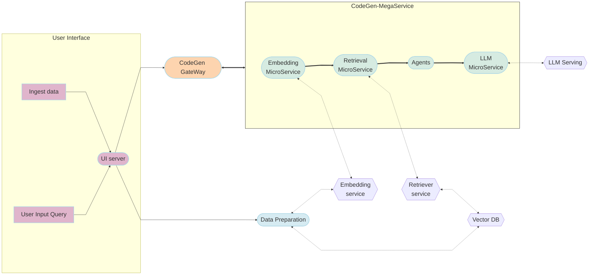

# Code Generation Example (CodeGen)

## Table of Contents

- [Overview](#overview)
- [Problem Motivation](#problem-motivation)
- [Architecture](#architecture)
  - [High-Level Diagram](#high-level-diagram)
  - [OPEA Microservices Diagram](#opea-microservices-diagram)
- [Deployment Options](#deployment-options)
- [Benchmarking](#benchmarking)
- [Automated Deployment using Terraform](#automated-deployment-using-terraform)
- [Contribution](#contribution)

## Overview

The Code Generation (CodeGen) example demonstrates an AI application designed to assist developers by generating computer code based on natural language prompts or existing code context. It leverages Large Language Models (LLMs) trained on vast datasets of repositories, documentation, and code for programming.

This example showcases how developers can quickly deploy and utilize a CodeGen service, potentially integrating it into their IDEs or development workflows to accelerate tasks like code completion, translation, summarization, refactoring, and error detection.

## Problem Motivation

Writing, understanding, and maintaining code can be time-consuming and complex. Developers often perform repetitive coding tasks, struggle with translating between languages, or need assistance understanding large codebases. CodeGen LLMs address this by automating code generation, providing intelligent suggestions, and assisting with various code-related tasks, thereby boosting productivity and reducing development friction. This OPEA example provides a blueprint for deploying such capabilities using optimized components.

## Architecture

### High-Level Diagram

The CodeGen application follows a microservice-based architecture enabling scalability and flexibility. User requests are processed through a gateway, which orchestrates interactions between various backend services, including the core LLM for code generation and potentially retrieval-augmented generation (RAG) components for context-aware responses.

### OPEA Microservices Diagram

This example utilizes several microservices from the [OPEA GenAIComps](https://github.com/opea-project/GenAIComps) repository. The diagram below illustrates the interaction between these components for a typical CodeGen request, potentially involving RAG using a vector database.

## Deployment Options

This CodeGen example can be deployed manually on various hardware platforms using Docker Compose or Kubernetes. Select the appropriate guide based on your target environment:

| Hardware        | Deployment Mode      | Guide Link                                                               |
| :-------------- | :------------------- | :----------------------------------------------------------------------- |
| Intel Xeon CPU  | Single Node (Docker) | [Xeon Docker Compose Guide](./docker_compose/intel/cpu/xeon/README.md)   |
| Intel Gaudi HPU | Single Node (Docker) | [Gaudi Docker Compose Guide](./docker_compose/intel/hpu/gaudi/README.md) |
| AMD ROCm GPU    | Single Node (Docker) | [ROCm Docker Compose Guide](./docker_compose/amd/gpu/rocm/README.md)     |
| Intel Xeon CPU  | Kubernetes (Helm)    | [Kubernetes Helm Guide](./kubernetes/helm/README.md)                     |
| Intel Gaudi HPU | Kubernetes (Helm)    | [Kubernetes Helm Guide](./kubernetes/helm/README.md)                     |
| Intel Xeon CPU  | Kubernetes (GMC)     | [Kubernetes GMC Guide](./kubernetes/gmc/README.md)                       |
| Intel Gaudi HPU | Kubernetes (GMC)     | [Kubernetes GMC Guide](./kubernetes/gmc/README.md)                       |

_Note: Building custom microservice images can be done using the resources in [GenAIComps](https://github.com/opea-project/GenAIComps)._

## Benchmarking

Guides for evaluating the performance and accuracy of this CodeGen deployment are available:

| Benchmark Type | Guide Link                                                       |
| :------------- | :--------------------------------------------------------------- |
| Accuracy       | [Accuracy Benchmark Guide](./benchmark/accuracy/README.md)       |
| Performance    | [Performance Benchmark Guide](./benchmark/performance/README.md) |

## Automated Deployment using Terraform

Intel® Optimized Cloud Modules for Terraform provide an automated way to deploy this CodeGen example on various Cloud Service Providers (CSPs).

| Cloud Provider       | Intel Architecture                | Intel Optimized Cloud Module for Terraform                                                                    | Comments    |
| :------------------- | :-------------------------------- | :------------------------------------------------------------------------------------------------------------ | :---------- |
| AWS                  | 4th Gen Intel Xeon with Intel AMX | [AWS Deployment](https://github.com/intel/terraform-intel-aws-vm/tree/main/examples/gen-ai-xeon-opea-codegen) | Available   |
| GCP                  | 4th/5th Gen Intel Xeon            | [GCP Deployment](https://github.com/intel/terraform-intel-gcp-vm/tree/main/examples/gen-ai-xeon-opea-codegen) | Available   |
| Azure                | 4th/5th Gen Intel Xeon            | Work-in-progress                                                                                              | Coming Soon |
| Intel Tiber AI Cloud | 5th Gen Intel Xeon with Intel AMX | Work-in-progress                                                                                              | Coming Soon |

## Contribution

We welcome contributions to the OPEA project. Please refer to the contribution guidelines for more information.
