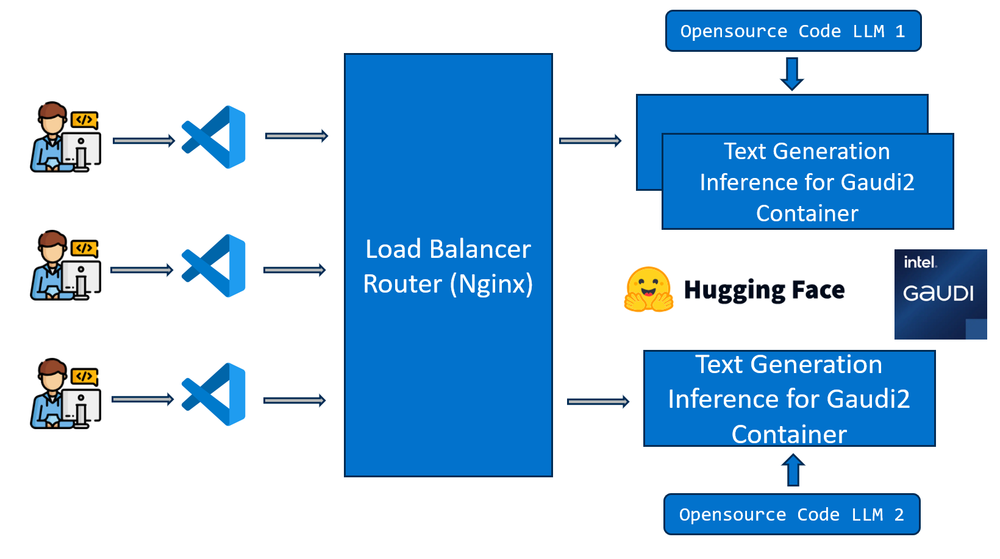

# Code Generation Application

Code Generation (CodeGen) Large Language Models (LLMs) are specialized AI models designed for the task of generating computer code. Such models undergo training with datasets that encompass repositories, specialized documentation, programming code, relevant web content, and other related data. They possess a deep understanding of various programming languages, coding patterns, and software development concepts. CodeGen LLMs are engineered to assist developers and programmers. When these LLMs are seamlessly integrated into the developer's Integrated Development Environment (IDE), they possess a comprehensive understanding of the coding context, which includes elements such as comments, function names, and variable names. This contextual awareness empowers them to provide more refined and contextually relevant coding suggestions.

The capabilities of CodeGen LLMs include:

- Code Generation: Streamline coding through Code Generation, enabling non-programmers to describe tasks for code creation.
- Code Completion: Accelerate coding by suggesting contextually relevant snippets as developers type.
- Code Translation and Modernization: Translate and modernize code across multiple programming languages, aiding interoperability and updating legacy projects.
- Code Summarization: Extract key insights from codebases, improving readability and developer productivity.
- Code Refactoring: Offer suggestions for code refactoring, enhancing code performance and efficiency.
- AI-Assisted Testing: Assist in creating test cases, ensuring code robustness and accelerating development cycles.
- Error Detection and Debugging: Detect errors in code and provide detailed descriptions and potential fixes, expediting debugging processes.

In this example, we present a Code Copilot application to showcase how code generation can be executed on either Intel Gaudi2 platform or Intel Xeon Processor platform. This CodeGen use case involves code generation utilizing open-source models such as `m-a-p/OpenCodeInterpreter-DS-6.7B` and `deepseek-ai/deepseek-coder-33b-instruct` with Text Generation Inference (TGI) for serving deployment.

The workflow falls into the following architecture:

# Deploy CodeGen Service

The CodeGen service can be effortlessly deployed on either Intel Gaudi2 or Intel Xeon Scalable Processor.

## Deploy CodeGen on Gaudi

Refer to the [Gaudi Guide](./docker/gaudi/README.md) for instructions on deploying CodeGen on Gaudi.

## Deploy CodeGen on Xeon

Refer to the [Xeon Guide](./docker/xeon/README.md) for instructions on deploying CodeGen on Xeon.

## Deploy CodeGen into Kubernetes on Xeon & Gaudi

Refer to the [Kubernetes Guide](./kubernetes/manifests/README.md) for instructions on deploying CodeGen into Kubernetes on Xeon & Gaudi.
