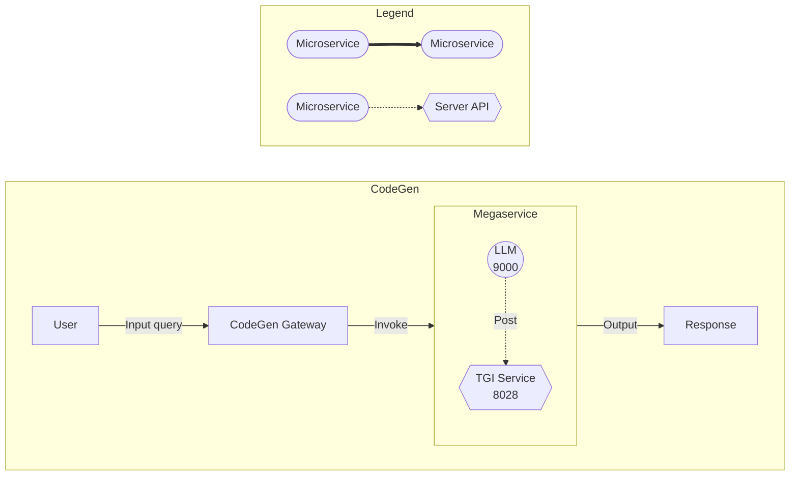

# Build MegaService of CodeGen on Xeon

This document outlines the deployment process for a CodeGen application utilizing the [GenAIComps](https://github.com/opea-project/GenAIComps.git) microservice pipeline on Intel Xeon server. The steps include Docker images creation, container deployment via Docker Compose, and service execution to integrate microservices such as `llm`. We will publish the Docker images to Docker Hub soon, further simplifying the deployment process for this service.

## 🚀 Create an AWS Xeon Instance

To run the example on an AWS Xeon instance, start by creating an AWS account if you don't have one already. Then, get started with the [EC2 Console](https://console.aws.amazon.com/ec2/v2/home). AWS EC2 M7i, C7i, C7i-flex and M7i-flex instances are next-generation compute optimized instances powered by custom 4th Generation Intel Xeon Scalable processors (code named Sapphire Rapids). These instances are optimized for high-performance computing and demanding workloads.

For detailed information about these instance types, you can refer to [m7i](https://aws.amazon.com/ec2/instance-types/m7i/). Once you've chosen the appropriate instance type, proceed with configuring your instance settings, including network configurations, security groups, and storage options.

After launching your instance, you can connect to it using SSH (for Linux instances) or Remote Desktop Protocol (RDP) (for Windows instances). From there, you'll have full access to your Xeon server, allowing you to install, configure, and manage your applications as needed.

## 🚀 Build Docker Images

First of all, you need to build the Docker images locally. This step can be ignored after the Docker images published to the Docker Hub.

### 1. Git Clone GenAIComps

```bash
git clone https://github.com/opea-project/GenAIComps.git
cd GenAIComps
```

### 2. Build the LLM Docker Image

```bash
docker build -t opea/llm-tgi:latest --build-arg https_proxy=$https_proxy --build-arg http_proxy=$http_proxy -f comps/llms/text-generation/tgi/Dockerfile .
```

### 3. Build the MegaService Docker Image

To construct the Mega Service, we utilize the [GenAIComps](https://github.com/opea-project/GenAIComps.git) microservice pipeline within the `codegen.py` Python script. Build MegaService Docker image via the command below:

```bash
git clone https://github.com/opea-project/GenAIExamples
cd GenAIExamples/CodeGen/docker
docker build -t opea/codegen:latest --build-arg https_proxy=$https_proxy --build-arg http_proxy=$http_proxy -f Dockerfile .
```

### 4. Build the UI Docker Image

Build the frontend Docker image via the command below:

```bash
cd GenAIExamples/CodeGen/docker/ui/
docker build -t opea/codegen-ui:latest --build-arg https_proxy=$https_proxy --build-arg http_proxy=$http_proxy -f ./docker/Dockerfile .
```

Then run the command `docker images`, you will have the following 3 Docker Images:

- `opea/llm-tgi:latest`
- `opea/codegen:latest`
- `opea/codegen-ui:latest`

## 🚀 Start Microservices and MegaService

The CodeGen megaservice manages a single microservice called LLM within a Directed Acyclic Graph (DAG). In the diagram above, the LLM microservice is a language model microservice that generates code snippets based on the user's input query. The TGI service serves as a text generation interface, providing a RESTful API for the LLM microservice. The CodeGen Gateway acts as the entry point for the CodeGen application, invoking the Megaservice to generate code snippets in response to the user's input query.

The mega flow of the CodeGen application, from user's input query to the application's output response, is as follows:



### Setup Environment Variables

Since the `compose.yaml` will consume some environment variables, you need to setup them in advance as below.

**Append the value of the public IP address to the no_proxy list**

```
export your_no_proxy=${your_no_proxy},"External_Public_IP"
```

```bash
export no_proxy=${your_no_proxy}
export http_proxy=${your_http_proxy}
export https_proxy=${your_http_proxy}
export LLM_MODEL_ID="meta-llama/CodeLlama-7b-hf"
export TGI_LLM_ENDPOINT="http://${host_ip}:8028"
export HUGGINGFACEHUB_API_TOKEN=${your_hf_api_token}
export MEGA_SERVICE_HOST_IP=${host_ip}
export LLM_SERVICE_HOST_IP=${host_ip}
export BACKEND_SERVICE_ENDPOINT="http://${host_ip}:7778/v1/codegen"
```

Note: Please replace the `host_ip` with you external IP address, do not use `localhost`.

### Start the Docker Containers for All Services

```bash
cd GenAIExamples/CodeGen/docker/xeon
docker compose up -d
```

### Validate the MicroServices and MegaService

1. TGI Service

```bash
curl http://${host_ip}:8028/generate \
  -X POST \
  -d '{"inputs":"Implement a high-level API for a TODO list application. The API takes as input an operation request and updates the TODO list in place. If the request is invalid, raise an exception.","parameters":{"max_new_tokens":256, "do_sample": true}}' \
  -H 'Content-Type: application/json'
```

2. LLM Microservices

```bash
curl http://${host_ip}:9000/v1/chat/completions\
  -X POST \
  -d '{"query":"Implement a high-level API for a TODO list application. The API takes as input an operation request and updates the TODO list in place. If the request is invalid, raise an exception.","max_new_tokens":256,"top_k":10,"top_p":0.95,"typical_p":0.95,"temperature":0.01,"repetition_penalty":1.03,"streaming":true}' \
  -H 'Content-Type: application/json'
```

3. MegaService

```bash
curl http://${host_ip}:7778/v1/codegen -H "Content-Type: application/json" -d '{
     "messages": "Implement a high-level API for a TODO list application. The API takes as input an operation request and updates the TODO list in place. If the request is invalid, raise an exception."
     }'
```

## 🚀 Launch the UI

To access the frontend, open the following URL in your browser: `http://{host_ip}:5173`. By default, the UI runs on port 5173 internally. If you prefer to use a different host port to access the frontend, you can modify the port mapping in the `compose.yaml` file as shown below:

```yaml
  codegen-xeon-ui-server:
    image: opea/codegen-ui:latest
    ...
    ports:
      - "80:5173"
```


Here is an example of running CodeGen in the UI:


## 🚀 Launch the React Based UI (Optional)

To access the React-based frontend, modify the UI service in the `compose.yaml` file. Replace `codegen-xeon-ui-server` service with the `codegen-xeon-react-ui-server` service as per the config below:

```yaml
codegen-xeon-react-ui-server:
  image: ${REGISTRY:-opea}/codegen-react-ui:${TAG:-latest}
  container_name: codegen-xeon-react-ui-server
  environment:
    - no_proxy=${no_proxy}
    - https_proxy=${https_proxy}
    - http_proxy=${http_proxy}
  depends_on:
    - codegen-xeon-backend-server
  ports:
    - "5174:80"
  ipc: host
  restart: always
```


## Install Copilot VSCode extension from Plugin Marketplace as the frontend

In addition to the Svelte UI, users can also install the Copilot VSCode extension from the Plugin Marketplace as the frontend.

Install `Neural Copilot` in VSCode as below.


### How to Use

#### Service URL Setting

Please adjust the service URL in the extension settings based on the endpoint of the code generation backend service.


#### Customize

The Copilot enables users to input their corresponding sensitive information and tokens in the user settings according to their own needs. This customization enhances the accuracy and output content to better meet individual requirements.


#### Code Suggestion

To trigger inline completion, you'll need to type `# {your keyword} (start with your programming language's comment keyword, like // in C++ and # in python)`. Make sure the `Inline Suggest` is enabled from the VS Code Settings.
For example:


To provide programmers with a smooth experience, the Copilot supports multiple ways to trigger inline code suggestions. If you are interested in the details, they are summarized as follows:

- Generate code from single-line comments: The simplest way introduced before.
- Generate code from consecutive single-line comments:


- Generate code from multi-line comments, which will not be triggered until there is at least one `space` outside the multi-line comment):


- Automatically complete multi-line comments:


### Chat with AI assistant

You can start a conversation with the AI programming assistant by clicking on the robot icon in the plugin bar on the left:


Then you can see the conversation window on the left, where you can chat with AI assistant:


There are 4 areas worth noting as shown in the screenshot above:

1. Enter and submit your question
2. Your previous questions
3. Answers from AI assistant (Code will be highlighted properly according to the programming language it is written in, also support streaming output)
4. Copy or replace code with one click (Note that you need to select the code in the editor first and then click "replace", otherwise the code will be inserted)

You can also select the code in the editor and ask the AI assistant questions about the code directly.
For example:

- Select code


- Ask question and get answer


