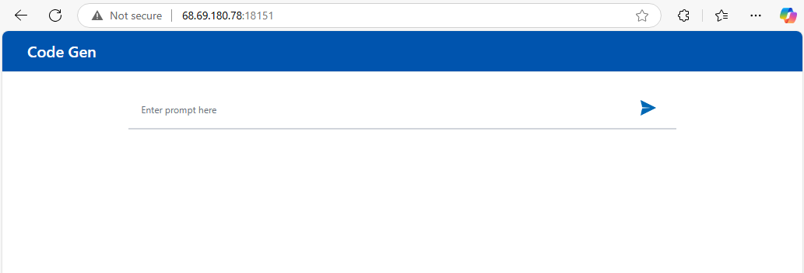
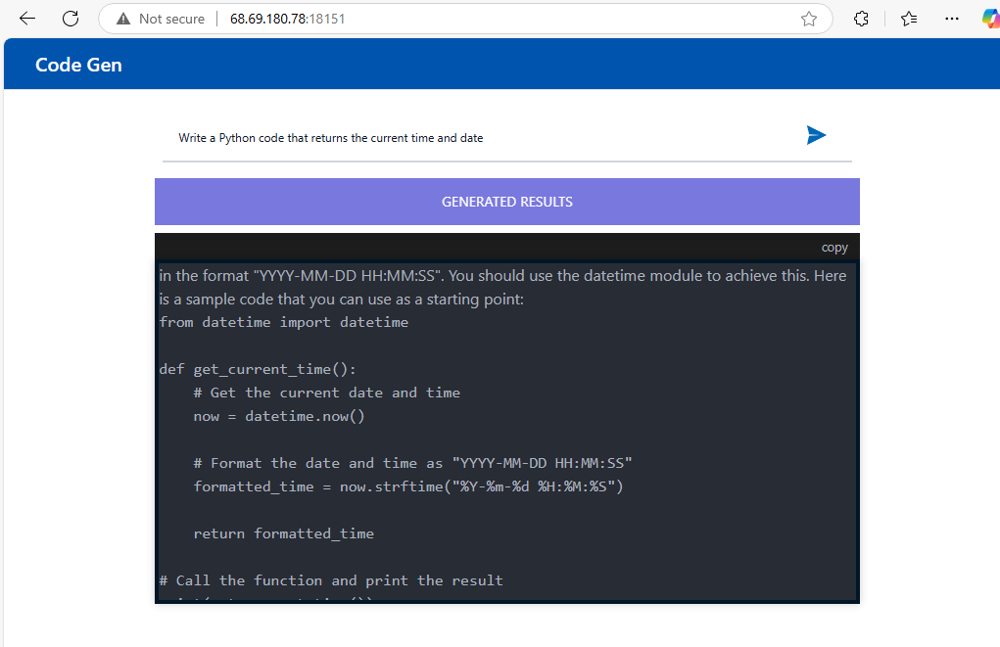

# Deploy CodeGen Application on AMD GPU (ROCm) with Docker Compose

This README provides instructions for deploying the CodeGen application using Docker Compose on a system equipped with AMD GPUs supporting ROCm, detailing the steps to configure, run, and validate the services. This guide defaults to using the **vLLM** backend for LLM serving.

## Table of Contents

- [Steps to Run with Docker Compose (Default vLLM)](#steps-to-run-with-docker-compose-default-vllm)
- [Service Overview](#service-overview)
- [Available Deployment Options](#available-deployment-options)
  - [compose_vllm.yaml (vLLM - Default)](#compose_vllyaml-vllm---default)
  - [compose.yaml (TGI)](#composeyaml-tgi)
- [Configuration Parameters and Usage](#configuration-parameters-and-usage)
  - [Docker Compose GPU Configuration](#docker-compose-gpu-configuration)
  - [Environment Variables (`set_env*.sh`)](#environment-variables-set_envsh)
- [Building Docker Images Locally (Optional)](#building-docker-images-locally-optional)
  - [1. Setup Build Environment](#1-setup-build-environment)
  - [2. Clone Repositories](#2-clone-repositories)
  - [3. Select Services and Build](#3-select-services-and-build)
- [Validate Service Health](#validate-service-health)
  - [1. Validate the vLLM/TGI Service](#1-validate-the-vllmtgi-service)
  - [2. Validate the LLM Service](#2-validate-the-llm-service)
  - [3. Validate the MegaService (Backend)](#3-validate-the-megaservice-backend)
  - [4. Validate the Frontend (UI)](#4-validate-the-frontend-ui)
- [How to Open the UI](#how-to-open-the-ui)
- [Troubleshooting](#troubleshooting)
- [Stopping the Application](#stopping-the-application)
- [Next Steps](#next-steps)

## Steps to Run with Docker Compose (Default vLLM)

_This section assumes you are using pre-built images and targets the default vLLM deployment._

1.  **Set Deploy Environment Variables:**

    - Go to the Docker Compose directory:
      ```bash
      # Adjust path if your GenAIExamples clone is located elsewhere
      cd GenAIExamples/CodeGen/docker_compose/amd/gpu/rocm
      ```
    - Setting variables in the operating system environment:
      - Set variable `HUGGINGFACEHUB_API_TOKEN`:
        ```bash
        ### Replace the string 'your_huggingfacehub_token' with your HuggingFacehub repository access token.
        export HUGGINGFACEHUB_API_TOKEN='your_huggingfacehub_token'
        ```
    - Edit the environment script for the **vLLM** deployment (`set_env_vllm.sh`):
      ```bash
      nano set_env_vllm.sh
      ```
      - Configure `HOST_IP`, `EXTERNAL_HOST_IP`, `*_PORT` variables, and proxies (`http_proxy`, `https_proxy`, `no_proxy`) as described in the Configuration section below.
    - Source the environment variables:
      ```bash
      . set_env_vllm.sh
      ```

2.  **Start the Services (vLLM):**

    ```bash
    docker compose -f compose_vllm.yaml up -d
    ```

3.  **Verify:** Proceed to the [Validate Service Health](#validate-service-health) section after allowing time for services to start.

## Service Overview

When using the default `compose_vllm.yaml` (vLLM-based), the following services are deployed:

| Service Name           | Default Port (Host)                            | Internal Port | Purpose                     |
| :--------------------- | :--------------------------------------------- | :------------ | :-------------------------- |
| codegen-vllm-service   | `${CODEGEN_VLLM_SERVICE_PORT}` (e.g., 8028)    | 8000          | LLM Serving (vLLM on ROCm)  |
| codegen-llm-server     | `${CODEGEN_LLM_SERVICE_PORT}` (e.g., 9000)     | 80            | LLM Microservice Wrapper    |
| codegen-backend-server | `${CODEGEN_BACKEND_SERVICE_PORT}` (e.g., 7778) | 80            | CodeGen MegaService/Gateway |
| codegen-ui-server      | `${CODEGEN_UI_SERVICE_PORT}` (e.g., 5173)      | 80            | Frontend User Interface     |

_(Note: Ports are configurable via `set_env_vllm.sh`. Check the script for actual defaults used.)_
_(Note: The TGI deployment (`compose.yaml`) uses `codegen-tgi-service` instead of `codegen-vllm-service`)_

## Available Deployment Options

This directory provides different Docker Compose files:

### compose_vllm.yaml (vLLM - Default)

- **Description:** Deploys the CodeGen application using vLLM optimized for ROCm as the backend LLM service. This is the default setup.
- **Services Deployed:** `codegen-vllm-service`, `codegen-llm-server`, `codegen-backend-server`, `codegen-ui-server`. Requires `set_env_vllm.sh`.

### compose.yaml (TGI)

- **Description:** Deploys the CodeGen application using Text Generation Inference (TGI) optimized for ROCm as the backend LLM service.
- **Services Deployed:** `codegen-tgi-service`, `codegen-llm-server`, `codegen-backend-server`, `codegen-ui-server`. Requires `set_env.sh`.

## Configuration Parameters and Usage

### Docker Compose GPU Configuration

To enable GPU support for AMD GPUs, the following configuration is added to the Docker Compose files (`compose.yaml`, `compose_vllm.yaml`) for the LLM serving container:

```yaml
# Example for vLLM service in compose_vllm.yaml
# Note: Modern docker compose might use deploy.resources syntax instead.
# Check your docker version and compose file.
shm_size: 1g
devices:
  - /dev/kfd:/dev/kfd
  - /dev/dri/:/dev/dri/
cap_add:
  - SYS_PTRACE
group_add:
  - video
security_opt:
  - seccomp:unconfined
```

This configuration forwards all available GPUs to the container. To use a specific GPU, specify its `cardN` and `renderN` device IDs (e.g., `/dev/dri/card0:/dev/dri/card0`, `/dev/dri/render128:/dev/dri/render128`). For example:

```yaml
shm_size: 1g
devices:
  - /dev/kfd:/dev/kfd
  - /dev/dri/card0:/dev/dri/card0
  - /dev/dri/render128:/dev/dri/render128
cap_add:
  - SYS_PTRACE
group_add:
  - video
security_opt:
  - seccomp:unconfined
```

**How to Identify GPU Device IDs:**
Use AMD GPU driver utilities to determine the correct `cardN` and `renderN` IDs for your GPU.

### Environment Variables (`set_env*.sh`)

These scripts (`set_env_vllm.sh` for vLLM, `set_env.sh` for TGI) configure crucial parameters passed to the containers.

| Environment Variable           | Description                                                                                              | Example Value (Edit in Script)   |
| :----------------------------- | :------------------------------------------------------------------------------------------------------- | :------------------------------- |
| `HUGGINGFACEHUB_API_TOKEN`     | Your Hugging Face Hub token for model access. **Required.**                                              | `your_huggingfacehub_token`      |
| `HOST_IP`                      | Internal/Primary IP address of the host machine. Used for inter-service communication. **Required.**     | `192.168.1.100`                  |
| `EXTERNAL_HOST_IP`             | External IP/hostname used to access the UI from outside. Same as `HOST_IP` if no proxy/LB. **Required.** | `192.168.1.100`                  |
| `CODEGEN_LLM_MODEL_ID`         | Hugging Face model ID for the CodeGen LLM.                                                               | `Qwen/Qwen2.5-Coder-7B-Instruct` |
| `CODEGEN_VLLM_SERVICE_PORT`    | Host port mapping for the vLLM serving endpoint (in `set_env_vllm.sh`).                                  | `8028`                           |
| `CODEGEN_TGI_SERVICE_PORT`     | Host port mapping for the TGI serving endpoint (in `set_env.sh`).                                        | `8028`                           |
| `CODEGEN_LLM_SERVICE_PORT`     | Host port mapping for the LLM Microservice wrapper.                                                      | `9000`                           |
| `CODEGEN_BACKEND_SERVICE_PORT` | Host port mapping for the CodeGen MegaService/Gateway.                                                   | `7778`                           |
| `CODEGEN_UI_SERVICE_PORT`      | Host port mapping for the UI service.                                                                    | `5173`                           |
| `http_proxy`                   | Network HTTP Proxy URL (if required).                                                                    | `Your_HTTP_Proxy`                |
| `https_proxy`                  | Network HTTPS Proxy URL (if required).                                                                   | `Your_HTTPs_Proxy`               |
| `no_proxy`                     | Comma-separated list of hosts to bypass proxy. Should include `localhost,127.0.0.1,$HOST_IP`.            | `localhost,127.0.0.1`            |

**How to Use:** Edit the relevant `set_env*.sh` file (`set_env_vllm.sh` for the default) with your values, then source it (`. ./set_env*.sh`) before running `docker compose`.

## Building Docker Images Locally (Optional)

Follow these steps if you need to build the Docker images from source instead of using pre-built ones.

### 1. Setup Build Environment

- #### Create application install directory and go to it:

  ```bash
  mkdir ~/codegen-install && cd codegen-install
  ```

### 2. Clone Repositories

- #### Clone the repository GenAIExamples (the default repository branch "main" is used here):

  ```bash
  git clone https://github.com/opea-project/GenAIExamples.git
  ```

  If you need to use a specific branch/tag of the GenAIExamples repository, then (v1.3 replace with its own value):

  ```bash
  git clone https://github.com/opea-project/GenAIExamples.git && cd GenAIExamples && git checkout v1.3
  ```

  We remind you that when using a specific version of the code, you need to use the README from this version.

- #### Go to build directory:

  ```bash
  cd ~/codegen-install/GenAIExamples/CodeGen/docker_image_build
  ```

- Cleaning up the GenAIComps repository if it was previously cloned in this directory.
  This is necessary if the build was performed earlier and the GenAIComps folder exists and is not empty:

  ```bash
  echo Y | rm -R GenAIComps
  ```

- #### Clone the repository GenAIComps (the default repository branch "main" is used here):

  ```bash
  git clone https://github.com/opea-project/GenAIComps.git
  ```

  If you use a specific tag of the GenAIExamples repository,
  then you should also use the corresponding tag for GenAIComps. (v1.3 replace with its own value):

  ```bash
  git clone https://github.com/opea-project/GenAIComps.git && cd GenAIComps && git checkout v1.3
  ```

  We remind you that when using a specific version of the code, you need to use the README from this version.

### 3. Select Services and Build

- #### Setting the list of images for the build (from the build file.yaml)

  Select the services corresponding to your desired deployment (vLLM is the default):

  ##### vLLM-based application (Default)

  ```bash
  service_list="vllm-rocm llm-textgen codegen codegen-ui"
  ```

  ##### TGI-based application

  ```bash
  service_list="llm-textgen codegen codegen-ui"
  ```

- #### Optional. Pull TGI Docker Image (Do this if you plan to build/use the TGI variant)

  ```bash
  docker pull ghcr.io/huggingface/text-generation-inference:2.3.1-rocm
  ```

- #### Build Docker Images

  _Ensure you are in the `~/codegen-install/GenAIExamples/CodeGen/docker_image_build` directory._

  ```bash
  docker compose -f build.yaml build ${service_list} --no-cache
  ```

  After the build, check the list of images with the command:

  ```bash
  docker image ls
  ```

  The list of images should include (depending on `service_list`):

  ###### vLLM-based application:

  - opea/vllm-rocm:latest
  - opea/llm-textgen:latest
  - opea/codegen:latest
  - opea/codegen-ui:latest

  ###### TGI-based application:

  - ghcr.io/huggingface/text-generation-inference:2.3.1-rocm (if pulled)
  - opea/llm-textgen:latest
  - opea/codegen:latest
  - opea/codegen-ui:latest

  _After building, ensure the `image:` tags in the main `compose_vllm.yaml` or `compose.yaml` (in the `amd/gpu/rocm` directory) match these built images (e.g., `opea/vllm-rocm:latest`)._

## Validate Service Health

Run these checks after starting the services to ensure they are operational. Focus on the vLLM checks first as it's the default.

### 1. Validate the vLLM/TGI Service

#### If you use vLLM (Default - using `compose_vllm.yaml` and `set_env_vllm.sh`)

- **How Tested:** Send a POST request with a sample prompt to the vLLM endpoint.
- **CURL Command:**

  ```bash
  DATA='{"model": "Qwen/Qwen2.5-Coder-7B-Instruct", '\
  '"messages": [{"role": "user", "content": "Implement a high-level API for a TODO list application. '\
  'The API takes as input an operation request and updates the TODO list in place. '\
  'If the request is invalid, raise an exception."}], "max_tokens": 256}'

  curl http://${HOST_IP}:${CODEGEN_VLLM_SERVICE_PORT}/v1/chat/completions \
    -X POST \
    -d "$DATA" \
    -H 'Content-Type: application/json'
  ```

- **Sample Output:**
  ```json
  {
    "id": "chatcmpl-142f34ef35b64a8db3deedd170fed951",
    "object": "chat.completion"
    // ... (rest of output) ...
  }
  ```
- **Expected Result:** A JSON response with a `choices[0].message.content` field containing meaningful generated code.

#### If you use TGI (using `compose.yaml` and `set_env.sh`)

- **How Tested:** Send a POST request with a sample prompt to the TGI endpoint.
- **CURL Command:**

  ```bash
  DATA='{"inputs":"Implement a high-level API for a TODO list application. '\
  # ... (data payload as before) ...
  '"parameters":{"max_new_tokens":256,"do_sample": true}}'

  curl http://${HOST_IP}:${CODEGEN_TGI_SERVICE_PORT}/generate \
    -X POST \
    -d "$DATA" \
    -H 'Content-Type: application/json'
  ```

- **Sample Output:**
  ```json
  {
    "generated_text": " The supported operations are \"add_task\", \"complete_task\", and \"remove_task\". # ... (generated code) ..."
  }
  ```
- **Expected Result:** A JSON response with a `generated_text` field containing meaningful generated code.

### 2. Validate the LLM Service

- **Service Name:** `codegen-llm-server`
- **How Tested:** Send a POST request to the LLM microservice wrapper endpoint.
- **CURL Command:**

  ```bash
  DATA='{"query":"Implement a high-level API for a TODO list application. '\
  # ... (data payload as before) ...
  '"repetition_penalty":1.03,"stream":false}'

  curl http://${HOST_IP}:${CODEGEN_LLM_SERVICE_PORT}/v1/chat/completions \
    -X POST \
    -d "$DATA" \
    -H 'Content-Type: application/json'
  ```

- **Sample Output:** (Structure may vary slightly depending on whether vLLM or TGI is backend)
  ```json
  {
    "id": "cmpl-4e89a590b1af46bfb37ce8f12b2996f8" // Example ID
    // ... (output structure depends on backend, check original validation) ...
  }
  ```
- **Expected Result:** A JSON response containing meaningful generated code within the `choices` array.

### 3. Validate the MegaService (Backend)

- **Service Name:** `codegen-backend-server`
- **How Tested:** Send a POST request to the main CodeGen gateway endpoint.
- **CURL Command:**

  ```bash
  DATA='{"messages": "Implement a high-level API for a TODO list application. '\
  # ... (data payload as before) ...
  'If the request is invalid, raise an exception."}'

  curl http://${HOST_IP}:${CODEGEN_BACKEND_SERVICE_PORT}/v1/codegen \
    -H "Content-Type: application/json" \
    -d "$DATA"
  ```

- **Sample Output:**
  ```textmate
  data: {"id":"cmpl-...", ...}
  # ... more data chunks ...
  data: [DONE]
  ```
- **Expected Result:** A stream of server-sent events (SSE) containing JSON data with generated code tokens, ending with `data: [DONE]`.

### 4. Validate the Frontend (UI)

- **Service Name:** `codegen-ui-server`
- **How Tested:** Access the UI URL in a web browser and perform a test query.
- **Steps:** See [How to Open the UI](#how-to-open-the-ui).
- **Expected Result:** The UI loads correctly, and submitting a prompt results in generated code displayed on the page.

## How to Open the UI

1.  Determine the UI access URL using the `EXTERNAL_HOST_IP` and `CODEGEN_UI_SERVICE_PORT` variables defined in your sourced `set_env*.sh` file (use `set_env_vllm.sh` for the default vLLM deployment). The default URL format is:
    `http://${EXTERNAL_HOST_IP}:${CODEGEN_UI_SERVICE_PORT}`
    (e.g., `http://192.168.1.100:5173`)

2.  Open this URL in your web browser.

3.  You should see the CodeGen starting page:
    

4.  Enter a prompt in the input field (e.g., "Write a Python code that returns the current time and date") and press Enter or click the submit button.

5.  Verify that the generated code appears correctly:
    

## Troubleshooting

_(No specific troubleshooting steps provided in the original content for this file. Add common issues if known.)_

- Check container logs (`docker compose -f <file> logs <service_name>`), especially for `codegen-vllm-service` or `codegen-tgi-service`.
- Ensure `HUGGINGFACEHUB_API_TOKEN` is correct.
- Verify ROCm drivers and Docker setup for GPU access.
- Confirm network connectivity and proxy settings.
- Ensure `HOST_IP` and `EXTERNAL_HOST_IP` are correctly set and accessible.
- If building locally, ensure build steps completed without error and image tags match compose file.

## Stopping the Application

### If you use vLLM (Default)

```bash
# Ensure you are in the correct directory
# cd GenAIExamples/CodeGen/docker_compose/amd/gpu/rocm
docker compose -f compose_vllm.yaml down
```

### If you use TGI

```bash
# Ensure you are in the correct directory
# cd GenAIExamples/CodeGen/docker_compose/amd/gpu/rocm
docker compose -f compose.yaml down
```

## Next Steps

- Explore the alternative TGI deployment option if needed.
- Refer to the main [CodeGen README](../../../../README.md) for architecture details and links to other deployment methods (Kubernetes, Xeon).
- Consult the [OPEA GenAIComps](https://github.com/opea-project/GenAIComps) repository for details on individual microservices.
