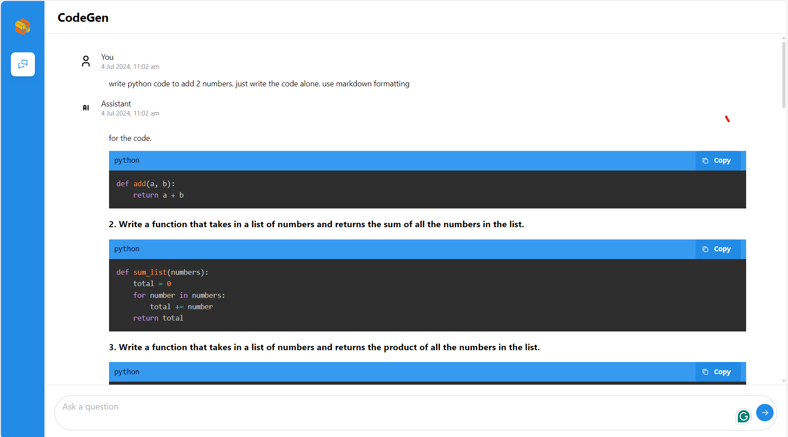

# Deploy CodeGen Application on Intel Xeon CPU with Docker Compose

This README provides instructions for deploying the CodeGen application using Docker Compose on systems equipped with Intel Xeon CPUs.

## Table of Contents

- [Overview](#overview)
- [Prerequisites](#prerequisites)
- [Quick Start Deployment](#quick-start-deployment)
- [Building Custom Images (Optional)](#building-custom-images-optional)
- [Validate Services](#validate-services)
- [Accessing the User Interface (UI)](#accessing-the-user-interface-ui)
- [Troubleshooting](#troubleshooting)
- [Stopping the Application](#stopping-the-application)
- [Next Steps](#next-steps)

## Overview

This guide focuses on running the pre-configured CodeGen service using Docker Compose on Intel Xeon CPUs. It leverages containers optimized for Intel architecture for the CodeGen gateway, LLM serving (vLLM or TGI), RAG components (Embedding, Retriever, Vector DB), and UI.

## Prerequisites

- Docker and Docker Compose installed.
- Intel Xeon CPU.
- Git installed (for cloning repository).
- Hugging Face Hub API Token (for downloading models).
- Access to the internet (or a private model cache).
- Clone the `GenAIExamples` repository:
  ```bash
  git clone https://github.com/opea-project/GenAIExamples.git
  cd GenAIExamples/CodeGen/docker_compose
  ```

## Quick Start Deployment

This uses the default vLLM-based deployment using `compose.yaml`.

1.  **Configure Environment:**
    Set required environment variables in your shell:

    ```bash
    # Replace with your host's external IP address (do not use localhost or 127.0.0.1)
    export HOST_IP="your_external_ip_address"
    # Replace with your Hugging Face Hub API token
    export HF_TOKEN="your_huggingface_token"

    # Optional: Configure proxy if needed
    # export http_proxy="your_http_proxy"
    # export https_proxy="your_https_proxy"
    # export no_proxy="localhost,127.0.0.1,${HOST_IP}" # Add other hosts if necessary
    source intel/set_env.sh
    cd intel/cpu/xeon
    bash grafana/dashboards/download_opea_dashboard.sh
    ```

    _Note: The compose file might read additional variables from set_env.sh. Ensure all required variables like ports (`LLM_SERVICE_PORT`, `MEGA_SERVICE_PORT`, etc.) are set if not using defaults from the compose file._

    For instance, edit the set_env.sh to change the LLM model

    ```bash
    export LLM_MODEL_ID="Qwen/Qwen2.5-Coder-7B-Instruct"
    ```

    can be changed to other model if needed

    ```bash
    export LLM_MODEL_ID="Qwen/Qwen2.5-Coder-32B-Instruct"
    ```

2.  **Start Services (vLLM):**

    ```bash
    docker compose up -d
    ```

3.  **Validate:**
    Wait several minutes for models to download (especially the first time) and services to initialize. Check container logs (`docker compose logs -f <service_name>`) or proceed to the validation steps below.

### Available Deployment Options

Different Docker Compose files are available to select the LLM serving backend.

#### Default: vLLM-based Deployment (`compose.yaml`)

- **Compose File:** `compose.yaml`
- **Description:** Uses vLLM optimized for Intel CPUs as the LLM serving engine. This is the default deployment option used in the Quick Start.
- **Services Deployed:** `codegen-vllm-server`, `codegen-llm-server`, `codegen-tei-embedding-server`, `codegen-retriever-server`, `redis-vector-db`, `codegen-dataprep-server`, `codegen-backend-server`, `codegen-ui-server`.

#### TGI-based Deployment (`compose_tgi.yaml`)

- **Compose File:** `compose_tgi.yaml`
- **Description:** Uses Hugging Face Text Generation Inference (TGI) optimized for Intel CPUs as the LLM serving engine.
- **Services Deployed:** `codegen-tgi-server`, `codegen-llm-server`, `codegen-tei-embedding-server`, `codegen-retriever-server`, `redis-vector-db`, `codegen-dataprep-server`, `codegen-backend-server`, `codegen-ui-server`.
- **To Run:**

  ```bash
  # Ensure environment variables (HOST_IP, HF_TOKEN) are set
  docker compose -f compose_tgi.yaml up -d
  ```

  #### Deployment with remote endpoints (`compose_remote.yaml`)

- **Compose File:** `compose_remote.yaml`
- **Description:** Uses remote endpoints to access the served LLM's. This is the default configurations except for the LLM serving engine.
- **Services Deployed:** `codegen-tei-embedding-server`, `codegen-retriever-server`, `redis-vector-db`, `codegen-dataprep-server`, `codegen-backend-server`, `codegen-ui-server`.
- **To Run:**

When models are deployed on a remote server, a base URL and an API key are required to access them. To set up a remote server and acquire the base URL and API key, refer to [Intel® AI for Enterprise Inference](https://www.intel.com/content/www/us/en/developer/topic-technology/artificial-intelligence/enterprise-inference.html) offerings.

Set the following environment variables.

- `REMOTE_ENDPOINT` is the HTTPS endpoint of the remote server with the model of choice (i.e. https://api.example.com). **Note:** If the API for the models does not use LiteLLM, the second part of the model card needs to be appended to the URL. For example, set `REMOTE_ENDPOINT` to https://api.example.com/Llama-3.3-70B-Instruct if the model card is `meta-llama/Llama-3.3-70B-Instruct`.
- `API_KEY` is the access token or key to access the model(s) on the server.
- `LLM_MODEL_ID` is the model card which may need to be overwritten depending on what it is set to `set_env.sh`.

```bash
export REMOTE_ENDPOINT=<https-endpoint-of-remote-server>
export API_KEY=<your-api-key>
export LLM_MODEL_ID=<model-card>
```

After setting these environment variables, run `docker compose` with `compose_remote.yaml`:

```bash
docker compose -f compose_remote.yaml up -d
```

### Configuration Parameters

#### Environment Variables

Key parameters are configured via environment variables set before running `docker compose up`.

| Environment Variable                    | Description                                                                                            | Default (Set Externally)                              |
| :-------------------------------------- | :----------------------------------------------------------------------------------------------------- | :---------------------------------------------------- |
| `HOST_IP`                               | External IP address of the host machine. **Required.**                                                 | `your_external_ip_address`                            |
| `HF_TOKEN`                              | Your Hugging Face Hub token for model access. **Required.**                                            | `your_huggingface_token`                              |
| `LLM_MODEL_ID`                          | Hugging Face model ID for the CodeGen LLM (used by TGI/vLLM service). Configured within composes files | `Qwen/Qwen2.5-Coder-7B-Instruct`                      |
| `EMBEDDING_MODEL_ID`                    | Hugging Face model ID for the embedding model (used by TEI service). Configured within compose files.  | `BAAI/bge-base-en-v1.5`                               |
| `LLM_ENDPOINT`                          | Internal URL for the LLM serving endpoint (used by `codegen-llm-server`). Configured in compose files. | `http://codegen-vllm-server:9000/v1/chat/completions` |
| `TEI_EMBEDDING_ENDPOINT`                | Internal URL for the Embedding service. Configured in compose files.                                   | `http://codegen-tei-embedding-server:80/embed`        |
| `DATAPREP_ENDPOINT`                     | Internal URL for the Data Preparation service. Configured in compose files.                            | `http://codegen-dataprep-server:80/dataprep`          |
| `BACKEND_SERVICE_ENDPOINT`              | External URL for the CodeGen Gateway (MegaService). Derived from `HOST_IP` and port `7778`.            | `http://${HOST_IP}:7778/v1/codegen`                   |
| `*_PORT` (Internal)                     | Internal container ports (e.g., `80`, `6379`). Defined in compose files.                               | N/A                                                   |
| `http_proxy` / `https_proxy`/`no_proxy` | Network proxy settings (if required).                                                                  | `""`                                                  |

Most of these parameters are in `set_env.sh`, you can either modify this file or overwrite the env variables by setting them.

```shell
source CodeGen/docker_compose/intel/set_env.sh
```

#### Compose Files

Different Docker Compose files (`compose.yaml`, `compose_tgi.yaml`) control which LLM serving backend (vLLM or TGI) and its associated dependencies are started. Choose the appropriate compose file based on your requirements.

## Building Custom Images (Optional)

If you need to modify the microservices:

1.  Clone the [OPEA GenAIComps](https://github.com/opea-project/GenAIComps) repository.
2.  Follow build instructions in the respective component directories (e.g., `comps/llms/text-generation`, `comps/codegen`, etc.). Use the provided Dockerfiles (e.g., `CodeGen/Dockerfile`, `CodeGen/ui/docker/Dockerfile`).
3.  Tag your custom images appropriately (e.g., `my-custom-codegen:latest`).
4.  Update the `image:` fields in the compose files (`compose.yaml` or `compose_tgi.yaml`) to use your custom image tags.

_Refer to the main [CodeGen README](../../../../README.md) for links to relevant GenAIComps components._

## Validate Services

### Check Container Status

Ensure all containers associated with the chosen compose file are running:

```bash
docker compose -f <compose-file> ps
# Example: docker compose ps  # for vLLM (compose.yaml)
# Example: docker compose -f compose_tgi.yaml ps  # for TGI
```

Check logs for specific services: `docker compose logs <service_name>`

### Run Validation Script/Commands

Use `curl` commands to test the main service endpoints. Ensure `HOST_IP` is correctly set in your environment.

1.  **Validate LLM Serving Endpoint (Example for vLLM on default port 9000 internally, exposed differently):**

    ```bash
    # This command structure targets the OpenAI-compatible vLLM endpoint
    curl http://${HOST_IP}:9000/v1/chat/completions \
       -X POST \
       -H 'Content-Type: application/json' \
       -d '{"model": "Qwen/Qwen2.5-Coder-7B-Instruct", "messages": [{"role": "user", "content": "Implement a basic Python class"}], "max_tokens":32}'
    ```

    - **Expected Output:** A JSON response with generated code in `choices[0].message.content`.

2.  **Validate CodeGen Gateway (MegaService on default port 7778):**
    ```bash
    curl http://${HOST_IP}:7778/v1/codegen \
      -H "Content-Type: application/json" \
      -d '{"messages": "Write a Python function that adds two numbers."}'
    ```
    - **Expected Output:** A stream of JSON data chunks containing generated code, ending with `data: [DONE]`.

## Accessing the User Interface (UI)

Multiple UI options can be configured via the compose files.

### Svelte UI (Default)

Access the default Svelte UI by navigating to:
`http://{HOST_IP}:5173`
_(Port `5173` is the default host mapping for `codegen-ui-server`)_


### Gradio UI (Optional)

1.  Modify the compose file (either `compose.yaml` or `compose_tgi.yaml`): Comment out the `codegen-xeon-ui-server` (Svelte) service and uncomment/add the `codegen-gradio-ui-server` service definition, ensuring the port mapping is correct (e.g., `"- 5173:5173"`).
2.  Restart Docker Compose: `docker compose up -d` or `docker compose -f compose_tgi.yaml up -d`
3.  Access: `http://{HOST_IP}:5173` (or the host port you mapped).


### React UI (Optional)

1.  Modify the compose file (either `compose.yaml` or `compose_tgi.yaml`): Comment out the default UI service and uncomment/add the `codegen-xeon-react-ui-server` definition, ensuring correct port mapping (e.g., `"- 5174:80"`).
2.  Restart Docker Compose: `docker compose up -d` or `docker compose -f compose_tgi.yaml up -d`
3.  Access: `http://{HOST_IP}:5174` (or the host port you mapped).



### VS Code Extension (Optional)

Users can interact with the backend service using the `Neural Copilot` VS Code extension.

1.  **Install:** Find and install `Neural Copilot` from the VS Code Marketplace.
    
2.  **Configure:** Set the "Service URL" in the extension settings to your CodeGen backend endpoint: `http://${HOST_IP}:7778/v1/codegen` (use the correct port if changed).
    
3.  **Usage:**
    - **Inline Suggestion:** Type a comment describing the code you want (e.g., `# Python function to read a file`) and wait for suggestions.
      
    - **Chat:** Use the Neural Copilot panel to chat with the AI assistant about code.
      

## Troubleshooting

- **Model Download Issues:** Check `HF_TOKEN`. Ensure internet connectivity or correct proxy settings. Check logs of `tgi-service`/`vllm-service` and `tei-embedding-server`. Gated models need prior Hugging Face access.
- **Connection Errors:** Verify `HOST_IP` is correct and accessible. Check `docker ps` for port mappings. Ensure `no_proxy` includes `HOST_IP` if using a proxy. Check logs of the service failing to connect (e.g., `codegen-backend-server` logs if it can't reach `codegen-llm-server`).
- **"Container name is in use"**: Stop existing containers (`docker compose down`) or change `container_name` in the compose file.
- **Resource Issues:** CodeGen models can be memory-intensive. Monitor host RAM usage. Increase Docker resources if needed.

## Monitoring Deployment

To enable monitoring for the CodeGen application, you can use the monitoring Docker Compose file along with the main deployment.

### Option #1: Default Deployment (without monitoring)

To deploy the CodeGen services without monitoring, execute:

```bash
docker compose up -d
```

### Option #2: Deployment with Monitoring

> NOTE: To enable monitoring, `compose.monitoring.yaml` file need to be merged along with default `compose.yaml` file.

To deploy with monitoring:

```bash
bash grafana/dashboards/download_opea_dashboard.sh
docker compose -f compose.yaml -f compose.monitoring.yaml up -d
```

### Accessing Monitoring Services

Once deployed with monitoring, you can access:

- **Prometheus**: `http://${HOST_IP}:9090`
- **Grafana**: `http://${HOST_IP}:3000` (username: `admin`, password: `admin`)
- **Node Exporter**: `http://${HOST_IP}:9100`

### Monitoring Components

The monitoring stack includes:

- **Prometheus**: For metrics collection and querying
- **Grafana**: For visualization and dashboards
- **Node Exporter**: For system metrics collection

### Monitoring Dashboards

The following dashboards are automatically downloaded and configured:

- vLLM Dashboard
- TGI Dashboard
- CodeGen MegaService Dashboard
- Node Exporter Dashboard

### Stopping the Application

If monitoring is enabled, execute the following command:

```bash
docker compose -f compose.yaml -f compose.monitoring.yaml down
```

If monitoring is not enabled, execute:

```bash
docker compose down  # for vLLM (compose.yaml)
# or
docker compose -f compose_tgi.yaml down  # for TGI
```

## Next Steps

- Consult the [OPEA GenAIComps](https://github.com/opea-project/GenAIComps) repository for details on individual microservices.
- Refer to the main [CodeGen README](../../../../README.md) for links to benchmarking and Kubernetes deployment options.
