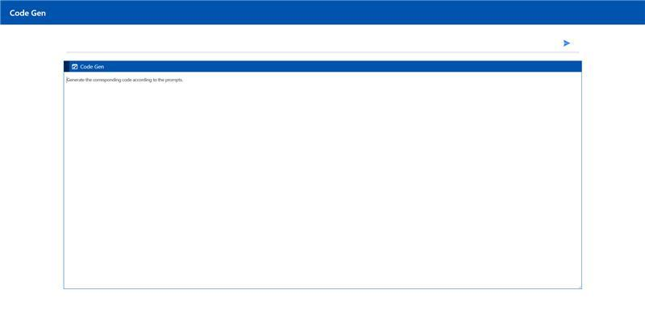
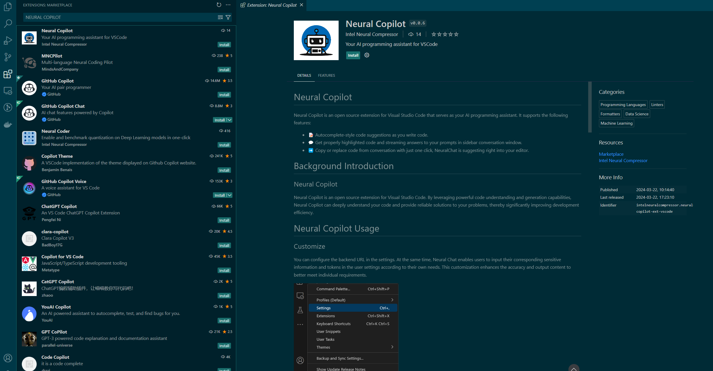

# Deploy CodeGen Application on Intel Xeon CPU with Docker Compose

This README provides instructions for deploying the CodeGen application using Docker Compose on systems equipped with Intel Xeon CPUs.

## Table of Contents

- [Overview](#overview)
- [Prerequisites](#prerequisites)
- [Quick Start](#quick-start)
- [Available Deployment Options](#available-deployment-options)
  - [Default: vLLM-based Deployment (`--profile codegen-xeon-vllm`)](#default-vllm-based-deployment---profile-codegen-xeon-vllm)
  - [TGI-based Deployment (`--profile codegen-xeon-tgi`)](#tgi-based-deployment---profile-codegen-xeon-tgi)
- [Configuration Parameters](#configuration-parameters)
  - [Environment Variables](#environment-variables)
  - [Compose Profiles](#compose-profiles)
- [Building Custom Images (Optional)](#building-custom-images-optional)
- [Validate Services](#validate-services)
  - [Check Container Status](#check-container-status)
  - [Run Validation Script/Commands](#run-validation-scriptcommands)
- [Accessing the User Interface (UI)](#accessing-the-user-interface-ui)
  - [Gradio UI (Default)](#gradio-ui-default)
  - [Svelte UI (Optional)](#svelte-ui-optional)
  - [React UI (Optional)](#react-ui-optional)
  - [VS Code Extension (Optional)](#vs-code-extension-optional)
- [Troubleshooting](#troubleshooting)
- [Stopping the Application](#stopping-the-application)
- [Next Steps](#next-steps)

## Overview

This guide focuses on running the pre-configured CodeGen service using Docker Compose on Intel Xeon CPUs. It leverages containers optimized for Intel architecture for the CodeGen gateway, LLM serving (vLLM or TGI), RAG components (Embedding, Retriever, Vector DB), and UI.

## Prerequisites

- Docker and Docker Compose installed.
- Intel Xeon CPU.
- Git installed (for cloning repository).
- Hugging Face Hub API Token (for downloading models).
- Access to the internet (or a private model cache).
- Clone the `GenAIExamples` repository:
  ```bash
  git clone https://github.com/opea-project/GenAIExamples.git
  cd GenAIExamples/CodeGen/docker_compose/intel/cpu/xeon
  ```

## Quick Start

This uses the default vLLM-based deployment profile (`codegen-xeon-vllm`).

1.  **Configure Environment:**
    Set required environment variables in your shell:

    ```bash
    # Replace with your host's external IP address (do not use localhost or 127.0.0.1)
    export HOST_IP="your_external_ip_address"
    # Replace with your Hugging Face Hub API token
    export HUGGINGFACEHUB_API_TOKEN="your_huggingface_token"

    # Optional: Configure proxy if needed
    # export http_proxy="your_http_proxy"
    # export https_proxy="your_https_proxy"
    # export no_proxy="localhost,127.0.0.1,${HOST_IP}" # Add other hosts if necessary
    source ../../../set_env.sh
    ```

    _Note: The compose file might read additional variables from a `.env` file or expect them defined elsewhere. Ensure all required variables like ports (`LLM_SERVICE_PORT`, `MEGA_SERVICE_PORT`, etc.) are set if not using defaults from the compose file._

2.  **Start Services (vLLM Profile):**

    ```bash
    docker compose --profile codegen-xeon-vllm up -d
    ```

3.  **Validate:**
    Wait several minutes for models to download (especially the first time) and services to initialize. Check container logs (`docker compose logs -f <service_name>`) or proceed to the validation steps below.

## Available Deployment Options

The `compose.yaml` file uses Docker Compose profiles to select the LLM serving backend.

### Default: vLLM-based Deployment (`--profile codegen-xeon-vllm`)

- **Profile:** `codegen-xeon-vllm`
- **Description:** Uses vLLM optimized for Intel CPUs as the LLM serving engine. This is the default profile used in the Quick Start.
- **Services Deployed:** `codegen-vllm-server`, `codegen-llm-server`, `codegen-tei-embedding-server`, `codegen-retriever-server`, `redis-vector-db`, `codegen-dataprep-server`, `codegen-backend-server`, `codegen-gradio-ui-server`.

### TGI-based Deployment (`--profile codegen-xeon-tgi`)

- **Profile:** `codegen-xeon-tgi`
- **Description:** Uses Hugging Face Text Generation Inference (TGI) optimized for Intel CPUs as the LLM serving engine.
- **Services Deployed:** `codegen-tgi-server`, `codegen-llm-server`, `codegen-tei-embedding-server`, `codegen-retriever-server`, `redis-vector-db`, `codegen-dataprep-server`, `codegen-backend-server`, `codegen-gradio-ui-server`.
- **To Run:**
  ```bash
  # Ensure environment variables (HOST_IP, HUGGINGFACEHUB_API_TOKEN) are set
  docker compose --profile codegen-xeon-tgi up -d
  ```

## Configuration Parameters

### Environment Variables

Key parameters are configured via environment variables set before running `docker compose up`.

| Environment Variable                    | Description                                                                                                         | Default (Set Externally)                                                                         |
| :-------------------------------------- | :------------------------------------------------------------------------------------------------------------------ | :----------------------------------------------------------------------------------------------- |
| `HOST_IP`                               | External IP address of the host machine. **Required.**                                                              | `your_external_ip_address`                                                                       |
| `HUGGINGFACEHUB_API_TOKEN`              | Your Hugging Face Hub token for model access. **Required.**                                                         | `your_huggingface_token`                                                                         |
| `LLM_MODEL_ID`                          | Hugging Face model ID for the CodeGen LLM (used by TGI/vLLM service). Configured within `compose.yaml` environment. | `Qwen/Qwen2.5-Coder-7B-Instruct`                                                                 |
| `EMBEDDING_MODEL_ID`                    | Hugging Face model ID for the embedding model (used by TEI service). Configured within `compose.yaml` environment.  | `BAAI/bge-base-en-v1.5`                                                                          |
| `LLM_ENDPOINT`                          | Internal URL for the LLM serving endpoint (used by `codegen-llm-server`). Configured in `compose.yaml`.             | `http://codegen-tgi-server:80/generate` or `http://codegen-vllm-server:8000/v1/chat/completions` |
| `TEI_EMBEDDING_ENDPOINT`                | Internal URL for the Embedding service. Configured in `compose.yaml`.                                               | `http://codegen-tei-embedding-server:80/embed`                                                   |
| `DATAPREP_ENDPOINT`                     | Internal URL for the Data Preparation service. Configured in `compose.yaml`.                                        | `http://codegen-dataprep-server:80/dataprep`                                                     |
| `BACKEND_SERVICE_ENDPOINT`              | External URL for the CodeGen Gateway (MegaService). Derived from `HOST_IP` and port `7778`.                         | `http://${HOST_IP}:7778/v1/codegen`                                                              |
| `*_PORT` (Internal)                     | Internal container ports (e.g., `80`, `6379`). Defined in `compose.yaml`.                                           | N/A                                                                                              |
| `http_proxy` / `https_proxy`/`no_proxy` | Network proxy settings (if required).                                                                               | `""`                                                                                             |

Most of these parameters are in `set_env.sh`, you can either modify this file or overwrite the env variables by setting them.

```shell
source CodeGen/docker_compose/set_env.sh
```

### Compose Profiles

Docker Compose profiles (`codegen-xeon-vllm`, `codegen-xeon-tgi`) control which LLM serving backend (vLLM or TGI) and its associated dependencies are started. Only one profile should typically be active.

## Building Custom Images (Optional)

If you need to modify the microservices:

1.  Clone the [OPEA GenAIComps](https://github.com/opea-project/GenAIComps) repository.
2.  Follow build instructions in the respective component directories (e.g., `comps/llms/text-generation`, `comps/codegen`, `comps/ui/gradio`, etc.). Use the provided Dockerfiles (e.g., `CodeGen/Dockerfile`, `CodeGen/ui/docker/Dockerfile.gradio`).
3.  Tag your custom images appropriately (e.g., `my-custom-codegen:latest`).
4.  Update the `image:` fields in the `compose.yaml` file to use your custom image tags.

_Refer to the main [CodeGen README](../../../../README.md) for links to relevant GenAIComps components._

## Validate Services

### Check Container Status

Ensure all containers associated with the chosen profile are running:

```bash
docker compose --profile <profile_name> ps
# Example: docker compose --profile codegen-xeon-vllm ps
```

Check logs for specific services: `docker compose logs <service_name>`

### Run Validation Script/Commands

Use `curl` commands to test the main service endpoints. Ensure `HOST_IP` is correctly set in your environment.

1.  **Validate LLM Serving Endpoint (Example for vLLM on default port 8000 internally, exposed differently):**

    ```bash
    # This command structure targets the OpenAI-compatible vLLM endpoint
    curl http://${HOST_IP}:8000/v1/chat/completions \
       -X POST \
       -H 'Content-Type: application/json' \
       -d '{"model": "Qwen/Qwen2.5-Coder-7B-Instruct", "messages": [{"role": "user", "content": "Implement a basic Python class"}], "max_tokens":32}'
    ```

    - **Expected Output:** A JSON response with generated code in `choices[0].message.content`.

2.  **Validate CodeGen Gateway (MegaService on default port 7778):**
    ```bash
    curl http://${HOST_IP}:7778/v1/codegen \
      -H "Content-Type: application/json" \
      -d '{"messages": "Write a Python function that adds two numbers."}'
    ```
    - **Expected Output:** A stream of JSON data chunks containing generated code, ending with `data: [DONE]`.

## Accessing the User Interface (UI)

Multiple UI options can be configured via the `compose.yaml`.

### Gradio UI (Default)

Access the default Gradio UI by navigating to:
`http://{HOST_IP}:8080`
_(Port `8080` is the default host mapping for `codegen-gradio-ui-server`)_


### Svelte UI (Optional)

1.  Modify `compose.yaml`: Comment out the `codegen-gradio-ui-server` service and uncomment/add the `codegen-xeon-ui-server` (Svelte) service definition, ensuring the port mapping is correct (e.g., `"- 5173:5173"`).
2.  Restart Docker Compose: `docker compose --profile <profile_name> up -d`
3.  Access: `http://{HOST_IP}:5173` (or the host port you mapped).



### React UI (Optional)

1.  Modify `compose.yaml`: Comment out the default UI service and uncomment/add the `codegen-xeon-react-ui-server` definition, ensuring correct port mapping (e.g., `"- 5174:80"`).
2.  Restart Docker Compose: `docker compose --profile <profile_name> up -d`
3.  Access: `http://{HOST_IP}:5174` (or the host port you mapped).


### VS Code Extension (Optional)

Users can interact with the backend service using the `Neural Copilot` VS Code extension.

1.  **Install:** Find and install `Neural Copilot` from the VS Code Marketplace.
    
2.  **Configure:** Set the "Service URL" in the extension settings to your CodeGen backend endpoint: `http://${HOST_IP}:7778/v1/codegen` (use the correct port if changed).
    
3.  **Usage:**
    - **Inline Suggestion:** Type a comment describing the code you want (e.g., `# Python function to read a file`) and wait for suggestions.
      
    - **Chat:** Use the Neural Copilot panel to chat with the AI assistant about code.
      

## Troubleshooting

- **Model Download Issues:** Check `HUGGINGFACEHUB_API_TOKEN`. Ensure internet connectivity or correct proxy settings. Check logs of `tgi-service`/`vllm-service` and `tei-embedding-server`. Gated models need prior Hugging Face access.
- **Connection Errors:** Verify `HOST_IP` is correct and accessible. Check `docker ps` for port mappings. Ensure `no_proxy` includes `HOST_IP` if using a proxy. Check logs of the service failing to connect (e.g., `codegen-backend-server` logs if it can't reach `codegen-llm-server`).
- **"Container name is in use"**: Stop existing containers (`docker compose down`) or change `container_name` in `compose.yaml`.
- **Resource Issues:** CodeGen models can be memory-intensive. Monitor host RAM usage. Increase Docker resources if needed.

## Stopping the Application

```bash
docker compose --profile <profile_name> down
# Example: docker compose --profile codegen-xeon-vllm down
```

## Next Steps

- Consult the [OPEA GenAIComps](https://github.com/opea-project/GenAIComps) repository for details on individual microservices.
- Refer to the main [CodeGen README](../../../../README.md) for links to benchmarking and Kubernetes deployment options.

```

```
