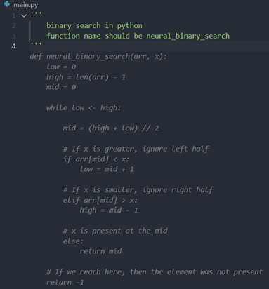

# Build MegaService of CodeGen on Gaudi

This document outlines the deployment process for a CodeGen application utilizing the [GenAIComps](https://github.com/opea-project/GenAIComps.git) microservice pipeline on Intel Gaudi2 server. The steps include Docker images creation, container deployment via Docker Compose, and service execution to integrate microservices such as `llm`. We will publish the Docker images to the Docker Hub soon, further simplifying the deployment process for this service.

The default pipeline deploys with vLLM as the LLM serving component. It also provides options of using TGI backend for LLM microservice.

## 🚀 Start MicroServices and MegaService

The CodeGen megaservice manages a several microservices including 'Embedding MicroService', 'Retrieval MicroService' and 'LLM MicroService' within a Directed Acyclic Graph (DAG). In the diagram below, the LLM microservice is a language model microservice that generates code snippets based on the user's input query. The TGI service serves as a text generation interface, providing a RESTful API for the LLM microservice. Data Preparation allows users to save/update documents or online resources to the vector database. Users can upload files or provide URLs, and manage their saved resources. The CodeGen Gateway acts as the entry point for the CodeGen application, invoking the Megaservice to generate code snippets in response to the user's input query.

The mega flow of the CodeGen application, from user's input query to the application's output response, is as follows:


### Setup Environment Variables

Since the `compose.yaml` will consume some environment variables, you need to setup them in advance as below.

1. set the host_ip and huggingface token

> [!NOTE]
> Please replace the `your_ip_address` with you external IP address, do not use `localhost`.

```bash
export host_ip=${your_ip_address}
export HUGGINGFACEHUB_API_TOKEN=you_huggingface_token
```

2. Set Network Proxy

**If you access public network through proxy, set the network proxy, otherwise, skip this step**

```bash
export no_proxy=${no_proxy},${host_ip}
export http_proxy=${your_http_proxy}
export https_proxy=${your_https_proxy}
```

### Start the Docker Containers for All Services

Find the corresponding [compose.yaml](./compose.yaml). User could start CodeGen based on TGI or vLLM service:

```bash
cd GenAIExamples/CodeGen/docker_compose/intel/hpu/gaudi
```

#### TGI service:

```bash
docker compose --profile codegen-gaudi-tgi up -d
```

Then run the command `docker images`, you will have the following Docker images:

- `ghcr.io/huggingface/text-embeddings-inference:cpu-1.5`
- `ghcr.io/huggingface/text-generation-inference:2.4.0-intel-cpu`
- `opea/codegen-gradio-ui`
- `opea/codegen`
- `opea/dataprep`
- `opea/embedding`
- `opea/llm-textgen`
- `opea/retriever`
- `redis/redis-stack`

#### vLLM service:

```bash
docker compose --profile codegen-gaudi-vllm up -d
```

Then run the command `docker images`, you will have the following Docker images:

- `ghcr.io/huggingface/text-embeddings-inference:cpu-1.5`
- `ghcr.io/huggingface/text-generation-inference:2.4.0-intel-cpu`
- `opea/codegen-gradio-ui`
- `opea/codegen`
- `opea/dataprep`
- `opea/embedding`
- `opea/llm-textgen`
- `opea/retriever`
- `redis/redis-stack`
- `opea/vllm`

Refer to the [Gaudi Guide](./README.md) to build docker images from source.

### Building the Docker image locally

Should the Docker image you seek not yet be available on Docker Hub, you can build the Docker image locally.
In order to build the Docker image locally follow the instrustion provided below.

#### Build the MegaService Docker Image

To construct the Mega Service, we utilize the [GenAIComps](https://github.com/opea-project/GenAIComps.git) microservice pipeline within the `codegen.py` Python script. Build the MegaService Docker image via the command below:

```bash
git clone https://github.com/opea-project/GenAIExamples
cd GenAIExamples/CodeGen
docker build -t opea/codegen:latest --build-arg https_proxy=$https_proxy --build-arg http_proxy=$http_proxy -f Dockerfile .
```

#### Build the UI Gradio Image

Build the frontend Gradio image via the command below:

```bash
cd GenAIExamples/CodeGen/ui
docker build -t opea/codegen-gradio-ui:latest --build-arg https_proxy=$https_proxy --build-arg http_proxy=$http_proxy -f docker/Dockerfile.gradio .
```

#### Dataprep Microservice with Redis

Follow the instrustion provided here: [opea/dataprep](https://github.com/MSCetin37/GenAIComps/blob/main/comps/dataprep/src/README_redis.md)

#### Embedding Microservice with TEI

Follow the instrustion provided here: [opea/embedding](https://github.com/MSCetin37/GenAIComps/blob/main/comps/embeddings/src/README_tei.md)

#### LLM text generation Microservice

Follow the instrustion provided here: [opea/llm-textgen](https://github.com/MSCetin37/GenAIComps/tree/main/comps/llms/src/text-generation)

#### Retriever Microservice

Follow the instrustion provided here: [opea/retriever](https://github.com/MSCetin37/GenAIComps/blob/main/comps/retrievers/src/README_redis.md)

#### Start Redis server

Follow the instrustion provided here: [redis/redis-stack](https://github.com/MSCetin37/GenAIComps/tree/main/comps/third_parties/redis/src)

### Validate the MicroServices and MegaService

1. LLM Service (for TGI, vLLM)

   ```bash
   curl http://${host_ip}:8028/v1/chat/completions \
       -X POST \
       -H 'Content-Type: application/json' \
       -d '{"model": "Qwen/Qwen2.5-Coder-7B-Instruct", "messages": [{"role": "user", "content": "Implement a high-level API for a TODO list application. The API takes as input an operation request and updates the TODO list in place. If the request is invalid, raise an exception."}], "max_tokens":32}'

   ```

2. LLM Microservices

   ```bash
   curl http://${host_ip}:9000/v1/chat/completions\
     -X POST \
     -H 'Content-Type: application/json' \
     -d '{"query":"Implement a high-level API for a TODO list application. The API takes as input an operation request and updates the TODO list in place. If the request is invalid, raise an exception.","max_tokens":256,"top_k":10,"top_p":0.95,"typical_p":0.95,"temperature":0.01,"repetition_penalty":1.03,"stream":true}'
   ```

3. Dataprep Microservice

   Make sure to replace the file name placeholders with your correct file name

   ```bash
   curl http://${host_ip}:6007/v1/dataprep/ingest \
   -X POST \
   -H "Content-Type: multipart/form-data" \
   -F "files=@./file1.pdf" \
   -F "files=@./file2.txt" \
   -F "index_name=my_API_document"
   ```

4. MegaService

   ```bash
   curl http://${host_ip}:7778/v1/codegen \
     -H "Content-Type: application/json" \
     -d '{"messages": "Implement a high-level API for a TODO list application. The API takes as input an operation request and updates the TODO list in place. If the request is invalid, raise an exception."}'
   ```

   CodeGen service with RAG and Agents activated based on an index.

   ```bash
   curl http://${host_ip}$:7778/v1/codegen \
     -H "Content-Type: application/json" \
     -d '{"agents_flag": "True", "index_name": "my_API_document", "messages": "Implement a high-level API for a TODO list application. The API takes as input an operation request and updates the TODO list in place. If the request is invalid, raise an exception."}'
   ```

## 🚀 Launch the Gradio Based UI (Recommended)

To access the Gradio frontend URL, follow the steps in [this README](../../../../ui/gradio/README.md)

Code Generation Tab


Resource Management Tab


Uploading a Knowledge Index


Here is an example of running a query in the Gradio UI using an Index:


## 🚀 Launch the Svelte Based UI (Optional)

To access the frontend, open the following URL in your browser: `http://{host_ip}:5173`. By default, the UI runs on port 5173 internally. If you prefer to use a different host port to access the frontend, you can modify the port mapping in the `compose.yaml` file as shown below:

```yaml
  codegen-gaudi-ui-server:
    image: opea/codegen-ui:latest
    ...
    ports:
      - "80:5173"
```


## 🚀 Launch the React Based UI (Optional)

To access the React-based frontend, modify the UI service in the `compose.yaml` file. Replace `codegen-gaudi-ui-server` service with the `codegen-gaudi-react-ui-server` service as per the config below:

```yaml
codegen-gaudi-react-ui-server:
  image: ${REGISTRY:-opea}/codegen-react-ui:${TAG:-latest}
  container_name: codegen-gaudi-react-ui-server
  environment:
    - no_proxy=${no_proxy}
    - https_proxy=${https_proxy}
    - http_proxy=${http_proxy}
    - APP_CODE_GEN_URL=${BACKEND_SERVICE_ENDPOINT}
  depends_on:
    - codegen-gaudi-backend-server
  ports:
    - "5174:80"
  ipc: host
  restart: always
```


## Install Copilot VSCode extension from Plugin Marketplace as the frontend

In addition to the Svelte UI, users can also install the Copilot VSCode extension from the Plugin Marketplace as the frontend.

Install `Neural Copilot` in VSCode as below.


### How to Use

#### Service URL Setting

Please adjust the service URL in the extension settings based on the endpoint of the CodeGen backend service.


#### Customize

The Copilot enables users to input their corresponding sensitive information and tokens in the user settings according to their own needs. This customization enhances the accuracy and output content to better meet individual requirements.


#### Code Suggestion

To trigger inline completion, you'll need to type `# {your keyword} (start with your programming language's comment keyword, like // in C++ and # in python)`. Make sure the `Inline Suggest` is enabled from the VS Code Settings.
For example:


To provide programmers with a smooth experience, the Copilot supports multiple ways to trigger inline code suggestions. If you are interested in the details, they are summarized as follows:

- Generate code from single-line comments: The simplest way introduced before.
- Generate code from consecutive single-line comments:


- Generate code from multi-line comments, which will not be triggered until there is at least one `space` outside the multi-line comment):



- Automatically complete multi-line comments:


### Chat with AI assistant

You can start a conversation with the AI programming assistant by clicking on the robot icon in the plugin bar on the left:


Then you can see the conversation window on the left, where you can chat with the AI assistant:


There are 4 areas worth noting as shown in the screenshot above:

1. Enter and submit your question
2. Your previous questions
3. Answers from AI assistant (Code will be highlighted properly according to the programming language it is written in, also support stream output)
4. Copy or replace code with one click (Note that you need to select the code in the editor first and then click "replace", otherwise the code will be inserted)

You can also select the code in the editor and ask the AI assistant questions about the code directly.
For example:

- Select code


- Ask question and get answer


