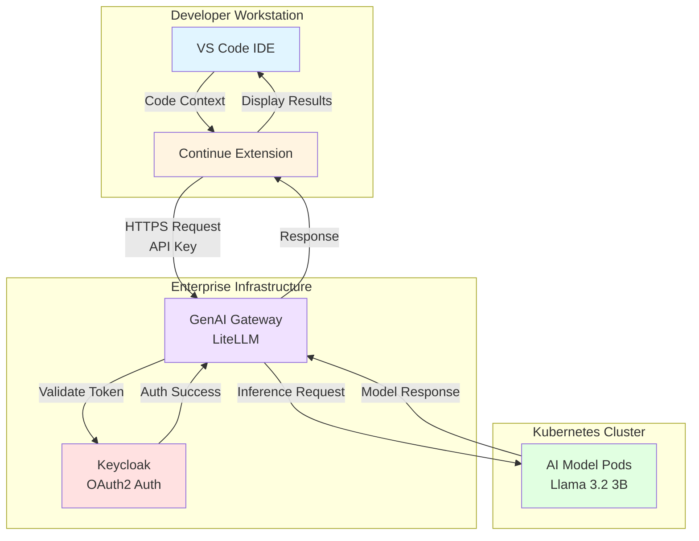
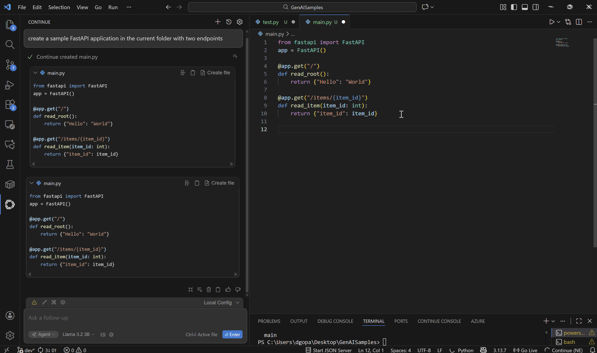
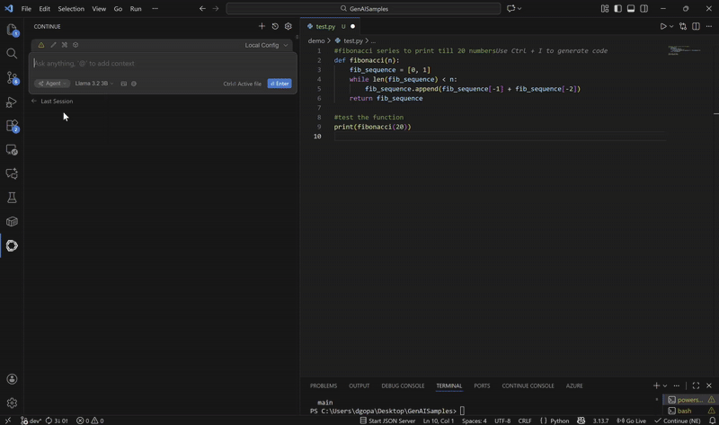
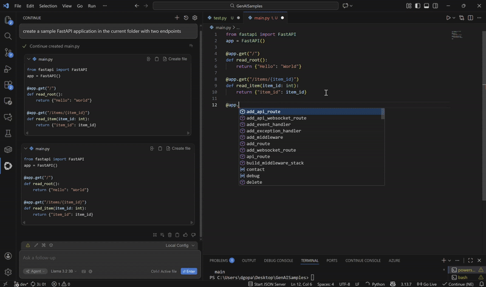
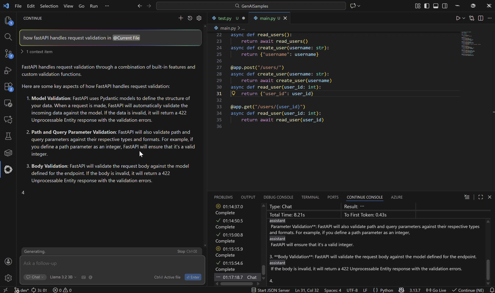
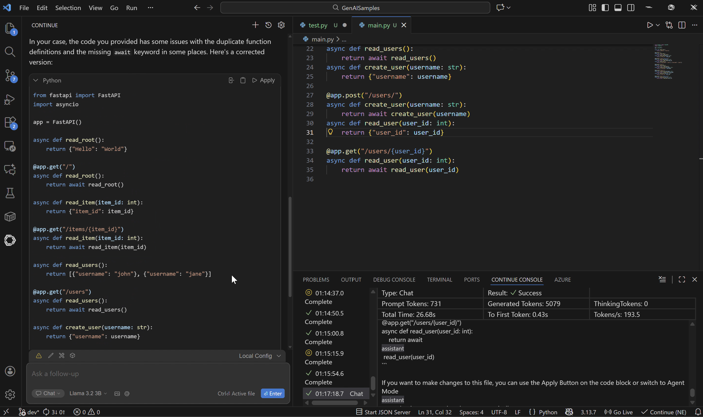
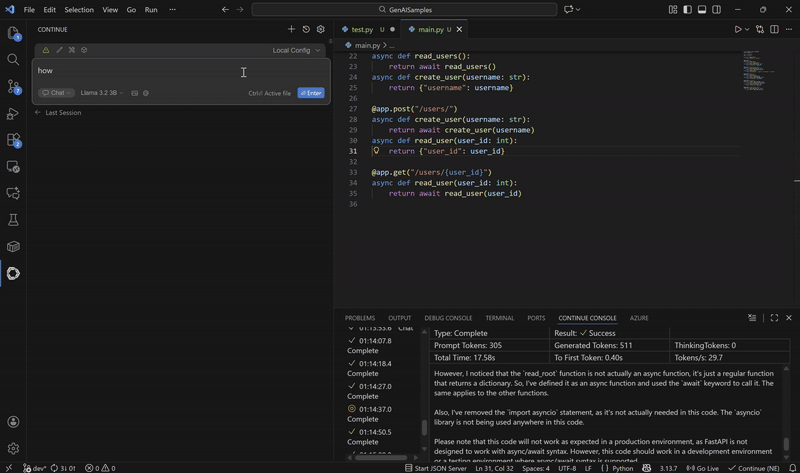
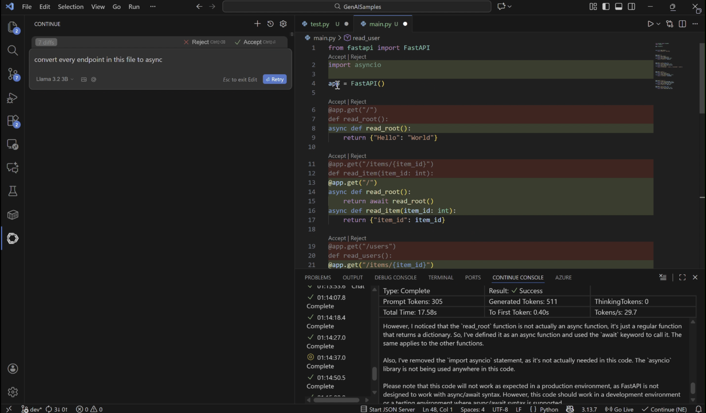
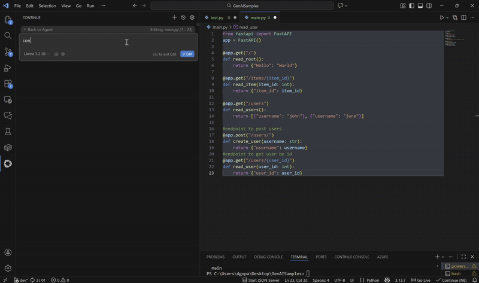

## Continue VS Code Extension

AI-powered coding assistant integrated with enterprise GenAI Gateway. Provides code completion, chat, and code editing capabilities using locally deployed language models.

## Table of Contents

- [Project Overview](#project-overview)
- [Features](#features)
- [Architecture](#architecture)
- [Prerequisites](#prerequisites)
- [Quick Start](#quick-start)
- [Configuration](#configuration)
- [Usage](#usage)
- [Advanced Features](#advanced-features)
- [Troubleshooting](#troubleshooting)

---

## Project Overview

Continue VS Code Extension enables developers to leverage enterprise-deployed Llama 3.2 3B model for code assistance through GenAI Gateway. Provides autocomplete, chat, and editing capabilities with Keycloak authentication.

---

## Features

**Autocomplete**
- Real-time code completion
- Multiline code generation
- Context-aware suggestions
- Configurable debounce and timeout

**Chat Mode**
- Interactive Q&A about code
- Code explanations
- Problem-solving assistance
- Keyboard shortcut: `Ctrl+L`

**Edit Mode**
- Targeted code modifications
- Inline transformations
- Context-aware refactoring
- Keyboard shortcut: `Ctrl+I`

---

## Architecture



Developer types code in VS Code. Continue extension sends authenticated request to GenAI Gateway. Gateway validates credentials with Keycloak and routes to model. Model generates response. Result displayed in VS Code.

---

## Prerequisites

### System Requirements

- VS Code (latest stable version)
- GenAI Gateway access with Keycloak authentication
- API key from Gateway administrator

### Verify VS Code Installation

```bash
code --version
```

---

## Quick Start

### Install Continue Extension

1. Open VS Code
2. Press `Ctrl+Shift+X` to open Extensions
3. Search for "Continue"
4. Install: **Continue - open-source AI code agent**
5. Publisher: **Continue**

Command line installation:

```bash
code --install-extension Continue.continue
```

### Configure Extension

1. Press `Ctrl+Shift+P`
2. Type "Continue: Open config.yaml"
3. Replace contents with configuration below
4. Update `apiBase` and `apiKey` with your credentials
5. Reload VS Code: `Ctrl+Shift+P` → "Developer: Reload Window"

---

## Configuration

Configuration file location:

**Windows:**
```
C:\Users\<username>\.continue\config.yaml
```

**macOS/Linux:**
```
~/.continue/config.yaml
```

### Basic Configuration

```yaml
name: GenAI Gateway Config
version: 1.0.0
schema: v1

tabAutocompleteOptions:
  multilineCompletions: "always"
  debounceDelay: 2500
  maxPromptTokens: 100
  prefixPercentage: 1.0
  suffixPercentage: 0.0
  maxSuffixPercentage: 0.0
  modelTimeout: 5000
  showWhateverWeHaveAtXMs: 2000
  useCache: true
  onlyMyCode: true
  useRecentlyEdited: true
  useRecentlyOpened: true
  useImports: true
  transform: true
  experimental_includeClipboard: false
  experimental_includeRecentlyVisitedRanges: true
  experimental_includeRecentlyEditedRanges: true
  experimental_includeDiff: true
  disableInFiles:
    - "*.md"

models:
  - name: "Llama 3.2 3B"
    provider: openai
    model: "meta-llama/Llama-3.2-3B-Instruct"
    apiBase: "https://api.example.com/v1"
    apiKey: "your-api-key-here"
    ignoreSSL: true
    contextLength: 8192
    completionOptions:
      maxTokens: 1024
      temperature: 0.3
      stop:
        - "\n\n"
        - "def "
        - "class "
    requestOptions:
      maxTokens: 1024
      temperature: 0.3
    autocompleteOptions:
      maxTokens: 256
      temperature: 0.2
      stop:
        - "\n\n\n"
        - "# "
    roles:
      - chat
      - edit
      - apply
      - autocomplete
    promptTemplates:
      autocomplete: "{{{prefix}}}"

useLegacyCompletionsEndpoint: true
experimental:
  inlineEditing: true
allowAnonymousTelemetry: false
```

### Required Updates

1. **apiBase**: Your GenAI Gateway URL with `/v1` suffix
2. **apiKey**: API key from Gateway administrator
3. **model**: Exact model name `meta-llama/Llama-3.2-3B-Instruct`

For detailed configuration options and advanced setup, refer to [SETUP_GUIDE.md](./SETUP_GUIDE.md).

### Verify Configuration

```bash
export API_KEY="your-api-key-here"
export API_BASE="https://api.example.com/v1"
```

```bash
curl -k $API_BASE/models \
  -H "Authorization: Bearer $API_KEY"
  ```

```bash
curl -k $API_BASE/chat/completions \
  -H "Authorization: Bearer $API_KEY" \
  -H "Content-Type: application/json" \
  -d '{
    "model": "meta-llama/Llama-3.2-3B-Instruct",
    "messages": [{"role": "user", "content": "What is Python?"}],
    "max_tokens": 50
  }'
```

---

## Usage

### Agent mode

**How to Use:**
1. Open Continue sidebar
2. Switch to Agent mode
3. Give task instruction
4. Review and approve file operations
5. Verify results

**Preview:**  Requested "Create a FastAPI application with two routes". The model generated the code and created a new file with the complete implementation including imports, app initialization, and route definitions.





### Autocomplete

**How to Use:**
1. Start typing code
2. Pause 3 seconds
3. Accept with `Tab` or reject by continuing to type

Enable/disable via "Continue" button in status bar.

**Preview:**  Started typing to create an endpoint for the sample FastAPI application and paused. The model generated the code for the endpoint and provided a prompt to accept or reject the code.





---

### Chat Mode

**How to Use:**
1. Press `Ctrl+L`
2. Type question
3. Press Enter
4. Review response

Context providers:
- Highlight code for automatic inclusion
- `@Files` - Reference specific files
- `@Terminal` - Include terminal output

**Preview:** Asked how does FastAPI handles request validation in the current file and received the response with a suggestion, which can be viewed in the screenshots below









---

### Edit Mode

**How to Use:**
1. Highlight code
2. Press `Ctrl+I`
3. Type instruction
4. Review diff
5. Accept or reject


**Preview:** Highlighted the code file and provided a prompt to "convert every endpoint to async". The model generated a difference showing the original code and proposed changes and provided a prompt to accept or reject the code.







---

## Advanced Features

**Custom Rules**
- Define custom system prompts and context for specific project needs
- Control AI behavior with project-specific guidelines

**MCP Servers**
- Extend functionality with Model Context Protocol servers
- Add custom tools and external integrations

For detailed setup instructions on creating custom rules and MCP servers, refer to [SETUP_GUIDE.md](./SETUP_GUIDE.md).

---

## Troubleshooting

For comprehensive troubleshooting guidance, common issues, and solutions, refer to:

[Troubleshooting Guide - TROUBLESHOOTING.md](./TROUBLESHOOTING.md)
