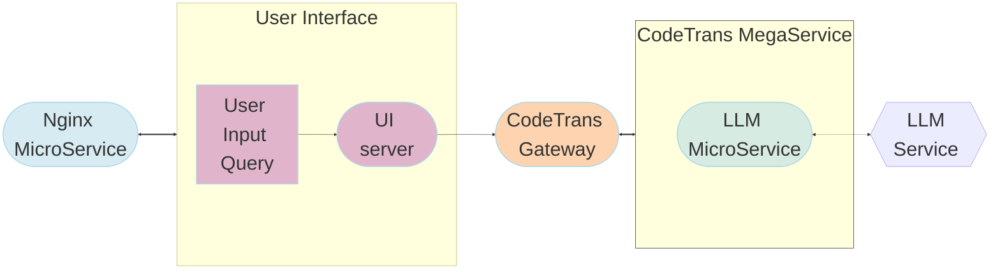

# Code Translation Application

Code translation is the process of converting code written in one programming language to another programming language while maintaining the same functionality. This process is also known as code conversion, source-to-source translation, or transpilation. Code translation is often performed when developers want to take advantage of new programming languages, improve code performance, or maintain legacy systems. Some common examples include translating code from Python to Java, or from JavaScript to TypeScript.

## Table of Contents

1. [Architecture](#architecture)
2. [Deployment Options](#deployment-options)
3. [Monitoring and Tracing](./README_miscellaneous.md)

## Architecture

The CodeTrans application is an end-to-end workflow that leverages the capability of LLMs. The workflow falls into the following architecture:

The CodeTrans example is implemented using the component-level microservices defined in [GenAIComps](https://github.com/opea-project/GenAIComps). The flow chart below shows the information flow between different microservices for this example.

This Code Translation use case demonstrates Text Generation Inference across multiple platforms. Currently, we provide examples for [Intel Gaudi2](https://www.intel.com/content/www/us/en/products/details/processors/ai-accelerators/gaudi-overview.html) and [Intel Xeon Scalable Processors](https://www.intel.com/content/www/us/en/products/details/processors/xeon.html), and we invite contributions from other hardware vendors to expand OPEA ecosystem.

## Deployment Options

The table below lists currently available deployment options. They outline in detail the implementation of this example on selected hardware.

| Category               | Deployment Option    | Description                                                       |
| ---------------------- | -------------------- | ----------------------------------------------------------------- |
| On-premise Deployments | Docker compose       | [CodeTrans deployment on Xeon](./docker_compose/intel/cpu/xeon)   |
|                        |                      | [CodeTrans deployment on Gaudi](./docker_compose/intel/hpu/gaudi) |
|                        |                      | [CodeTrans deployment on AMD ROCm](./docker_compose/amd/gpu/rocm) |
|                        | Kubernetes           | [Helm Charts](./kubernetes/helm)                                  |
|                        |                      | [GMC](./kubernetes/gmc)                                           |
|                        | Azure                | Work-in-progress                                                  |
|                        | Intel Tiber AI Cloud | Work-in-progress                                                  |
