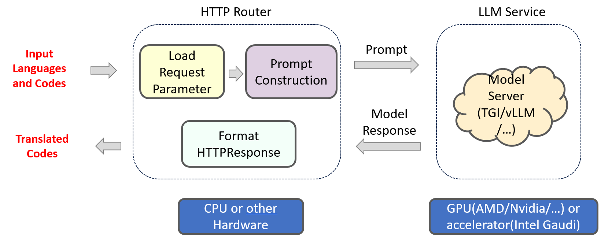

# Code Translation Application

Code translation is the process of converting code written in one programming language to another programming language while maintaining the same functionality. This process is also known as code conversion, source-to-source translation, or transpilation. Code translation is often performed when developers want to take advantage of new programming languages, improve code performance, or maintain legacy systems. Some common examples include translating code from Python to Java, or from JavaScript to TypeScript.

The workflow falls into the following architecture:



This Code Translation use case uses Text Generation Inference on Intel Gaudi2 or Intel Xeon Scalable Processor. The Intel Gaudi2 accelerator supports both training and inference for deep learning models in particular for LLMs. Visit [Habana AI products](https://habana.ai/products) for more details.

## Deploy Code Translation Service

The Code Translation service can be effortlessly deployed on either Intel Gaudi2 or Intel Xeon Scalable Processor.

Currently we support two ways of deploying Code Translation services on docker:

1. Start services using the docker image on `docker hub`:

   ```bash
   docker pull opea/codetrans:latest
   ```

2. Start services using the docker images `built from source`: [Guide](./docker)

### Setup Environment Variable

To set up environment variables for deploying Code Translation services, follow these steps:

1. Set the required environment variables:

   ```bash
   # Example: host_ip="192.168.1.1"
   export host_ip="External_Public_IP"
   # Example: no_proxy="localhost, 127.0.0.1, 192.168.1.1"
   export no_proxy="Your_No_Proxy"
   export HUGGINGFACEHUB_API_TOKEN="Your_Huggingface_API_Token"
   ```

2. If you are in a proxy environment, also set the proxy-related environment variables:

   ```bash
   export http_proxy="Your_HTTP_Proxy"
   export https_proxy="Your_HTTPs_Proxy"
   ```

3. Set up other environment variables:

   ```bash
   source ./docker/set_env.sh
   ```

### Deploy with Docker

#### Deploy Code Translation on Gaudi

Find the corresponding [compose.yaml](./docker/gaudi/compose.yaml).

```bash
cd GenAIExamples/CodeTrans/docker/gaudi
docker compose up -d
```

> Notice: Currently only the **Habana Driver 1.16.x** is supported for Gaudi.

Refer to the [Gaudi Guide](./docker/gaudi/README.md) to build docker images from source.

#### Deploy Code Translation on Xeon

Find the corresponding [compose.yaml](./docker/xeon/compose.yaml).

```bash
cd GenAIExamples/CodeTrans/docker/xeon
docker compose up -d
```

Refer to the [Xeon Guide](./docker/xeon/README.md) for more instructions on building docker images from source.

### Deploy using Kubernetes with GMC

Refer to the [Code Translation Kubernetes Guide](./kubernetes/README.md)

### Deploy using Kubernetes without GMC

Refer to the [Code Translation Kubernetes Guide](./kubernetes/manifests/README.md)

### Deploy CodeTrans into Kubernetes using Helm Chart

Install Helm (version >= 3.15) first. Refer to the [Helm Installation Guide](https://helm.sh/docs/intro/install/) for more information.

Refer to the [CodeTrans helm chart](https://github.com/opea-project/GenAIInfra/tree/main/helm-charts/codetrans) for instructions on deploying CodeTrans into Kubernetes on Xeon & Gaudi.

## Consume Code Translation Service

Two ways of consuming Code Translation Service:

1. Use cURL command on terminal

   ```bash
   curl http://${host_ip}:7777/v1/codetrans \
       -H "Content-Type: application/json" \
       -d '{"language_from": "Golang","language_to": "Python","source_code": "package main\n\nimport \"fmt\"\nfunc main() {\n    fmt.Println(\"Hello, World!\");\n}"}'
   ```

2. Access via frontend

To access the frontend, open the following URL in your browser: http://{host_ip}:5173.

By default, the UI runs on port 5173 internally.

## Troubleshooting

1. If you get errors like "Access Denied", [validate micro service](https://github.com/opea-project/GenAIExamples/tree/main/CodeTrans/docker/xeon#validate-microservices) first. A simple example:

   ```bash
   http_proxy=""
   curl http://${host_ip}:8008/generate \
     -X POST \
     -d '{"inputs":"    ### System: Please translate the following Golang codes into  Python codes.    ### Original codes:    '\'''\'''\''Golang    \npackage main\n\nimport \"fmt\"\nfunc main() {\n    fmt.Println(\"Hello, World!\");\n    '\'''\'''\''    ### Translated codes:","parameters":{"max_new_tokens":17, "do_sample": true}}' \
     -H 'Content-Type: application/json'
   ```

2. (Docker only) If all microservices work well, check the port ${host_ip}:7777, the port may be allocated by other users, you can modify the `compose.yaml`.

3. (Docker only) If you get errors like "The container name is in use", change container name in `compose.yaml`.
