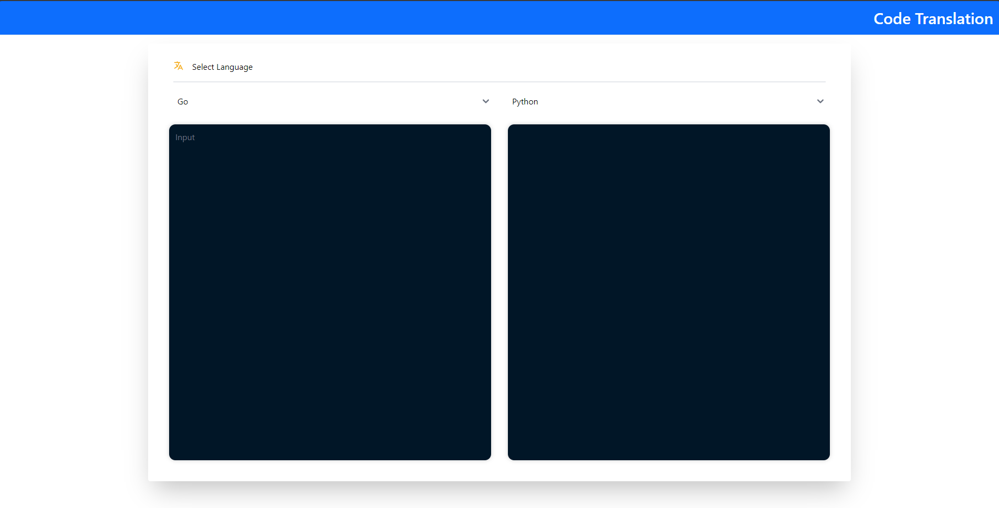
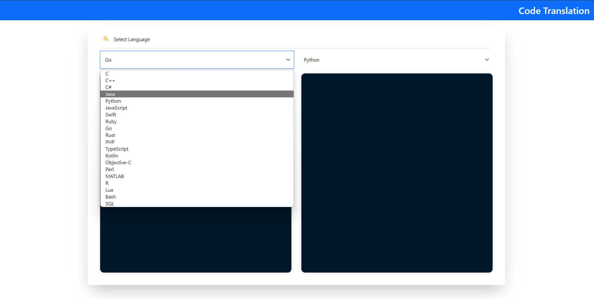
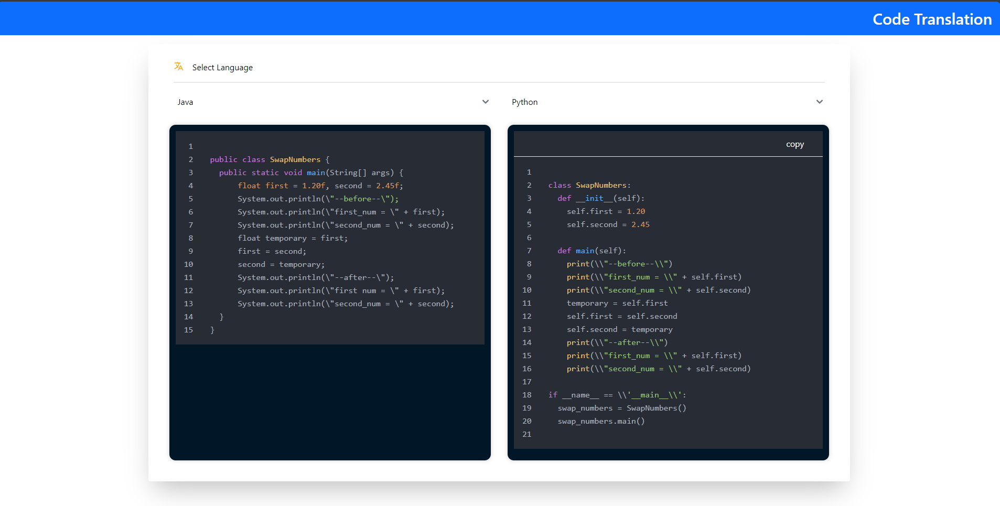

# Code Translation

## 📸 Project Screenshots





## 🧐 Features

Here're some of the project's features:

- Code Translation: The system is capable of recognizing multiple languages and converting the current code content into the desired language's code format, enabling a set of codes to be reused in multiple places, thus alleviating developers' development pressure.

## 🛠️ Get it Running

1. Clone the repo.

2. cd command to the current folder.

3. Modify the required .env variables.
   ```
   BASE_URL = ''
   ```
4. Execute `npm install` to install the corresponding dependencies.

5. Execute `npm run dev` in both environments
