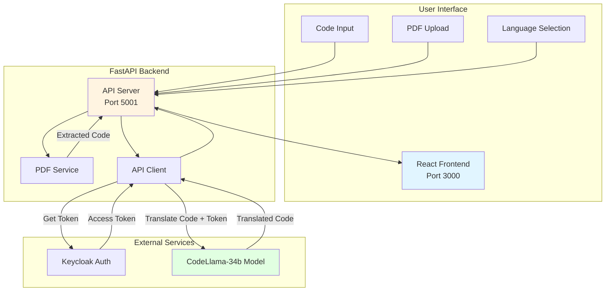
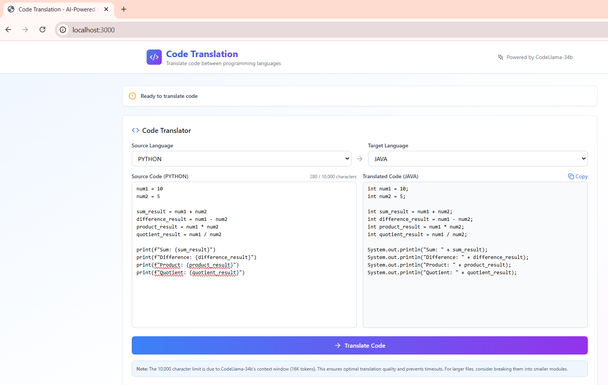

## Code Translation

A full-stack code translation application that converts code between programming languages using AI.
The system integrates a FastAPI backend powered by CodeLlama-34b-instruct, alongside a modern React + Vite + Tailwind CSS frontend for an intuitive translation experience.

## Table of Contents

- [Project Overview](#project-overview)
- [Features](#features)
- [Architecture](#architecture)
- [Prerequisites](#prerequisites)
- [Quick Start Deployment](#quick-start-deployment)
- [User Interface](#user-interface)
- [Troubleshooting](#troubleshooting)

---

## Project Overview

The **Code Translation** application demonstrates how large language models can be used to translate code between different programming languages. It accepts source code in one language, processes it through CodeLlama-34b-instruct, and returns translated code in the target language. This project integrates seamlessly with cloud-hosted APIs or local model endpoints, offering flexibility for research, enterprise, or educational use.

---

## Features

**Backend**

- Code translation between 6 languages (Java, C, C++, Python, Rust, Go)
- PDF code extraction with pattern recognition
- CodeLlama-34b-instruct for accurate translations
- Enterprise inference endpoints
- Keycloak authentication for secure API access
- Comprehensive error handling and logging
- File validation and size limits
- CORS enabled for web integration
- Health check endpoints
- Modular architecture (config + models + services)

**Frontend**

- Side-by-side code comparison interface
- Language selection dropdowns (6 languages)
- PDF file upload with drag-and-drop support
- Real-time character counter with limits
- Modern, responsive design with Tailwind CSS
- Built with Vite for fast development
- Live status updates
- Copy to clipboard functionality
- Mobile-friendly

---

## Architecture

Below is the architecture as it consists of a server that waits for code input or PDF uploads. Once code is provided, the server calls the CodeLlama model to translate the code to the target language.



This application is built with enterprise inference capabilities using Keycloak for authentication and CodeLlama-34b-instruct for code translation.

**Service Components:**

1. **React Web UI (Port 3000)** -  Provides side-by-side code comparison interface with language selection, PDF upload, and real-time translation results

2. **FastAPI Backend (Port 5001)** -  Handles code validation, PDF extraction, Keycloak authentication, and orchestrates code translation through CodeLlama model

**Typical Flow:**

1. User enters code or uploads a PDF through the web UI.
2. The backend validates the input and extracts code if needed.
3. The backend authenticates with Keycloak and calls CodeLlama model.
4. The model translates the code to the target language.
5. The translated code is returned and displayed to the user.
6. User can copy the translated code with one click.

---

## Prerequisites

### System Requirements

Before you begin, ensure you have the following installed:

- **Docker and Docker Compose**
- **Enterprise inference endpoint access** (Keycloak authentication)

### Verify Docker Installation

```bash
# Check Docker version
docker --version

# Check Docker Compose version
docker compose version

# Verify Docker is running
docker ps
```
---

## Quick Start Deployment

### Clone the Repository

```bash
git clone https://github.com/cld2labs/GenAISamples.git
cd GenAISamples/code-translation
```

### Set up the Environment

This application requires an `.env` file in the root directory for proper configuration. Create it with the commands below:

```bash
# Create the .env file
cat > .env << EOF
# Backend API Configuration
BACKEND_PORT=5001

# Required - Enterprise/Keycloak Configuration
BASE_URL=https://api.example.com
KEYCLOAK_CLIENT_ID=api
KEYCLOAK_CLIENT_SECRET=your_client_secret

# Required - Model Configuration
INFERENCE_MODEL_ENDPOINT=CodeLlama-34b-Instruct-hf
INFERENCE_MODEL_NAME=codellama/CodeLlama-34b-Instruct-hf

# LLM Settings
LLM_TEMPERATURE=0.2
LLM_MAX_TOKENS=4096

# Code Translation Settings
MAX_CODE_LENGTH=10000
MAX_FILE_SIZE=10485760

# CORS Configuration
CORS_ALLOW_ORIGINS=["http://localhost:5173", "http://localhost:3000"]
EOF
```

Or manually create `.env` with:

```bash
# Backend API Configuration
BACKEND_PORT=5001

# Required - Enterprise/Keycloak Configuration
BASE_URL=https://api.example.com
KEYCLOAK_CLIENT_ID=api
KEYCLOAK_CLIENT_SECRET=your_client_secret

# Required - Model Configuration
INFERENCE_MODEL_ENDPOINT=CodeLlama-34b-Instruct-hf
INFERENCE_MODEL_NAME=codellama/CodeLlama-34b-Instruct-hf

# LLM Settings
LLM_TEMPERATURE=0.2
LLM_MAX_TOKENS=4096

# Code Translation Settings
MAX_CODE_LENGTH=10000
MAX_FILE_SIZE=10485760

# CORS Configuration
CORS_ALLOW_ORIGINS=["http://localhost:5173", "http://localhost:3000"]
```

**Note**: The docker-compose.yaml file automatically loads environment variables from `.env` for the backend service.

### Running the Application

Start both API and UI services together with Docker Compose:

```bash
# From the rag-chatbot directory
docker compose up --build

# Or run in detached mode (background)
docker compose up -d --build
```

The API will be available at: `http://localhost:5001`  
The UI will be available at: `http://localhost:3000`

**View logs**:

```bash
# All services
docker compose logs -f

# Backend only
docker compose logs -f backend

# Frontend only
docker compose logs -f frontend
```

**Verify the services are running**:

```bash
# Check API health
curl http://localhost:5001/health

# Check if containers are running
docker compose ps
```

## User Interface

**Using the Application**

Make sure you are at the localhost:3000 url

You will be directed to the main page which has each feature



The interface provides:

Translate code:

- Select source language from dropdown (Java, C, C++, Python, Rust, Go)
- Select target language from dropdown
- Enter or paste your code in the left textarea
- Click "Translate Code" button
- View translated code in the right textarea
- Click "Copy" to copy the result

Upload a PDF:

- Scroll to the "Alternative: Upload PDF" section
- Drag and drop a PDF file, or
- Click "browse" to select a file
- Wait for code extraction to complete
- Extracted code appears in the source code box

**UI Configuration**

When running with Docker Compose, the UI automatically connects to the backend API. The frontend is available at `http://localhost:3000` and the API at `http://localhost:5001`.


For production deployments, you may want to configure a reverse proxy or update the API URL in the frontend configuration.

### Stopping the Application


```bash
docker compose down
```

---

## Troubleshooting

For comprehensive troubleshooting guidance, common issues, and solutions, refer to:

[Troubleshooting Guide - TROUBLESHOOTING.md](./TROUBLESHOOTING.md)
