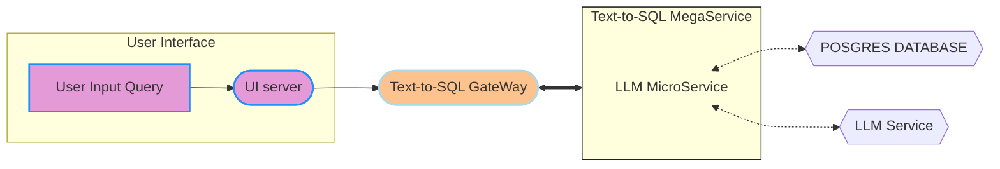

# DBQnA Application

Experience a revolutionary way to interact with your database using our DBQnA app! Harnessing the power of OPEA microservices, our application seamlessly translates natural language queries into SQL and delivers real-time database results, all designed to optimize workflows and enhance productivity for modern enterprises.

---

---

## 🛠️ Key Features

### 💬 SQL Query Generation

The key feature of DBQnA app is that it converts a user's natural language query into an SQL query and automatically executes the generated SQL query on the database to return the relevant results. BAsically ask questions to database, receive corresponding SQL query and real-time query execution output, all without needing any SQL knowledge.

---

## 📚 Setup Guide

- **[Xeon Guide](./docker_compose/intel/cpu/xeon/README.md)**: Instructions to build Docker images from source and run the application via Docker Compose.
