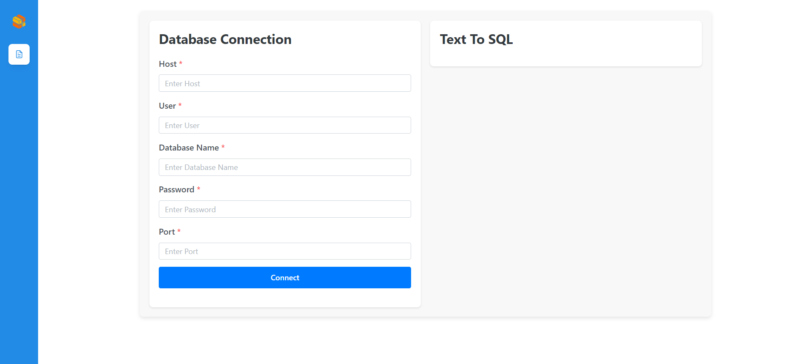
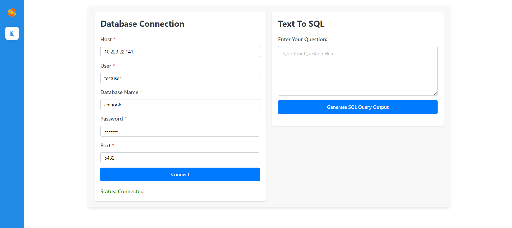
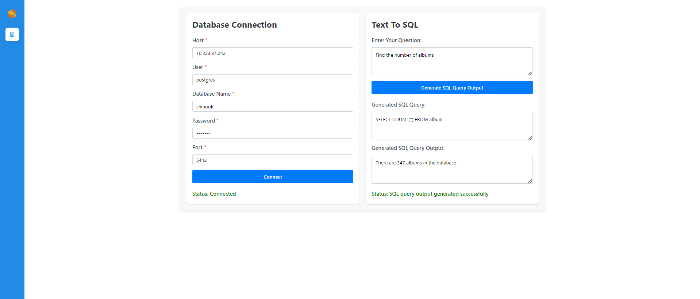

# Deploy on Intel Xeon Processor

This document outlines the deployment process for DBQnA application which helps generating a SQL query and its output given a NLP question, utilizing the [GenAIComps](https://github.com/opea-project/GenAIComps.git) microservice pipeline on an Intel Xeon server. The steps include Docker image creation, container deployment via Docker Compose, and service execution to integrate microservices. We will publish the Docker images to Docker Hub soon, which will simplify the deployment process for this service.

## 🚀 Build Docker Images

First of all, you need to build Docker Images locally. This step can be ignored once the Docker images are published to Docker hub.

### 1.1 Build Text to SQL service Image

```bash
git clone https://github.com/opea-project/GenAIComps.git
cd GenAIComps
docker build --no-cache -t opea/text2sql:comps -f comps/text2sql/src/Dockerfile .

```

### 1.2 Build react UI Docker Image

Build the frontend Docker image based on react framework via below command:

```bash
cd GenAIExamples/DBQnA/ui
docker build --no-cache -t opea/text2sql-react-ui:latest -f docker/Dockerfile.react .

```

Then run the command `docker images`, you will have the following Docker Images:

1. `opea/text2sql:latest`
2. `opea/dbqna-react-ui:latest`

## 🚀 Start Microservices

### Required Models

We set default model as "mistralai/Mistral-7B-Instruct-v0.3", change "LLM_MODEL_ID" in following Environment Variables setting if you want to use other models.

If use gated models, you also need to provide [huggingface token](https://huggingface.co/docs/hub/security-tokens) to "HUGGINGFACEHUB_API_TOKEN" environment variable.

```bash
export HUGGINGFACEHUB_API_TOKEN="xxx"
```

### 2.1 Setup Environment Variables

Since the `compose.yaml` will consume some environment variables, you need to setup them in advance as below.

```bash
# host_ip should be your external IP address, do not use localhost.
export host_ip=$(hostname -I | awk '{print $1}')

# Example: no_proxy="localhost,127.0.0.1,192.168.1.1"
export no_proxy=${no_proxy},${host_ip}

# If you are in a proxy environment, also set the proxy-related environment variables:
export http_proxy=${http_proxy}
export https_proxy=${https_proxy}

# Set other required variables

export TGI_PORT=8008
export TGI_LLM_ENDPOINT=http://${host_ip}:${TGI_PORT}
export HF_TOKEN=${HUGGINGFACEHUB_API_TOKEN}
export LLM_MODEL_ID="mistralai/Mistral-7B-Instruct-v0.3"
export POSTGRES_USER=postgres
export POSTGRES_PASSWORD=testpwd
export POSTGRES_DB=chinook
export text2sql_port=9090
```

or
edit the file set_env.sh to set those environment variables,

```bash
source set_env.sh
```

Note: Please replace with `host_ip` with your external IP address, do not use localhost.

### 2.2 Start Microservice Docker Containers

There are 2 options to start the microservice

#### 2.2.1 Start the microservice using docker compose

```bash
cd GenAIExamples/DBQnA/docker_compose/intel/cpu/xeon
docker compose up -d
```

#### 2.2.2 Alternatively we can start the microservices by running individual docker services

**NOTE:** Make sure all the individual docker services are down before starting them.

Below are the commands to start each of the docker service individually

- Start PostgresDB Service

We will use [Chinook](https://github.com/lerocha/chinook-database) sample database as a default to test the Text-to-SQL microservice. Chinook database is a sample database ideal for demos and testing ORM tools targeting single and multiple database servers.

```bash

docker run --name test-text2sql-postgres --ipc=host -e POSTGRES_USER=${POSTGRES_USER} -e POSTGRES_HOST_AUTH_METHOD=trust -e POSTGRES_DB=${POSTGRES_DB} -e POSTGRES_PASSWORD=${POSTGRES_PASSWORD} -p 5442:5432 -d -v $WORKPATH/comps/text2sql/langchain/chinook.sql:/docker-entrypoint-initdb.d/chinook.sql postgres:latest
```

- Start TGI Service

```bash

docker run -d --name="test-text2sql-tgi-endpoint" --ipc=host -p $TGI_PORT:80 -v ./data:/data --shm-size 1g -e HUGGINGFACEHUB_API_TOKEN=${HUGGINGFACEHUB_API_TOKEN} -e HF_TOKEN=${HF_TOKEN} -e model=${model} ghcr.io/huggingface/text-generation-inference:2.1.0 --model-id $model
```

- Start Text-to-SQL Service

```bash
unset http_proxy

docker run -d --name="test-text2sql-server" --ipc=host -p ${text2sql_port}:8090 --ipc=host -e http_proxy=$http_proxy -e https_proxy=$https_proxy -e TGI_LLM_ENDPOINT=$TGI_LLM_ENDPOINT opea/text2sql:latest
```

- Start React UI service

```bash
docker run -d --name="test-dbqna-react-ui-server" --ipc=host -p 5174:80 -e no_proxy=$no_proxy -e https_proxy=$https_proxy -e http_proxy=$http_proxy opea/dbqna-react-ui:latest
```

## 🚀 Validate Microservices

### 3.1 TGI Service

```bash

curl http://${host_ip}:$TGI_PORT/generate \
    -X POST \
    -d '{"inputs":"What is Deep Learning?","parameters":{"max_new_tokens":17, "do_sample": true}}' \
    -H 'Content-Type: application/json'
```

### 3.2 Postgres Microservice

Once Text-to-SQL microservice is started, user can use below command

#### 3.2.1 Test the Database connection

```bash
curl --location http://${host_ip}:9090/v1/postgres/health \
    --header 'Content-Type: application/json' \
    --data '{"user": "'${POSTGRES_USER}'","password": "'${POSTGRES_PASSWORD}'","host": "'${host_ip}'", "port": "5442", "database": "'${POSTGRES_DB}'"}'
```

#### 3.2.2 Invoke the microservice.

```bash
curl http://${host_ip}:9090/v1/text2sql\
    -X POST \
    -d '{"input_text": "Find the total number of Albums.","conn_str": {"user": "'${POSTGRES_USER}'","password": "'${POSTGRES_PASSWORD}'","host": "'${host_ip}'", "port": "5442", "database": "'${POSTGRES_DB}'"}}' \
    -H 'Content-Type: application/json'
```

### 3.3 Frontend validation

We test the API in frontend validation to check if API returns HTTP_STATUS: 200 and validates if API response returns SQL query and output

The test is present in App.test.tsx under react root folder ui/react/

Command to run the test

```bash
npm run test
```

## 🚀 Launch the React UI

Open this URL `http://{host_ip}:5174` in your browser to access the frontend.



Test DB Connection


Create SQL query and output for given NLP question

