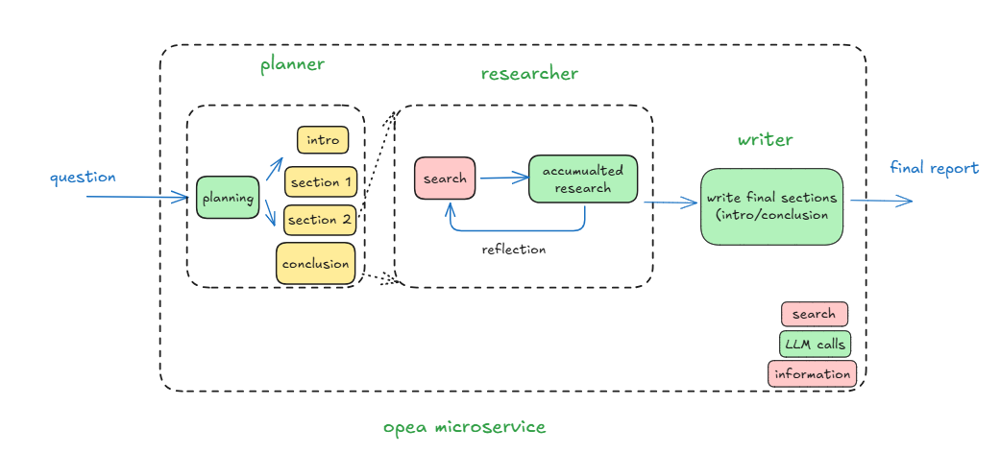

# Deep Research Agent Application

Deep Research Agents are a new class of autonomous AI systems designed to perform complex, multi-step research tasks that typically require human-level reasoning, planning, and synthesis.

## Overview

In this application, we leverage the deep research agent implementation of [langchain-ai/open_deep_research](https://github.com/langchain-ai/open_deep_research), and deploy it on the Intel platform with opea microserice.



## Setup Deployment Environment

```
# Configure deep_researcher.yaml with your llm model served by the vllm

# get your TAVILY_API_KEY from https://app.tavily.com/
export TAVILY_API_KEY=""
# get your HuggingFace Access Token from https://huggingface.co/docs/transformers.js/en/guides/private#step-1-generating-a-user-access-token
export HF_TOKEN=""

# set proxy if needed by your machine
export http_proxy=""
export https_proxy=""
export no_proxy=""

# the shell script will initialize the OPENAI_BASE_URL and OPENAI_API_KEY for the openai compatible vllm service
source ./set_env.sh
```

## Deploy the Services Using Docker Compose

To deploy the Deep Research Agent services, execute the docker compose up command with the appropriate arguments. For a default deployment, execute:

```
docker compose -f docker_compose/intel/hpu/gaudi/compose.yaml up -d

```

## Validate Microservice

```shell
curl http://${host_ip}:8022/v1/deep_research_agent \
    -X POST \
    -d '{"question":"What is Deep Learning?"}' \
    -H 'Content-Type: application/json'
```
