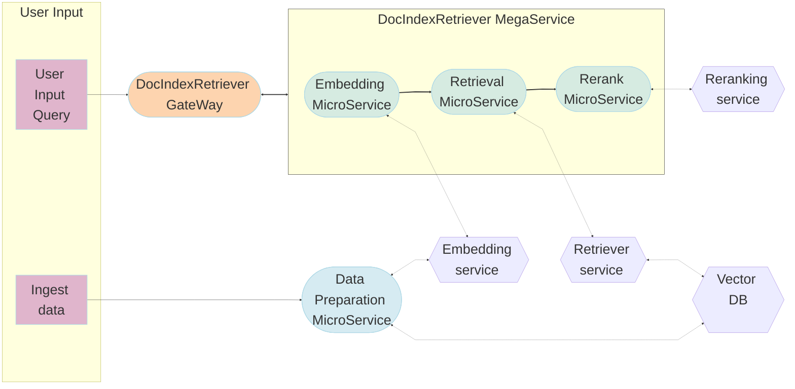

# DocRetriever Application

DocRetriever is the most widely adopted use case for leveraging the different methodologies to match user query against a set of free-text records. DocRetriever is essential to RAG system, which bridges the knowledge gap by dynamically fetching relevant information from external sources, ensuring that responses generated remain factual and current. The core of this architecture are vector databases, which are instrumental in enabling efficient and semantic retrieval of information. These databases store data as vectors, allowing RAG to swiftly access the most pertinent documents or data points based on semantic similarity.

The DocIndexRetriever example is implemented using the component-level microservices defined in [GenAIComps](https://github.com/opea-project/GenAIComps). The flow chart below shows the information flow between different microservices for this example.



## We provided DocRetriever with different deployment infra

- [docker xeon version](docker_compose/intel/cpu/xeon/README.md) => minimum endpoints, easy to setup
- [docker gaudi version](docker_compose/intel/hpu/gaudi/README.md) => with extra tei_gaudi endpoint, faster

## We allow users to set retriever/reranker hyperparams via requests

Example usage:

```python
url = "http://{host_ip}:{port}/v1/retrievaltool".format(host_ip=host_ip, port=port)
payload = {
    "messages": query,
    "k": 5,  # retriever top k
    "top_n": 2,  # reranker top n
}
response = requests.post(url, json=payload)
```
