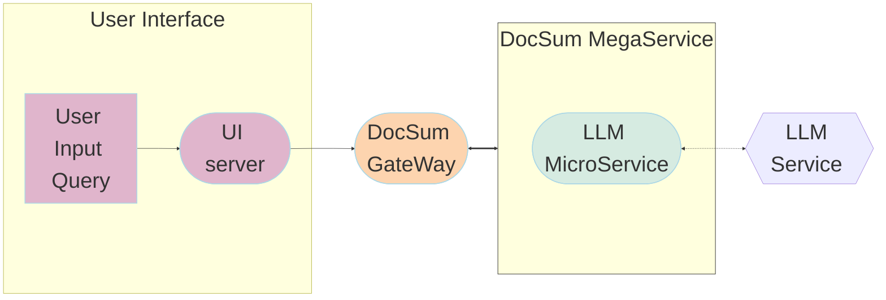

# Document Summarization Application

Large Language Models (LLMs) have revolutionized the way we interact with text. These models can be used to create summaries of news articles, research papers, technical documents, legal documents and other types of text. Suppose you have a set of documents (PDFs, Notion pages, customer questions, etc.) and you want to summarize the content. In this example use case, we utilize LangChain to implement summarization strategies and facilitate LLM inference using Text Generation Inference.

The architecture for document summarization will be illustrated/described below:


## Deploy Document Summarization Service

The Document Summarization service can be effortlessly deployed on either Intel Gaudi2 or Intel Xeon Scalable Processors.
Based on whether you want to use Docker or Kubernetes, follow the instructions below.

Currently we support two ways of deploying Document Summarization services with docker compose:

1. Start services using the docker image on `docker hub`:

   ```bash
   docker pull opea/docsum:latest
   ```

2. Start services using the docker images `built from source`: [Guide](https://github.com/opea-project/GenAIExamples/tree/main/DocSum/docker_compose)

### Required Models

We set default model as "Intel/neural-chat-7b-v3-3", change "LLM_MODEL_ID" in "docker_compose/set_env.sh" if you want to use other models.

```
export LLM_MODEL_ID="Intel/neural-chat-7b-v3-3"
```

If use gated models, you also need to provide [huggingface token](https://huggingface.co/docs/hub/security-tokens) to "HUGGINGFACEHUB_API_TOKEN" environment variable.

### Setup Environment Variable

To set up environment variables for deploying Document Summarization services, follow these steps:

1. Set the required environment variables:

   ```bash
   # Example: host_ip="192.168.1.1"
   export host_ip="External_Public_IP"
   # Example: no_proxy="localhost, 127.0.0.1, 192.168.1.1"
   export no_proxy="Your_No_Proxy"
   export HUGGINGFACEHUB_API_TOKEN="Your_Huggingface_API_Token"
   ```

2. If you are in a proxy environment, also set the proxy-related environment variables:

   ```bash
   export http_proxy="Your_HTTP_Proxy"
   export https_proxy="Your_HTTPs_Proxy"
   ```

3. Set up other environment variables:

   ```bash
   source ./docker_compose/set_env.sh
   ```

### Deploy using Docker

#### Deploy on Gaudi

Find the corresponding [compose.yaml](./docker_compose/intel/hpu/gaudi/compose.yaml).

```bash
cd GenAIExamples/DocSum/docker_compose/intel/hpu/gaudi/
docker compose -f compose.yaml up -d
```

Refer to the [Gaudi Guide](./docker_compose/intel/hpu/gaudi/README.md) to build docker images from source.

#### Deploy on Xeon

Find the corresponding [compose.yaml](./docker_compose/intel/cpu/xeon/compose.yaml).

```bash
cd GenAIExamples/DocSum/docker_compose/intel/cpu/xeon/
docker compose up -d
```

Refer to the [Xeon Guide](./docker_compose/intel/cpu/xeon/README.md) for more instructions on building docker images from source.

### Deploy using Kubernetes with GMC

Refer to [Kubernetes deployment](./kubernetes/intel/README_gmc.md)

### Deploy using Kubernetes without GMC

Refer to [Kubernetes deployment](./kubernetes/intel/README.md)

### Deploy DocSum into Kubernetes using Helm Chart

Install Helm (version >= 3.15) first. Refer to the [Helm Installation Guide](https://helm.sh/docs/intro/install/) for more information.

Refer to the [DocSum helm chart](https://github.com/opea-project/GenAIInfra/tree/main/helm-charts/docsum/README.md) for instructions on deploying DocSum into Kubernetes on Xeon & Gaudi.

### Workflow of the deployed Document Summarization Service

The DocSum example is implemented using the component-level microservices defined in [GenAIComps](https://github.com/opea-project/GenAIComps). The flow chart below shows the information flow between different microservices for this example.



## Consume Document Summarization Service

Two ways of consuming Document Summarization Service:

1. Use cURL command on terminal

   ```bash
   #Use English mode (default).
   curl http://${host_ip}:8888/v1/docsum \
       -H "Content-Type: multipart/form-data" \
       -F "messages=Text Embeddings Inference (TEI) is a toolkit for deploying and serving open source text embeddings and sequence classification models. TEI enables high-performance extraction for the most popular models, including FlagEmbedding, Ember, GTE and E5." \
       -F "max_tokens=32" \
       -F "language=en" \
       -F "stream=true"

   #Use Chinese mode.
   curl http://${host_ip}:8888/v1/docsum \
       -H "Content-Type: multipart/form-data" \
       -F "messages=2024年9月26日，北京——今日，英特尔正式发布英特尔® 至强® 6性能核处理器（代号Granite Rapids），为AI、数据分析、科学计算等计算密集型业务提供卓越性能。" \
       -F "max_tokens=32" \
       -F "language=zh" \
       -F "stream=true"
   ```

2. Access via frontend

   To access the frontend, open the following URL in your browser: http://{host_ip}:5173.

   By default, the UI runs on port 5173 internally.

## Troubleshooting

1. If you get errors like "Access Denied", [validate micro service](https://github.com/opea-project/GenAIExamples/tree/main/DocSum/docker_compose/intel/cpu/xeon/README.md#validate-microservices) first. A simple example:

   ```bash
   http_proxy=""
   curl http://${host_ip}:8008/generate \
     -X POST \
     -d '{"inputs":"What is Deep Learning?","parameters":{"max_tokens":17, "do_sample": true}}' \
     -H 'Content-Type: application/json'
   ```

2. (Docker only) If all microservices work well, check the port ${host_ip}:8888, the port may be allocated by other users, you can modify the `compose.yaml`.

3. (Docker only) If you get errors like "The container name is in use", change container name in `compose.yaml`.
