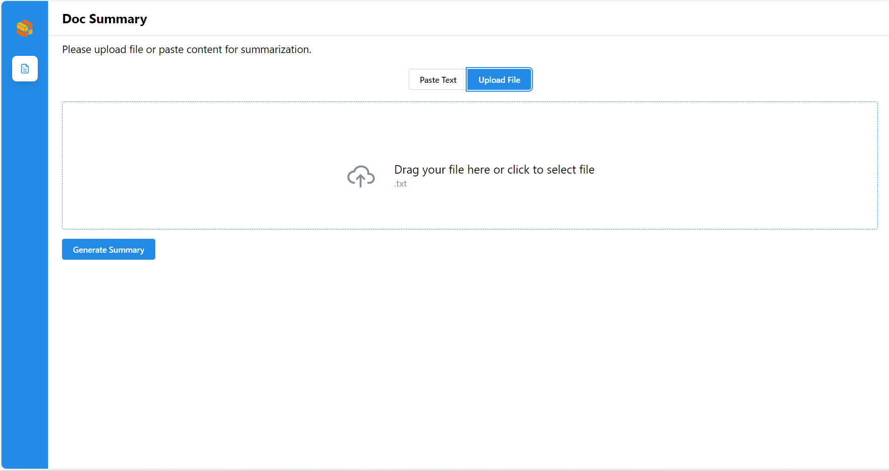
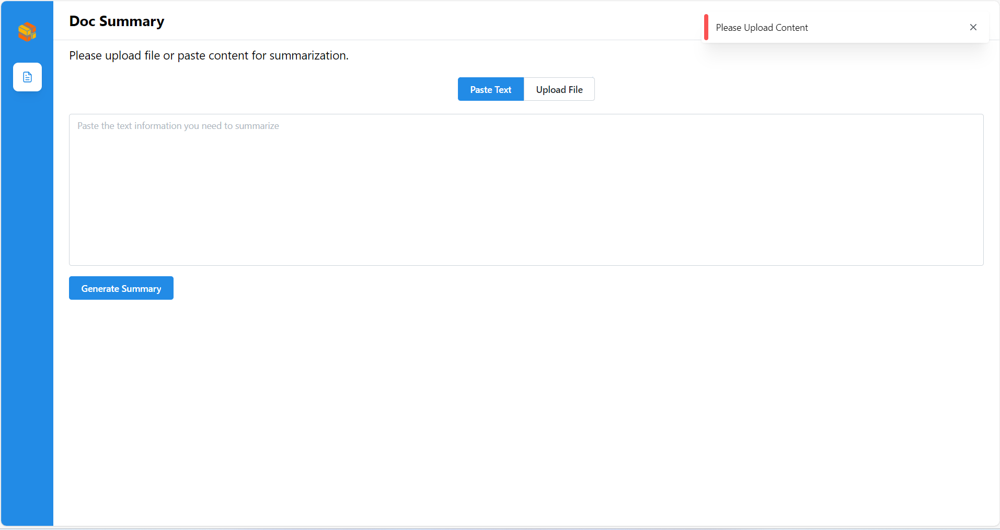

# Doc Summary React

## 📸 Project Screenshots





## 🧐 Features

Here're some of the project's features:

- Summarizing Uploaded Files: Upload files from their local device, then click 'Generate Summary' to summarize the content of the uploaded file. The summary will be displayed on the 'Summary' box.
- Summarizing Text via Pasting: Paste the text to be summarized into the text box, then click 'Generate Summary' to produce a condensed summary of the content, which will be displayed in the 'Summary' box on the right.
- Scroll to Bottom: The summarized content will automatically scroll to the bottom.

## 🛠️ Get it Running

1. Clone the repo.

2. cd command to the current folder.

3. Modify the required .env variables.
   ```
   VITE_DOC_SUM_URL = ''
   ```
4. Execute `npm install` to install the corresponding dependencies.

5. Execute `npm run dev` in both environments
