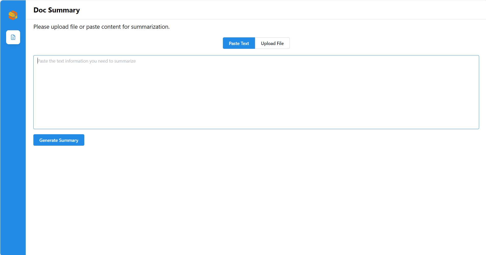

# Build Mega Service of Document Summarization on Intel Xeon Processor

This document outlines the deployment process for a Document Summarization application utilizing the [GenAIComps](https://github.com/opea-project/GenAIComps.git) microservice pipeline on an Intel Xeon server. The steps include Docker image creation, container deployment via Docker Compose, and service execution to integrate microservices such as `llm`. We will publish the Docker images to Docker Hub soon, which will simplify the deployment process for this service.

## 🚀 Apply Intel Xeon Server on AWS

To apply a Intel Xeon server on AWS, start by creating an AWS account if you don't have one already. Then, head to the [EC2 Console](https://console.aws.amazon.com/ec2/v2/home) to begin the process. Within the EC2 service, select the Amazon EC2 M7i or M7i-flex instance type to leverage the power of 4th Generation Intel Xeon Scalable processors. These instances are optimized for high-performance computing and demanding workloads.

For detailed information about these instance types, you can refer to this [link](https://aws.amazon.com/ec2/instance-types/m7i/). Once you've chosen the appropriate instance type, proceed with configuring your instance settings, including network configurations, security groups, and storage options.

After launching your instance, you can connect to it using SSH (for Linux instances) or Remote Desktop Protocol (RDP) (for Windows instances). From there, you'll have full access to your Xeon server, allowing you to install, configure, and manage your applications as needed.

## 🚀 Build Docker Images

First of all, you need to build Docker Images locally and install the python package of it.

```bash
git clone https://github.com/opea-project/GenAIComps.git
cd GenAIComps
```

### 1. Build LLM Image

```bash
docker build -t opea/llm-docsum-tgi:latest --build-arg https_proxy=$https_proxy --build-arg http_proxy=$http_proxy -f comps/llms/summarization/tgi/Dockerfile .
```

Then run the command `docker images`, you will have the following four Docker Images:

### 2. Build MegaService Docker Image

To construct the Mega Service, we utilize the [GenAIComps](https://github.com/opea-project/GenAIComps.git) microservice pipeline within the `docsum.py` Python script. Build the MegaService Docker image via below command:

```bash
git clone https://github.com/opea-project/GenAIExamples
cd GenAIExamples/DocSum/docker
docker build -t opea/docsum:latest --build-arg https_proxy=$https_proxy --build-arg http_proxy=$http_proxy -f Dockerfile .
```

### 3. Build UI Docker Image

Build the frontend Docker image via below command:

```bash
cd GenAIExamples/DocSum/docker/ui/
docker build -t opea/docsum-ui:latest --build-arg https_proxy=$https_proxy --build-arg http_proxy=$http_proxy -f ./docker/Dockerfile .
```

Then run the command `docker images`, you will have the following Docker Images:

1. `opea/llm-docsum-tgi:latest`
2. `opea/docsum:latest`
3. `opea/docsum-ui:latest`

### 4. Build React UI Docker Image

Build the frontend Docker image via below command:

```bash
cd GenAIExamples/DocSum/docker/ui/
export BACKEND_SERVICE_ENDPOINT="http://${host_ip}:8888/v1/docsum"
docker build -t opea/docsum-react-ui:latest --build-arg BACKEND_SERVICE_ENDPOINT=$BACKEND_SERVICE_ENDPOINT -f ./docker/Dockerfile.react .

docker build -t opea/docsum-react-ui:latest --build-arg BACKEND_SERVICE_ENDPOINT=$BACKEND_SERVICE_ENDPOINT --build-arg https_proxy=$https_proxy --build-arg http_proxy=$http_proxy  -f ./docker/Dockerfile.react .
```

Then run the command `docker images`, you will have the following Docker Images:

1. `opea/llm-docsum-tgi:latest`
2. `opea/docsum:latest`
3. `opea/docsum-ui:latest`
4. `opea/docsum-react-ui:latest`

## 🚀 Start Microservices and MegaService

### Required Models

We set default model as "Intel/neural-chat-7b-v3-3", change "LLM_MODEL_ID" in following Environment Variables setting if you want to use other models.
If use gated models, you also need to provide [huggingface token](https://huggingface.co/docs/hub/security-tokens) to "HUGGINGFACEHUB_API_TOKEN" environment variable.

### Setup Environment Variables

Since the `compose.yaml` will consume some environment variables, you need to setup them in advance as below.

```bash
export no_proxy=${your_no_proxy}
export http_proxy=${your_http_proxy}
export https_proxy=${your_http_proxy}
export LLM_MODEL_ID="Intel/neural-chat-7b-v3-3"
export TGI_LLM_ENDPOINT="http://${host_ip}:8008"
export HUGGINGFACEHUB_API_TOKEN=${your_hf_api_token}
export MEGA_SERVICE_HOST_IP=${host_ip}
export LLM_SERVICE_HOST_IP=${host_ip}
export BACKEND_SERVICE_ENDPOINT="http://${host_ip}:8888/v1/docsum"
```

Note: Please replace with `host_ip` with your external IP address, do not use localhost.

### Start Microservice Docker Containers

```bash
cd GenAIExamples/DocSum/docker/xeon
docker compose up -d
```

### Validate Microservices

1. TGI Service

```bash
curl http://${your_ip}:8008/generate \
  -X POST \
  -d '{"inputs":"What is Deep Learning?","parameters":{"max_new_tokens":17, "do_sample": true}}' \
  -H 'Content-Type: application/json'
```

2. LLM Microservice

```bash
curl http://${your_ip}:9000/v1/chat/docsum \
  -X POST \
  -d '{"query":"Text Embeddings Inference (TEI) is a toolkit for deploying and serving open source text embeddings and sequence classification models. TEI enables high-performance extraction for the most popular models, including FlagEmbedding, Ember, GTE and E5."}' \
  -H 'Content-Type: application/json'
```

3. MegaService

```bash
curl http://${host_ip}:8888/v1/docsum -H "Content-Type: application/json" -d '{
     "messages": "Text Embeddings Inference (TEI) is a toolkit for deploying and serving open source text embeddings and sequence classification models. TEI enables high-performance extraction for the most popular models, including FlagEmbedding, Ember, GTE and E5."
     }'
```

Following the validation of all aforementioned microservices, we are now prepared to construct a mega-service.

## 🚀 Launch the UI

Open this URL `http://{host_ip}:5173` in your browser to access the svelte based frontend.
Open this URL `http://{host_ip}:5174` in your browser to access the React based frontend.

### Svelte UI


### React UI (Optional)

To access the React-based frontend, modify the UI service in the `compose.yaml` file. Replace `docsum-xeon-ui-server` service with the `docsum-xeon-react-ui-server` service as per the config below:

```yaml
docsum-xeon-react-ui-server:
  image: ${REGISTRY:-opea}/docsum-react-ui:${TAG:-latest}
  container_name: docsum-xeon-react-ui-server
  depends_on:
    - docsum-xeon-backend-server
  ports:
    - "5174:80"
  environment:
    - no_proxy=${no_proxy}
    - https_proxy=${https_proxy}
    - http_proxy=${http_proxy}
  ipc: host
  restart: always
```


