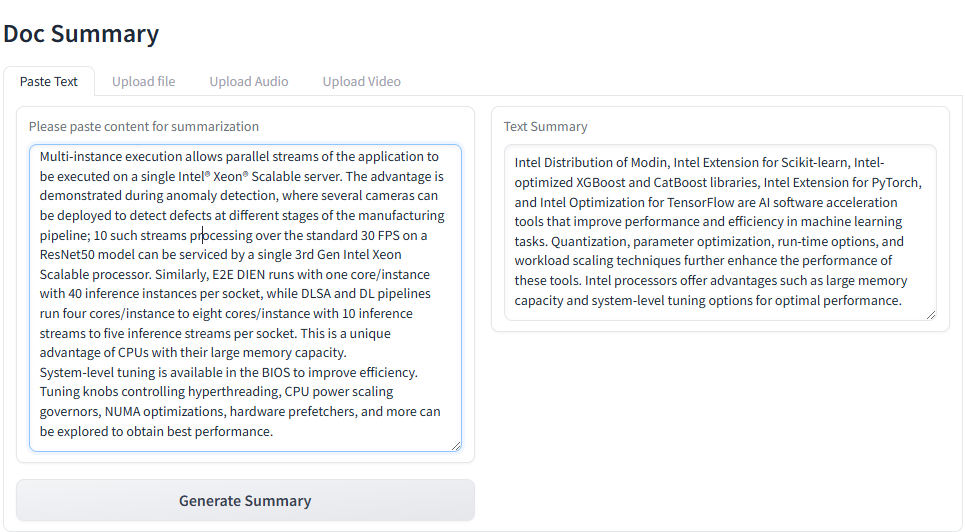

# Deploy DocSum Application on AMD EPYC™ Processors with Docker Compose

This document details the deployment procedure for a Document Summarization application using OPEA components on an AMD EPYC™ Processors.

This example includes the following sections:

- [DocSum Quick Start Deployment](#docsum-quick-start-deployment): Demonstrates how to quickly deploy a DocSum application/pipeline on AMD EPYC platform.
- [DocSum Docker Compose Files](#docsum-docker-compose-files): Describes some example deployments and their docker compose files.
- [DocSum Detailed Usage](#docsum-detailed-usage): Provide more detailed usage.
- [Launch the UI](#launch-the-ui): Guideline for UI usage

## DocSum Quick Start Deployment

This section explains how to quickly deploy and manually test the DocSum service on an AMD EPYC platform. The process involves the following basic steps:

1. [Access the Code](#access-the-code)
2. [Install Docker](#install-docker)
3. [Determine your host external IP address](#determine-your-host-external-ip-address)
4. [Generate a HuggingFace Access Token](#generate-a-huggingface-access-token)
5. [Set Up Environment](#set-up-environment)
6. [Deploy the Services Using Docker Compose](#deploy-the-services-using-docker-compose)
7. [Check the Deployment Status](#check-the-deployment-status)
8. [Test the Pipeline](#test-the-pipeline)
9. [Cleanup the Deployment](#cleanup-the-deployment)

### Access the Code

Clone the GenAIExample repository and access the DocSum AMD EPYC platform Docker Compose files and supporting scripts:

```bash
git clone https://github.com/opea-project/GenAIExamples.git
cd GenAIExamples/DocSum/docker_compose/amd/cpu/epyc
```

### Install Docker

Ensure Docker is installed on your system. If Docker is not already installed, use the provided script to set it up:

    source ./install_docker.sh

This script installs Docker and its dependencies. After running it, verify the installation by checking the Docker version:

    docker --version

If Docker is already installed, this step can be skipped.

### Determine your host external IP address

Run the following command in your terminal to list network interfaces:

    ifconfig

Look for the inet address associated with your active network interface (e.g., enp99s0). For example:

    enp99s0: flags=4163<UP,BROADCAST,RUNNING,MULTICAST>  mtu 1500
        inet 10.101.16.119  netmask 255.255.255.0  broadcast 10.101.16.255

In this example, the (`host_ip`) would be (`10.101.16.119`).

    # Replace with your host's external IP address
    export host_ip="your_external_ip_address"

### Generate a HuggingFace Access Token

Some HuggingFace resources, such as some models, are only accessible if you have an access token. If you do not already have a HuggingFace access token, you can create one by first creating an account by following the steps provided at [HuggingFace](https://huggingface.co/) and then generating a [user access token](https://huggingface.co/docs/transformers.js/en/guides/private#step-1-generating-a-user-access-token).

```bash
export HF_TOKEN="your_huggingface_token"
```

### Set Up Environment

The model_cache directory, by default, stores models in the ./data directory. To change this, use the following command:

```bash
# Optional
export model_cache=/home/documentation/data_docsum/data # Path to save cache models
```

Set the environment variables

```bash
source ./set_env.sh
```

NOTE: by default vLLM does "warmup" at start, to optimize its performance for the specified model and the underlying platform, which can take long time. For development (and e.g. autoscaling) it can be skipped with `export VLLM_SKIP_WARMUP=true`.

### Deploy the Services Using Docker Compose

To deploy the DocSum services, execute the `docker compose up` command with the appropriate arguments. For a default deployment, execute:

```bash
docker compose up -d
```

**Note**: developers should build docker image from source when:

- Developing off the git main branch (as the container's ports in the repo may be different from the published docker image).
- Unable to download the docker image.
- Use a specific version of Docker image.

Please refer to the table below to build different microservices from source:

| Microservice | Deployment Guide                                                                                                                      |
| ------------ | ------------------------------------------------------------------------------------------------------------------------------------- |
| whisper      | [whisper build guide](https://github.com/opea-project/GenAIComps/tree/main/comps/third_parties/whisper/src)                           |
| vLLM         | [vLLM build guide](https://github.com/opea-project/GenAIComps/tree/main/comps/third_parties/vllm#build-docker)                        |
| llm-docsum   | [LLM-DocSum build guide](https://github.com/opea-project/GenAIComps/tree/main/comps/llms/src/doc-summarization#12-build-docker-image) |
| MegaService  | [MegaService build guide](../../../../README_miscellaneous.md#build-megaservice-docker-image)                                         |
| UI           | [Basic UI build guide](../../../../README_miscellaneous.md#build-ui-docker-image)                                                     |

### Check the Deployment Status

After running docker compose, to check if all the containers launched via docker compose have started:

```bash
docker ps -a
```

For the default deployment, the following five containers should be running:

```bash
CONTAINER ID   IMAGE                                 COMMAND                  CREATED         STATUS                   PORTS                                       NAMES
748f577b3c78   opea/whisper:latest                   "python whisper_s…"      5 minutes ago   Up About a minute        0.0.0.0:7066->7066/tcp, :::7066->7066/tcp   docsum-epyc-whisper-server
4eq8b7034fd9   opea/docsum-gradio-ui:latest          "docker-entrypoint.s…"   5 minutes ago   Up About a minute        0.0.0.0:5173->5173/tcp, :::5173->5173/tcp   docsum-epyc-ui-server
fds3dd5b9fd8   opea/docsum:latest                    "python docsum.py"       5 minutes ago   Up About a minute        0.0.0.0:8888->8888/tcp, :::8888->8888/tcp   docsum-epyc-backend-server
78fsd6fabfs7   opea/llm-docsum:latest                "bash entrypoint.sh"     5 minutes ago   Up About a minute        0.0.0.0:9000->9000/tcp, :::9000->9000/tcp   docsum-epyc-llm-server
78964d0c1hg5   opea/vllm:latest                "python3 -m vllm.en …"   5 minutes ago   Up 5 minutes (healthy)   0.0.0.0:8008->80/tcp, [::]:8008->80/tcp     docsum-epyc-vllm-service
```

### Test the Pipeline

Once the DocSum services are running, test the pipeline using the following command:

```bash
curl -X POST http://${host_ip}:8888/v1/docsum \
        -H "Content-Type: application/json" \
        -d '{"type": "text", "messages": "Text Embeddings Inference (TEI) is a toolkit for deploying and serving open source text embeddings and sequence classification models. TEI enables high-performance extraction for the most popular models, including FlagEmbedding, Ember, GTE and E5."}'
```

**Note** The value of _host_ip_ was set using the _set_env.sh_ script and can be found in the _.env_ file.

### Cleanup the Deployment

To stop the containers associated with the deployment, execute the following command:

```bash
docker compose -f compose.yaml down
```

All the DocSum containers will be stopped and then removed on completion of the "down" command.

## DocSum Docker Compose Files

In the context of deploying a DocSum pipeline on an AMD EPYC platform, we can pick and choose different large language model serving frameworks. The table below outlines the various configurations that are available as part of the application.

| File                                   | Description                                                                               |
| -------------------------------------- | ----------------------------------------------------------------------------------------- |
| [compose.yaml](./compose.yaml)         | Default compose file using vllm as serving framework                                      |
| [compose_tgi.yaml](./compose_tgi.yaml) | The LLM serving framework is TGI. All other configurations remain the same as the default |

## DocSum Detailed Usage

There are also some customized usage.

### Query with text

```bash
# form input. Use English mode (default).
curl http://${host_ip}:8888/v1/docsum \
      -H "Content-Type: multipart/form-data" \
      -F "type=text" \
      -F "messages=Text Embeddings Inference (TEI) is a toolkit for deploying and serving open source text embeddings and sequence classification models. TEI enables high-performance extraction for the most popular models, including FlagEmbedding, Ember, GTE and E5." \
      -F "max_tokens=32" \
      -F "language=en" \
      -F "stream=True"

# Use Chinese mode.
curl http://${host_ip}:8888/v1/docsum \
      -H "Content-Type: multipart/form-data" \
      -F "type=text" \
      -F "messages=2024年9月26日，北京——今日，英特尔正式发布英特尔® 至强® 6性能核处理器（代号Granite Rapids），为AI、数据分析、科学计算等计算密集型业务提供卓越性能。" \
      -F "max_tokens=32" \
      -F "language=zh" \
      -F "stream=True"

# Upload file
curl http://${host_ip}:8888/v1/docsum \
   -H "Content-Type: multipart/form-data" \
   -F "type=text" \
   -F "messages=" \
   -F "files=@/path to your file (.txt, .docx, .pdf)" \
   -F "max_tokens=32" \
   -F "language=en"
```

Note that the `-F "messages="` flag is required, even for file uploads. Multiple files can be uploaded in a single call with multiple `-F "files=@/path"` inputs.

### Query with audio and video

> Audio and video can be passed as base64 strings or uploaded by providing a local file path.

Audio:

```bash
# Send base64 string
curl -X POST http://${host_ip}:8888/v1/docsum \
   -H "Content-Type: application/json" \
   -d '{"type": "audio", "messages": "UklGRigAAABXQVZFZm10IBIAAAABAAEARKwAAIhYAQACABAAAABkYXRhAgAAAAEA"}'

curl http://${host_ip}:8888/v1/docsum \
   -H "Content-Type: multipart/form-data" \
   -F "type=audio" \
   -F "messages=UklGRigAAABXQVZFZm10IBIAAAABAAEARKwAAIhYAQACABAAAABkYXRhAgAAAAEA" \
   -F "max_tokens=32" \
   -F "language=en" \
   -F "stream=True"

# Upload file
curl http://${host_ip}:8888/v1/docsum \
   -H "Content-Type: multipart/form-data" \
   -F "type=audio" \
   -F "messages=" \
   -F "files=@/path to your file (.mp3, .wav)" \
   -F "max_tokens=32" \
   -F "language=en"
```

Video:

```bash
# Send base64 string
curl -X POST http://${host_ip}:8888/v1/docsum \
   -H "Content-Type: application/json" \
   -d '{"type": "video", "messages": "convert your video to base64 data type"}'

curl http://${host_ip}:8888/v1/docsum \
   -H "Content-Type: multipart/form-data" \
   -F "type=video" \
   -F "messages=convert your video to base64 data type" \
   -F "max_tokens=32" \
   -F "language=en" \
   -F "stream=True"

# Upload file
curl http://${host_ip}:8888/v1/docsum \
   -H "Content-Type: multipart/form-data" \
   -F "type=video" \
   -F "messages=" \
   -F "files=@/path to your file (.mp4)" \
   -F "max_tokens=32" \
   -F "language=en"
```

### Query with long context

If you want to deal with long context, can set following parameters and select suitable summary type.

- "summary_type": can be "auto", "stuff", "truncate", "map_reduce", "refine", default is "auto"
- "chunk_size": max token length for each chunk. Set to be different default value according to "summary_type".
- "chunk_overlap": overlap token length between each chunk, default is 0.1\*chunk_size

**summary_type=auto**

"summary_type" is set to be "auto" by default, in this mode we will check input token length, if it exceed `MAX_INPUT_TOKENS`, `summary_type` will automatically be set to `refine` mode, otherwise will be set to `stuff` mode.

```bash
curl http://${host_ip}:8888/v1/docsum \
   -H "Content-Type: multipart/form-data" \
   -F "type=text" \
   -F "messages=" \
   -F "max_tokens=32" \
   -F "files=@/path to your file (.txt, .docx, .pdf)" \
   -F "language=en" \
   -F "summary_type=auto"
```

**summary_type=stuff**

In this mode LLM generate summary based on complete input text. In this case please carefully set `MAX_INPUT_TOKENS` and `MAX_TOTAL_TOKENS` according to your model and device memory, otherwise it may exceed LLM context limit and raise error when meet long context.

```bash
curl http://${host_ip}:8888/v1/docsum \
   -H "Content-Type: multipart/form-data" \
   -F "type=text" \
   -F "messages=" \
   -F "max_tokens=32" \
   -F "files=@/path to your file (.txt, .docx, .pdf)" \
   -F "language=en" \
   -F "summary_type=stuff"
```

**summary_type=truncate**

Truncate mode will truncate the input text and keep only the first chunk, whose length is equal to `min(MAX_TOTAL_TOKENS - input.max_tokens - 50, MAX_INPUT_TOKENS)`

```bash
curl http://${host_ip}:8888/v1/docsum \
   -H "Content-Type: multipart/form-data" \
   -F "type=text" \
   -F "messages=" \
   -F "max_tokens=32" \
   -F "files=@/path to your file (.txt, .docx, .pdf)" \
   -F "language=en" \
   -F "summary_type=truncate"
```

**summary_type=map_reduce**

Map_reduce mode will split the inputs into multiple chunks, map each document to an individual summary, then consolidate those summaries into a single global summary. `stream=True` is not allowed here.

In this mode, default `chunk_size` is set to be `min(MAX_TOTAL_TOKENS - input.max_tokens - 50, MAX_INPUT_TOKENS)`

```bash
curl http://${host_ip}:8888/v1/docsum \
   -H "Content-Type: multipart/form-data" \
   -F "type=text" \
   -F "messages=" \
   -F "max_tokens=32" \
   -F "files=@/path to your file (.txt, .docx, .pdf)" \
   -F "language=en" \
   -F "summary_type=map_reduce"
```

**summary_type=refine**

Refine mode will split the inputs into multiple chunks, generate summary for the first one, then combine with the second, loops over every remaining chunks to get the final summary.

In this mode, default `chunk_size` is set to be `min(MAX_TOTAL_TOKENS - 2 * input.max_tokens - 128, MAX_INPUT_TOKENS)`.

```bash
curl http://${host_ip}:8888/v1/docsum \
   -H "Content-Type: multipart/form-data" \
   -F "type=text" \
   -F "messages=" \
   -F "max_tokens=32" \
   -F "files=@/path to your file (.txt, .docx, .pdf)" \
   -F "language=en" \
   -F "summary_type=refine"
```

## Launch the UI

Several UI options are provided. If you need to work with multimedia documents, .doc, or .pdf files, suggested to use Gradio UI.

### Gradio UI

Open this URL `http://{host_ip}:5173` in your browser to access the Gradio based frontend.


### Launch the Svelte UI

Open this URL `http://{host_ip}:5173` in your browser to access the Svelte based frontend.


### Launch the React UI (Optional)

Open this URL `http://{host_ip}:5174` in your browser to access the React based frontend.

To access the React-based frontend, modify the UI service in the `compose.yaml` file. Replace `docsum-epyc-ui-server` service with the `docsum-epyc-react-ui-server` service as per the config below:

```yaml
docsum-epyc-react-ui-server:
  image: ${REGISTRY:-opea}/docsum-react-ui:${TAG:-latest}
  container_name: docsum-epyc-react-ui-server
  depends_on:
    - docsum-epyc-backend-server
  ports:
    - "5174:80"
  environment:
    - no_proxy=${no_proxy}
    - https_proxy=${https_proxy}
    - http_proxy=${http_proxy}
  ipc: host
  restart: always
```


Open this URL `http://{host_ip}:5175` in your browser to access the frontend.


### Profile Microservices

To further analyze MicroService Performance, users could follow the instructions to profile MicroServices.

#### 1. vLLM backend Service

Users could follow previous section to testing vLLM microservice or DocSum MegaService. By default, vLLM profiling is not enabled. Users could start and stop profiling by following commands.

##### Start vLLM profiling

```bash
curl http://${host_ip}:8008/start_profile \
  -H "Content-Type: application/json" \
  -d '{"model": "meta-llama/Meta-Llama-3-8B-Instruct"}'
```

After vLLM profiling is started, users could start asking questions and get responses from vLLM MicroService

```bash
curl http://${host_ip}:8008/v1/chat/completions \
    -X POST \
    -H "Content-Type: application/json" \
    -d '{"model": "meta-llama/Meta-Llama-3-8B-Instruct", "messages": [{"role": "user", "content": "Text Embeddings Inference (TEI) is a toolkit for deploying and serving open source text embeddings and sequence classification models. TEI enables high-performance extraction for the most popular models, including FlagEmbedding, Ember, GTE and E5."}]}'
```

##### Stop vLLM profiling

By following command, users could stop vLLM profiling and generate a \*.pt.trace.json.gz file as profiling result  
 under /mnt folder in docsum-epyc-vllm-service docker instance.

```bash
curl http://${host_ip}:8008/stop_profile \
  -H "Content-Type: application/json" \
  -d '{"model": "meta-llama/Meta-Llama-3-8B-Instruct"}'
```

After vllm profiling is stopped, users could use below command to get the \*.pt.trace.json.gz file under /mnt folder.

```bash
docker cp  docsum-epyc-vllm-service:/mnt/ .
```

##### Check profiling result

Open a web browser and type "chrome://tracing" or "ui.perfetto.dev", and then load the json.gz file.

## Conclusion

This guide should enable developer to deploy the default configuration or any of the other compose yaml files for different configurations. It also highlights the configurable parameters that can be set before deployment.
