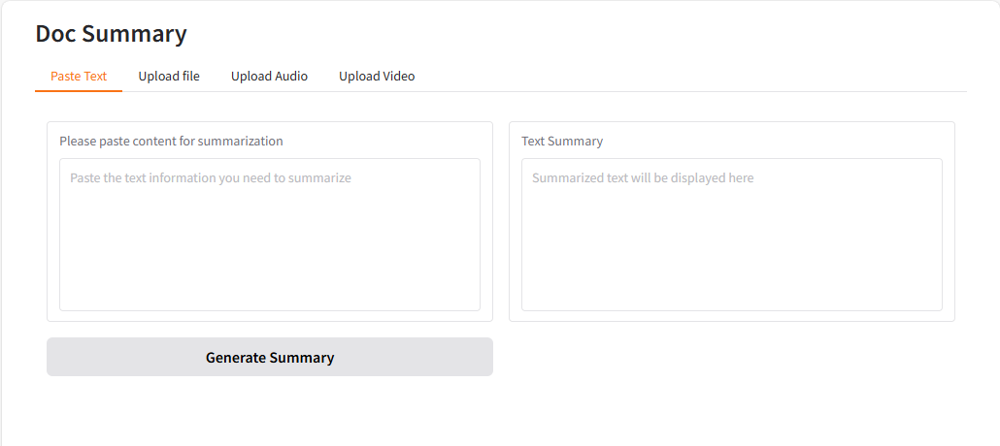
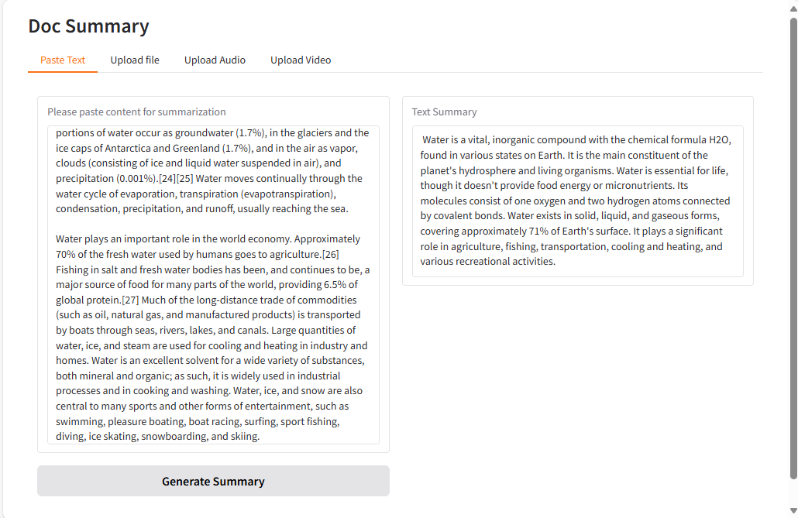

# Example DocSum deployments on AMD GPU (ROCm)

This document outlines the deployment process for a Document Summarization application utilizing OPEA components on an AMD GPU server.

This example includes the following sections:

- [DocSum Quick Start Deployment](#docsum-quick-start-deployment): Demonstrates how to quickly deploy a DocSum application/pipeline on AMD GPU platform.
- [DocSum Docker Compose Files](#docsum-docker-compose-files): Describes some example deployments and their docker compose files.
- [DocSum Detailed Usage](#docsum-detailed-usage): Provide more detailed usage.
- [Launch the UI](#launch-the-ui): Guideline for UI usage

## DocSum Quick Start Deployment

This section describes how to quickly deploy and test the DocSum service manually on an AMD GPU platform. The basic steps are:

1. [Access the Code](#access-the-code)
2. [Generate a HuggingFace Access Token](#generate-a-huggingface-access-token)
3. [Configure the Deployment Environment](#configure-the-deployment-environment)
4. [Deploy the Services Using Docker Compose](#deploy-the-services-using-docker-compose)
5. [Check the Deployment Status](#check-the-deployment-status)
6. [Test the Pipeline](#test-the-pipeline)
7. [Cleanup the Deployment](#cleanup-the-deployment)

### Access the Code

Clone the GenAIExample repository and access the ChatQnA AMD GPU platform Docker Compose files and supporting scripts:

```
git clone https://github.com/opea-project/GenAIExamples.git
cd GenAIExamples/DocSum/docker_compose/amd/gpu/rocm
```

Checkout a released version, such as v1.2:

```
git checkout v1.2
```

### Generate a HuggingFace Access Token

Some HuggingFace resources, such as some models, are only accessible if you have an access token. If you do not already have a HuggingFace access token, you can create one by first creating an account by following the steps provided at [HuggingFace](https://huggingface.co/) and then generating a [user access token](https://huggingface.co/docs/transformers.js/en/guides/private#step-1-generating-a-user-access-token).

### Configure the Deployment Environment

To set up environment variables for deploying DocSum services, source the _set_env.sh_ script in this directory:

```
source ./set_env.sh
```

The _set_env.sh_ script will prompt for required and optional environment variables used to configure the DocSum services. If a value is not entered, the script will use a default value for the same. It will also generate a _.env_ file defining the desired configuration. Consult the section on [DocSum Service configuration](#docsum-service-configuration) for information on how service specific configuration parameters affect deployments.

### Deploy the Services Using Docker Compose

To deploy the DocSum services, execute the `docker compose up` command with the appropriate arguments. For a default deployment, execute:

```bash
docker compose up -d
```

**Note**: developers should build docker image from source when:

- Developing off the git main branch (as the container's ports in the repo may be different from the published docker image).
- Unable to download the docker image.
- Use a specific version of Docker image.

Please refer to the table below to build different microservices from source:

| Microservice | Deployment Guide                                                                                                                      |
| ------------ | ------------------------------------------------------------------------------------------------------------------------------------- |
| whisper      | [whisper build guide](https://github.com/opea-project/GenAIComps/tree/main/comps/third_parties/whisper/src)                           |
| vLLM         | [vLLM build guide](https://github.com/opea-project/GenAIComps/tree/main/comps/third_parties/vllm#build-docker)                        |
| llm-docsum   | [LLM-DocSum build guide](https://github.com/opea-project/GenAIComps/tree/main/comps/llms/src/doc-summarization#12-build-docker-image) |
| MegaService  | [MegaService build guide](../../../../README_miscellaneous.md#build-megaservice-docker-image)                                         |
| UI           | [Basic UI build guide](../../../../README_miscellaneous.md#build-ui-docker-image)                                                     |

### Check the Deployment Status

After running docker compose, check if all the containers launched via docker compose have started:

```
docker ps -a
```

For the default deployment, the following 5 containers should have started:

```
CONTAINER ID   IMAGE                                                         COMMAND                  CREATED         STATUS                   PORTS                                       NAMES
748f577b3c78   opea/whisper:latest                                           "python whisper_s…"      5 minutes ago   Up About a minute        0.0.0.0:7066->7066/tcp, :::7066->7066/tcp   whisper-service
4eq8b7034fd9   opea/docsum-gradio-ui:latest                                  "docker-entrypoint.s…"   5 minutes ago   Up About a minute        0.0.0.0:5173->5173/tcp, :::5173->5173/tcp   docsum-ui-server
fds3dd5b9fd8   opea/docsum:latest                                            "python docsum.py"       5 minutes ago   Up About a minute        0.0.0.0:8888->8888/tcp, :::8888->8888/tcp   docsum-backend-server
78fsd6fabfs7   opea/llm-docsum:latest                                        "bash entrypoint.sh"     5 minutes ago   Up About a minute        0.0.0.0:9000->9000/tcp, :::9000->9000/tcp   docsum-llm-server
78964d0c1hg5   ghcr.io/huggingface/text-generation-inference:2.4.1-rocm      "/tgi-entrypoint.sh"     5 minutes ago   Up 5 minutes (healthy)   0.0.0.0:8008->80/tcp, [::]:8008->80/tcp     docsum-tgi-service
```

### Test the Pipeline

Once the DocSum services are running, test the pipeline using the following command:

```bash
curl -X POST http://${host_ip}:8888/v1/docsum \
        -H "Content-Type: application/json" \
        -d '{"type": "text", "messages": "Text Embeddings Inference (TEI) is a toolkit for deploying and serving open source text embeddings and sequence classification models. TEI enables high-performance extraction for the most popular models, including FlagEmbedding, Ember, GTE and E5."}'
```

**Note** The value of _host_ip_ was set using the _set_env.sh_ script and can be found in the _.env_ file.

### Cleanup the Deployment

To stop the containers associated with the deployment, execute the following command:

```
docker compose -f compose.yaml down
```

All the DocSum containers will be stopped and then removed on completion of the "down" command.

## DocSum Docker Compose Files

In the context of deploying a DocSum pipeline on an AMD GPU platform, we can pick and choose different large language model serving frameworks. The table below outlines the various configurations that are available as part of the application.

| File                                     | Description                                                                                |
| ---------------------------------------- | ------------------------------------------------------------------------------------------ |
| [compose.yaml](./compose.yaml)           | Default compose file using tgi as serving framework                                        |
| [compose_vllm.yaml](./compose_vllm.yaml) | The LLM serving framework is vLLM. All other configurations remain the same as the default |

## DocSum Detailed Usage

There are also some customized usage.

### Query with text

```bash
# form input. Use English mode (default).
curl http://${host_ip}:8888/v1/docsum \
      -H "Content-Type: multipart/form-data" \
      -F "type=text" \
      -F "messages=Text Embeddings Inference (TEI) is a toolkit for deploying and serving open source text embeddings and sequence classification models. TEI enables high-performance extraction for the most popular models, including FlagEmbedding, Ember, GTE and E5." \
      -F "max_tokens=32" \
      -F "language=en" \
      -F "stream=True"

# Use Chinese mode.
curl http://${host_ip}:8888/v1/docsum \
      -H "Content-Type: multipart/form-data" \
      -F "type=text" \
      -F "messages=2024年9月26日，北京——今日，英特尔正式发布英特尔® 至强® 6性能核处理器（代号Granite Rapids），为AI、数据分析、科学计算等计算密集型业务提供卓越性能。" \
      -F "max_tokens=32" \
      -F "language=zh" \
      -F "stream=True"

# Upload file
curl http://${host_ip}:8888/v1/docsum \
   -H "Content-Type: multipart/form-data" \
   -F "type=text" \
   -F "messages=" \
   -F "files=@/path to your file (.txt, .docx, .pdf)" \
   -F "max_tokens=32" \
   -F "language=en" \
```

### Query with audio and video

> Audio and Video file uploads are not supported in docsum with curl request, please use the Gradio-UI.

Audio:

```bash
curl -X POST http://${host_ip}:8888/v1/docsum \
   -H "Content-Type: application/json" \
   -d '{"type": "audio", "messages": "UklGRigAAABXQVZFZm10IBIAAAABAAEARKwAAIhYAQACABAAAABkYXRhAgAAAAEA"}'

curl http://${host_ip}:8888/v1/docsum \
   -H "Content-Type: multipart/form-data" \
   -F "type=audio" \
   -F "messages=UklGRigAAABXQVZFZm10IBIAAAABAAEARKwAAIhYAQACABAAAABkYXRhAgAAAAEA" \
   -F "max_tokens=32" \
   -F "language=en" \
   -F "stream=True"
```

Video:

```bash
curl -X POST http://${host_ip}:8888/v1/docsum \
   -H "Content-Type: application/json" \
   -d '{"type": "video", "messages": "convert your video to base64 data type"}'

curl http://${host_ip}:8888/v1/docsum \
   -H "Content-Type: multipart/form-data" \
   -F "type=video" \
   -F "messages=convert your video to base64 data type" \
   -F "max_tokens=32" \
   -F "language=en" \
   -F "stream=True"
```

### Query with long context

If you want to deal with long context, can set following parameters and select suitable summary type.

- "summary_type": can be "auto", "stuff", "truncate", "map_reduce", "refine", default is "auto"
- "chunk_size": max token length for each chunk. Set to be different default value according to "summary_type".
- "chunk_overlap": overlap token length between each chunk, default is 0.1\*chunk_size

**summary_type=auto**

"summary_type" is set to be "auto" by default, in this mode we will check input token length, if it exceed `MAX_INPUT_TOKENS`, `summary_type` will automatically be set to `refine` mode, otherwise will be set to `stuff` mode.

```bash
curl http://${host_ip}:8888/v1/docsum \
   -H "Content-Type: multipart/form-data" \
   -F "type=text" \
   -F "messages=" \
   -F "max_tokens=32" \
   -F "files=@/path to your file (.txt, .docx, .pdf)" \
   -F "language=en" \
   -F "summary_type=auto"
```

**summary_type=stuff**

In this mode LLM generate summary based on complete input text. In this case please carefully set `MAX_INPUT_TOKENS` and `MAX_TOTAL_TOKENS` according to your model and device memory, otherwise it may exceed LLM context limit and raise error when meet long context.

```bash
curl http://${host_ip}:8888/v1/docsum \
   -H "Content-Type: multipart/form-data" \
   -F "type=text" \
   -F "messages=" \
   -F "max_tokens=32" \
   -F "files=@/path to your file (.txt, .docx, .pdf)" \
   -F "language=en" \
   -F "summary_type=stuff"
```

**summary_type=truncate**

Truncate mode will truncate the input text and keep only the first chunk, whose length is equal to `min(MAX_TOTAL_TOKENS - input.max_tokens - 50, MAX_INPUT_TOKENS)`

```bash
curl http://${host_ip}:8888/v1/docsum \
   -H "Content-Type: multipart/form-data" \
   -F "type=text" \
   -F "messages=" \
   -F "max_tokens=32" \
   -F "files=@/path to your file (.txt, .docx, .pdf)" \
   -F "language=en" \
   -F "summary_type=truncate"
```

**summary_type=map_reduce**

Map_reduce mode will split the inputs into multiple chunks, map each document to an individual summary, then consolidate those summaries into a single global summary. `stream=True` is not allowed here.

In this mode, default `chunk_size` is set to be `min(MAX_TOTAL_TOKENS - input.max_tokens - 50, MAX_INPUT_TOKENS)`

```bash
curl http://${host_ip}:8888/v1/docsum \
   -H "Content-Type: multipart/form-data" \
   -F "type=text" \
   -F "messages=" \
   -F "max_tokens=32" \
   -F "files=@/path to your file (.txt, .docx, .pdf)" \
   -F "language=en" \
   -F "summary_type=map_reduce"
```

**summary_type=refine**

Refin mode will split the inputs into multiple chunks, generate summary for the first one, then combine with the second, loops over every remaining chunks to get the final summary.

In this mode, default `chunk_size` is set to be `min(MAX_TOTAL_TOKENS - 2 * input.max_tokens - 128, MAX_INPUT_TOKENS)`.

```bash
curl http://${host_ip}:8888/v1/docsum \
   -H "Content-Type: multipart/form-data" \
   -F "type=text" \
   -F "messages=" \
   -F "max_tokens=32" \
   -F "files=@/path to your file (.txt, .docx, .pdf)" \
   -F "language=en" \
   -F "summary_type=refine"
```

## Launch the UI

Several UI options are provided. If you need to work with multimedia documents, .doc, or .pdf files, suggested to use Gradio UI.

### Gradio UI

To access the UI, use the URL - http://${EXTERNAL_HOST_IP}:${FAGGEN_UI_PORT}
A page should open when you click through to this address:



If a page of this type has opened, then we believe that the service is running and responding,
and we can proceed to functional UI testing.

For example, let's take the description of water from the Wiki.
Copy the first few paragraphs from the Wiki and put them in the text field and then click Generate FAQs.
After that, a page with the result of the task should open:



If the result shown on the page is correct, then we consider the verification of the UI service to be successful.
