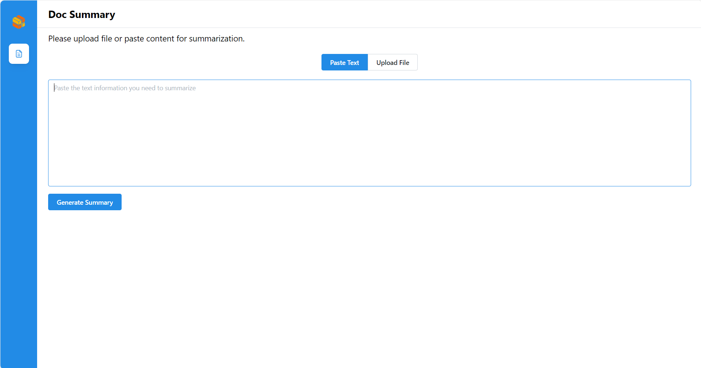

# Build and deploy DocSum Application on AMD GPU (ROCm)

## Build images

## 🚀 Build Docker Images

First of all, you need to build Docker Images locally and install the python package of it.

### 1. Build LLM Image

```bash
git clone https://github.com/opea-project/GenAIComps.git
cd GenAIComps
docker build -t opea/llm-docsum-tgi:latest --build-arg https_proxy=$https_proxy --build-arg http_proxy=$http_proxy -f comps/llms/src/doc-summarization/Dockerfile .
```

Then run the command `docker images`, you will have the following four Docker Images:

### 2. Build MegaService Docker Image

To construct the Mega Service, we utilize the [GenAIComps](https://github.com/opea-project/GenAIComps.git) microservice pipeline within the `docsum.py` Python script. Build the MegaService Docker image via below command:

```bash
git clone https://github.com/opea-project/GenAIExamples
cd GenAIExamples/DocSum/
docker build -t opea/docsum:latest --build-arg https_proxy=$https_proxy --build-arg http_proxy=$http_proxy -f Dockerfile .
```

### 3. Build UI Docker Image

Build the frontend Docker image via below command:

```bash
cd GenAIExamples/DocSum/ui
docker build -t opea/docsum-ui:latest --build-arg https_proxy=$https_proxy --build-arg http_proxy=$http_proxy -f docker/Dockerfile .
```

Then run the command `docker images`, you will have the following Docker Images:

1. `opea/llm-docsum-tgi:latest`
2. `opea/docsum:latest`
3. `opea/docsum-ui:latest`

### 4. Build React UI Docker Image

Build the frontend Docker image via below command:

```bash
cd GenAIExamples/DocSum/ui
export BACKEND_SERVICE_ENDPOINT="http://${host_ip}:8888/v1/docsum"
docker build -t opea/docsum-react-ui:latest --build-arg BACKEND_SERVICE_ENDPOINT=$BACKEND_SERVICE_ENDPOINT -f ./docker/Dockerfile.react .

docker build -t opea/docsum-react-ui:latest --build-arg BACKEND_SERVICE_ENDPOINT=$BACKEND_SERVICE_ENDPOINT --build-arg https_proxy=$https_proxy --build-arg http_proxy=$http_proxy  -f ./docker/Dockerfile.react .
```

Then run the command `docker images`, you will have the following Docker Images:

1. `opea/llm-docsum-tgi:latest`
2. `opea/docsum:latest`
3. `opea/docsum-ui:latest`
4. `opea/docsum-react-ui:latest`

## 🚀 Start Microservices and MegaService

### Required Models

Default model is "Intel/neural-chat-7b-v3-3". Change "LLM_MODEL_ID" in environment variables below if you want to use another model.
For gated models, you also need to provide [HuggingFace token](https://huggingface.co/docs/hub/security-tokens) in "HUGGINGFACEHUB_API_TOKEN" environment variable.

### Setup Environment Variables

Since the `compose.yaml` will consume some environment variables, you need to setup them in advance as below.

```bash
export DOCSUM_TGI_IMAGE="ghcr.io/huggingface/text-generation-inference:2.3.1-rocm"
export DOCSUM_LLM_MODEL_ID="Intel/neural-chat-7b-v3-3"
export HOST_IP=${host_ip}
export DOCSUM_TGI_SERVICE_PORT="18882"
export DOCSUM_TGI_LLM_ENDPOINT="http://${HOST_IP}:${DOCSUM_TGI_SERVICE_PORT}"
export DOCSUM_HUGGINGFACEHUB_API_TOKEN=${your_hf_api_token}
export DOCSUM_LLM_SERVER_PORT="8008"
export DOCSUM_BACKEND_SERVER_PORT="8888"
export DOCSUM_FRONTEND_PORT="5173"
export DocSum_COMPONENT_NAME="OpeaDocSumTgi"
```

Note: Please replace with `host_ip` with your external IP address, do not use localhost.

Note: In order to limit access to a subset of GPUs, please pass each device individually using one or more -device /dev/dri/rendered<node>, where <node> is the card index, starting from 128. (https://rocm.docs.amd.com/projects/install-on-linux/en/latest/how-to/docker.html#docker-restrict-gpus)

Example for set isolation for 1 GPU

```
      - /dev/dri/card0:/dev/dri/card0
      - /dev/dri/renderD128:/dev/dri/renderD128
```

Example for set isolation for 2 GPUs

```
      - /dev/dri/card0:/dev/dri/card0
      - /dev/dri/renderD128:/dev/dri/renderD128
      - /dev/dri/card1:/dev/dri/card1
      - /dev/dri/renderD129:/dev/dri/renderD129
```

Please find more information about accessing and restricting AMD GPUs in the link (https://rocm.docs.amd.com/projects/install-on-linux/en/latest/how-to/docker.html#docker-restrict-gpus)

### Start Microservice Docker Containers

```bash
cd GenAIExamples/DocSum/docker_compose/amd/gpu/rocm
docker compose up -d
```

### Validate Microservices

1. TGI Service

   ```bash
   curl http://${host_ip}:8008/generate \
     -X POST \
     -d '{"inputs":"What is Deep Learning?","parameters":{"max_new_tokens":64, "do_sample": true}}' \
     -H 'Content-Type: application/json'
   ```

2. LLM Microservice

   ```bash
   curl http://${host_ip}:9000/v1/docsum \
     -X POST \
     -d '{"query":"Text Embeddings Inference (TEI) is a toolkit for deploying and serving open source text embeddings and sequence classification models. TEI enables high-performance extraction for the most popular models, including FlagEmbedding, Ember, GTE and E5."}' \
     -H 'Content-Type: application/json'
   ```

3. MegaService

   ```bash
   curl http://${host_ip}:8888/v1/docsum -H "Content-Type: application/json" -d '{
        "messages": "Text Embeddings Inference (TEI) is a toolkit for deploying and serving open source text embeddings and sequence classification models. TEI enables high-performance extraction for the most popular models, including FlagEmbedding, Ember, GTE and E5.","max_tokens":32, "language":"en", "stream":false
        }'
   ```

## 🚀 Launch the Svelte UI

Open this URL `http://{host_ip}:5173` in your browser to access the frontend.


Here is an example for summarizing a article.


## 🚀 Launch the React UI (Optional)

To access the React-based frontend, modify the UI service in the `compose.yaml` file. Replace `docsum-rocm-ui-server` service with the `docsum-rocm-react-ui-server` service as per the config below:

```yaml
docsum-rocm-react-ui-server:
  image: ${REGISTRY:-opea}/docsum-react-ui:${TAG:-latest}
  container_name: docsum-rocm-react-ui-server
  depends_on:
    - docsum-rocm-backend-server
  ports:
    - "5174:80"
  environment:
    - no_proxy=${no_proxy}
    - https_proxy=${https_proxy}
    - http_proxy=${http_proxy}
    - DOC_BASE_URL=${BACKEND_SERVICE_ENDPOINT}
```

Open this URL `http://{host_ip}:5175` in your browser to access the frontend.


