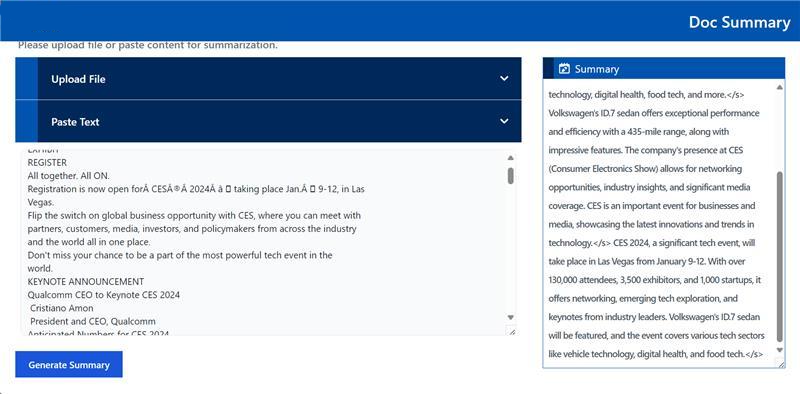

# Build Mega Service of Document Summarization on Intel Xeon Processor

This document outlines the deployment process for a Document Summarization application utilizing the [GenAIComps](https://github.com/opea-project/GenAIComps.git) microservice pipeline on an Intel Xeon server. The steps include Docker image creation, container deployment via Docker Compose, and service execution to integrate microservices such as `llm`. We will publish the Docker images to Docker Hub soon, which will simplify the deployment process for this service.

## 🚀 Apply Intel Xeon Server on AWS

To apply a Intel Xeon server on AWS, start by creating an AWS account if you don't have one already. Then, head to the [EC2 Console](https://console.aws.amazon.com/ec2/v2/home) to begin the process. Within the EC2 service, select the Amazon EC2 M7i or M7i-flex instance type to leverage 4th Generation Intel Xeon Scalable processors. These instances are optimized for high-performance computing and demanding workloads.

For detailed information about these instance types, you can refer to this [link](https://aws.amazon.com/ec2/instance-types/m7i/). Once you've chosen the appropriate instance type, proceed with configuring your instance settings, including network configurations, security groups, and storage options.

After launching your instance, you can connect to it using SSH (for Linux instances) or Remote Desktop Protocol (RDP) (for Windows instances). From there, you'll have full access to your Xeon server, allowing you to install, configure, and manage your applications as needed.

## 🚀 Build Docker Images

### 1. Build MicroService Docker Image

First of all, you need to build Docker Images locally and install the python package of it.

```bash
git clone https://github.com/opea-project/GenAIComps.git
cd GenAIComps
```

#### Whisper Service

The Whisper Service converts audio files to text. Follow these steps to build and run the service:

```bash
docker build -t opea/whisper:latest --build-arg https_proxy=$https_proxy --build-arg http_proxy=$http_proxy -f comps/asr/src/integrations/dependency/whisper/Dockerfile .
```

### 2. Build MegaService Docker Image

To construct the Mega Service, we utilize the [GenAIComps](https://github.com/opea-project/GenAIComps.git) microservice pipeline within the `docsum.py` Python script. Build the MegaService Docker image via below command:

```bash
git clone https://github.com/opea-project/GenAIExamples
cd GenAIExamples/DocSum/
docker build -t opea/docsum:latest --build-arg https_proxy=$https_proxy --build-arg http_proxy=$http_proxy -f Dockerfile .
```

### 3. Build UI Docker Image

Several UI options are provided. If you need to work with multimedia documents, .doc, or .pdf files, suggested to use Gradio UI.

#### Gradio UI

Build the Gradio UI frontend Docker image using the following command:

```bash
cd GenAIExamples/DocSum/ui
docker build -t opea/docsum-gradio-ui:latest --build-arg https_proxy=$https_proxy --build-arg http_proxy=$http_proxy -f docker/Dockerfile.gradio .
```

#### Svelte UI

Build the frontend Docker image via below command:

```bash
cd GenAIExamples/DocSum/ui
docker build -t opea/docsum-ui:latest --build-arg https_proxy=$https_proxy --build-arg http_proxy=$http_proxy -f docker/Dockerfile .
```

#### React UI

Build the frontend Docker image via below command:

```bash
cd GenAIExamples/DocSum/ui
export BACKEND_SERVICE_ENDPOINT="http://${host_ip}:8888/v1/docsum"
docker build -t opea/docsum-react-ui:latest --build-arg BACKEND_SERVICE_ENDPOINT=$BACKEND_SERVICE_ENDPOINT -f ./docker/Dockerfile.react .

docker build -t opea/docsum-react-ui:latest --build-arg BACKEND_SERVICE_ENDPOINT=$BACKEND_SERVICE_ENDPOINT --build-arg https_proxy=$https_proxy --build-arg http_proxy=$http_proxy  -f ./docker/Dockerfile.react .
```

## 🚀 Start Microservices and MegaService

### Required Models

Default model is "Intel/neural-chat-7b-v3-3". Change "LLM_MODEL_ID" environment variable in commands below if you want to use another model.

```bash
export LLM_MODEL_ID="Intel/neural-chat-7b-v3-3"
```

When using gated models, you also need to provide [HuggingFace token](https://huggingface.co/docs/hub/security-tokens) to "HUGGINGFACEHUB_API_TOKEN" environment variable.

### Setup Environment Variable

To set up environment variables for deploying Document Summarization services, follow these steps:

1. Set the required environment variables:

   ```bash
   # Example: host_ip="192.168.1.1"
   export host_ip="External_Public_IP"
   # Example: no_proxy="localhost, 127.0.0.1, 192.168.1.1"
   export no_proxy="Your_No_Proxy"
   export HUGGINGFACEHUB_API_TOKEN="Your_Huggingface_API_Token"
   ```

2. If you are in a proxy environment, also set the proxy-related environment variables:

   ```bash
   export http_proxy="Your_HTTP_Proxy"
   export https_proxy="Your_HTTPs_Proxy"
   ```

3. Set up other environment variables:

   ```bash
   source GenAIExamples/DocSum/docker_compose/set_env.sh
   ```

### Start Microservice Docker Containers

```bash
cd GenAIExamples/DocSum/docker_compose/intel/cpu/xeon
docker compose -f compose.yaml up -d
```

You will have the following Docker Images:

1. `opea/docsum-ui:latest`
2. `opea/docsum:latest`
3. `opea/llm-docsum:latest`
4. `opea/whisper:latest`

### Validate Microservices

1. TGI Service

   ```bash
   curl http://${host_ip}:8008/generate \
     -X POST \
     -d '{"inputs":"What is Deep Learning?","parameters":{"max_new_tokens":17, "do_sample": true}}' \
     -H 'Content-Type: application/json'
   ```

2. LLM Microservice

   ```bash
   curl http://${host_ip}:9000/v1/docsum \
     -X POST \
     -d '{"query":"Text Embeddings Inference (TEI) is a toolkit for deploying and serving open source text embeddings and sequence classification models. TEI enables high-performance extraction for the most popular models, including FlagEmbedding, Ember, GTE and E5."}' \
     -H 'Content-Type: application/json'
   ```

3. Whisper Microservice

   ```bash
    curl http://${host_ip}:7066/v1/asr \
        -X POST \
        -d '{"audio":"UklGRigAAABXQVZFZm10IBIAAAABAAEARKwAAIhYAQACABAAAABkYXRhAgAAAAEA"}' \
        -H 'Content-Type: application/json'
   ```

   Expected output:

   ```bash
     {"asr_result":"you"}
   ```

4. MegaService

   Text:

   ```bash
   ## json input
   curl -X POST http://${host_ip}:8888/v1/docsum \
        -H "Content-Type: application/json" \
        -d '{"type": "text", "messages": "Text Embeddings Inference (TEI) is a toolkit for deploying and serving open source text embeddings and sequence classification models. TEI enables high-performance extraction for the most popular models, including FlagEmbedding, Ember, GTE and E5."}'

   # form input, use English mode (default).
   curl http://${host_ip}:8888/v1/docsum \
       -H "Content-Type: multipart/form-data" \
       -F "type=text" \
       -F "messages=Text Embeddings Inference (TEI) is a toolkit for deploying and serving open source text embeddings and sequence classification models. TEI enables high-performance extraction for the most popular models, including FlagEmbedding, Ember, GTE and E5." \
       -F "max_tokens=32" \
       -F "language=en" \
       -F "stream=true"

   # Use Chinese mode.
   curl http://${host_ip}:8888/v1/docsum \
       -H "Content-Type: multipart/form-data" \
       -F "type=text" \
       -F "messages=2024年9月26日，北京——今日，英特尔正式发布英特尔® 至强® 6性能核处理器（代号Granite Rapids），为AI、数据分析、科学计算等计算密集型业务提供卓越性能。" \
       -F "max_tokens=32" \
       -F "language=zh" \
       -F "stream=true"

   # Upload file
   curl http://${host_ip}:8888/v1/docsum \
      -H "Content-Type: multipart/form-data" \
      -F "type=text" \
      -F "messages=" \
      -F "files=@/path to your file (.txt, .docx, .pdf)" \
      -F "max_tokens=32" \
      -F "language=en" \
      -F "stream=true"
   ```

   > Audio and Video file uploads are not supported in docsum with curl request, please use the Gradio-UI. You can still pass base64 string of the audio or video file as follows:

   Audio:

   ```bash
   curl -X POST http://${host_ip}:8888/v1/docsum \
      -H "Content-Type: application/json" \
      -d '{"type": "audio", "messages": "UklGRigAAABXQVZFZm10IBIAAAABAAEARKwAAIhYAQACABAAAABkYXRhAgAAAAEA"}'

   curl http://${host_ip}:8888/v1/docsum \
      -H "Content-Type: multipart/form-data" \
      -F "type=audio" \
      -F "messages=UklGRigAAABXQVZFZm10IBIAAAABAAEARKwAAIhYAQACABAAAABkYXRhAgAAAAEA" \
      -F "max_tokens=32" \
      -F "language=en" \
      -F "stream=true"
   ```

   Video:

   ```bash
   curl -X POST http://${host_ip}:8888/v1/docsum \
      -H "Content-Type: application/json" \
      -d '{"type": "video", "messages": "convert your video to base64 data type"}'

   curl http://${host_ip}:8888/v1/docsum \
      -H "Content-Type: multipart/form-data" \
      -F "type=video" \
      -F "messages=convert your video to base64 data type" \
      -F "max_tokens=32" \
      -F "language=en" \
      -F "stream=true"
   ```

5. MegaService with long context

   If you want to deal with long context, can set following parameters and select suitable summary type.

   - "summary_type": can be "auto", "stuff", "truncate", "map_reduce", "refine", default is "auto"
   - "chunk_size": max token length for each chunk. Set to be different default value according to "summary_type".
   - "chunk_overlap": overlap token length between each chunk, default is 0.1\*chunk_size

   **summary_type=auto**

   "summary_type" is set to be "auto" by default, in this mode we will check input token length, if it exceed `MAX_INPUT_TOKENS`, `summary_type` will automatically be set to `refine` mode, otherwise will be set to `stuff` mode.

   ```bash
   curl http://${host_ip}:8888/v1/docsum \
      -H "Content-Type: multipart/form-data" \
      -F "type=text" \
      -F "messages=" \
      -F "max_tokens=32" \
      -F "files=@/path to your file (.txt, .docx, .pdf)" \
      -F "language=en" \
      -F "summary_type=auto"
   ```

   **summary_type=stuff**

   In this mode LLM generate summary based on complete input text. In this case please carefully set `MAX_INPUT_TOKENS` and `MAX_TOTAL_TOKENS` according to your model and device memory, otherwise it may exceed LLM context limit and raise error when meet long context.

   ```bash
   curl http://${host_ip}:8888/v1/docsum \
      -H "Content-Type: multipart/form-data" \
      -F "type=text" \
      -F "messages=" \
      -F "max_tokens=32" \
      -F "files=@/path to your file (.txt, .docx, .pdf)" \
      -F "language=en" \
      -F "summary_type=stuff"
   ```

   **summary_type=truncate**

   Truncate mode will truncate the input text and keep only the first chunk, whose length is equal to `min(MAX_TOTAL_TOKENS - input.max_tokens - 50, MAX_INPUT_TOKENS)`

   ```bash
   curl http://${host_ip}:8888/v1/docsum \
      -H "Content-Type: multipart/form-data" \
      -F "type=text" \
      -F "messages=" \
      -F "max_tokens=32" \
      -F "files=@/path to your file (.txt, .docx, .pdf)" \
      -F "language=en" \
      -F "summary_type=truncate"
   ```

   **summary_type=map_reduce**

   Map_reduce mode will split the inputs into multiple chunks, map each document to an individual summary, then consolidate those summaries into a single global summary. `stream=True` is not allowed here.

   In this mode, default `chunk_size` is set to be `min(MAX_TOTAL_TOKENS - input.max_tokens - 50, MAX_INPUT_TOKENS)`

   ```bash
   curl http://${host_ip}:8888/v1/docsum \
      -H "Content-Type: multipart/form-data" \
      -F "type=text" \
      -F "messages=" \
      -F "max_tokens=32" \
      -F "files=@/path to your file (.txt, .docx, .pdf)" \
      -F "language=en" \
      -F "summary_type=map_reduce"
   ```

   **summary_type=refine**

   Refin mode will split the inputs into multiple chunks, generate summary for the first one, then combine with the second, loops over every remaining chunks to get the final summary.

   In this mode, default `chunk_size` is set to be `min(MAX_TOTAL_TOKENS - 2 * input.max_tokens - 128, MAX_INPUT_TOKENS)`.

   ```bash
   curl http://${host_ip}:8888/v1/docsum \
      -H "Content-Type: multipart/form-data" \
      -F "type=text" \
      -F "messages=" \
      -F "max_tokens=32" \
      -F "files=@/path to your file (.txt, .docx, .pdf)" \
      -F "language=en" \
      -F "summary_type=refine"
   ```

## 🚀 Launch the UI

Several UI options are provided. If you need to work with multimedia documents, .doc, or .pdf files, suggested to use Gradio UI.

### Gradio UI

Open this URL `http://{host_ip}:5173` in your browser to access the Gradio based frontend.


### Svelte UI

Open this URL `http://{host_ip}:5173` in your browser to access the Svelte based frontend.



### React UI (Optional)

Open this URL `http://{host_ip}:5174` in your browser to access the React based frontend.

To access the React-based frontend, modify the UI service in the `compose.yaml` file. Replace `docsum-xeon-ui-server` service with the `docsum-xeon-react-ui-server` service as per the config below:

```yaml
docsum-xeon-react-ui-server:
  image: ${REGISTRY:-opea}/docsum-react-ui:${TAG:-latest}
  container_name: docsum-xeon-react-ui-server
  depends_on:
    - docsum-xeon-backend-server
  ports:
    - "5174:80"
  environment:
    - no_proxy=${no_proxy}
    - https_proxy=${https_proxy}
    - http_proxy=${http_proxy}
  ipc: host
  restart: always
```


