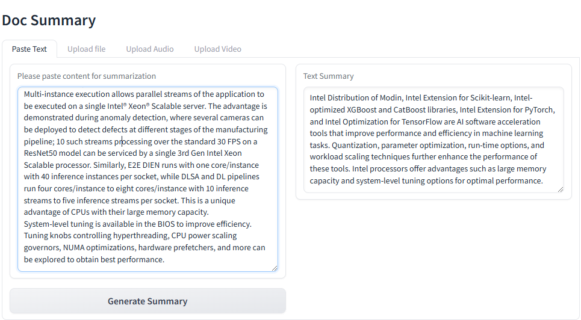

# Document Summary

This project provides a user interface for summarizing documents and text using a Dockerized frontend application. Users can upload files or paste text to generate summaries.

## Docker

### Build UI Docker Image

To build the frontend Docker image, navigate to the `GenAIExamples/DocSum/ui` directory and run the following command:

```bash
cd GenAIExamples/DocSum/ui
docker build -t opea/docsum-gradio-ui:latest --build-arg https_proxy=$https_proxy --build-arg http_proxy=$http_proxy -f docker/Dockerfile.gradio .
```

This command builds the Docker image with the tag `opea/docsum-ui:latest`. It also passes the proxy settings as build arguments to ensure that the build process can access the internet if you are behind a corporate firewall.

### Run UI Docker Image

To run the frontend Docker image, navigate to the `GenAIExamples/DocSum/ui/docker` directory and execute the following commands:

```bash
cd GenAIExamples/DocSum/ui/docker

ip_address=$(hostname -I | awk '{print $1}')
docker run -d -p 5173:5173 --ipc=host \
   -e http_proxy=$http_proxy \
   -e https_proxy=$https_proxy \
   -e no_proxy=$no_proxy \
   -e BACKEND_SERVICE_ENDPOINT=http://$ip_address:8888/v1/docsum \
   opea/docsum-gradio-ui:latest
```

This command runs the Docker container in interactive mode, mapping port 5173 of the host to port 5173 of the container. It also sets several environment variables, including the backend service endpoint, which is required for the frontend to communicate with the backend service.

### Python

To run the frontend application directly using Python, navigate to the `GenAIExamples/DocSum/ui/gradio` directory and run the following command:

```bash
cd GenAIExamples/DocSum/ui/gradio
python docsum_ui_gradio.py
```

This command starts the frontend application using Python.

## 📸 Project Screenshots



### 🧐 Features

Here are some of the project's features:

- Summarizing Uploaded Files: Users can upload files from their local device. Once a file is uploaded, the summarization of the document will start automatically. The summary will be displayed in the 'Summary' box.
- Summarizing Text via Pasting: Users can paste the text to be summarized into the text box. By clicking the 'Generate Summary' button, a condensed summary of the content will be produced and displayed in the 'Summary' box on the right.

## Additional Information

### Prerequisites

Ensure you have Docker installed and running on your system. Also, make sure you have the necessary proxy settings configured if you are behind a corporate firewall.

### Environment Variables

- `http_proxy`: Proxy setting for HTTP connections.
- `https_proxy`: Proxy setting for HTTPS connections.
- `no_proxy`: Comma-separated list of hosts that should be excluded from proxying.
- `BACKEND_SERVICE_ENDPOINT`: The endpoint of the backend service that the frontend will communicate with.

### Troubleshooting

- Docker Build Issues: If you encounter issues while building the Docker image, ensure that your proxy settings are correctly configured and that you have internet access.
- Docker Run Issues: If the Docker container fails to start, check the environment variables and ensure that the backend service is running and accessible.

This README file provides detailed instructions and explanations for building and running the Dockerized frontend application, as well as running it directly using Python. It also highlights the key features of the project and provides additional information for troubleshooting and configuring the environment.
