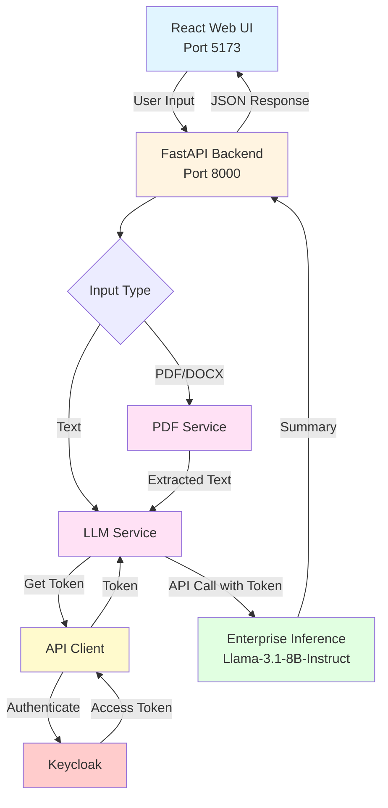
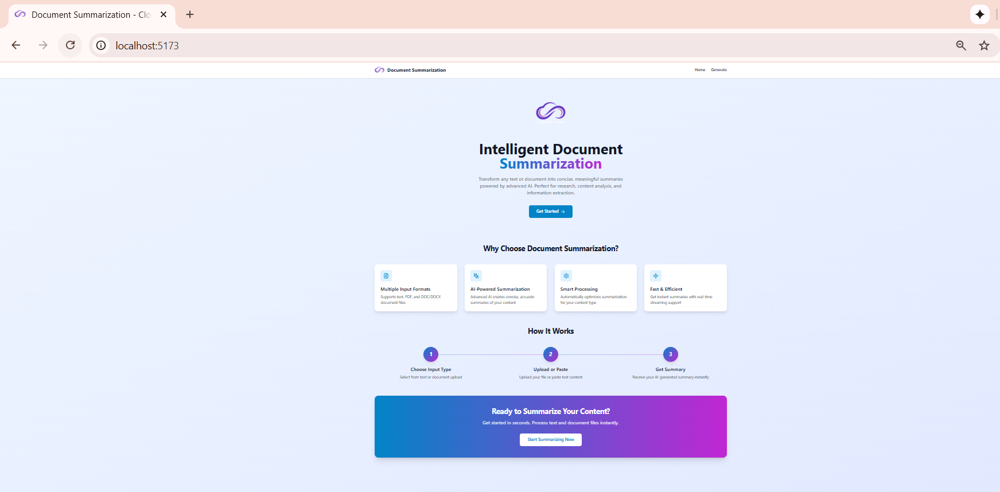
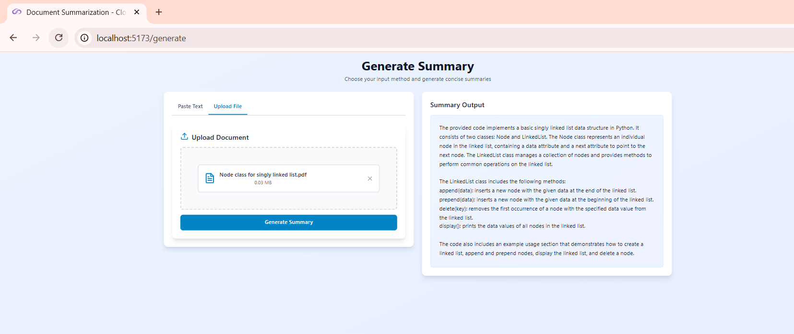

## Document Summarization

A full-stack document summarization application that processes text and document files to generate concise summaries.
The system integrates a FastAPI backend with enterprise inference endpoints, alongside a modern React + Vite + Tailwind CSS frontend for an intuitive user experience.

## Table of Contents

- [Project Overview](#project-overview)
- [Features](#features)
- [Architecture](#architecture)
- [Prerequisites](#prerequisites)
- [Quick Start Deployment](#quick-start-deployment)
- [User Interface](#user-interface)
- [Troubleshooting](#troubleshooting)

---

## Project Overview

The **Document Summarization** application processes multiple content formats to generate concise summaries. Users can paste text or upload documents (PDF, DOCX). The backend uses enterprise inference endpoints via Keycloak authentication for all text summarization.

---

## Features

**Backend**

- Multiple input format support (text, PDF, DOCX)
- PDF text extraction with OCR support for image-based PDFs
- DOCX document processing
- Enterprise inference endpoints for text summarization via Keycloak
- File validation and size limits (PDF/DOCX: 50 MB)
- CORS enabled for web integration
- Comprehensive error handling and logging
- Health check endpoints
- Modular architecture (routes + services)

**Frontend**

- Clean, intuitive interface with tab-based input selection
- Drag-and-drop file upload
- Real-time summary display
- Mobile-responsive design with Tailwind CSS
- Built with Vite for fast development

---

## Architecture

Below is the architecture showing how user input is processed through document extraction, then summarized using the enterprise inference endpoint.



**Service Components:**

1. **React Web UI (Port 5173)** - Provides intuitive interface with drag-and-drop file upload, tab-based input selection, and real-time summary display

2. **FastAPI Backend (Port 8000)** - Orchestrates document processing, handles authentication, and routes requests to appropriate processing services

**Typical Flow:**

1. User inputs text or uploads a document (PDF/DOCX) through the web UI.
2. The backend processes the input:
   - Text: Sent directly to LLM service
   - PDF/DOCX: Extracted using PDF service with OCR support
3. The LLM service requests a token from API Client.
4. API Client authenticates with Keycloak and obtains an access token.
5. LLM service uses the token to call the enterprise inference endpoint.
6. The model generates a summary using Llama-3.1-8B-Instruct.
7. The summary is returned and displayed to the user via the UI.

---

## Prerequisites

### System Requirements

Before you begin, ensure you have the following installed:

- **Docker and Docker Compose**
- **Enterprise inference endpoint access** (Keycloak authentication)

### Verify Docker Installation

```bash
# Check Docker version
docker --version

# Check Docker Compose version
docker compose version

# Verify Docker is running
docker ps
```

---

## Quick Start Deployment

### Clone the Repository

```bash
git clone https://github.com/cld2labs/GenAISamples.git
cd GenAISamples/doc-summarization
```

### Set up the Environment

This application requires an `.env` file in the `backend` directory for proper configuration. Create it with the commands below:

```bash
# Create the .env file in the backend directory
mkdir -p backend
cat > backend/.env << EOF
# Enterprise/Keycloak Configuration (REQUIRED)
BASE_URL=https://api.example.com
KEYCLOAK_REALM=master
KEYCLOAK_CLIENT_ID=api
KEYCLOAK_CLIENT_SECRET=your_client_secret

# Model Configuration (Enterprise Inference)
INFERENCE_MODEL_ENDPOINT=Llama-3.1-8B-Instruct
INFERENCE_MODEL_NAME=meta-llama/Llama-3.1-8B-Instruct

# LLM Configuration
LLM_TEMPERATURE=0.7
LLM_MAX_TOKENS=2000

# Service Configuration
SERVICE_PORT=8000
LOG_LEVEL=INFO

# CORS Settings
CORS_ORIGINS=*
EOF
```

Or manually create `backend/.env` with:

```bash
# Enterprise/Keycloak Configuration (REQUIRED)
BASE_URL=https://api.example.com
KEYCLOAK_REALM=master
KEYCLOAK_CLIENT_ID=api
KEYCLOAK_CLIENT_SECRET=your_client_secret

# Model Configuration (Enterprise Inference)
INFERENCE_MODEL_ENDPOINT=Llama-3.1-8B-Instruct
INFERENCE_MODEL_NAME=meta-llama/Llama-3.1-8B-Instruct

# LLM Configuration
LLM_TEMPERATURE=0.7
LLM_MAX_TOKENS=2000

# Service Configuration
SERVICE_PORT=8000
LOG_LEVEL=INFO

# CORS Settings
CORS_ORIGINS=*
```


### Running the Application

Start both API and UI services together with Docker Compose:

```bash
# From the doc-summarization directory
docker compose up --build

# Or run in detached mode (background)
docker compose up -d --build
```

The Backend will be available at: `http://localhost:8000`
The UI will be available at: `http://localhost:5173`

**View logs**:

```bash
# All services
docker compose logs -f

# Backend only
docker compose logs -f backend

# Frontend only
docker compose logs -f frontend
```

**Verify the services are running**:

```bash
# Check API health
curl http://localhost:8000/health

# Check if containers are running
docker compose ps
```

---


## User Interface

**Using the Application**

Make sure you are at the localhost:5173 url

You will be directed to the main page which has each feature






**UI Configuration**

When running with Docker Compose, the UI automatically connects to the backend API. The frontend is available at `http://localhost:5173` and the API at `http://localhost:8000`.


### Stopping the Application

```bash
docker compose down
```

---

## Troubleshooting

For comprehensive troubleshooting guidance, common issues, and solutions, refer to:

[TROUBLESHOOTING.md](./TROUBLESHOOTING.md)

