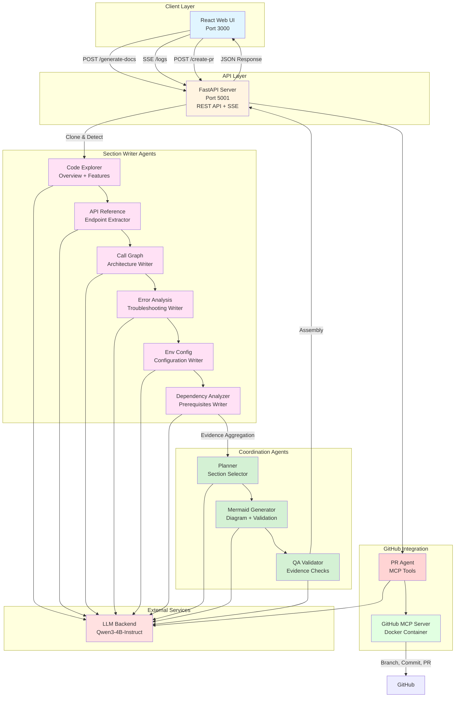
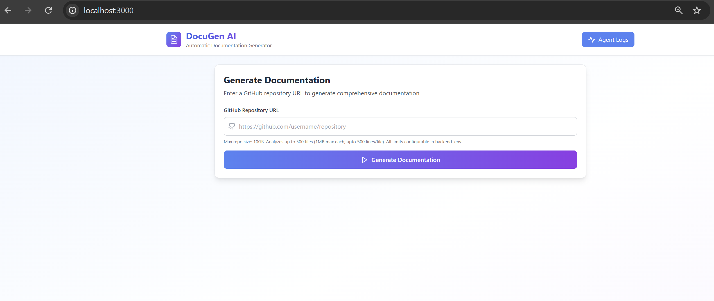
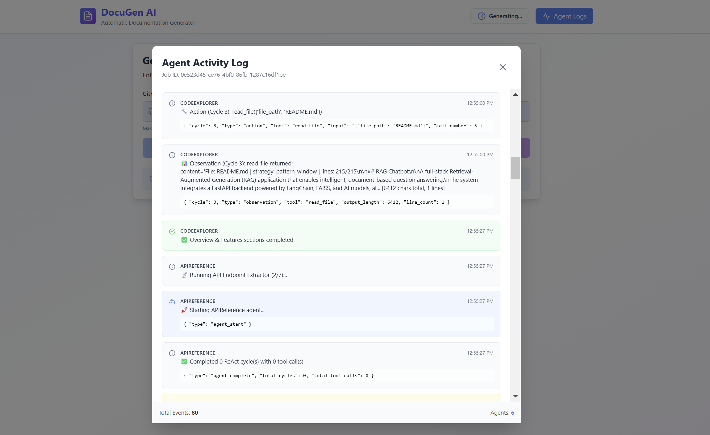
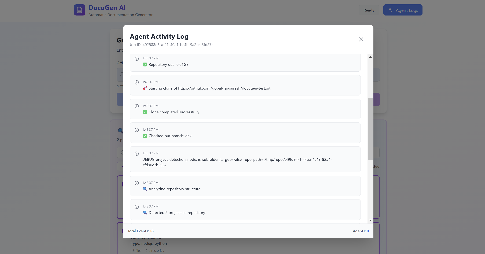
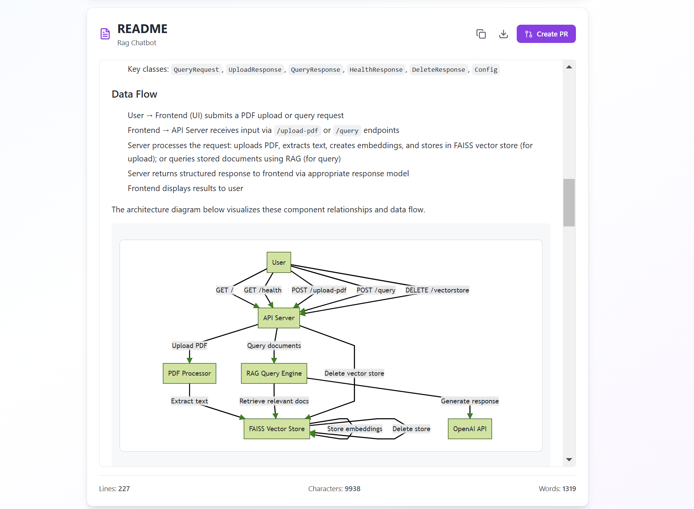
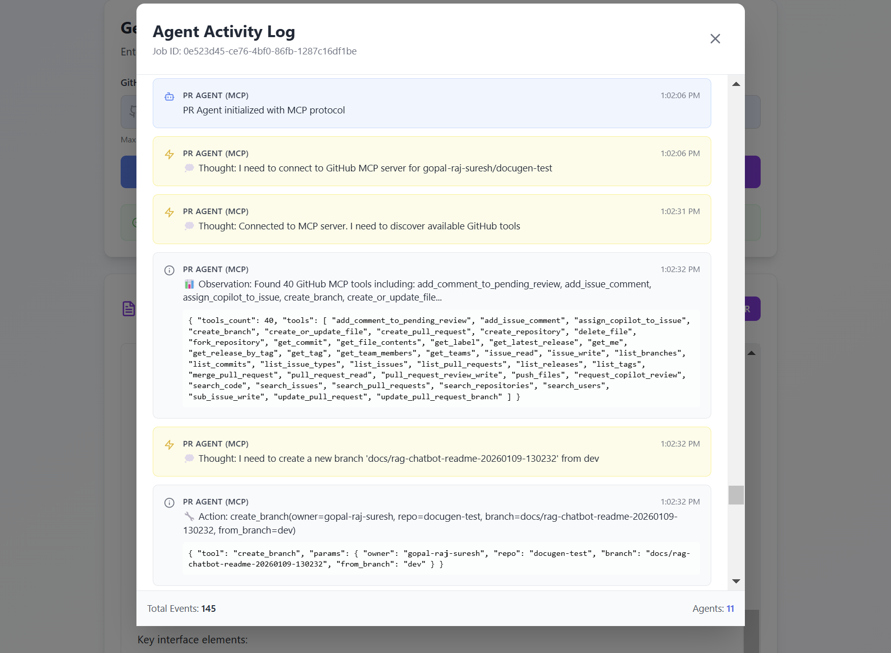
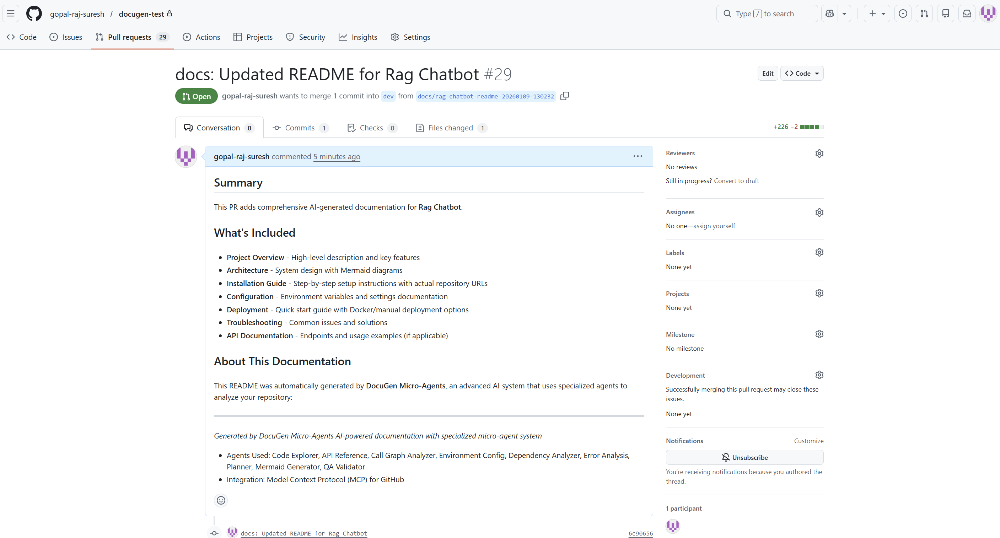
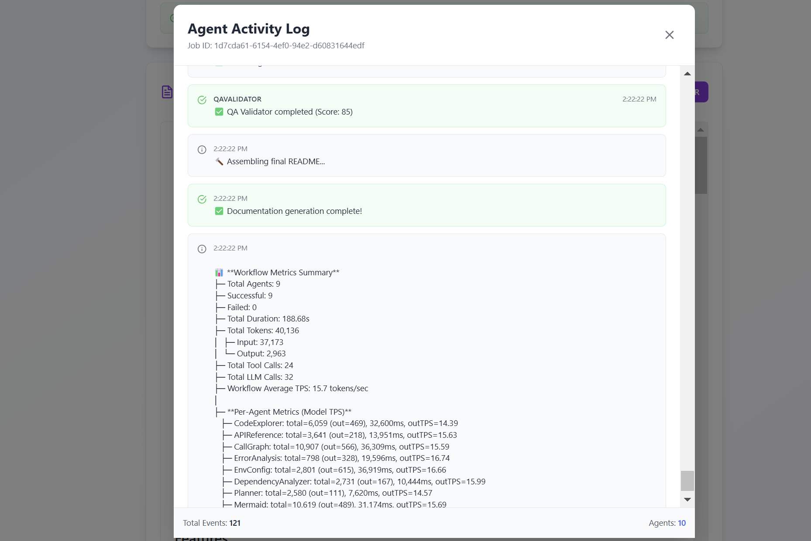

## Documentation Generator

AI-powered documentation generator that automatically creates comprehensive README files from code repositories. This application uses a micro-agent system with nine specialized agents orchestrated by LangGraph to analyze code, extract API endpoints, map call graphs, identify error patterns, parse configurations, and generate documentation with architecture diagrams.

## Table of Contents

- [Project Overview](#project-overview)
- [Features](#features)
- [Architecture](#architecture)
- [Tool System](#tool-system)
- [Prerequisites](#prerequisites)
- [Quick Start](#quick-start)
- [User Interface](#user-interface)
- [Troubleshooting](#troubleshooting)
- [Additional Info](#additional-info)

---

## Project Overview

Documentation Generator is an autonomous system that transforms code repositories into professional README documentation using a specialized micro-agent architecture. The application employs nine specialized AI agents built on LangChain and orchestrated by LangGraph. Six section-writer agents analyze specific aspects of the codebase (project overview, API endpoints, architecture patterns, error handling, environment configuration, and dependencies), while three coordination agents handle planning, diagram generation, and quality validation. The system clones repositories, performs intelligent analysis with strategic file sampling, and generates structured documentation including project descriptions, installation instructions, usage guides, and Mermaid architecture diagrams. Each agent operates with a limited tool set and context budget optimized for efficiency. The system supports both single-project repositories and monorepos with intelligent project detection and user selection capabilities.

---

## Features

- Micro-agent system with nine specialized AI agents optimized for small language models: Code Explorer, API Reference, Call Graph, Error Analysis, Environment Config, Dependency Analyzer, Planner, Mermaid Generator, and QA Validator
- 11 custom repository analysis tools built with LangChain distributed across agents for autonomous code exploration, API extraction, and syntax validation
- Strategic file sampling with three reading strategies: full, smart, and pattern_window (context-aware extraction around routes, errors, and entry points)
- Autonomous repository analysis using ReAct pattern (Thought → Action → Observation) for transparent decision-making
- Intelligent monorepo detection with automatic project discovery and user selection interface
- Subfolder-specific documentation generation via URL targeting (e.g., `https://github.com/owner/repo/tree/main/backend`)
- Support for GitHub public and private repositories with token-based authentication
- Automated pull request creation using Model Context Protocol (MCP) with official GitHub MCP server integration
- Real-time progress tracking via Server-Sent Events (SSE) for live agent activity monitoring
- Mermaid 8.14.0 compatible diagram generation with semantic validation and render-safe checks
- Built on LangChain framework for tool infrastructure and LangGraph for multi-agent workflow orchestration with state persistence
- Evidence-based documentation generation with filesystem verification and agent output aggregation
- Comprehensive metrics tracking including token usage, tool calls, LLM calls, TPS (tokens per second), and execution duration
- Modern React web interface with job history, status monitoring, and documentation preview
- Flexible LLM backend supporting Qwen/Qwen3-4B-Instruct-2507 optimized for Intel Xeon processors
- RESTful API with JSON-based communication for integration capabilities
- Configurable analysis limits via .env (10GB max repo size, 500 files max, 1MB per file, adjustable line budget)

---

## Architecture

This application uses a micro-agent architecture with nine specialized AI agents built on LangChain and orchestrated by LangGraph. The React frontend communicates with a FastAPI backend that orchestrates the workflow. Nine agents operate sequentially within a LangGraph StateGraph workflow: six section-writer agents (Code Explorer, API Reference, Call Graph, Error Analysis, Environment Config, Dependency Analyzer) analyze specific aspects of the codebase and write documentation sections directly, followed by three coordination agents (Planner decides which sections to include, Mermaid Generator creates architecture diagrams with semantic validation, and QA Validator performs evidence-based quality checks). An Evidence Aggregator node consolidates filesystem data and agent outputs before planning. All agents use strategic file sampling with pattern_window mode to extract high-value code regions (routes, error handlers, entry points) within limited context budgets. The system tracks comprehensive metrics including token usage, tool calls, and execution duration. Each agent operates with 3-8 specialized tools and implements the ReAct pattern for autonomous decision-making.



**Strategic File Sampling:**

The system implements three intelligent file reading strategies to optimize context usage with small language models. All strategies work within a configurable line budget (default: 500 lines, set via MAX_LINES_PER_FILE):

- **full** - Reads first N lines within budget. Simple and deterministic for small files.
- **smart** - Extracts top + function/class signatures + bottom sections. Preserves file structure overview while staying within line budget.
- **pattern_window** - Context-aware extraction that detects high-value code patterns (FastAPI/Flask routes, error handlers, entry points, main functions) and extracts ±6 lines around matches. Falls back to smart strategy if no patterns found. This is the default mode for all agents, enabling efficient analysis of large codebases.

All agents use `pattern_window` by default to maximize information density within the 8K context budget optimized for Qwen3-4B. The line budget is configurable via `.env` file to balance context usage and file coverage.

**Core Components:**

1. **React Web UI (Port 3000)** - Vite development server hosting the React frontend. Handles repository URL input with subfolder support, displays real-time generation progress via SSE streaming, provides project selection interface for monorepos, and offers documentation preview with download functionality.

2. **FastAPI Server (Port 5001)** - Manages LangGraph workflow orchestration with state persistence, maintains job state in memory, handles repository cloning with branch detection, performs monorepo project detection, tracks comprehensive metrics (tokens, tool calls, TPS, duration), and coordinates GitHub PR creation via MCP protocol.

3. **Code Explorer Agent** - Writes Project Overview and Features sections. Uses 5 tools: `list_directory`, `read_file`, `detect_languages`, `extract_dependencies`, `analyze_code_structure`. Extracts concrete technical details including project purpose, user-facing capabilities, dependencies, and architecture patterns.

4. **API Reference Agent** - Extracts API endpoints and returns structured JSON. Uses 3 tools: `list_directory`, `read_file`, `find_api_routes`. Identifies REST API routes, HTTP methods, and endpoint purposes from FastAPI, Flask, Express, and Spring frameworks.

5. **Call Graph Agent** - Writes Architecture section describing component relationships and data flow. Uses 5 tools including `find_entry_points` to identify main application files and `analyze_code_structure` to map dependencies.

6. **Error Analysis Agent** - Writes Troubleshooting section by identifying error patterns, exception handlers, and common failure modes. Uses `read_file` with pattern_window to extract try-except blocks and error handling logic.

7. **Environment Config Agent** - Writes Configuration section by analyzing .env.example files and configuration modules. Extracts environment variables, API keys, and deployment settings with their purposes.

8. **Dependency Analyzer Agent** - Writes Prerequisites and Quick Start Deployment sections. Analyzes requirements.txt, package.json, Dockerfile, and docker-compose.yml to generate installation instructions and deployment guides.

9. **Planner Agent** - Determines which sections to include in the final README based on project type (web app, API service, library, CLI tool). Uses 8 tools including `find_ui_files`, `find_docker_files`, `find_config_files` for project detection.

10. **Mermaid Generator Agent** - Creates architecture diagrams with semantic validation. Validates diagrams against evidence packet to ensure accuracy (no endpoint nodes, includes backend/frontend/database based on detected components). Uses `validate_mermaid_syntax` for Mermaid 8.14.0 render-safe checks.

11. **QA Validator Agent** - Performs evidence-based quality validation comparing README sections against filesystem evidence. Checks for hallucinations, missing sections, and factual accuracy before final assembly.

12. **PR Agent** - Autonomous AI agent activated via `/api/create-pr/{job_id}` endpoint after documentation generation. Uses GitHub MCP server tools via Model Context Protocol stdio interface. Executes four-step workflow: checks existing README.md, creates feature branch, commits documentation with conventional commit message, creates pull request with descriptive body.

---

## Tool System

The system includes 11 specialized repository analysis tools implemented in `api/tools/repo_tools.py` using LangChain's `@tool` decorator. These tools enable the nine LangGraph agents to autonomously analyze repositories. Each agent receives a curated subset of tools based on its specific responsibilities. The PR Agent uses a separate set of GitHub tools provided by the GitHub MCP server. All tools are invoked by agents using the ReAct pattern - agents autonomously decide when to call tools, interpret results, and act on observations.

### Tool Distribution Across Agents

| Agent                    | Tool Count | Tools Available                                       |
|--------------------------|------------|-------------------------------------------------------|
| **Code Explorer**        | 5          | Core analysis tools for repository exploration        |
| **API Reference**        | 3          | Directory listing, file reading, API route detection  |
| **Call Graph**           | 5          | Core analysis tools + entry point detection           |
| **Error Analysis**       | 3          | File reading, directory listing, code structure       |
| **Env Config**           | 3          | File reading, config file detection, directory listing|
| **Dependency Analyzer**  | 5          | Core analysis tools + dependency extraction           |
| **Planner**              | 8          | Core tools + project detection tools                  |
| **Mermaid Generator**    | 7          | Selective tools + validation tools                    |
| **QA Validator**         | 0          | No tools (operates on README sections + evidence)     |
| **PR Agent**             | 4          | GitHub MCP tools (via Model Context Protocol)         |

### Core Analysis Tools (5 tools)

**Framework: LangChain (@tool decorator)**
**Used by: Code Explorer, Call Graph, Dependency Analyzer**

1. **`list_directory`** - Browses directory structure with automatic filtering of common ignore patterns (.git, node_modules, __pycache__, venv, dist, build)
2. **`read_file`** - Reads source code and configuration files with strategic sampling (supports full, smart, pattern_window modes). Default: pattern_window for context-aware extraction. Limits: 1MB max file size, configurable line budget (default 500 via MAX_LINES_PER_FILE).
3. **`detect_languages`** - Identifies programming languages by file extensions (supports 16 languages including Python, JavaScript, TypeScript, Go, Rust, Java, C++)
4. **`extract_dependencies`** - Recursively scans subdirectories and parses dependency files (requirements.txt, package.json, go.mod, Cargo.toml). Returns first 20 dependencies per ecosystem.
5. **`analyze_code_structure`** - Extracts functions, classes, and imports using AST parsing (Python) or basic line count metrics (other languages)

### Project Detection Tools (3 tools)

**Framework: LangChain (@tool decorator)**
**Used by: Planner (in addition to core tools)**

6. **`find_ui_files`** - Detects frontend components and frameworks (React, Vue.js, Angular, Next.js, Svelte)
7. **`find_docker_files`** - Checks for Docker and containerization configuration files
8. **`find_config_files`** - Locates environment and configuration files in repository root

### Diagram Generation Tools (2 tools)

**Framework: LangChain (@tool decorator)**
**Used by: Diagram Generator (in addition to selective core tools)**

9. **`find_entry_points`** - Locates main entry point files (main.py, server.py, index.js, etc.) across languages
10. **`find_api_routes`** - Extracts API routes/endpoints using regex for Flask, FastAPI, Express, Spring frameworks

### Validation Tool (1 tool)

**Framework: LangChain (@tool decorator)**
**Used by: Diagram Generator for self-critique**

11. **`validate_mermaid_syntax`** - Validates Mermaid 8.14.0 syntax with automatic error detection and repair suggestions

### GitHub MCP Tools (4 tools)

**Framework: Model Context Protocol (MCP)**
**Used by: PR Agent**

1. **`get_file_contents`** - Retrieves file content and SHA from GitHub repository
2. **`create_branch`** - Creates new feature branch with timestamp-based naming
3. **`create_or_update_file`** - Commits README.md to branch with conventional commit message
4. **`create_pull_request`** - Opens PR with AI-generated title, description, and labels

---

## Prerequisites

### System Requirements

Before you begin, ensure you have the following installed:

- **Python 3.9+** - Required for FastAPI backend and LangGraph workflow execution
- **Node.js 16+** and **npm** - Required for React frontend with Vite build tooling
- **Git** - Required for repository cloning operations and version control

### Verify Installation

```bash
# Check Python version
python --version

# Check Node.js version
node --version

# Check npm version
npm --version

# Verify Git installation
git --version
```

### Required API Keys

**GenAI Gateway API Key:**
- Required for accessing LLM models through the enterprise GenAI Gateway
- Key format starts with `sk-` followed by alphanumeric string
- Supports Qwen/Qwen3-4B-Instruct-2507 optimized for Intel Xeon processors
- Used for all nine AI agents (Code Explorer, API Reference, Call Graph, Error Analysis, Env Config, Dependency Analyzer, Planner, Mermaid Generator, QA Validator) plus PR Agent

**GitHub Personal Access Token (Optional):**
- Required only for automatic pull request creation via PR Agent
- Generate classic token at https://github.com/settings/tokens
- Required scopes: `repo` (full control of private repositories)
- Used by PR Agent via GitHub MCP server to create branch, commit, and pull request
- Token format: `ghp_` followed by 36 alphanumeric characters

---

## Quick Start

### Clone the Repository

```bash
git clone https://github.com/opea-project/GenAIExamples.git
cd GenAIExamples/DocuGenMicroagents
```

### Docker Deployment (Recommended)

The fastest way to run DocuGen is using Docker Compose:

**1. Configure Environment Variables:**

```bash
cp api/.env.example api/.env
```

Edit `api/.env` and configure your API keys:

```bash
# Auth mode: genai_gateway | keycloak
AUTH_MODE=genai_gateway

# GenAI Gateway Configuration
GENAI_GATEWAY_URL=https://your-gateway-url.com
GENAI_GATEWAY_API_KEY=your_genai_gateway_api_key_here

# GitHub token (optional, required for PR creation)
GITHUB_TOKEN=your_github_personal_access_token_here

# AI models (all agents use Qwen3-4B optimized for Intel Xeon)
CODE_EXPLORER_MODEL=Qwen/Qwen3-4B-Instruct-2507
API_REFERENCE_MODEL=Qwen/Qwen3-4B-Instruct-2507
CALL_GRAPH_MODEL=Qwen/Qwen3-4B-Instruct-2507
ERROR_ANALYSIS_MODEL=Qwen/Qwen3-4B-Instruct-2507
ENV_CONFIG_MODEL=Qwen/Qwen3-4B-Instruct-2507
DEPENDENCY_ANALYZER_MODEL=Qwen/Qwen3-4B-Instruct-2507
PLANNER_MODEL=Qwen/Qwen3-4B-Instruct-2507
MERMAID_MODEL=Qwen/Qwen3-4B-Instruct-2507
QA_VALIDATOR_MODEL=Qwen/Qwen3-4B-Instruct-2507
WRITER_MODEL=Qwen/Qwen3-4B-Instruct-2507
```

**2. Start Services:**

```bash
docker-compose up -d
```

This command will:
- Build and start the backend container on port 5001
- Build and start the frontend container on port 3000
- Set up networking between containers
- Enable health checks for both services

**3. Verify Services:**

```bash
docker-compose ps
```

Expected output:
```
NAME               STATUS
docugen-backend    Up (healthy)
docugen-frontend   Up (healthy)
```

**4. View Logs:**

```bash
# View all logs
docker-compose logs -f

# View specific service logs
docker-compose logs -f backend
docker-compose logs -f frontend
```

**5. Stop Services:**

```bash
docker-compose down
```

### Access the Application

Open your browser and navigate to:

```
http://localhost:3000
```

---

## User Interface

### Homepage
Enter any GitHub repository URL to start documentation generation. Supports full repositories, specific branches, and subfolder paths for monorepos.



### Agent Workflow
Watch the nine AI agents work sequentially in real-time. Each agent displays its reasoning process using the ReAct pattern (Thought → Action → Observation). Progress through six section-writer agents, followed by planning, diagram generation, and quality validation.



### Progress Tracking
Monitor live progress with detailed logs from each agent. Server-Sent Events (SSE) provide real-time updates on tool executions, decisions, and analysis results.



### Generated Documentation
Review the complete README with architecture diagrams, installation instructions, and usage guides. Download or create a pull request directly from the interface.



### PR Agent Execution
Activate the PR Agent to autonomously create a GitHub pull request. Watch as it checks for existing files, creates a branch, commits changes, and opens a PR with AI-generated descriptions.



### Pull Request Created
PR Agent successfully creates the pull request with conventional commit messages and links it back to the UI for immediate access.



---

## Troubleshooting

For detailed troubleshooting guidance and solutions to common issues, refer to:

[TROUBLESHOOTING.md](./TROUBLESHOOTING.md)

---

## Additional Info

### Model Compatibility

| Model Name | Deployment Platform | Notes |
|------------|---------------------|-------|
| Qwen/Qwen3-4B-Instruct-2507 | Xeon | Optimized SLM with 8K context window for efficient documentation generation across all nine micro-agents. |

### Performance Metrics

The system tracks comprehensive performance metrics for each agent execution, providing visibility into token usage, processing speed, and resource consumption. Metrics are calculated and displayed in real-time during workflow execution:

**Metrics Tracked:**
- **Token Usage** - Input and output tokens per agent, aggregated for total workflow cost
- **Tokens Per Second (TPS)** - Model generation speed measured at two levels:
  - **Per-Agent TPS**: `output_tokens / agent_duration_seconds` - True model inference speed for each agent
  - **Workflow Average TPS**: `total_output_tokens / workflow_duration_seconds` - Overall throughput including inter-agent overhead (typically lower due to I/O and state management gaps)
- **Execution Duration** - Wall-clock time for each agent and total workflow duration
- **LLM Calls** - Number of model inference requests per agent
- **Tool Calls** - Number of repository analysis tool invocations per agent

**TPS Interpretation**: Per-Agent TPS measures effective throughput (output tokens / total agent duration) which includes LLM inference time plus tool execution overhead. This represents real-world agent performance. Workflow Average TPS is typically lower because it also includes gaps between agent executions (state updates, inter-agent I/O). Both metrics provide complete visibility into system performance.



Metrics are displayed in the agent logs panel upon completion with the format: `AgentName: total=X (out=Y), Zms, outTPS=W` showing total tokens, output tokens, duration, and output tokens per second for each agent, plus workflow-level averages.

