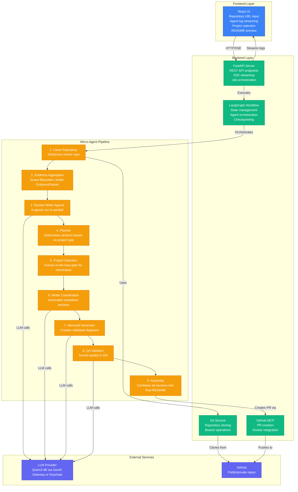
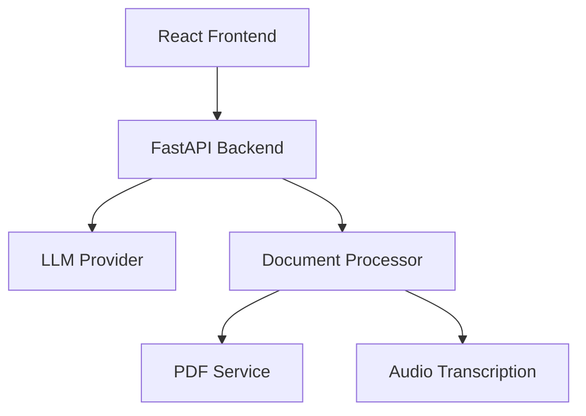

# DocuGen Micro-Agents - Generic Usage Guide

This documentation covers how to deploy and use DocuGen Micro-Agents to automatically generate comprehensive README documentation for any software repository.

---

## Table of Contents

1. [Overview](#overview)
2. [System Architecture](#system-architecture)
3. [Prerequisites](#prerequisites)
4. [Deployment](#deployment)
5. [Generating Documentation](#generating-documentation)
6. [Supported Project Types](#supported-project-types)
7. [Understanding Output](#understanding-output)
8. [Limitations](#limitations)
9. [Troubleshooting](#troubleshooting)

---

## Overview

DocuGen Micro-Agents is a specialized multi-agent system that autonomously generates comprehensive README documentation for software repositories. The system uses **9 micro-agents** that work together to analyze code structure, extract dependencies, understand architecture, and produce professional technical documentation based on actual code rather than templates.

### Core Capabilities

- **Micro-agent architecture** with 9 specialized agents for targeted analysis
- **Strategic file sampling** to optimize context usage and processing speed
- **Evidence-based documentation** - every statement verified through code analysis
- **Autonomous repository exploration** using ReAct (Reason-Act-Observe) pattern
- **Multi-language support** with automatic technology stack detection
- **Monorepo project detection** with human-in-the-loop selection
- **Architecture diagram generation** with Mermaid syntax validation
- **GitHub pull request creation** for documentation submission
- **Real-time agent activity streaming** via Server-Sent Events
- **Performance metrics tracking** with per-agent token usage and blast radius reports

### Design Philosophy

DocuGen generates documentation from code analysis, not assumptions. Every feature, dependency, and configuration mentioned in the output is extracted from actual files in your repository. If information cannot be verified through code inspection, it is omitted rather than fabricated.

**Key Principles:**
- **Evidence-first**: All agents write findings to a central EvidencePacket
- **Specialized roles**: Each agent focuses on a specific analysis domain
- **Context-efficient**: Strategic file sampling keeps processing under LLM context limits
- **Quality-assured**: QA Validator scores all sections before final assembly

---

## System Architecture

### Micro-Agent Overview

DocuGen uses **9 specialized micro-agents** organized into three categories:

#### 1. Section Writer Agents (6 agents)
These agents analyze code and contribute specific sections to the documentation:

- **Code Explorer** - Filesystem structure, languages, key files
- **API Reference** - REST/GraphQL endpoints, request/response schemas
- **Call Graph** - Function relationships, entry points, call paths
- **Error Analysis** - Exception handlers, error patterns, logging
- **Env Config** - Environment variables, configuration files
- **Dependency Analyzer** - Package dependencies, security vulnerabilities

#### 2. Coordination Agents (3 agents)
These agents orchestrate documentation generation:

- **Planner** - Determines sections to generate based on project type
- **Mermaid Generator** - Creates validated architecture diagrams
- **QA Validator** - Scores documentation quality (0-100) and validates completeness

#### 3. Infrastructure Nodes
- **Evidence Aggregator** - Consolidates filesystem data for all agents
- **PR Agent** (via MCP) - Creates GitHub pull requests

### Micro-Agent Execution Flow



### Strategic File Sampling

DocuGen uses **intelligent file sampling** to work within LLM context limits:

**MAX_LINES_PER_FILE=500** (configurable) acts as a budget, not a guarantee. Three strategies are available:

#### 1. Pattern Window Strategy (DEFAULT)
- Detects high-value patterns (routes, error handlers, entry points)
- Extracts ±6 lines around each match
- **Typical extraction: 150-300 lines from 500 budget**
- Used by all agents by default

**Detected patterns:**
```python
@app.get(), @router.post()       # FastAPI/Flask routes
try:, except:, raise              # Error handling
if __name__ == "__main__":        # Entry points
def main(, uvicorn.run()          # Main functions
```

#### 2. Smart Strategy
- Extracts top + function/class signatures + bottom
- **Typical extraction: 100-200 lines**
- Good for structural overviews

#### 3. Full Strategy
- Takes first N lines (up to 500)
- Simple but can waste context on comments

**Why this matters:**
- Qwen3-4B has 8K context window
- pattern_window keeps each file read to ~150-300 lines
- Allows processing more files within context limits
- Maximizes information density per token

**Configuration location:** `api/tools/repo_tools.py` (lines 95-222)

### Agent Communication Model

Each micro-agent operates autonomously with access to repository tools:

#### Section Writer Agents

**Code Explorer Agent**
- **Tools**: list_directory, read_file, detect_languages, extract_dependencies
- **Output**: File structure tree, language distribution, key files list
- **Strategy**: pattern_window for key files, smart for structure

**API Reference Agent**
- **Tools**: read_file, grep_search
- **Output**: Endpoint list with HTTP methods, request/response schemas
- **Strategy**: pattern_window for route files

**Call Graph Agent**
- **Tools**: read_file, grep_search
- **Output**: Function call relationships, entry points, call paths
- **Strategy**: pattern_window for function definitions

**Error Analysis Agent**
- **Tools**: read_file, grep_search
- **Output**: Exception handlers, error patterns, logging strategies
- **Strategy**: pattern_window for error handling code

**Env Config Agent**
- **Tools**: read_file
- **Output**: Environment variable list, configuration files found
- **Strategy**: full for .env.example files (typically small)

**Dependency Analyzer Agent**
- **Tools**: read_file, extract_dependencies
- **Output**: Dependency report, security warnings, version conflicts
- **Strategy**: full for package files (small)

#### Coordination Agents

**Planner Agent**
- **Input**: Evidence from all section writers
- **Output**: List of sections to generate (e.g., Prerequisites, Architecture, Configuration)
- **Logic**: Determines sections based on project type and detected features

**Mermaid Generator Agent**
- **Tools**: Repository access + Mermaid syntax validation
- **Output**: Validated Mermaid diagrams showing system architecture
- **Strategy**: pattern_window for architecture-relevant files

**QA Validator Agent**
- **Input**: All generated sections
- **Output**: Quality score (0-100), validation result with feedback
- **Criteria**: Completeness, accuracy, clarity, technical depth

---

## Prerequisites

### System Requirements

**For Docker Deployment:**
- Docker Engine 20.10+
- Docker Compose 2.0+
- 4GB RAM minimum (8GB recommended for large repos)
- 20GB disk space

**For Local Development:**
- Python 3.11+
- Node.js 20+
- pip and npm package managers
- Git 2.30+

### Required Credentials

**LLM API Configuration** (required)

Choose one authentication mode:

**Option 1: GenAI Gateway (Recommended)**
```bash
AUTH_MODE=genai_gateway
GENAI_GATEWAY_URL=https://your-gateway-url.com
GENAI_GATEWAY_API_KEY=your-api-key
```

**Option 2: Keycloak (Enterprise)**
```bash
AUTH_MODE=keycloak
BASE_URL=https://your-inference-endpoint.company.com
KEYCLOAK_REALM=master
KEYCLOAK_CLIENT_ID=api
KEYCLOAK_CLIENT_SECRET=your-client-secret
```

**GitHub Personal Access Token** (optional, for private repos and PR creation)
```bash
# Generate at: https://github.com/settings/tokens
# Required scopes: repo (full control of private repositories)
GITHUB_TOKEN=ghp_...
```

### Repository Requirements

The target repository must meet these criteria:
- Cloneable via HTTPS (public or with valid token)
- Size under 10GB (configurable via MAX_REPO_SIZE)
- Contains at least one package manager file (package.json, requirements.txt, Gemfile, pom.xml, etc.)
- Has readable file permissions

---

## Deployment

### Docker Deployment (Production)

**Step 1:** Configure environment

Create `api/.env`:
```bash
# ==========================================
# Authentication Configuration
# ==========================================
AUTH_MODE=genai_gateway
GENAI_GATEWAY_URL=https://your-gateway-url.com
GENAI_GATEWAY_API_KEY=your-api-key

# OR for enterprise Keycloak authentication:
# AUTH_MODE=keycloak
# BASE_URL=https://your-inference-endpoint.company.com
# KEYCLOAK_REALM=master
# KEYCLOAK_CLIENT_ID=api
# KEYCLOAK_CLIENT_SECRET=your-client-secret

# ==========================================
# Micro-Agent Model Configuration
# ==========================================
# All agents use Qwen3-4B-Instruct (optimized SLM for code analysis)
CODE_EXPLORER_MODEL=Qwen/Qwen3-4B-Instruct-2507
API_REFERENCE_MODEL=Qwen/Qwen3-4B-Instruct-2507
CALL_GRAPH_MODEL=Qwen/Qwen3-4B-Instruct-2507
ERROR_ANALYSIS_MODEL=Qwen/Qwen3-4B-Instruct-2507
ENV_CONFIG_MODEL=Qwen/Qwen3-4B-Instruct-2507
DEPENDENCY_ANALYZER_MODEL=Qwen/Qwen3-4B-Instruct-2507
PLANNER_MODEL=Qwen/Qwen3-4B-Instruct-2507
MERMAID_MODEL=Qwen/Qwen3-4B-Instruct-2507
QA_VALIDATOR_MODEL=Qwen/Qwen3-4B-Instruct-2507
WRITER_MODEL=Qwen/Qwen3-4B-Instruct-2507

# ==========================================
# Repository Analysis Limits
# ==========================================
TEMP_REPO_DIR=./tmp/repos
MAX_REPO_SIZE=10737418240    # 10GB in bytes
MAX_FILE_SIZE=1000000         # 1MB in bytes
MAX_FILES_TO_SCAN=500         # Maximum number of files to analyze
MAX_LINES_PER_FILE=500        # Line budget per file (pattern_window extracts ~150-300 lines)

# ==========================================
# Agent Execution Settings
# ==========================================
AGENT_TEMPERATURE=0.7         # Model temperature (0.0-1.0)
AGENT_MAX_TOKENS=1000         # Maximum tokens per agent response
AGENT_TIMEOUT=300             # Agent timeout in seconds (5 minutes)

# ==========================================
# GitHub Integration (MCP)
# ==========================================
# Optional: Required for automatic PR creation
GITHUB_TOKEN=your-github-token-here

# ==========================================
# Server Configuration
# ==========================================
API_PORT=5001
HOST=0.0.0.0
CORS_ORIGINS=["http://localhost:3000", "http://localhost:3001", "http://localhost:5173"]
```

**Step 2:** Deploy services

```bash
cd docugen-microagents
docker-compose up -d
```

**Step 3:** Verify deployment

```bash
# Check container status
docker-compose ps

# Expected output:
# docugen-backend    Up (healthy)
# docugen-frontend   Up (healthy)

# View logs
docker-compose logs -f

# Access application
# Frontend: http://localhost:3000
# Backend:  http://localhost:5001
# Health:   http://localhost:5001/health
```

### Local Development Deployment

**Step 1:** Backend setup

```bash
cd docugen-microagents/api

# Create virtual environment
python -m venv venv
source venv/bin/activate  # Windows: venv\Scripts\activate

# Install dependencies
pip install -r requirements.txt

# Create .env file (see Docker deployment section for full configuration)
cp .env.example .env
# Edit .env with your credentials

# Run server
python server.py
```

**Step 2:** Frontend setup

```bash
cd docugen-microagents/ui

# Install dependencies
npm install

# Run development server
npm run dev
```

**Step 3:** Access application

```
Frontend: http://localhost:3000
Backend:  http://localhost:5001
```

---

## Generating Documentation

### Basic Workflow

**Step 1:** Enter repository URL

Supported formats:
```
# Full repository
https://github.com/owner/repository

# Specific branch
https://github.com/owner/repository/tree/dev

# Subfolder (for monorepos)
https://github.com/owner/repository/tree/main/services/api
```

**Step 2:** Initiate generation

Click "Generate Documentation". The system will:
1. Parse and validate the URL
2. Clone the repository
3. Run Evidence Aggregator to scan filesystem
4. Execute 6 section writer agents in parallel
5. Run coordination agents (Planner → Writer → Mermaid → QA)

**Step 3:** Monitor micro-agent activity

Real-time logs display:
- **Repository cloning progress**
- **Evidence Aggregator** - Filesystem scanning
- **Section Writer Agents** (parallel execution):
  - Code Explorer - Language detection, key files
  - API Reference - Endpoint discovery
  - Call Graph - Function relationships
  - Error Analysis - Exception handling patterns
  - Env Config - Environment variables
  - Dependency Analyzer - Package analysis
- **Planner** - Section determination
- **Writer** - Documentation generation with ReAct loops
- **Mermaid Generator** - Diagram creation and validation
- **QA Validator** - Quality scoring (0-100)
- **Performance Metrics** - Token usage, TPS, blast radius

**Step 4:** Project selection (monorepos only)

If multiple projects are detected:
1. Review detected projects list
2. Select ONE project to document
3. Click "Continue"

The workflow resumes automatically after selection.

**Step 5:** Review output

When complete:
- **QA Score displayed** (e.g., "Quality Score: 87/100")
- **Preview README** in the UI
- **Download** as README.md file
- **Create GitHub pull request** (if GITHUB_TOKEN configured)
- **View performance metrics** - Total tokens, duration, agent-level breakdown

### Project Selection Logic

DocuGen automatically detects projects based on:
- Package manager files (package.json, requirements.txt, pom.xml, etc.)
- Directory structure patterns
- Configuration files (docker-compose.yml, Dockerfile, etc.)

**Detection Rules:**
```
Project indicators:
- package.json → Node.js project
- requirements.txt → Python project
- pom.xml or build.gradle → Java project
- Cargo.toml → Rust project
- go.mod → Go project
- Gemfile → Ruby project
- composer.json → PHP project
- *.csproj → .NET project
```

Monorepo example:
```
repo/
├── services/
│   ├── auth-api/         ← Detected project 1 (package.json)
│   ├── data-pipeline/    ← Detected project 2 (requirements.txt)
│   └── frontend/         ← Detected project 3 (package.json)
```

**Selection UI:**
```
Detected Projects:
[x] services/auth-api (Node.js)
[ ] services/data-pipeline (Python)
[ ] services/frontend (Node.js)

[Continue with Selected Project]
```

### Creating Pull Requests

**Prerequisites:**
- GITHUB_TOKEN configured in .env
- Token has `repo` scope
- Target repository is on GitHub

**Process:**
1. Generate documentation
2. Review README output
3. Click "Create PR"
4. System will:
   - Create branch: `docs/update-readme-{timestamp}`
   - Commit README.md
   - Create pull request to base branch
   - Return PR URL

**PR Contents:**
- **Title**: `[AI] Update documentation`
- **Body**: Generated by DocuGen Micro-Agents with metadata
- **Files**: README.md
- **Base branch**: Extracted from URL (e.g., `dev`, `main`)

---

## Supported Project Types

### Fully Supported

**Web Applications**
- React, Vue, Angular, Svelte frontends
- FastAPI, Flask, Django, Express, Spring Boot backends
- Full-stack applications (MERN, MEAN, LAMP)

**REST APIs**
- OpenAPI/Swagger documented services
- RESTful microservices
- GraphQL APIs (via API Reference Agent)

**CLI Tools**
- Python click/argparse applications
- Node.js commander applications
- Go cobra applications

**Libraries and SDKs**
- NPM packages
- PyPI packages
- Maven/Gradle libraries
- Go modules
- RubyGems

**Microservices**
- Docker Compose multi-service applications
- Kubernetes-deployed services
- Monorepo microservice architectures

### Partially Supported

**Mobile Applications**
- React Native (JavaScript dependencies detected)
- Flutter (Dart dependencies detected)
- Native iOS/Android (limited package manager detection)

**Data Pipelines**
- Apache Airflow DAGs
- Apache Spark jobs
- ETL scripts

**Infrastructure as Code**
- Terraform configurations
- CloudFormation templates
- Ansible playbooks

### Not Supported

- Pure documentation repositories (no code to analyze)
- Binary-only releases
- Repositories without package managers
- Obfuscated or minified code without source

---

## Understanding Output

### Generated Sections

The **Planner Agent** determines which sections to generate based on project type. Common sections:

**Project Overview**
- Purpose and value proposition
- High-level architecture pattern
- Technology stack summary

**Features**
- User-facing capabilities
- Organized by component (Backend/Frontend)
- Based on code analysis from **Code Explorer** and **API Reference** agents

Example:
```markdown
## Features

**Backend (FastAPI)**
- Multiple input format support (text, PDF, audio, video)
- Streaming and non-streaming response modes
- Support for vLLM, TGI, and Ollama providers
- File validation with size limits

**Frontend (React)**
- Drag-and-drop file upload
- Real-time summary display
- Mobile-responsive design
```

**API Reference**
- Generated by **API Reference Agent**
- Detected endpoints with HTTP methods
- Request/response schemas
- Authentication requirements

Example:
```markdown
## API Reference

### POST /api/summarize
Generates a summary from uploaded document.

**Request:**
- Content-Type: multipart/form-data
- Body: `file` (PDF, TXT, MP3, MP4)

**Response:**
{
  "summary": "Generated summary text...",
  "duration": 1.23
}
```

**Architecture**
- Generated by **Mermaid Generator Agent**
- Validated Mermaid diagrams
- System component visualization
- Data flow diagrams

Example:


**Prerequisites**
- Required tools and versions from **Dependency Analyzer Agent**
- API keys and credentials from **Env Config Agent**
- System requirements

**Configuration**
- Environment variables from **Env Config Agent**
- Actual variable names and purposes from .env.example
- Configuration file examples

**Error Handling**
- Exception handling patterns from **Error Analysis Agent**
- Logging strategies
- Common error scenarios

**Quick Start**
- Installation commands
- Setup instructions
- Running the application

### Quality Assurance

The **QA Validator Agent** scores documentation on a 0-100 scale:

**Scoring Criteria:**
- **Completeness** (25 points) - All expected sections present
- **Accuracy** (25 points) - Technically correct information
- **Clarity** (25 points) - Clear, understandable language
- **Technical Depth** (25 points) - Sufficient detail for developers

**Score Interpretation:**
- **90-100**: Excellent - Production-ready documentation
- **80-89**: Good - Minor improvements needed
- **70-79**: Fair - Some sections need enhancement
- **Below 70**: Needs work - Significant gaps or errors

**QA Report Example:**
```json
{
  "score": 87,
  "passed": true,
  "feedback": {
    "strengths": [
      "Comprehensive API documentation with examples",
      "Clear installation instructions",
      "Well-structured architecture diagram"
    ],
    "improvements": [
      "Add troubleshooting section for common errors",
      "Include performance benchmarks",
      "Expand testing documentation"
    ]
  }
}
```

### Performance Metrics

DocuGen tracks detailed metrics for each agent:

**Per-Agent Metrics:**
- **Tokens used** - Input + output tokens
- **Duration** - Processing time in milliseconds
- **TPS** (Tokens Per Second) - Generation speed
- **LLM calls** - Number of API requests
- **Tool calls** - Number of tool invocations

**Blast Radius Report:**
- Total tokens across all agents
- Total duration
- Most expensive agent
- Context efficiency score

Example metrics display:
```
Performance Metrics:
- Total tokens: 45,231
- Total duration: 23.4s
- Code Explorer: 12,450 tokens (5.2s)
- API Reference: 8,120 tokens (3.1s)
- Dependency Analyzer: 6,340 tokens (2.8s)
- Writer: 15,221 tokens (8.9s)
- QA Validator: 3,100 tokens (1.4s)
```

### Quality Characteristics

Documentation generated by DocuGen exhibits these traits:

**Accuracy**
- All dependencies extracted from package files by **Dependency Analyzer**
- Code snippets are actual code from repository
- Configuration variables match .env.example files (via **Env Config Agent**)
- Commands match package.json scripts or Makefiles

**Specificity**
- File paths reference actual repository files
- Version numbers match package manager specifications
- Port numbers match configuration files
- Directory structures match actual layout

**Completeness**
- All detected features documented (via **Code Explorer**)
- All package manager dependencies listed (via **Dependency Analyzer**)
- All environment variables explained (via **Env Config Agent**)
- All major components represented in diagrams (via **Mermaid Generator**)
- Error handling documented (via **Error Analysis Agent**)
- API endpoints cataloged (via **API Reference Agent**)

---

## Limitations

### Functional Limitations

**Code Analysis Depth**
- Analyzes structure and configuration, not runtime behavior
- Does not execute code or run tests
- Cannot verify if setup instructions actually work
- Does not understand complex business logic
- Limited to static analysis patterns

**Context Boundaries**
- Only analyzes files in the repository
- Does not read external documentation (wikis, Confluence)
- Does not access git history or issue trackers
- Does not read inline comments extensively
- MAX_LINES_PER_FILE budget limits depth per file

**Single Project Focus**
- Monorepos require selecting one project at a time
- Cannot document all services in one generation pass
- Each project must have clear boundaries

**Git Provider Support**
- PR creation only works with GitHub repositories
- GitLab and Bitbucket not supported for PR creation
- Cloning works with any Git provider

### Technical Constraints

**Repository Size**
- Default limit: 10GB
- Large repositories may timeout or hit memory limits
- Use subfolder URLs for focused analysis

**File Count**
- Default: 500 files scanned
- Very large codebases may not be fully analyzed
- Adjust MAX_FILES_TO_SCAN in configuration

**Token Limits**
- Large repositories generate extensive context
- Qwen3-4B has 8K context window
- Strategic file sampling mitigates this (pattern_window extracts ~150-300 lines per file)
- Processing time scales with repository size

**Language Support**
- Best support for Python, JavaScript/TypeScript, Java, Go
- Limited support for less common languages
- Depends on package manager file formats

**Micro-Agent Constraints**
- Each agent has AGENT_TIMEOUT (default 300s)
- Failed agents logged in state.failed_agents
- Retry logic limited to 3 attempts per agent

---

## Troubleshooting

### Repository Access Issues

**Symptom:** "Repository not found or access denied"

**Diagnosis:**
```bash
# Test repository URL
curl -I https://github.com/owner/repo

# If 404: Repository does not exist or is private
# If 200: Repository exists and is public
```

**Resolution:**
1. Verify repository URL spelling
2. For private repositories:
   - Add GITHUB_TOKEN to api/.env
   - Ensure token has `repo` scope
   - Regenerate token if expired
3. Restart backend to load new token:
   ```bash
   docker-compose restart backend
   ```

### Micro-Agent Failures

**Symptom:** Specific agent fails (e.g., "API Reference Agent failed")

**Diagnosis:**
```bash
# Check backend logs for agent-specific errors
docker-compose logs backend | grep -i "agent.*error"

# Look for:
# - "Failed to parse JSON from agent output"
# - LLM API errors (connection refused, invalid key, rate limits)
# - Tool execution failures
# - Timeout errors (exceeds AGENT_TIMEOUT)
```

**Resolution:**
1. **JSON parsing errors:**
   - Agent output format invalid
   - Check agent prompt in agents/ directory
   - Verify model supports JSON output

2. **LLM API errors:**
   - Verify LLM endpoint is accessible
   - Check API key is valid (GENAI_GATEWAY_API_KEY or KEYCLOAK_CLIENT_SECRET)
   - Verify model names match available models

3. **Timeout errors:**
   - Increase AGENT_TIMEOUT in .env (default 300s)
   - Reduce MAX_FILES_TO_SCAN or MAX_LINES_PER_FILE
   - Use subfolder URL for smaller scope

4. **Tool execution failures:**
   - Check repository permissions (read access)
   - Verify file paths are valid
   - Check TEMP_REPO_DIR has write permissions

**View failed agents:**
```bash
# Check state.failed_agents in logs
docker-compose logs backend | grep "failed_agents"
```

### Log Streaming Issues

**Symptom:** Agent logs appear all at once at the end

**Cause:** Python output buffering

**Resolution:**

For Docker deployment (already configured):
```yaml
# docker-compose.yml includes:
environment:
  - PYTHONUNBUFFERED=1
```

For local deployment:
```bash
# Run with unbuffered output
PYTHONUNBUFFERED=1 python server.py
```

### Pull Request Creation Failures

**Symptom:** "MCP PR Agent error: No such file or directory"

**Cause:** Docker CLI not installed in backend container

**Resolution:**

Verify Docker CLI installation in backend:
```bash
docker-compose exec backend which docker
# Should return: /usr/bin/docker
```

If not installed, rebuild backend:
```bash
docker-compose up -d --build backend
```

### Monorepo Project Detection

**Symptom:** Projects not detected or wrong projects detected

**Diagnosis:**
```bash
# Check for package manager files
docker-compose exec backend ls -la ./tmp/repos/*/

# Look for:
# - package.json (Node.js)
# - requirements.txt (Python)
# - pom.xml (Java)
# - go.mod (Go)
```

**Resolution:**
1. Ensure projects have package manager files
2. Use subfolder URL to target specific project
3. Customize detection logic in utils/__init__.py (see CUSTOMIZATION.md)

### Memory and Performance Issues

**Symptom:** Container OOM errors or slow performance

**Diagnosis:**
```bash
# Check container resource usage
docker stats docugen-backend
```

**Resolution:**
1. Increase Docker memory limits:
   ```yaml
   # docker-compose.yml
   services:
     backend:
       deploy:
         resources:
           limits:
             memory: 8G  # Increase from default 4G
   ```

2. Reduce repository scan scope:
   ```bash
   # In .env
   MAX_FILES_TO_SCAN=300
   MAX_LINES_PER_FILE=300
   ```

3. Use subfolder URLs for targeted analysis

4. Check agent metrics for expensive agents:
   ```bash
   docker-compose logs backend | grep "agent_metrics"
   ```

### Context Window Exceeded

**Symptom:** "Context length exceeded" errors from LLM

**Diagnosis:**
```bash
# Check blast_radius_report in logs
docker-compose logs backend | grep "blast_radius"

# Look for total_tokens_used exceeding 8000 (Qwen3-4B context window)
```

**Resolution:**
1. Reduce MAX_LINES_PER_FILE:
   ```bash
   # In .env
   MAX_LINES_PER_FILE=300  # Reduce from 500
   ```

2. Use pattern_window strategy (already default):
   - Automatically limits to ~150-300 lines per file
   - Verify in logs: "Using pattern_window strategy"

3. Reduce MAX_FILES_TO_SCAN:
   ```bash
   # In .env
   MAX_FILES_TO_SCAN=300  # Reduce from 500
   ```

4. Use subfolder URL for smaller scope

### QA Validator Low Scores

**Symptom:** QA scores consistently below 70

**Diagnosis:**
```bash
# Check QA validation results
docker-compose logs backend | grep -A 20 "qa_validation_result"

# Review feedback in logs:
# - Missing sections
# - Incomplete information
# - Technical inaccuracies
```

**Resolution:**
1. **Missing sections:**
   - Add missing package manager files to repository
   - Ensure key configuration files exist (.env.example, docker-compose.yml)

2. **Incomplete information:**
   - Increase MAX_LINES_PER_FILE for more context
   - Run specific agents with verbose logging

3. **Technical inaccuracies:**
   - Review agent prompts in agents/ directory
   - Adjust model temperature (AGENT_TEMPERATURE)
   - Try different model (upgrade from Qwen3-4B to larger model)

4. **Customize QA criteria:**
   - Edit agents/qa_validator.py
   - Adjust scoring weights (see CUSTOMIZATION.md)

### Health Check Failures

**Symptom:** Containers show "unhealthy" status

**Diagnosis:**
```bash
# Check health endpoint
curl http://localhost:5001/health

# Check logs
docker-compose logs backend
```

**Resolution:**
1. Verify ports are not in use:
   ```bash
   netstat -an | grep 5001
   netstat -an | grep 3000
   ```

2. Check if services are running:
   ```bash
   docker-compose ps
   ```

3. Restart services:
   ```bash
   docker-compose restart
   ```

---

## Best Practices

### Repository Preparation

**Include Configuration Examples**
```bash
# Provide .env.example with all variables
cp .env .env.example

# Document each variable with inline comments
AUTH_MODE=genai_gateway                      # Required: Authentication mode
GENAI_GATEWAY_URL=https://your-gateway.com   # Required: GenAI Gateway URL
GENAI_GATEWAY_API_KEY=your-key-here          # Required: GenAI Gateway API key
DATABASE_URL=postgresql://...                # Required: PostgreSQL connection string
REDIS_URL=redis://...                        # Optional: Redis for caching
```

**Write Clear README Sections**
- Even basic setup instructions help
- DocuGen extracts and improves existing content
- Better input leads to better output

**Use Standard Project Structure**
```
project/
├── src/ or app/          # Source code
├── tests/                # Tests
├── docs/                 # Documentation
├── config/               # Configuration
├── package.json          # Dependencies
├── .env.example          # Environment template
└── README.md             # Basic docs
```

**Add API Documentation**
- Use OpenAPI/Swagger specs
- Add docstrings to route handlers
- **API Reference Agent** extracts this automatically

**Document Error Handling**
- Use try/except blocks consistently
- **Error Analysis Agent** detects these patterns

### Documentation Review

**Always Review Generated Output**
- AI-generated content is 80-90% accurate
- Verify technical details and commands
- Add domain-specific context AI cannot infer
- Correct any misinterpretations

**Check QA Score**
- Scores below 80 warrant review
- Review QA feedback for specific improvements
- Re-run generation after fixing issues

**Iterative Improvement**
- Run DocuGen on updated code
- Compare with previous output
- Identify and fix recurring issues
- Customize prompts if needed (see CUSTOMIZATION.md)

### Model Selection

**Configure models for all agents**
```bash
# Qwen3-4B-Instruct (default) - Balanced cost/quality
CODE_EXPLORER_MODEL=Qwen/Qwen3-4B-Instruct-2507
API_REFERENCE_MODEL=Qwen/Qwen3-4B-Instruct-2507
CALL_GRAPH_MODEL=Qwen/Qwen3-4B-Instruct-2507
ERROR_ANALYSIS_MODEL=Qwen/Qwen3-4B-Instruct-2507
ENV_CONFIG_MODEL=Qwen/Qwen3-4B-Instruct-2507
DEPENDENCY_ANALYZER_MODEL=Qwen/Qwen3-4B-Instruct-2507
PLANNER_MODEL=Qwen/Qwen3-4B-Instruct-2507
MERMAID_MODEL=Qwen/Qwen3-4B-Instruct-2507
QA_VALIDATOR_MODEL=Qwen/Qwen3-4B-Instruct-2507
WRITER_MODEL=Qwen/Qwen3-4B-Instruct-2507
```

**Model Selection Guidance:**
- **Qwen3-4B-Instruct**: Fast, cost-effective, good for most projects (8K context)
- **Qwen2.5-32B-Instruct**: Higher quality, slower, better for complex codebases (32K context)
- **Mix and match**: Use 4B for simple agents (Env Config), 32B for complex agents (Writer)

**Batching and Caching**
- Generate docs once per release
- Cache results for repeated queries
- Use git hooks to trigger only on significant changes

### Performance Optimization

**Monitor Metrics**
- Check blast_radius_report after each run
- Identify expensive agents
- Optimize prompts or reduce scope

**Adjust Sampling Strategy**
```python
# In tools/repo_tools.py, customize for your domain:
strategy = "pattern_window"  # Default - best for most projects
strategy = "smart"           # Faster, less context per file
strategy = "full"            # Maximum detail, highest token usage
```

**Parallel Execution**
- Section writer agents already run in parallel
- 6 agents = ~6x speedup over sequential execution
- Monitor logs to verify parallel execution

**Token Budget Management**
```bash
# Conservative (faster, lower cost)
MAX_LINES_PER_FILE=300
MAX_FILES_TO_SCAN=300

# Balanced (default)
MAX_LINES_PER_FILE=500
MAX_FILES_TO_SCAN=500

# Aggressive (slower, higher quality for large repos)
MAX_LINES_PER_FILE=700
MAX_FILES_TO_SCAN=700
```

---

## Integration Patterns

### CI/CD Integration

Run DocuGen automatically on pull requests or releases. Example GitHub Actions workflow:

```yaml
name: Generate Documentation

on:
  pull_request:
    branches: [main]

jobs:
  generate-docs:
    runs-on: ubuntu-latest
    steps:
      - uses: actions/checkout@v3

      - name: Run DocuGen Micro-Agents
        env:
          GENAI_GATEWAY_URL: ${{ secrets.GENAI_GATEWAY_URL }}
          GENAI_GATEWAY_API_KEY: ${{ secrets.GENAI_GATEWAY_API_KEY }}
        run: |
          docker run -v $(pwd):/repo \
            -e AUTH_MODE=genai_gateway \
            -e GENAI_GATEWAY_URL=$GENAI_GATEWAY_URL \
            -e GENAI_GATEWAY_API_KEY=$GENAI_GATEWAY_API_KEY \
            docugen-microagents:latest \
            /repo

      - name: Commit README
        run: |
          git config user.name "DocuGen Bot"
          git config user.email "bot@example.com"
          git add README.md
          git commit -m "docs: Update README [automated]"
          git push
```

### API Usage

Programmatic access for automation:

```python
import requests
import time

# Start documentation generation
response = requests.post(
    "http://localhost:5001/api/generate-docs",
    json={"repo_url": "https://github.com/owner/repo"}
)
job_id = response.json()["job_id"]

# Poll for completion
while True:
    status = requests.get(f"http://localhost:5001/api/status/{job_id}")
    data = status.json()

    if data["status"] == "complete":
        # Check QA score
        qa_score = data.get("qa_score", 0)
        print(f"Documentation generated with QA score: {qa_score}/100")

        # Get performance metrics
        metrics = data.get("agent_metrics", {})
        total_tokens = data.get("total_tokens_used", 0)
        print(f"Total tokens: {total_tokens}")
        break

    time.sleep(5)

# Download README
readme = requests.get(f"http://localhost:5001/api/download/{job_id}")
with open("README.md", "w") as f:
    f.write(readme.text)
```

### Webhook Integration

Trigger documentation generation on git push:

```python
# webhook_server.py
from flask import Flask, request
import requests

app = Flask(__name__)

@app.route("/webhook", methods=["POST"])
def github_webhook():
    payload = request.json

    # Trigger on push to main branch
    if payload["ref"] == "refs/heads/main":
        repo_url = payload["repository"]["html_url"]

        # Start DocuGen
        response = requests.post(
            "http://localhost:5001/api/generate-docs",
            json={"repo_url": repo_url}
        )

        return {"status": "started", "job_id": response.json()["job_id"]}

    return {"status": "ignored"}

if __name__ == "__main__":
    app.run(port=8000)
```

**Configure GitHub webhook:**
```
Payload URL: http://your-server:8000/webhook
Content type: application/json
Events: Push events
```

---

## Advanced Usage

### Customizing Micro-Agents

See **CUSTOMIZATION.md** for detailed customization guides:

- Customizing section writer agents (Code Explorer, API Reference, etc.)
- Customizing coordination agents (Planner, Mermaid, QA Validator)
- Adding custom tools
- Modifying strategic file sampling
- Adding new micro-agents
- Workflow customization

### Environment Variables Reference

See **api/.env.example** for complete list with descriptions.

**Key variables:**
- `AUTH_MODE` - Authentication mode (genai_gateway | keycloak)
- `MAX_LINES_PER_FILE` - File sampling budget (default 500)
- `AGENT_TIMEOUT` - Agent execution timeout in seconds (default 300)
- `AGENT_TEMPERATURE` - Model temperature 0.0-1.0 (default 0.7)
- `AGENT_MAX_TOKENS` - Max tokens per agent response (default 1000)

### Metrics and Observability

**Available metrics:**
- Per-agent token usage
- Per-agent execution duration
- LLM call counts
- Tool call counts
- TPS (Tokens Per Second)
- Blast radius (total context usage)

**Accessing metrics:**
```bash
# View in logs
docker-compose logs backend | grep "agent_metrics"

# Or via API
curl http://localhost:5001/api/metrics/{job_id}
```

---

**For customization and development guides, see CUSTOMIZATION.md**
