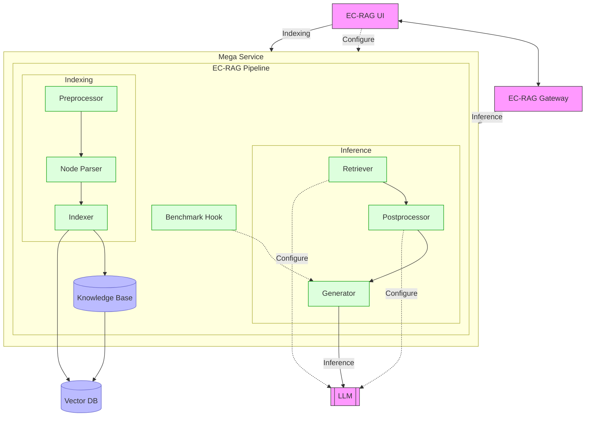

# Edge Craft Retrieval-Augmented Generation Application

Edge Craft RAG (EC-RAG) is a customizable, tunable and production-ready
Retrieval-Augmented Generation system for edge solutions. It is designed to
curate the RAG pipeline to meet hardware requirements at edge with guaranteed
quality and performance.

## What's New

1. Support Agent component and enable deep_search agent
2. Optimize pipeline execution performance with asynchronous api
3. Support session list display in UI
4. Support vllm-based embedding service

## Table of contents

1. [Architecture](#architecture)
2. [Deployment Options](#deployment-options)

## Architecture

The architecture of the Edge Craft Retrieval-Augmented Generation Application is illustrated below:

## Deployment Options

The table below lists the available deployment options and their implementation details for different hardware platforms.

| Platform  | Deployment Method | Link                                                          |
| --------- | ----------------- | ------------------------------------------------------------- |
| Intel Arc | Docker compose    | [Deployment on Arc](./docker_compose/intel/gpu/arc/README.md) |

## Validated Configurations

| **Deploy Method** | **LLM Engine** | **LLM Model** | **Hardware** |
| ----------------- | -------------- | ------------- | ------------ |
| Docker Compose    | vLLM           | Qwen3-8B      | Intel Arc    |
